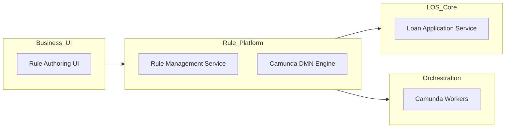
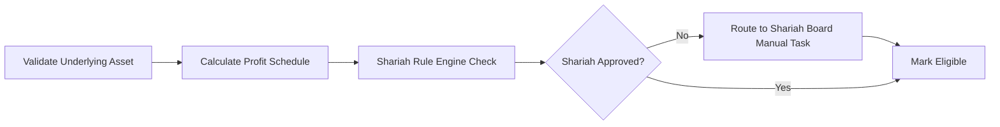
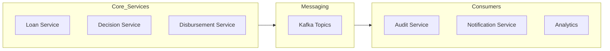
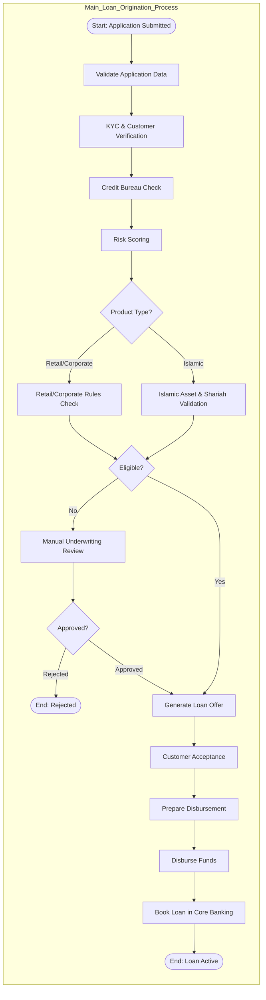

# Loan Origination System (LOS) – Architecture & Design

## 1. Overview

This system supports **multi-product loan origination**:

- Retail Loans (personal, auto, home)
- Corporate Loans (SME, large enterprise)
- Islamic Loans (Murabaha, Ijara, Musharaka)

The platform is **event-driven**, **workflow-orchestrated**, and **cloud-native**, with strong focus on scalability, compliance & auditability, product configurability, and secure secret & config management.

### Core Stack

| Layer              | Technology         |
|--------------------|-------------------|
| Backend            | Java + Spring Boot |
| Workflow / Saga    | Camunda 8 (Zeebe)  |
| Database           | PostgreSQL         |
| Messaging          | Kafka              |
| Service Discovery  | Consul             |
| Secrets Management | HashiCorp Vault    |
| Deployment         | Microsoft Azure (AKS) |

### Scale Assumptions

| Item              | Value                                 |
|-------------------|---------------------------------------|
| Loan applications | ~1,000 per day                        |
| Peak load         | 5–10× burst during campaigns          |
| Users             | Loan officers, underwriters, partners |
| Core Banking      | Shared for conventional + Islamic     |

This scale is moderate, so the design focuses on **resilience, auditability, and product flexibility** rather than extreme low-latency tuning.

---

## 2. High-Level Architecture

```mermaid
flowchart LR

subgraph Channels
    A1[Web Portal]
    A2[Mobile App]
    A3[Partner APIs]
end

subgraph API_Layer
    B1[Azure API Management]
    B2[Auth Service]
end

subgraph LOS_Core
    C1[Loan Application Service]
    C2[Customer Service]
    C3[Product Config Service]
    C4[Document Service]
end

subgraph Orchestration
    D1[Camunda 8 Cluster]
    D2[Saga Workers]
end

subgraph Decisioning
    E1[Credit Service]
    E2[Risk & Scoring Engine]
    E3[Compliance & AML]
    E4[Shariah Rules Engine]
end

subgraph External_Integrations
    F1[Credit Bureaus]
    F2[KYC Providers]
    F3[Core Banking]
    F4[Payment Gateway]
end

subgraph Data_Platform
    G1[PostgreSQL]
    G2[Blob Storage]
    G3[Audit/Event Store]
end

subgraph Platform_Services
    H1[Kafka]
    H2[Consul]
    H3[Vault]
    H4[Monitoring]
end

Channels --> API_Layer
API_Layer --> LOS_Core
LOS_Core --> Orchestration
Orchestration --> Decisioning
Decisioning --> External_Integrations
LOS_Core --> Data_Platform
LOS_Core --> Platform_Services
Orchestration --> Platform_Services
```

---

## 3. Loan Origination Lifecycle

Each loan application runs as a **Camunda Saga Workflow** through these main stages:

1. Application Capture
2. KYC & Customer Verification
3. Credit & Risk Assessment
4. Product-Specific Processing
5. Approval / Rejection
6. Offer Generation
7. Acceptance & Documentation
8. Disbursement
9. Core Banking Booking

### Workflow Orchestration

```mermaid
flowchart LR

subgraph Application_Saga
    S1[Application Created]
    S2[KYC Verification]
    S3[Credit Bureau Check]
    S4[Risk Scoring]
    S5[Product & Rule Validation]
    S6[Approval Decision]
    S7[Offer Generation]
    S8[Customer Acceptance]
    S9[Disbursement]
    S10[Core Banking Booking]
end

subgraph Worker_Services
    W1[KYC Worker]
    W2[Credit Worker]
    W3[Risk Worker]
    W4[Rules Worker]
    W5[Offer Worker]
    W6[Disbursement Worker]
end

Application_Saga --> Worker_Services
```

Each box in `Application_Saga` represents a **Camunda service task**. Each Worker is a Spring Boot microservice consuming Camunda jobs.

### Saga Compensation Model

| Failure                  | Compensation               |
|--------------------------|----------------------------|
| KYC fails                | Mark application rejected  |
| Credit API timeout       | Retry → manual review      |
| Disbursement fails       | Reverse payment + cancel booking |
| Shariah validation fails | Route to Shariah board review |
| Core Banking Booking     | Cancel booking             |
| Offer Generated          | Mark offer expired         |
| Islamic Asset Purchase   | Cancel asset order         |

Each compensation is triggered via **BPMN Error Boundary Events**.

---

## 4. Microservices Breakdown

### 4.1 Loan Application Service

**Responsibilities:** Create & manage loan applications, track status, store loan structure & metadata.

**DB Tables:**

| Table                 | Purpose                         |
|-----------------------|---------------------------------|
| loan_application      | Master record                   |
| loan_product_snapshot | Product config at time of apply |
| loan_party            | Applicants, guarantors          |
| loan_status_history   | Audit trail                     |
| loan_financials       | Amount, tenure, rate/profit     |

### 4.2 Product Configuration Service

Supports **dynamic loan products** without code changes.

**Stores:** Loan types (Retail / Corporate / Islamic), tenure rules, profit/interest models, fee structures, eligibility rules.

### 4.3 Customer Service

Manages customer profile, KYC status, linked applications, and corporate hierarchy (for business loans).

**DB Tables:**

| Table                 | Purpose               |
|-----------------------|-----------------------|
| customer_profile      | Individual/corporate  |
| kyc_record            | Documents + status    |
| customer_relationship | Corporate hierarchies |

### 4.4 Document Service

Handles document upload, storage, and retrieval with integration to Azure Blob Storage.

### 4.5 Decision Services

| Service            | Purpose                                                     |
|--------------------|-------------------------------------------------------------|
| Credit Service     | Bureau integration                                          |
| Risk Engine        | Internal scoring (DTI, FOIR, exposure)                      |
| Compliance Service | AML, sanctions screening                                    |
| Shariah Rules      | Islamic finance validation (no interest, asset-backing, profit model checks) |

**DB Tables:**

| Table               | Purpose                |
|---------------------|------------------------|
| credit_report       | Bureau response        |
| risk_score          | Internal scoring       |
| rule_evaluation_log | Why rule passed/failed |

---

## 5. Product Flexibility & Rule Authoring

Business users must author rules without code deployments. Rules are versioned and stored in PostgreSQL.

### Rule Types

| Category    | Examples                            |
|-------------|-------------------------------------|
| Eligibility | Age, turnover, credit score         |
| Pricing     | Interest/profit rate tiers          |
| Limits      | Max exposure per customer           |
| Islamic     | Asset validation, profit calc rules |

### Architecture

Workers call the **Camunda DMN Engine** during eligibility check, pricing, and Islamic compliance validation.

---

## 6. Islamic Loan Handling

Islamic loans require **asset-backed and profit-based structures**.

### Additional Workflow Steps

| Step               | Description                          |
|--------------------|--------------------------------------|
| Asset Verification | Ensure underlying asset exists       |
| Profit Calculation | No interest, only profit margin      |
| Ownership Flow     | Bank buys → sells/leases to customer |
| Shariah Approval   | Scholar or rule-based validation     |

These steps are **conditionally injected** in Camunda via BPMN gateways based on product type.

### Islamic Finance Tables

| Table            | Purpose                      |
|------------------|------------------------------|
| islamic_asset    | Asset backing the loan       |
| profit_schedule  | Installment profit breakdown |
| shariah_approval | Approval logs                |

### Subprocess Flow

---

## 7. Event-Driven Architecture

All major state transitions emit domain events via Kafka.

### Event Flow

### Key Events

- `LoanApplicationSubmitted`
- `KYCCompleted`
- `CreditCheckFailed`
- `RiskEvaluated`
- `LoanApproved`
- `LoanRejected`
- `LoanDisbursed`

---

## 8. Database Design (PostgreSQL)

Each microservice has its **own schema** following database-per-service pattern.

### Design Principles

- No cross-service joins
- Communication via APIs/events only
- Strong audit history for compliance
- Soft deletes for regulatory requirements

---

## 9. Camunda 8 Integration

Camunda Zeebe brokers run as a cluster on AKS. Each Spring Boot worker subscribes to task types, executes business logic, and reports completion/failure.

### Failure Handling

- Retries with exponential backoff
- Compensation tasks (Saga rollback)
- Dead letter queue for unrecoverable failures

### Worker Mapping

| BPMN Task            | Zeebe Job Type                  |
|----------------------|---------------------------------|
| Validate Application | `application-validation-worker` |
| KYC Check            | `kyc-worker`                    |
| Credit Check         | `credit-bureau-worker`          |
| Risk Score           | `risk-scoring-worker`           |
| Rules Evaluation     | `rules-worker`                  |
| Islamic Validation   | `shariah-rules-worker`          |
| Offer Generation     | `offer-worker`                  |
| Disbursement         | `disbursement-worker`           |
| Core Booking         | `core-banking-booking-worker`   |

---

## 10. Security Architecture

### HashiCorp Vault

Used for DB credentials, API keys for bureaus, and encryption keys. Services fetch secrets at runtime via **Vault Agent / Sidecar**.

### Authentication & Authorization

- OAuth2 / OIDC (Keycloak or Azure AD)
- Role-based access control:
  - Loan Officer
  - Underwriter
  - Shariah Reviewer
  - Admin

### Data Protection

- Field-level encryption for National IDs and financial statements
- TLS for all service-to-service communication
- Audit logging for all data access

---

## 11. Service Discovery & Configuration

### Consul

- Service registration and discovery
- Health checks
- Dynamic configuration (feature flags, thresholds)
- Key-value store for runtime configuration

---

## 12. Azure Deployment Mapping

| Function            | Azure Service                    |
|---------------------|----------------------------------|
| Spring Boot Hosting | Azure Kubernetes Service (AKS)   |
| API Gateway         | Azure API Management             |
| Camunda 8           | Self-managed on AKS              |
| PostgreSQL          | Azure Database for PostgreSQL    |
| Messaging           | Kafka on AKS (or Confluent Cloud)|
| Object Storage      | Azure Blob Storage               |
| Secrets             | HashiCorp Vault on AKS           |
| Service Discovery   | Consul on AKS                    |
| Monitoring          | Azure Monitor + Prometheus + Grafana |
| Logs                | Azure Log Analytics              |

---

## 13. Observability

| Area                | Tooling              |
|---------------------|----------------------|
| Logs                | ELK / Azure Log Analytics |
| Metrics             | Prometheus + Grafana |
| Tracing             | OpenTelemetry        |
| Workflow Monitoring | Camunda Operate      |

---

## 14. Scalability Strategy

For **1,000 applications/day**:

| Component       | Scaling Strategy                   |
|-----------------|------------------------------------|
| Loan Services   | 2–4 pods with HPA autoscaling      |
| Camunda Workers | Scale per task type                |
| PostgreSQL      | Single primary + read replica      |
| Kafka           | Partition topics by application ID |

System is designed so **workflow throughput**, not HTTP traffic, is the main scaling factor. Stateless Spring Boot services enable horizontal scaling.

---

## 15. API Design

### Core Endpoints

| Endpoint | Method | Description |
|----------|--------|-------------|
| `/api/v1/loans` | POST | Create loan application |
| `/api/v1/loans/{loanId}` | GET | Get application status |
| `/api/v1/loans/{loanId}/documents` | POST | Upload documents |
| `/api/v1/loans/{loanId}/manual-review` | POST | Trigger manual review |

All status changes come from **Camunda events**, not direct DB updates.

---

## 16. Key Design Principles

- ✔ **Microservices-based** architecture with clear service boundaries
- ✔ **Workflow-driven** state management via Camunda
- ✔ **Product & rule configurability** without redeploy (Camunda DMN)
- ✔ **Event-driven** integration via Kafka for loose coupling
- ✔ **Compliance-ready** with comprehensive audit trails
- ✔ **Shariah-aware** branching logic for Islamic products
- ✔ **Cloud-native** deployment on Azure AKS

---

# Appendix: Camunda 8 BPMN Design

## Process Definition

**Process Name:** `loan-origination-process`  
**Process Type:** Orchestrated Saga  
**Engine:** Camunda 8 (Zeebe)

## BPMN Flow Overview

## BPMN Elements Breakdown

### 1. Start Event

**Type:** Message Start Event  
**Message:** `LoanApplicationSubmitted`

Triggered when Loan Application Service publishes event.

### 2. Validate Application Data

**Type:** Service Task  
**Worker Type:** `application-validation-worker`

**Purpose:** Mandatory fields validation, product availability check, basic eligibility pre-check.

**Failure →** BPMN Error → End Rejected

### 3. KYC & Customer Verification

**Type:** Service Task  
**Worker Type:** `kyc-worker`

**Calls:** KYC provider, sanctions screening, ID verification.

**Failure Handling:** Technical failure → Retry; KYC Failed → BPMN Error → Rejected

### 4. Credit Bureau Check

**Type:** Service Task  
**Worker Type:** `credit-bureau-worker`

**Pulls:** Score, liabilities, defaults. Stored in Decision DB.

### 5. Risk Scoring

**Type:** Service Task  
**Worker Type:** `risk-scoring-worker`

**Executes:** Internal scoring model (DTI, FOIR, exposure).

**Outputs:** `riskGrade`, `recommendedLimit`

### 6. Product Type Gateway

**Type:** Exclusive Gateway

| Condition              | Path                  |
|------------------------|-----------------------|
| productType != ISLAMIC | Retail/Corporate path |
| productType == ISLAMIC | Islamic path          |

### 7. Retail/Corporate Rules Check

**Type:** Business Rule Task  
**Engine:** Camunda DMN  
**Worker Type:** `rules-worker`

**Evaluates:** Eligibility, pricing, limits.

**Outputs:** `eligible = true/false`

### 8. Islamic Asset & Shariah Validation

**Type:** Subprocess (Collapsed)

**Worker Types:** `islamic-asset-worker`, `profit-calculation-worker`, `shariah-rules-worker`

### 9. Eligibility Gateway

- If `eligible == false` → Manual Underwriting
- If `eligible == true` → Offer Generation

### 10. Manual Underwriting Review

**Type:** User Task  
**Assignee Group:** `UNDERWRITERS`

**Actions:** Approve, reject, or request more documents.

### 11. Offer Generation

**Type:** Service Task  
**Worker Type:** `offer-worker`

**Generates:** EMI/installment plan, profit schedule (Islamic), fees, terms PDF.

### 12. Customer Acceptance

**Type:** Receive Task (Message Catch Event)  
**Message:** `CustomerAcceptedOffer`

**Timeout Boundary Event:** If timeout (e.g., 7 days) → End Rejected

### 13. Prepare Disbursement

**Type:** Service Task  
**Worker Type:** `disbursement-prep-worker`

**Checks:** Signed documents, mandates, bank details.

### 14. Disburse Funds

**Type:** Service Task  
**Worker Type:** `disbursement-worker`

Calls payment system.

**Compensation Task:** `reverse-disbursement-worker`

### 15. Book Loan in Core Banking

**Type:** Service Task  
**Worker Type:** `core-banking-booking-worker`

**Creates:** Loan account, repayment schedule.

**If failure occurs:** Compensation → Reverse disbursement

### 16. End Events

| End Event   | Meaning             |
|-------------|---------------------|
| Loan Active | Successfully booked |
| Rejected    | Failed at any stage |

## Process Variables

| Variable           | Description             |
|--------------------|-------------------------|
| applicationId      | Loan ID                 |
| customerId         | Customer ID             |
| productType        | RETAIL / CORP / ISLAMIC |
| riskGrade          | Risk result             |
| eligible           | Boolean                 |
| approved           | Boolean                 |
| offerAccepted      | Boolean                 |
| disbursementStatus | SUCCESS / FAILED        |
