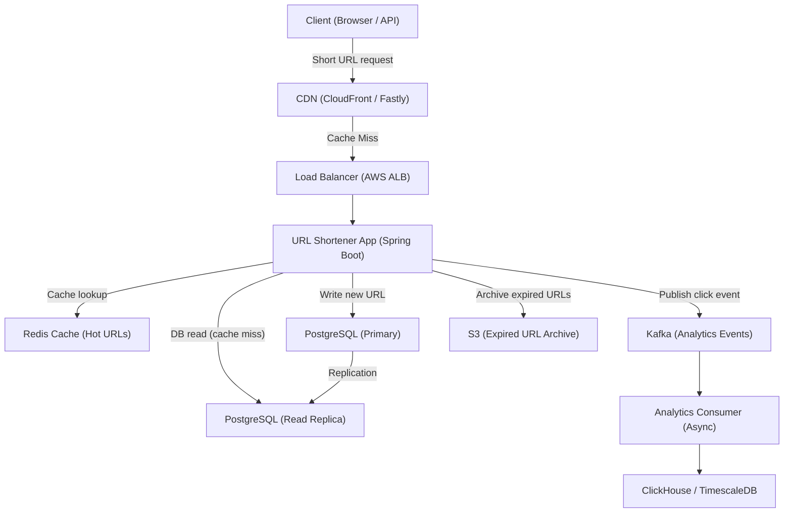
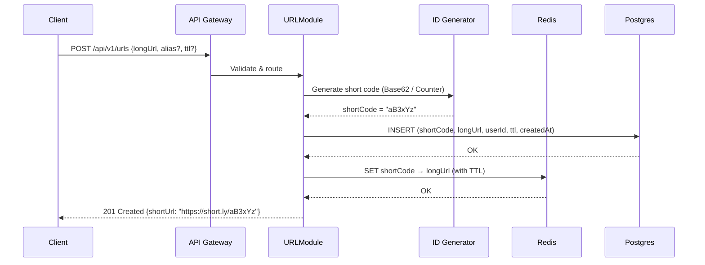
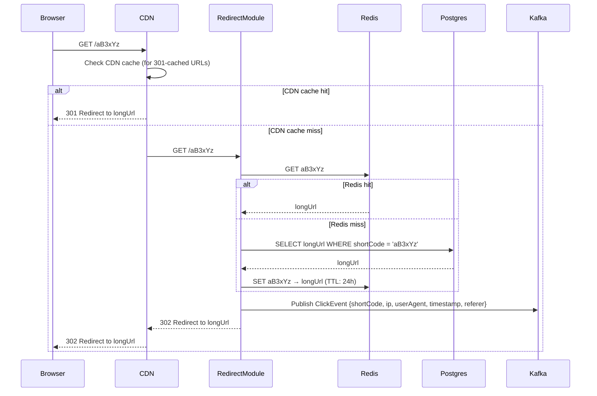

# 01 — High-Level Architecture: URL Shortener

---

## Objective

Define the overall system architecture, service decomposition, communication patterns, and architectural style for the URL shortening platform.

---

## Architecture Decision: Modular Monolith → Microservices Migration Path

### Chosen Approach: **Modular Monolith with DDD boundaries**

### Why NOT Microservices from Day 1?

| Concern | Explanation |
|---|---|
| Operational overhead | Microservices require service mesh, distributed tracing, separate deployments — overkill for a team of < 10 |
| Latency | Inter-service calls add network hops on an already latency-sensitive redirect path |
| Data consistency | URL uniqueness requires atomic checks — easier with shared DB in a monolith |
| Team size | Microservices shine when multiple teams own different domains |

### Why Modular Monolith Works Here?

- Clear DDD bounded contexts that can be extracted later without major rewrites
- Single deployment unit simplifies operations at MVP and V1 scale
- Module boundaries enforce separation without network overhead
- Migration to microservices is a refactor-and-extract operation, not a rewrite

### When to Extract to Microservices?

| Signal | Action |
|---|---|
| Analytics processing causes GC pressure affecting redirect latency | Extract analytics consumer to independent service |
| Different scaling requirements (redirect needs 100 pods, creation needs 5) | Extract redirect service |
| Teams grow beyond 15 engineers | Establish service ownership per team |
| Custom alias feature requires separate SLA/ownership | Extract URL management service |

---

## Service Boundaries (Modules)

```
┌─────────────────────────────────────────────────────────┐
│                  URL Shortener Monolith                  │
│                                                         │
│  ┌──────────────┐  ┌──────────────┐  ┌───────────────┐ │
│  │  URL Module  │  │ Redirect Mod │  │Analytics Mod  │ │
│  │              │  │              │  │               │ │
│  │ - Create URL │  │ - Lookup     │  │ - Click ingest│ │
│  │ - Delete URL │  │ - Redirect   │  │ - Aggregation │ │
│  │ - Custom alias│  │ - Cache hit  │  │ - Reporting   │ │
│  └──────────────┘  └──────────────┘  └───────────────┘ │
│                                                         │
│  ┌──────────────┐  ┌──────────────┐                    │
│  │  User Module │  │  Admin Module│                    │
│  │              │  │              │                    │
│  │ - Auth/JWT   │  │ - Abuse mgmt │                    │
│  │ - API keys   │  │ - URL mgmt   │                    │
│  └──────────────┘  └──────────────┘                    │
└─────────────────────────────────────────────────────────┘
```

---

## System Architecture Diagram



---

## Request Flow: URL Shortening (Write Path)



---

## Request Flow: URL Redirect (Hot Read Path)



---

## Component Responsibilities

| Component | Responsibility | Technology |
|---|---|---|
| CDN | Cache 301 redirects globally, reduce origin load | CloudFront / Fastly |
| Load Balancer | L7 routing, SSL termination, health checks | AWS ALB |
| Application | Business logic, URL management, redirect orchestration | Spring Boot |
| Redis | Hot URL cache, distributed counter (for ID gen) | Redis Cluster |
| PostgreSQL | Durable URL storage, user data | PostgreSQL 15+ |
| Kafka | Decouple analytics event ingestion | Apache Kafka |
| ClickHouse | Time-series analytics queries at scale | ClickHouse |
| S3 | Cold storage for expired/archived URL data | AWS S3 |

---

## Synchronous vs Asynchronous Communication

| Path | Pattern | Justification |
|---|---|---|
| URL creation → DB write | Synchronous | Must confirm durability before returning short URL |
| Redirect → cache lookup | Synchronous | On the critical latency path |
| Click event → analytics | Asynchronous (Kafka) | Analytics lag is acceptable; must not block redirect |
| URL expiration | Async batch job | Background cleanup; no user impact |
| Custom alias uniqueness check | Synchronous | Must be atomic with write |

---

## CQRS Considerations

The system naturally separates into:

- **Command side**: URL creation, deletion, update (writes to PostgreSQL)
- **Query side**: URL redirect lookup (reads from Redis/read-replica), analytics queries (ClickHouse)

Full CQRS with separate models is **not needed at V1** because:
- The URL entity is simple (one table, few fields)
- The read model and write model are identical

CQRS becomes valuable at V2+ when:
- Analytics requires denormalized read models
- Personalized dashboard data needs pre-aggregated projections

---

## Key Architectural Decisions

### 301 vs 302 Redirect

| Type | Caching | Analytics | When to Use |
|---|---|---|---|
| 301 (Permanent) | Browser + CDN caches redirect | Loses click visibility post-cache | Maximum performance, no analytics needed |
| 302 (Temporary) | Not cached | Every click hits origin or CDN | Analytics accuracy required |
| 307 (Temporary) | Not cached, method-preserving | Every click hits origin | If supporting non-GET methods (rare) |

**Production recommendation**: Use **302** by default. For premium/high-traffic URLs, offer an opt-in 301 mode, with CDN-level analytics as a compensating mechanism.

### Short Code Generation Strategy

| Strategy | Pros | Cons |
|---|---|---|
| MD5/SHA256 of long URL | Deterministic, dedup natural | Collision risk, fixed-length truncation unsafe |
| Auto-increment ID + Base62 | Simple, no collisions | Sequential IDs are guessable (enumerable) |
| Random Base62 + uniqueness check | Non-guessable, safe | Race condition on check-then-insert; retry needed |
| Pre-generated key pool (KGS) | Pre-validated, fastest | Requires key generation service; operational complexity |
| Snowflake ID + Base62 | Time-ordered, distributed-safe | Long (10+ chars base62 for 64-bit) |

**Recommended**: Random 6-char Base62 with DB unique constraint + retry on collision (collision probability is negligible at scale with 56B key space and 5M URLs/day).

---

## Alternatives Considered

| Alternative | Why Rejected |
|---|---|
| Full microservices from day 1 | Operational complexity without team-scale justification |
| NoSQL-only (DynamoDB/Cassandra) | URL uniqueness enforcement is simpler in relational; analytics needs a proper time-series store anyway |
| In-memory only (no persistent DB) | Durability requirement for short URLs |
| Serverless (Lambda) for redirects | Cold start latency violates p99 < 50ms requirement |

---

## Risks

- **Single point of failure**: PostgreSQL primary — mitigated by Multi-AZ, read replicas, automatic failover
- **Redis cache invalidation**: URL deletion must evict Redis key immediately
- **Kafka lag spike**: If analytics consumer falls behind, click events pile up — mitigated by consumer autoscaling and DLQ

---

## Interview Discussion Points

- **Why not use DynamoDB for everything?** DynamoDB is excellent for key-value lookup (redirect path) but poor for ad-hoc analytics queries and uniqueness constraints
- **How does the system handle cache eviction on URL deletion?** Application deletes Redis key synchronously on URL deletion API call
- **What if Redis is down?** Redirect path falls back to PostgreSQL read replica; higher latency but functional
- **How do you prevent a hot key problem in Redis?** One extremely popular URL (e.g., a viral tweet) can saturate a single Redis node — mitigated with Redis read replicas or local in-process cache (Caffeine)
