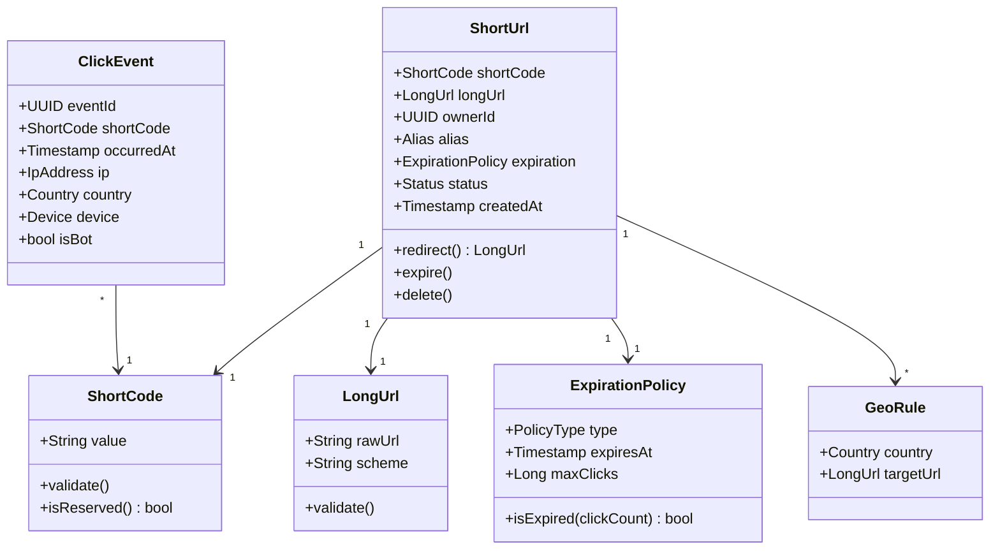

# 02 — Domain Modeling: URL Shortener

---

## Objective

Define the core domain entities, value objects, aggregates, and domain events that model the URL shortening business domain using Domain-Driven Design (DDD) principles.

---

## Domain Overview

The URL Shortener domain is conceptually simple but has subtle invariants:

- A **ShortUrl** is the central aggregate — it owns the mapping between a short code and a long URL
- The **short code** is a value object (immutable, identity-carrying)
- **Click** events are domain events, not entities — they are append-only facts
- **User** is a separate bounded context, referenced by ID only

---

## Core Entities

### ShortUrl (Aggregate Root)

```
ShortUrl
├── ShortCode         (Value Object — immutable, 6-8 chars, Base62)
├── LongUrl           (Value Object — validated URL string)
├── OwnerId           (Reference to User — nullable for anonymous)
├── Alias             (Value Object — optional custom alias)
├── ExpirationPolicy  (Value Object — never | at_time | after_clicks)
├── Status            (Enum — ACTIVE | EXPIRED | DELETED)
├── CreatedAt         (Timestamp)
├── UpdatedAt         (Timestamp)
└── GeoRoutingRules   (Collection<GeoRule> — for advanced routing)
```

**Invariants enforced by the aggregate:**
- `ShortCode` must be unique across the system (enforced by DB unique constraint + service layer)
- A `DELETED` ShortUrl cannot be redirected
- An `EXPIRED` ShortUrl can optionally show a "link expired" page
- `Alias` must be URL-safe and not conflict with system-reserved paths (e.g., `/api`, `/health`)
- `LongUrl` must be a valid URL (scheme check: http/https only)

---

### ClickEvent (Domain Event — Append Only)

```
ClickEvent
├── EventId           (UUID — idempotency key)
├── ShortCode         (Reference to ShortUrl)
├── OccurredAt        (Timestamp — millisecond precision)
├── IpAddress         (Value Object — anonymized after 24h for GDPR)
├── UserAgent         (String)
├── Referer           (String — nullable)
├── Country           (Value Object — derived from IP via GeoIP)
├── Device            (Enum — MOBILE | DESKTOP | TABLET | BOT)
└── BotFlag           (Boolean — auto-detected)
```

**Why an event, not an entity?** Click data is immutable — you never update a click record. It's a fact that happened. Treating it as a domain event drives the async analytics architecture.

---

### User (External Reference)

```
User (belongs to Identity Bounded Context)
├── UserId            (UUID)
├── Email             (Value Object)
├── ApiKey            (Value Object — for programmatic access)
├── Tier              (Enum — FREE | PRO | ENTERPRISE)
└── RateLimitPolicy   (links to quota enforcement)
```

The URL module does **not** own the User entity. It only holds a `UserId` reference. User authentication and management lives in the Identity module.

---

## Value Objects

### ShortCode

- 6–8 characters from `[a-zA-Z0-9]`
- Immutable — once created, a short code never changes
- Equality is structural (same chars = same code)
- Generated either randomly or from a user-provided alias
- Validation rules: no spaces, no special chars, no reserved words

### LongUrl

- Must have `http://` or `https://` scheme
- Max length: 2048 characters
- Must be parseable as a valid URI
- Optional: malware/phishing check hook (V2 — pluggable)

### ExpirationPolicy

```
ExpirationPolicy
├── type: NEVER | AT_TIMESTAMP | AFTER_N_CLICKS
├── expiresAt: Timestamp? (for AT_TIMESTAMP)
└── maxClicks: Long? (for AFTER_N_CLICKS)
```

---

## Aggregates and Boundaries

| Aggregate | Root | Owns | Does NOT Own |
|---|---|---|---|
| ShortUrl | ShortUrl | ShortCode, LongUrl, ExpirationPolicy, GeoRules | User, ClickEvent |
| ClickBatch | N/A (event-sourced) | ClickEvents | ShortUrl details |

**Aggregate design principle applied**: Keep aggregates small. ShortUrl does NOT contain a list of all its clicks — that would make it unbounded in size. Clicks are in a separate analytics store, queryable by `ShortCode`.

---

## Domain Events

| Event | Trigger | Consumers |
|---|---|---|
| `UrlCreated` | ShortUrl created successfully | Analytics init, notification |
| `UrlDeleted` | User/admin deletes a URL | Cache eviction, analytics stop |
| `UrlExpired` | TTL reached or click limit hit | Cache eviction, user notification |
| `UrlRedirected` | Redirect served | Analytics consumer (async) |
| `UrlAliasConflict` | Custom alias already taken | API error response |
| `SuspiciousUrlFlagged` | Malware/phishing check failed | Admin queue |

---

## Domain Services

### ShortCodeGenerator

Responsible for producing unique short codes. Not a property of any entity — it's a stateless service.

- Strategies: Random Base62, Counter-based, Pre-pooled keys
- Called by `UrlCreationService`
- Must retry on collision (DB constraint violation)

### UrlExpirationChecker

Evaluates whether a `ShortUrl` should be considered expired:
- By timestamp: `now() > expiresAt`
- By click count: `totalClicks >= maxClicks` (requires click count query)

Called during redirect path — must be fast (Redis TTL handles the time-based case natively).

### GeoRoutingResolver

Given a requester's `Country` and a `ShortUrl` with `GeoRoutingRules`, resolves which `LongUrl` target to redirect to.

---

## Domain Model Diagram



---

## Ubiquitous Language

| Term | Definition |
|---|---|
| **Short URL** | The full shortened URL including domain (e.g., `https://short.ly/aB3xYz`) |
| **Short Code** | Only the path component of the short URL (`aB3xYz`) |
| **Long URL** | The original destination URL |
| **Alias** | A user-defined, human-readable short code |
| **Redirect** | The act of serving a short code lookup and responding with a 302 |
| **Click** | One redirect event, captured as a domain event |
| **Expiration** | A policy that marks a ShortUrl as no longer valid |
| **GeoRouting** | Serving different long URLs based on requester geography |
| **Hot URL** | A URL receiving extremely high redirect traffic (cache priority candidate) |
| **Bot Traffic** | Redirect requests from automated scrapers/crawlers (filtered from analytics) |

---

## Tradeoffs

| Decision | Tradeoff |
|---|---|
| Clicks as domain events, not entity children | Keeps ShortUrl aggregate lean; but requires separate store query for analytics |
| Alias as part of ShortUrl, not a separate entity | Simpler model; but alias management (rename, reclaim) is tightly coupled |
| ExpirationPolicy as value object | Immutable after creation; changing expiry requires creating a new policy (or allowing mutation — a deliberate design choice) |
| GeoRules inside ShortUrl | Simpler queries; but if rules grow (100+ countries), this becomes a list-within-aggregate anti-pattern |

---

## Interview Discussion Points

- **Why keep Click events out of the ShortUrl aggregate?** Aggregates should be loadable quickly and fit in memory. An aggregate that accumulates millions of click events becomes a performance anti-pattern
- **What is the invariant that the ShortUrl aggregate must protect?** A deleted or expired ShortUrl must never result in a redirect — this logic lives in the aggregate's `redirect()` method
- **How would you model A/B testing in this domain?** A `ShortUrl` could have a `TrafficSplitPolicy` value object containing weighted `LongUrl` targets
- **How do you handle the click count expiration type?** Requires an atomic increment + check — Redis INCR with a Lua script is appropriate, avoiding a DB roundtrip
