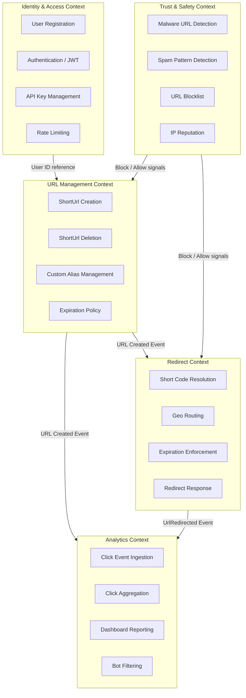

# 03 — DDD Bounded Contexts: URL Shortener

---

## Objective

Identify and define the bounded contexts within the URL shortener system, establish their responsibilities, and define how they interact — laying the foundation for future service extraction.

---

## Bounded Contexts Overview



---

## Bounded Context Details

### 1. URL Management Context

**Core Responsibility**: Own the lifecycle of a `ShortUrl` — creation, modification, deletion, and expiration.

**What it owns:**
- `ShortUrl` aggregate
- Custom alias uniqueness enforcement
- Short code generation
- Expiration policy application
- URL validation (format, scheme)

**What it does NOT own:**
- How the redirect is served (that's Redirect Context)
- Click analytics (that's Analytics Context)
- User identity (that's Identity Context)

**Key API exposed:**
```
POST /api/v1/urls          → Create short URL
DELETE /api/v1/urls/{code} → Delete short URL
GET /api/v1/urls/{code}    → Get URL metadata (not redirect)
PATCH /api/v1/urls/{code}  → Update expiration or geo rules
```

**Published Events:**
- `UrlCreated { shortCode, longUrl, ownerId, expiresAt }`
- `UrlDeleted { shortCode, deletedBy, reason }`
- `UrlExpired { shortCode, reason: TTL | CLICK_LIMIT }`

---

### 2. Redirect Context

**Core Responsibility**: Serve the redirect response as fast as possible given a short code.

**What it owns:**
- The hot-path redirect logic
- Cache read/write (Redis)
- Geo-routing resolution
- Expiration check at read time
- Publishing `UrlRedirected` events

**What it does NOT own:**
- Short URL creation
- Persistence of URL data (reads from cache + read replica)
- Analytics aggregation

**Key behavior:**
1. Receive GET `/{shortCode}`
2. Check Redis → if hit, redirect immediately
3. If miss → check PostgreSQL read replica
4. Check expiration → if expired, return 410 Gone
5. Apply geo-routing → pick target URL
6. Respond 302 (or 301 for CDN-cached)
7. Asynchronously publish `UrlRedirected` event

**Published Events:**
- `UrlRedirected { shortCode, resolvedUrl, ip, userAgent, country, timestamp }`

**Anti-Corruption Layer:**
The Redirect Context does NOT import the `ShortUrl` domain model. It works with a lightweight `UrlLookupResult` DTO — a read-optimized projection of the `ShortUrl` aggregate. This prevents tight coupling between the two contexts.

---

### 3. Analytics Context

**Core Responsibility**: Ingest, process, aggregate, and expose click analytics.

**What it owns:**
- `ClickEvent` storage and querying
- Bot detection and filtering
- Time-series aggregations (clicks/hour, clicks/day, by country, by device)
- Dashboard API
- Data retention policies (e.g., raw events purged after 90 days, aggregates kept indefinitely)

**What it does NOT own:**
- URL metadata (queries it from URL Management context via API call or event-sourced read model)
- The redirect serving logic

**Consumed Events:**
- `UrlRedirected` — primary click data source
- `UrlDeleted` — trigger for analytics data cleanup (or just stop processing for that code)

**Storage Strategy:**
- Raw events: Kafka → ClickHouse (append-only)
- Aggregates: pre-computed in ClickHouse materialized views
- Dashboard queries: ClickHouse columnar queries (fast for aggregations)

---

### 4. Identity & Access Context

**Core Responsibility**: Manage user accounts, authentication, API keys, and authorization.

**What it owns:**
- User entity (full lifecycle)
- Password/OAuth2 authentication
- JWT issuance and validation
- API key generation and rotation
- Rate limit quota definition per user tier

**What it does NOT own:**
- Short URL data
- Analytics data
- Rate limit enforcement at the HTTP layer (that's API Gateway or a shared RateLimiter service)

**Integration with other contexts:**
- URL Management receives `userId` from JWT claims — no need to query Identity
- Rate limiter checks user tier quota stored in Redis (populated from Identity's user data)

---

### 5. Trust & Safety Context (V2)

**Core Responsibility**: Detect and block abusive URLs (phishing, malware, spam).

**What it owns:**
- Malware/phishing URL database (updated via threat intelligence feeds)
- URL scanning pipeline (async scan on creation)
- IP reputation scoring
- Abuse report handling

**Integration pattern:**
- Plugged into URL Management as a pre-creation validation hook
- Plugged into Redirect Context as a blocking layer (redirect blocked if URL flagged after creation)
- Can be a **separate microservice** even in the monolith phase — it's I/O bound and independently scalable

---

## Context Map

| Relationship | Context A | Context B | Pattern |
|---|---|---|---|
| URL Management → Redirect | Upstream | Downstream | Published Events (Kafka) |
| URL Management → Analytics | Upstream | Downstream | Published Events (Kafka) |
| Identity → URL Management | Upstream | Downstream | Open Host Service (JWT claims) |
| Trust & Safety → URL Management | Upstream | Downstream | Anti-Corruption Layer (plugin hook) |
| Redirect → Analytics | Upstream | Downstream | Published Events (Kafka) |

**Context Map Patterns Used:**
- **Open Host Service**: Identity exposes a well-defined JWT standard; other contexts parse it
- **Published Language**: Kafka events are the shared language between contexts (schema-registered in Confluent Schema Registry)
- **Anti-Corruption Layer**: Redirect context has a `UrlLookupAdapter` that translates `ShortUrl` aggregate into its own read model

---

## Module Structure in Codebase (Monolith)

```
com.urlshortener
├── url/                    ← URL Management Bounded Context
│   ├── domain/
│   │   ├── ShortUrl.java
│   │   ├── ShortCode.java
│   │   ├── LongUrl.java
│   │   ├── ExpirationPolicy.java
│   │   └── events/
│   ├── application/
│   │   ├── CreateUrlUseCase.java
│   │   └── DeleteUrlUseCase.java
│   ├── infrastructure/
│   │   ├── UrlRepository.java
│   │   └── ShortCodeGenerator.java
│   └── api/
│       └── UrlController.java
│
├── redirect/               ← Redirect Bounded Context
│   ├── application/
│   │   ├── RedirectUseCase.java
│   │   └── GeoRoutingResolver.java
│   ├── infrastructure/
│   │   ├── RedirectCacheAdapter.java
│   │   └── UrlLookupAdapter.java        ← ACL
│   └── api/
│       └── RedirectController.java
│
├── analytics/              ← Analytics Bounded Context
│   ├── domain/
│   │   └── ClickEvent.java
│   ├── application/
│   │   ├── ClickIngestionService.java
│   │   └── ClickAggregationService.java
│   ├── infrastructure/
│   │   ├── ClickEventConsumer.java      ← Kafka consumer
│   │   └── ClickHouseRepository.java
│   └── api/
│       └── AnalyticsDashboardController.java
│
├── identity/               ← Identity Bounded Context
│   ├── domain/
│   │   └── User.java
│   ├── application/
│   │   └── AuthService.java
│   └── api/
│       └── AuthController.java
│
└── shared/                 ← Shared Kernel (minimal)
    ├── events/
    │   └── DomainEvent.java
    ├── types/
    │   └── CountryCode.java
    └── security/
        └── JwtValidator.java
```

**Rule**: Contexts may only communicate via:
1. Published domain events (Kafka)
2. Internal application service interfaces (Java interfaces, not direct class calls across packages)
3. Shared Kernel types (minimal, stable types only)

---

## Tradeoffs

| Decision | Tradeoff |
|---|---|
| Separate Analytics context from Redirect | Analytics can scale independently; adds event publishing overhead |
| Anti-Corruption Layer in Redirect | Protects Redirect from URL Management model changes; adds translation code |
| Shared Kernel for event types | Reduces code duplication; creates coupling on shared types |
| Trust & Safety as optional plugin | Easy to swap vendor; but adds async validation delay on creation |

---

## Interview Discussion Points

- **How would you split this monolith into microservices?** Extract Redirect as the first microservice (highest RPS, most independent). Next: Analytics (largest data volume, separate DB). Identity last (most stable, most risk if split incorrectly)
- **What's the biggest risk in this context map?** The Redirect context depends on URL Management data — any schema change in `ShortUrl` must be backward compatible in the Kafka events consumed by Redirect
- **How do you maintain consistency across contexts?** Via Saga pattern: `UrlCreated` event triggers cache warm-up in Redirect context; if that fails, Redirect falls back to DB lookup — eventual consistency is acceptable
- **What's a good Shared Kernel?** Only put things that are truly stable and domain-agnostic: `CountryCode`, `Timestamp`, base `DomainEvent` interface. Never put business logic in the Shared Kernel
