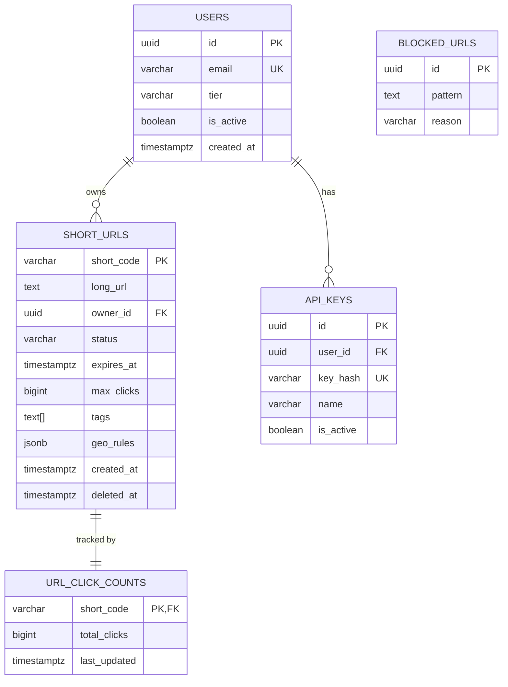

# 05 — Database Design: URL Shortener

---

## Objective

Design the persistent data layer for the URL shortener — covering schema design, indexing strategy, partitioning, sharding considerations, and the rationale for choosing PostgreSQL as the primary store alongside ClickHouse for analytics.

---

## Technology Choices

| Store | Purpose | Justification |
|---|---|---|
| PostgreSQL 15+ | Primary URL storage, user data, idempotency keys | ACID guarantees needed for URL uniqueness, soft deletes, transactional creation |
| Redis 7+ | Hot URL cache, rate limit counters, ID generation counters, idempotency key cache | Sub-millisecond lookup; TTL-native; atomic operations |
| ClickHouse | Click analytics time-series | Columnar storage; 100x faster than PostgreSQL for aggregations on billions of rows |
| AWS S3 | Archived expired URL records | Cost-effective cold storage; partitioned by date |

---

## PostgreSQL Schema

### Table: `short_urls`

```sql
CREATE TABLE short_urls (
    short_code          VARCHAR(10)     PRIMARY KEY,
    long_url            TEXT            NOT NULL,
    owner_id            UUID            REFERENCES users(id) ON DELETE SET NULL,
    status              VARCHAR(10)     NOT NULL DEFAULT 'ACTIVE',
                                        -- CHECK (status IN ('ACTIVE', 'EXPIRED', 'DELETED'))
    expires_at          TIMESTAMPTZ     NULL,
    max_clicks          BIGINT          NULL,
    tags                TEXT[]          NOT NULL DEFAULT '{}',
    geo_rules           JSONB           NOT NULL DEFAULT '[]',
    idempotency_key     UUID            NULL,       -- for creation idempotency
    created_at          TIMESTAMPTZ     NOT NULL DEFAULT NOW(),
    updated_at          TIMESTAMPTZ     NOT NULL DEFAULT NOW(),
    deleted_at          TIMESTAMPTZ     NULL        -- soft delete timestamp
);
```

**Field Justifications:**
- `short_code` as PRIMARY KEY — natural key, already unique, avoids surrogate key overhead on the redirect hot path
- `long_url` as TEXT — URLs can exceed 255 chars; TEXT is unlimited in PostgreSQL
- `geo_rules` as JSONB — flexible schema for country→URL mappings; JSONB supports GIN indexing
- `tags` as `TEXT[]` — PostgreSQL native array; supports GIN index for array containment queries
- `idempotency_key` — stored to detect duplicate creation requests

**Indexes:**

```sql
-- Primary key index on short_code (auto-created by PRIMARY KEY)

-- For user dashboard: "show me all my URLs"
CREATE INDEX idx_short_urls_owner_status 
    ON short_urls (owner_id, status, created_at DESC)
    WHERE owner_id IS NOT NULL;

-- For expiration cleanup job: "find all URLs past their expiry"
CREATE INDEX idx_short_urls_expires_at 
    ON short_urls (expires_at)
    WHERE expires_at IS NOT NULL AND status = 'ACTIVE';

-- For tag filtering
CREATE INDEX idx_short_urls_tags 
    ON short_urls USING GIN (tags);

-- For idempotency key lookup
CREATE UNIQUE INDEX idx_short_urls_idempotency_key 
    ON short_urls (idempotency_key)
    WHERE idempotency_key IS NOT NULL;
```

---

### Table: `users`

```sql
CREATE TABLE users (
    id              UUID            PRIMARY KEY DEFAULT gen_random_uuid(),
    email           VARCHAR(320)    NOT NULL UNIQUE,
    password_hash   VARCHAR(255)    NOT NULL,
    tier            VARCHAR(20)     NOT NULL DEFAULT 'FREE',
                                    -- CHECK (tier IN ('FREE', 'PRO', 'ENTERPRISE'))
    api_key_hash    VARCHAR(255)    NULL UNIQUE,
    is_active       BOOLEAN         NOT NULL DEFAULT TRUE,
    created_at      TIMESTAMPTZ     NOT NULL DEFAULT NOW(),
    last_login_at   TIMESTAMPTZ     NULL,
    deleted_at      TIMESTAMPTZ     NULL
);
```

---

### Table: `api_keys`

```sql
CREATE TABLE api_keys (
    id              UUID            PRIMARY KEY DEFAULT gen_random_uuid(),
    user_id         UUID            NOT NULL REFERENCES users(id) ON DELETE CASCADE,
    key_hash        VARCHAR(255)    NOT NULL UNIQUE,    -- SHA256 of the actual key
    key_prefix      VARCHAR(8)      NOT NULL,           -- first 8 chars for display
    name            VARCHAR(100)    NOT NULL,
    last_used_at    TIMESTAMPTZ     NULL,
    expires_at      TIMESTAMPTZ     NULL,
    is_active       BOOLEAN         NOT NULL DEFAULT TRUE,
    created_at      TIMESTAMPTZ     NOT NULL DEFAULT NOW()
);

CREATE INDEX idx_api_keys_user_id ON api_keys (user_id) WHERE is_active = TRUE;
```

**Why hash the API key?** Never store API keys in plaintext. Store `SHA256(key)` — the user sees the key once on creation. This prevents insider access to user credentials.

---

### Table: `url_click_counts` (Materialized Counter — PostgreSQL)

```sql
CREATE TABLE url_click_counts (
    short_code      VARCHAR(10)     PRIMARY KEY REFERENCES short_urls(short_code),
    total_clicks    BIGINT          NOT NULL DEFAULT 0,
    last_updated    TIMESTAMPTZ     NOT NULL DEFAULT NOW()
);
```

**Why a separate counter table?** Avoids UPDATE contention on the `short_urls` table during high-traffic redirect storms. Still, at very high scale (>10K RPS per URL), even this becomes a hot row. Prefer Redis INCR for the counter with periodic flush to this table.

---

### Table: `blocked_urls` (Trust & Safety)

```sql
CREATE TABLE blocked_urls (
    id              UUID            PRIMARY KEY DEFAULT gen_random_uuid(),
    pattern         TEXT            NOT NULL,   -- exact URL or regex pattern
    pattern_type    VARCHAR(10)     NOT NULL,   -- CHECK (pattern_type IN ('EXACT', 'DOMAIN', 'REGEX'))
    reason          VARCHAR(50)     NOT NULL,   -- PHISHING, MALWARE, SPAM, LEGAL
    created_at      TIMESTAMPTZ     NOT NULL DEFAULT NOW(),
    created_by      UUID            REFERENCES users(id)
);

CREATE INDEX idx_blocked_urls_pattern ON blocked_urls USING GIN (to_tsvector('english', pattern));
```

---

## ER Diagram



---

## ClickHouse Schema (Analytics)

```sql
CREATE TABLE click_events (
    event_id        UUID,
    short_code      LowCardinality(String),
    occurred_at     DateTime64(3, 'UTC'),
    ip_address      String,             -- anonymized after 24h
    country         LowCardinality(String),
    device          LowCardinality(String),
    referrer        String,
    user_agent      String,
    is_bot          UInt8
)
ENGINE = MergeTree()
PARTITION BY toYYYYMM(occurred_at)    -- monthly partitions
ORDER BY (short_code, occurred_at)    -- clustered index: shortCode first, then time
TTL occurred_at + INTERVAL 90 DAY     -- raw data purged after 90 days
    DELETE;
```

**Partition strategy**: Monthly partitions make it easy to:
- Drop old data (just drop the partition — instant, no row-by-row delete)
- Query recent months efficiently (partition pruning)
- Manage TTL

**Why `LowCardinality(String)` for country/device?** ClickHouse optimizes repeated values in low-cardinality columns via dictionary encoding — 10x compression and faster queries.

---

## Materialized Views in ClickHouse

```sql
-- Pre-aggregated daily stats per short code
CREATE MATERIALIZED VIEW click_daily_stats
ENGINE = SummingMergeTree()
PARTITION BY toYYYYMM(date)
ORDER BY (short_code, date)
AS SELECT
    short_code,
    toDate(occurred_at) AS date,
    count() AS clicks,
    countIf(is_bot = 0) AS human_clicks,
    uniqExact(ip_address) AS unique_ips
FROM click_events
GROUP BY short_code, date;
```

Analytics dashboard queries hit this materialized view — not the raw event table. Sub-second response for 90-day rollups on any URL.

---

## Indexing Strategy Summary

| Table | Index | Type | Purpose |
|---|---|---|---|
| `short_urls` | `short_code` | B-Tree (PK) | Redirect lookup |
| `short_urls` | `(owner_id, status, created_at)` | B-Tree | User dashboard listing |
| `short_urls` | `expires_at` | Partial B-Tree | Expiration cleanup job |
| `short_urls` | `tags` | GIN | Tag-based filtering |
| `short_urls` | `idempotency_key` | Unique B-Tree | Duplicate creation detection |
| `click_events` | `(short_code, occurred_at)` | ClickHouse ORDER BY | Time-series analytics |
| `click_events` | `toYYYYMM(occurred_at)` | Partition key | Date-range scan pruning |

---

## Partitioning Strategy

**PostgreSQL `short_urls` table** — partition by:
- **Not needed at V1**: At 5M URLs/day × 365 days × 2 years = ~3.6B rows, single-table B-Tree on `short_code` still performs well (log₂(3.6B) ≈ 32 comparisons)
- **V2**: If analytics-per-URL data is co-located, range partition by `created_at` month
- **At Taking scale (billions/year)**: Hash partition by `short_code` for even distribution

---

## Sharding Considerations

At what point does PostgreSQL need horizontal sharding?

| Signal | Action |
|---|---|
| Single DB > 2 TB storage | Consider Citus (PostgreSQL sharding extension) |
| Write throughput > 10K RPS sustained | Consider sharding or moving to Cassandra for write path |
| Single node IOPS saturated | Vertical scale first (NVMe SSDs), then shard |
| p99 DB query > 20ms consistently | Add read replicas, then shard |

**Shard Key**: If sharding, use `short_code` as the shard key — redirect lookups are always by short code, so queries never fan out to multiple shards.

---

## Consistency and Durability Tradeoffs

| Scenario | Behavior | Justification |
|---|---|---|
| URL creation | Synchronous write to primary, confirm before returning | Durability guarantee — URL must not be lost |
| Redirect read | Read from Redis → then read replica | Eventual consistency acceptable (stale hit < 1s) |
| Click count update | Async via Kafka → ClickHouse | Analytics lag acceptable (30s–60s) |
| Cache invalidation on delete | Synchronous Redis DEL on delete API call | Must be immediate to stop redirects |
| Expiration enforcement | TTL in Redis + background DB updater | Redis TTL fires first; DB batch job catches stragglers |

---

## Soft Delete Strategy

- Set `status = 'DELETED'` and `deleted_at = NOW()`
- Immediate Redis key eviction on soft delete
- Hard delete (physical row removal) after 30-day grace period via scheduled cleanup job
- Analytics data retained even after URL deletion (historical clicks still valuable)

---

## Data Archival Strategy

- Expired or deleted URLs older than 90 days → exported to S3 as Parquet files
- S3 path: `s3://short-ly-archive/urls/year=2024/month=01/batch_xxx.parquet`
- Retained for 7 years (compliance, potential abuse investigation)
- Row deleted from PostgreSQL after S3 confirmation
- ClickHouse click_events TTL handles analytics archive automatically

---

## Multi-Tenant Considerations (V2)

If offering white-label short domains (enterprise feature):
- Add `tenant_id` to `short_urls` table
- Short code uniqueness becomes unique per `(tenant_id, short_code)` — change PK to composite
- Row-level security in PostgreSQL: `CREATE POLICY ... USING (tenant_id = current_setting('app.tenant_id'))`
- Redis namespace per tenant: `tenant:short.co:aB3xYz`

---

## Interview Discussion Points

- **Why PostgreSQL over DynamoDB for URL storage?** PostgreSQL provides UNIQUE constraint enforcement (no race conditions on alias creation), rich query patterns for the dashboard, JSONB for flexible geo rules. DynamoDB would require application-level locking for uniqueness
- **Why not store click events in PostgreSQL?** 500M clicks/day = ~180B rows/year. PostgreSQL cannot efficiently aggregate this volume. ClickHouse handles 100B+ rows with sub-second aggregation queries
- **How do you handle the hot row problem on click counting?** Redis INCR per short code, batch-flushed to PostgreSQL every 60 seconds. Never do `UPDATE short_urls SET click_count = click_count + 1` under high concurrency
- **What's your strategy for index bloat in PostgreSQL?** Schedule `VACUUM ANALYZE` during low-traffic windows. Monitor `pg_stat_user_tables` for dead tuples. Use `pg_partman` for partition management
- **How do you enforce short_code uniqueness without SELECT-then-INSERT race conditions?** INSERT with unique constraint — let the DB enforce it. On conflict, retry with a new code. Never SELECT first
