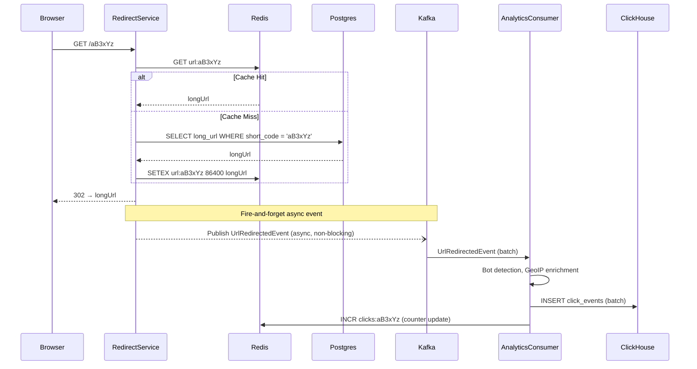
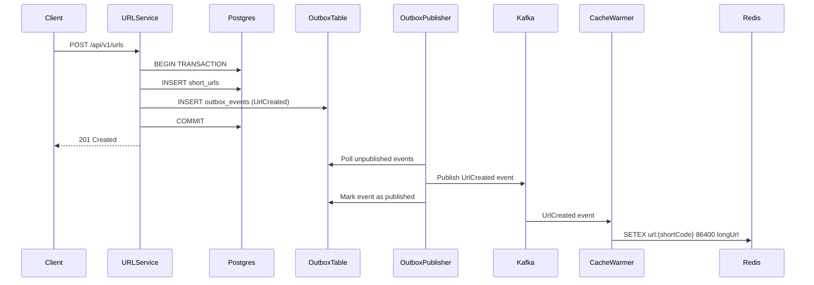

# 06 — Event Flow Design: URL Shortener

---

## Objective

Define the event-driven architecture for the URL shortener — specifically how domain events flow through the system to decouple the analytics pipeline from the critical redirect path, and how the outbox pattern ensures reliability.

---

## Why Event-Driven for This System?

The core problem: **Analytics must not slow down redirects.**

A naive implementation records a click in the database synchronously during redirect — adding 10–50ms of DB write latency to the most latency-sensitive operation. Under 10K RPS, this saturates the DB write path.

The solution: **Decouple via Kafka.** Redirect responds immediately; click events are published to Kafka asynchronously and processed by an independent consumer.

---

## Domain Events Catalog

| Event | Topic | Producer | Consumers | Trigger |
|---|---|---|---|---|
| `UrlCreated` | `url.created` | URL Management | Analytics (init), Cache Warmer | POST /api/v1/urls |
| `UrlDeleted` | `url.deleted` | URL Management | Cache Eviction, Analytics | DELETE /api/v1/urls/{code} |
| `UrlExpired` | `url.expired` | Expiration Job | Cache Eviction, User Notification | TTL/click-limit reached |
| `UrlRedirected` | `url.redirected` | Redirect Service | Analytics Ingestion | GET /{code} (successful redirect) |
| `UrlBlocked` | `url.blocked` | Trust & Safety | Cache Eviction, Admin Alert | Safety scan flags URL |
| `ClickBatchFlushed` | `analytics.click.batch` | Analytics Consumer | ClickHouse Writer | Batch aggregation |

---

## Kafka Topic Design

### Topic: `url.redirected` (High Volume — Critical)

```
Topic:              url.redirected
Partitions:         32                    ← based on peak RPS / consumer throughput
Replication Factor: 3
Retention:          24 hours              ← click events processed quickly; long retention = storage cost
Cleanup Policy:     delete
Message Format:     Avro (schema versioned)
```

**Partition Key**: `shortCode` — ensures all click events for the same URL land on the same partition, preserving order per URL. This matters for click-count-based expiration enforcement.

**Throughput calculation:**
- Peak: 10,000 redirects/second
- Each message: ~500 bytes (Avro-encoded)
- Peak throughput: 10,000 × 500 = 5 MB/s
- With replication (3x): 15 MB/s total
- 32 partitions × ~500 KB/s/partition = 16 MB/s capacity — adequate

---

### Topic: `url.created`

```
Topic:              url.created
Partitions:         8
Replication Factor: 3
Retention:          7 days
Message Format:     Avro
```

**Partition Key**: `ownerId` — analytics initialization per user stays on same partition.

---

### Topic: `url.deleted` / `url.expired`

```
Topic:              url.lifecycle
Partitions:         8
Replication Factor: 3
Retention:          7 days
```

Combines delete + expire events (low volume, same consumers). Separate topics would add operational complexity without benefit.

---

## Avro Schema: UrlRedirectedEvent

```json
{
  "type": "record",
  "name": "UrlRedirectedEvent",
  "namespace": "com.urlshortener.events",
  "doc": "Emitted each time a short URL is resolved and a redirect response served",
  "fields": [
    { "name": "eventId", "type": "string", "doc": "UUID — idempotency key for exactly-once processing" },
    { "name": "shortCode", "type": "string" },
    { "name": "resolvedUrl", "type": "string" },
    { "name": "occurredAt", "type": "long", "logicalType": "timestamp-millis" },
    { "name": "ipAddress", "type": "string" },
    { "name": "userAgent", "type": "string" },
    { "name": "referrer", "type": ["null", "string"], "default": null },
    { "name": "country", "type": ["null", "string"], "default": null },
    { "name": "device", "type": { "type": "enum", "name": "Device", "symbols": ["MOBILE", "DESKTOP", "TABLET", "BOT", "UNKNOWN"] } },
    { "name": "isBot", "type": "boolean" },
    { "name": "redirectType", "type": { "type": "enum", "name": "RedirectType", "symbols": ["DIRECT", "GEO_ROUTED", "AB_TESTED"] } },
    { "name": "schemaVersion", "type": "int", "default": 1 }
  ]
}
```

---

## Event Flow Diagrams

### Redirect + Analytics Event Flow



---

### URL Creation Event Flow



**Why the Outbox Pattern here?** Without it, there's a window where the URL is created in Postgres but the event is never published to Kafka (app crash between write and publish). The outbox pattern guarantees at-least-once event delivery by persisting the event in the same transaction as the URL record.

---

## Outbox Pattern Implementation

### Table: `outbox_events`

```sql
CREATE TABLE outbox_events (
    id              UUID            PRIMARY KEY DEFAULT gen_random_uuid(),
    aggregate_type  VARCHAR(50)     NOT NULL,   -- 'SHORT_URL', 'USER'
    aggregate_id    VARCHAR(50)     NOT NULL,   -- the short_code or user_id
    event_type      VARCHAR(100)    NOT NULL,   -- 'UrlCreated', 'UrlDeleted'
    payload         JSONB           NOT NULL,
    published       BOOLEAN         NOT NULL DEFAULT FALSE,
    created_at      TIMESTAMPTZ     NOT NULL DEFAULT NOW(),
    published_at    TIMESTAMPTZ     NULL
);

CREATE INDEX idx_outbox_unpublished 
    ON outbox_events (created_at) 
    WHERE published = FALSE;
```

**Outbox Publisher (Polling Approach):**
1. Every 100ms, query `SELECT * FROM outbox_events WHERE published = FALSE ORDER BY created_at LIMIT 100`
2. Publish each event to Kafka
3. `UPDATE outbox_events SET published = TRUE, published_at = NOW() WHERE id IN (...)`

**Alternative: Debezium CDC** (Production-recommended at scale)
- Postgres WAL → Debezium → Kafka
- No polling; sub-100ms latency; no polling overhead
- Eliminates the outbox table polling — the WAL is the outbox

---

## Consumer Group Design

| Consumer Group | Topic(s) | Scaling | Processing |
|---|---|---|---|
| `analytics-click-ingester` | `url.redirected` | 1 consumer/partition = 32 max | Batch → ClickHouse INSERT |
| `cache-eviction-handler` | `url.lifecycle` | 8 consumers | Redis DEL on delete/expire |
| `cache-warmer` | `url.created` | 4 consumers | Redis SETEX on creation |
| `notification-sender` | `url.lifecycle` | 4 consumers | Email/push on expiry (V2) |
| `analytics-initializer` | `url.created` | 4 consumers | Init click_counts record |

---

## Dead Letter Queue (DLQ) Strategy

| Failure Scenario | DLQ Topic | Retry Strategy | Alert |
|---|---|---|---|
| ClickHouse INSERT fails | `url.redirected.dlq` | 3 retries with exp backoff, then DLQ | Alert if DLQ > 1000 msgs |
| GeoIP enrichment timeout | `url.redirected.dlq` | Skip enrichment after 2 retries | Metric alert |
| Cache eviction fails | `url.lifecycle.dlq` | 3 retries, then DLQ + ops alert | PagerDuty alert |
| Outbox publishing fails | N/A (in-process retry) | Exponential backoff, Kafka broker reconnect | Alert on lag > 60s |

**DLQ consumer**: Manual inspection + replay tool. Engineer reviews DLQ messages, fixes root cause, replays to original topic.

---

## Exactly-Once vs At-Least-Once

| Path | Guarantee | Justification |
|---|---|---|
| Click event → ClickHouse | At-least-once + idempotent consumer | A duplicate click insert is tolerable; filtering by `eventId` deduplication in ClickHouse |
| URL created event → cache | At-least-once | Cache warm on duplicate is a no-op |
| URL deleted event → cache eviction | At-least-once | Idempotent: Redis DEL on already-deleted key is safe |
| URL created → Postgres | Exactly-once (ACID transaction) | Must not create duplicate URL records |

**Deduplication in ClickHouse:**

```sql
-- ReplacingMergeTree deduplicates by event_id on merge
CREATE TABLE click_events (...) ENGINE = ReplacingMergeTree() ORDER BY (event_id);
```

---

## Backpressure Handling

**Scenario**: Analytics consumer falls behind (ClickHouse slow, network issues).

| Signal | Detection | Response |
|---|---|---|
| Kafka consumer lag > 1M messages | Consumer lag metric | Scale up analytics consumer pods |
| ClickHouse insert queue full | ClickHouse pending inserts metric | Pause consumer; allow ClickHouse to drain |
| Topic disk full | Kafka storage alert | Increase retention policy storage; add brokers |

**Kafka Producer config for redirect service:**
- `acks=1` (not `acks=all`) — analytics events do not need full replication acknowledgment; performance > durability for click events
- `compression.type=lz4` — 3-5x compression on repetitive URL/IP data
- `batch.size=64KB, linger.ms=5` — micro-batching for throughput

---

## Tradeoffs

| Decision | Tradeoff |
|---|---|
| Fire-and-forget Kafka publish during redirect | Can lose click events if Kafka is unavailable; acceptable since analytics isn't the primary product |
| Outbox pattern for UrlCreated | Guarantees delivery but adds a DB table + polling overhead |
| At-least-once for analytics | Simple consumer; requires idempotent ClickHouse writes |
| Partition key = shortCode | Even distribution only if codes are uniformly distributed; a single viral URL causes partition hotspot |

---

## Interview Discussion Points

- **What happens if Kafka is down when a redirect occurs?** The redirect still succeeds (user is served). The click event is lost. For non-critical analytics, this is acceptable. For billing (pay-per-click), use synchronous write with circuit breaker
- **How do you handle the hot partition problem?** If `shortCode = "google"` gets 100K RPS, all events go to one partition. Solutions: add random suffix to partition key, or use a special high-volume topic with more partitions for known hot URLs
- **Why not use RabbitMQ instead of Kafka?** Kafka provides durable log replay (re-process events if ClickHouse fails), better throughput, and consumer group semantics. RabbitMQ is more appropriate for task queues, not event streaming
- **How do you debug a missing click event?** Trace via `eventId` — check Kafka consumer group lag, DLQ, ClickHouse deduplication log. Correlation ID on the HTTP request → Kafka event links them
