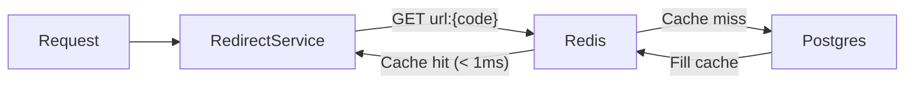
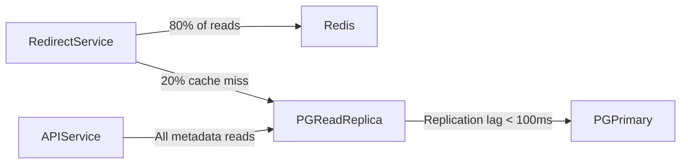
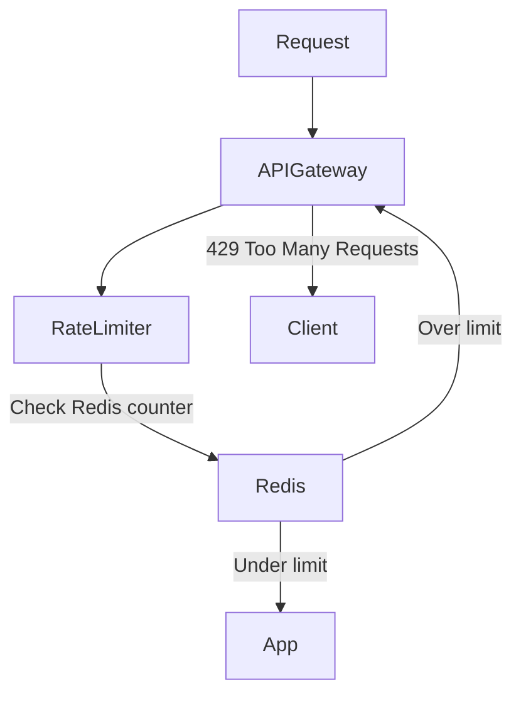
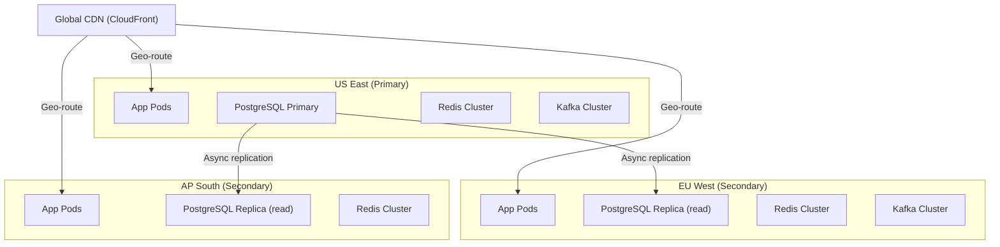

# 07 — Scaling Strategy: URL Shortener

---

## Objective

Define the horizontal and vertical scaling approach, caching layers, load balancing, rate limiting, and performance bottleneck analysis for the URL shortener at various traffic tiers.

---

## Scaling Tiers

| Tier | Daily Redirects | RPS (Peak) | Architecture |
|---|---|---|---|
| Startup | 1M/day | 50 RPS | Single app instance, single Postgres, Redis |
| Growth | 50M/day | 2,500 RPS | 3 app instances, Postgres primary+replica, Redis cluster |
| Scale | 500M/day | 10,000 RPS | 10+ app instances, multi-region, CDN, Kafka |
| FAANG | 5B/day | 100,000 RPS | 100+ instances, global CDN, multi-region active-active |

---

## The Three Scaling Levers for URL Shortener

### 1. CDN Layer (Most Impactful)

The most aggressive scaling lever is serving redirects from the CDN — not the application layer at all.

**How it works:**
- URLs marked as "cacheable" (e.g., permanent URLs with high traffic) serve a `301 Moved Permanently`
- CDN caches this redirect response at edge nodes globally
- Subsequent requests from the same geo region never hit the origin application
- Cache hit ratio target: > 80% of redirects served by CDN

**CDN Configuration:**

```
Cache-Control: public, max-age=86400, stale-while-revalidate=3600
Vary: Accept-Encoding
```

**Tradeoff**: 301 redirects cached in CDN mean the browser won't re-request the short URL even if it's later deleted or expired. Mitigated by:
1. Only 301-cache URLs with `permanent=true` flag
2. CDN cache purge API call on URL deletion/expiry
3. Default to 302 (no caching) for all other URLs

**CDN impact at scale:**
- Without CDN: 10,000 RPS × 100 origin servers needed
- With CDN (80% hit rate): 2,000 RPS to origin × 20 origin servers needed
- Cost savings: ~80% reduction in compute

---

### 2. Redis Cache Layer (In-Memory Redirect)

For the 20% of requests that miss CDN (dynamic URLs, recent URLs, 302s):



**Redis configuration:**
- `maxmemory-policy: allkeys-lru` — evict least-recently-used URLs when memory full
- Target hit rate: > 95% for active URLs
- TTL: 24 hours for active URLs; immediate eviction on delete/expire

**Hot URL protection**: A single viral URL hitting 100K RPS can saturate one Redis node.

Solutions:
1. **Local process cache (Caffeine)**: In-process LRU cache of top 10K URLs per app instance, TTL=60s. Reduces Redis calls by ~70%
2. **Redis read replicas**: Redirect reads distributed across 3 read replicas
3. **Consistent hashing**: URL cache keys distributed across Redis cluster nodes

**Memory sizing:**
- Top 1M URLs in Redis × 250 bytes/entry = 250MB
- Redis cluster: 3 nodes × 4GB each = 12GB total (headroom for growth)

---

### 3. Application Layer Scaling

**Horizontal scaling:**
- Stateless application pods (no session affinity needed — all state in Redis/Postgres)
- Auto-scaling based on CPU + request queue depth
- Kubernetes HPA: scale out at 60% CPU, scale in at 30%

**Redirect service characteristics:**
- Mostly I/O bound (Redis lookup, occasional Postgres read)
- CPU-light: no computation beyond cache lookup + HTTP response
- Each instance handles: 2,000–5,000 RPS (depending on Redis latency)
- At 10,000 RPS: 2–5 instances sufficient (with Redis providing most of the work)

**URL creation service characteristics:**
- Separate from redirect (can scale independently)
- DB-write bound: each creation = 1 write + 1 cache set
- At 300 creation RPS: 2–3 instances sufficient

---

## Load Balancing Strategy

```
Global Traffic → Route 53 (DNS-based geo routing)
    ↓
CloudFront CDN (edge redirect serving)
    ↓ (cache miss)
AWS ALB (Application Load Balancer)
    ↓
Target Groups:
    - Redirect Service pods (high replicas)
    - API Service pods (lower replicas)
```

**ALB routing rules:**
- `GET /{shortCode}` → Redirect Target Group
- `/api/*` → API Target Group
- `/health` → All target groups (health check)

**Why separate target groups?** Redirect and API have different scaling profiles. Don't co-locate — a burst of URL creations (bulk import) shouldn't affect redirect latency.

---

## Caching Strategy Summary

| Cache Layer | Technology | What's Cached | TTL | Eviction |
|---|---|---|---|---|
| CDN (Edge) | CloudFront | 301 redirect responses | 24 hours | Cache invalidation API on delete |
| Application (L1) | Caffeine (in-process) | Top 10K hot URLs | 60 seconds | LRU |
| Distributed (L2) | Redis Cluster | Active URLs | 24 hours | LRU + explicit eviction on delete |
| Read Replica | PostgreSQL replica | All URLs | N/A (DB) | N/A |

**Cache-aside pattern** (used here):
1. Check cache
2. If miss: read from DB, populate cache
3. On write: invalidate cache, write to DB

**Write-through** not used: URL creation doesn't require immediate cache availability — the first redirect will be a cache miss and populate it.

---

## Database Scaling

### Read Path



**Read replica strategy:**
- 2 read replicas in same region
- PgBouncer connection pooler in front of each replica (max 100 connections per replica)
- Replication lag monitoring: alert if lag > 1 second

### Write Path

- All writes go to primary PostgreSQL
- Connection pooled via PgBouncer (app uses 5 connections per pod; PgBouncer maintains 100 to DB)
- Write RPS at 300 creation/sec + periodic cache flush = well within single-primary capacity (PostgreSQL handles ~5,000 simple writes/sec on modern hardware)

### When to shard PostgreSQL:

| Metric | Threshold | Action |
|---|---|---|
| DB storage | > 1 TB | Add read replicas for read-heavy workload |
| Write RPS | > 5,000 | Shard by `short_code` hash using Citus |
| P99 query time | > 50ms consistently | Profile + index, then scale vertically |

---

## Rate Limiting Architecture



**Rate limit algorithm**: Token Bucket (via Redis + Lua script)
- Reason: Allows burst traffic (better UX) while maintaining average rate limit
- Lua script executes atomically in Redis — no race conditions

**Lua script (conceptual):**
```
local tokens = redis.call('GET', key) or capacity
local now = redis.call('TIME')[1]
-- refill tokens based on elapsed time
-- check if request can proceed
-- update counter
-- return allowed/denied
```

**Rate limit scope:**
- Per IP (anonymous requests)
- Per user ID (authenticated requests)  
- Per API key (programmatic access)
- Per tenant (enterprise multi-tenant)

---

## Async Processing for Scalability

| Synchronous (In Request) | Asynchronous (Decoupled) |
|---|---|
| Cache lookup (Redis) | Click event recording (Kafka) |
| DB read (cache miss) | Analytics aggregation (ClickHouse) |
| URL validation | Email notification on expiry |
| Redirect response | URL malware scanning (V2) |
| Idempotency check | Bulk URL creation processing |

**Throughput impact**: Moving click event recording async increased redirect throughput from ~2,000 RPS/instance to ~10,000 RPS/instance.

---

## Performance Bottlenecks

### Bottleneck 1: N+1 Query in Analytics Dashboard

**Problem**: Fetching all URLs for a user, then querying click counts for each URL individually.

**Solution**: JOIN or IN clause, or pre-materialized click_count on the URL record (updated via async batch).

---

### Bottleneck 2: Hot Redis Key

**Problem**: Single URL (e.g., viral campaign URL) receiving 50K RPS all hitting same Redis key → single node saturated.

**Solution**: 
1. Detect hot keys (Redis `MONITOR` + key access counter)
2. Replicate hot URL into local process cache (Caffeine) with 5-second TTL
3. 100 app instances × 5-second local cache = 500 "virtual" distributed cache copies

---

### Bottleneck 3: Short Code Collision on Creation

**Problem**: Under high creation RPS, two requests generate the same random code simultaneously.

**Solution**:
- DB unique constraint → conflict detected → retry with new code
- At 300 creation RPS and 56B key space, collision probability is 300² / (2 × 56B) ≈ negligible
- Pre-generated key pool (KGS service) eliminates retries entirely at the cost of operational complexity

---

### Bottleneck 4: Kafka Consumer Lag

**Problem**: Click event consumer falls behind during traffic spikes → growing lag → stale analytics.

**Solution**:
- Monitor consumer lag metric (`kafka.consumer_lag`)
- Auto-scale consumer pod count based on lag metric (KEDA — Kubernetes Event-driven Autoscaling)
- ClickHouse batched inserts: accumulate 10,000 events or 1 second, then INSERT in bulk (10K rows/INSERT is much faster than 1 row/INSERT)

---

## Multi-Region Scaling (FAANG Level)



**Multi-region considerations:**
- URL creation: writes to US East primary only (single write region)
- URL reads (redirect): served from nearest region's read replica
- Replication lag: async PG replication = eventual consistency (< 1s lag typically)
- Risk: user creates URL, immediately shares it with someone in EU — EU redirect might miss (< 1s window). Accept this tradeoff or use synchronous replication (higher latency penalty)

---

## Tradeoffs

| Decision | Tradeoff |
|---|---|
| CDN 301 caching | Loses click analytics visibility for cached redirects; accept for high-traffic permanent URLs |
| Local in-process cache | Stale up to 60s after URL deletion; accept 60s window where deleted URL might redirect |
| Async Kafka click events | Can lose click data if Kafka unavailable; accept for analytics (not billing) |
| Read replicas for redirects | Replication lag means recently created URLs might miss on redirect; fill cache on creation to mitigate |
| Token bucket rate limiting | Burst traffic allowed (good UX); high-burst attack can temporarily exceed target rate |

---

## Interview Discussion Points

- **What breaks first at 10x traffic?** Redis — becomes the hot path bottleneck as cache miss rate increases with more unique URLs. Solution: increase Redis memory, add read replicas
- **How do you ensure redirect p99 < 50ms globally?** CDN serving from edge nodes globally; Redis in each region; connection pooling to minimize DB round trips
- **How would you scale to Twitter-level traffic (1B redirects/day)?** Full active-active multi-region with global Kafka replication, dedicated redirect service per region, edge compute (Lambda@Edge/CloudFront Functions) for zero-latency redirects
- **What would you do differently for a startup?** Start with a monolith + single Postgres + single Redis node. Skip Kafka until analytics becomes a real requirement. Use Railway or Render instead of Kubernetes. Complexity kills startups
