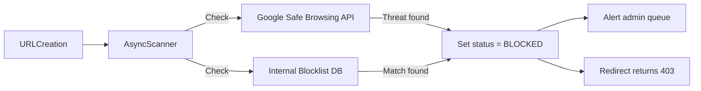

# 08 — Security Design: URL Shortener

---

## Objective

Define the security architecture for the URL shortener — covering authentication, authorization, input validation, abuse prevention, data protection, and compliance considerations.

---

## Security Threat Model

| Threat | Impact | Mitigation |
|---|---|---|
| Phishing via short URLs | High — users trust short links | Malware/phishing scan, blocklist |
| Enumeration of short codes | Medium — privacy exposure | Random code generation, large key space |
| URL creation abuse (spam) | High — reputation damage | Rate limiting, CAPTCHA (anonymous), account tier limits |
| API key theft | High — account takeover | Hashed storage, key rotation, IP allowlisting |
| SQL injection | Critical | Parameterized queries, ORM |
| XSS in analytics dashboard | Medium | CSP headers, output encoding |
| SSRF via long URL target | High — internal network access | URL validation, SSRF protection |
| DDoS on redirect endpoint | High — service unavailability | CDN rate limiting, WAF |
| Data exfiltration (click data with IPs) | Medium — GDPR violation | IP anonymization, data minimization |
| Redirect loop / open redirect exploit | Medium | Validate long URL scheme |

---

## Authentication

### JWT Authentication (User-facing API)

```
Flow:
1. POST /auth/login { email, password }
2. Server validates credentials, issues JWT
3. JWT contains: { sub: userId, tier: FREE, exp: 1h, iat: now }
4. Client includes: Authorization: Bearer <jwt>
5. Server validates signature using HS256 with rotating secret
```

**JWT Configuration:**
- Access token TTL: 1 hour
- Refresh token TTL: 30 days (stored in HttpOnly cookie, not localStorage)
- Algorithm: HS256 for internal; RS256 if tokens need to be validated by external services
- Signing key rotation: quarterly (old keys kept for TTL duration to avoid invalidating in-flight tokens)

**Refresh token rotation**: Each use of refresh token issues new refresh token + invalidates old one. Stored in DB to support revocation.

---

### API Key Authentication (Programmatic Access)

```
Flow:
1. User creates API key: POST /api/v1/users/me/api-keys
2. Server generates: key = "sl_" + base64(random 32 bytes)
3. Stores: key_prefix = key[0:8], key_hash = SHA256(key)
4. Returns: full key to user (shown ONCE only)
5. Client includes: X-API-Key: sl_xxxxx...
6. Server: computes SHA256(incoming key), looks up key_hash in DB
```

**Why hash API keys?** A database breach doesn't expose usable keys. Same principle as password hashing.

**API key features:**
- Key name (user-defined, for tracking)
- Expiry date (optional)
- IP allowlist (optional, enterprise tier)
- Per-key rate limits
- Last-used timestamp tracking

---

### Anonymous Access

- Anonymous users can create short URLs (with stricter rate limits)
- Anonymous URLs are not owned (no deletion, no analytics)
- CAPTCHA enforcement after 3 anonymous creations per IP per hour
- Temporary rate limit state stored in Redis per IP

---

## Authorization (RBAC)

| Role | Permissions |
|---|---|
| `ANONYMOUS` | Create URL (rate-limited), use redirect |
| `USER_FREE` | Create/delete own URLs, basic analytics, list own URLs |
| `USER_PRO` | + Custom alias, geo routing, bulk creation, detailed analytics |
| `USER_ENTERPRISE` | + White-label domains, team management, audit logs |
| `ADMIN` | All user permissions + URL moderation, user management, blocklist management |

**Spring Security implementation:**
- Method-level security with `@PreAuthorize`
- Resource ownership check: `shortUrl.ownerId == authenticatedUser.id || hasRole('ADMIN')`
- API tier enforcement via `UserTierInterceptor` before route handler

---

## Input Validation

### Long URL Validation

```
Rules:
1. Must have scheme: http:// or https:// only
   - Reject: ftp://, javascript:, data:, file://, vbscript:
2. Must be parseable as RFC 3986 URI
3. Max length: 2048 characters
4. Must not be a localhost or private IP range (SSRF protection):
   - Block: 127.0.0.1, 192.168.x.x, 10.x.x.x, 172.16-31.x.x, ::1
5. Must not be a short.ly URL (redirect loop prevention)
6. Optionally: resolve DNS and check if domain exists (async, V2)
```

**SSRF Protection**: Most critical — without it, attackers can create short URLs pointing to internal services (`http://169.254.169.254/` AWS metadata endpoint, internal databases, monitoring endpoints).

```
Implementation:
- Parse URL → extract host
- DNS resolve host → get IPs
- Check IPs against private/loopback ranges
- Reject if any IP is private
Note: DNS rebinding attack — resolve at validation AND at redirect time
```

---

### Short Code / Alias Validation

```
Rules:
1. Only [a-zA-Z0-9] and hyphens allowed
2. Length: 3-50 characters
3. No leading/trailing hyphens
4. Not a reserved path: [api, auth, admin, health, metrics, docs, v1, v2]
5. Not a reserved word list: [porn, hate, etc.] — brand safety
```

---

## Phishing / Malware Prevention

### At URL Creation Time (Async Scan)



**Google Safe Browsing API**: Free tier covers most use cases. Returns threat types: MALWARE, SOCIAL_ENGINEERING (phishing), UNWANTED_SOFTWARE.

**Internal blocklist**: Updated via:
- Admin UI (manual addition)
- Abuse report from users
- Automated threat intelligence feed imports

---

### At Redirect Time (Fast Path)

- Check URL status in Redis (BLOCKED flag included in cached entry)
- If blocked: return 403 with "URL has been blocked for safety reasons" message
- No additional API calls on redirect path — must be zero-latency

---

## Transport Security

| Layer | Control |
|---|---|
| HTTPS enforcement | HSTS header: `Strict-Transport-Security: max-age=31536000; includeSubDomains; preload` |
| TLS version | TLS 1.2 minimum; TLS 1.3 preferred |
| Certificate | ACM (AWS) — auto-renewed, no manual management |
| CDN | CloudFront enforces HTTPS; terminates TLS at edge |
| Internal service | mTLS between services (via Istio service mesh at V2) |

---

## Response Security Headers

```http
Strict-Transport-Security: max-age=31536000; includeSubDomains; preload
Content-Security-Policy: default-src 'self'; script-src 'self' 'nonce-{random}'; object-src 'none'
X-Content-Type-Options: nosniff
X-Frame-Options: DENY
Referrer-Policy: strict-origin-when-cross-origin
Permissions-Policy: geolocation=(), microphone=(), camera=()
Cache-Control: no-store, no-cache              (API responses)
```

**Why CSP?** Prevents XSS attacks on the analytics dashboard. Even if an attacker injects a script via a URL tag/label, CSP blocks its execution.

---

## Data Protection

### IP Address Anonymization (GDPR Compliance)

```
On click event creation:
1. Store full IP immediately (for abuse detection, fraud)
2. After 24 hours: anonymize via scheduled job
   - IPv4: zero last octet: 192.168.1.100 → 192.168.1.0
   - IPv6: zero last 80 bits
3. After 90 days: raw click events purged (ClickHouse TTL)
4. Aggregated counts retained indefinitely (no personal data)
```

**GDPR "Right to Erasure"**: User account deletion → all associated short URLs soft-deleted, click data anonymized immediately (not waiting for schedule), email purged.

---

### Secrets Management

| Secret | Storage | Rotation |
|---|---|---|
| DB credentials | AWS Secrets Manager | 90 days automated |
| JWT signing key | AWS Secrets Manager | Quarterly |
| API key salts | AWS Secrets Manager | Yearly |
| Kafka credentials | Kubernetes secrets (encrypted at rest) | 90 days |
| External API keys (Safe Browsing) | AWS Secrets Manager | On rotation/compromise |

**Spring Boot integration**: `spring-cloud-aws-secrets-manager` — injects secrets at startup, supports dynamic refresh.

---

## Audit Logging

All security-relevant actions produce structured audit log entries:

```json
{
  "timestamp": "2024-01-15T10:30:00Z",
  "actor": { "userId": "usr_abc", "ip": "1.2.3.4", "userAgent": "..." },
  "action": "URL_DELETED",
  "resource": { "type": "SHORT_URL", "id": "aB3xYz" },
  "result": "SUCCESS",
  "traceId": "abc-123"
}
```

Audit events published to:
1. Immutable log store (S3 with object lock — cannot be deleted)
2. SIEM (Splunk/Datadog) for real-time alerting

---

## Rate Limiting (Security Perspective)

| Attack Vector | Mitigation |
|---|---|
| Brute force login | Account lockout after 5 failures; exponential backoff |
| Credential stuffing | CAPTCHA on login after 3 failures from same IP |
| Redirect enumeration | 100 req/min/IP on redirect; 429 after exceeded |
| Bulk URL creation abuse | Tier-based limits; CAPTCHA for anonymous > 5/hour |
| DDoS | WAF (AWS WAF) + CloudFront rate limiting + Shield Standard |

---

## SQL Injection Prevention

- All DB access via JPA/Hibernate with named parameters — no string concatenation in queries
- JPQL used for simple queries; `@Query` with `:paramName` for complex ones
- Never pass user input into raw SQL fragments
- DB user has minimal privileges: `SELECT, INSERT, UPDATE` on specific tables; no `DROP`, `TRUNCATE`, `CREATE`

---

## Interview Discussion Points

- **How do you prevent short URLs being used for phishing?** Async malware scan at creation + blocklist check at redirect + allow user abuse reporting + integrate Safe Browsing API
- **What's the SSRF risk and how do you mitigate it?** An attacker could point a short URL to `http://169.254.169.254/latest/meta-data/` (AWS metadata). Mitigate by validating and DNS-resolving the target URL, blocking private IP ranges both at validation and redirect time
- **How do you handle a compromised API key?** User can revoke via API; server marks key inactive in DB; Redis rate limit tokens for that key invalidated; audit log captures all actions taken with that key for investigation
- **Why not use OAuth2 for user API access?** OAuth2 is appropriate when third-party apps need access on behalf of users. For our own API clients, API keys + JWT is simpler and sufficient. OAuth2 is a V2 consideration for third-party integrations
- **How do you prevent URL enumeration?** Random 6-char Base62 codes — key space is 56 billion. To enumerate all URLs, an attacker would need ~56 billion requests × CDN/rate-limit blocking. Practically infeasible
