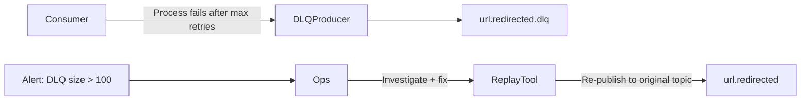

# 10 — Message Queue Design: URL Shortener

---

## Objective

Define the Kafka-based messaging architecture — topic design, producer and consumer configuration, retry/DLQ strategy, exactly-once guarantees, and operational considerations.

---

## Why Kafka (Not RabbitMQ / SQS)?

| Criteria | Kafka | RabbitMQ | AWS SQS |
|---|---|---|---|
| Throughput | 10M+ msg/sec | 100K msg/sec | 300 msg/sec (standard) |
| Message replay | Yes (log-based) | No (queue-based) | No |
| Consumer groups | Native | Plugins | No |
| Ordering | Per-partition | Per-queue | FIFO queues only |
| Retention | Days/weeks | Until consumed | 14 days max |
| Use case | Event streaming, analytics pipelines | Task queues, RPC | Simple task queues |

**Decision**: Kafka because:
1. 10K redirect RPS → 10K click events/sec — needs high throughput
2. Analytics consumer might need to replay events (ClickHouse failure recovery)
3. Multiple independent consumers (analytics, cache warmer, notifications)
4. Log retention for audit trail

**When RabbitMQ would be better**: If the system only needed task queues (send email, process bulk upload) — RabbitMQ's routing features and simpler ops would win.

---

## Kafka Cluster Configuration

```
Brokers:          3 (minimum for HA; 5 for production at scale)
Replication:      RF=3 (all topics)
Min ISR:          2 (message not accepted unless 2 replicas confirmed)
ZooKeeper/KRaft:  KRaft mode (Kafka 3.3+ — removes ZooKeeper dependency)
Storage:          NVMe SSDs, 10TB per broker
Retention:        24h for click events, 7d for lifecycle events
```

---

## Topic Design

### `url.redirected`

```yaml
Topic:            url.redirected
Partitions:       32
Replication:      3
Retention:        24 hours
Cleanup Policy:   delete
Compression:      lz4
Message Key:      shortCode
Message Value:    UrlRedirectedEvent (Avro)
```

**Partition count rationale**:
- Peak: 10,000 events/sec
- Each partition handles ~500 events/sec (conservative)
- Consumer max parallelism = partition count = 32
- 32 partitions × 500 events/sec = 16,000 events/sec capacity

**Partition key = shortCode**:
- All events for the same URL land on same partition
- Consumer processes events for same URL in order
- Critical for click-limit expiration (order matters)
- Risk: Hot partition if one URL gets extreme traffic → mitigated by separate high-volume URL queue

---

### `url.created`

```yaml
Topic:            url.created
Partitions:       8
Replication:      3
Retention:        7 days
Message Key:      ownerId
Message Value:    UrlCreatedEvent (Avro)
```

7-day retention: cache warmers and analytics initializers may lag behind and need to re-process.

---

### `url.lifecycle`

```yaml
Topic:            url.lifecycle
Partitions:       8
Replication:      3
Retention:        7 days
Message Key:      shortCode
Message Value:    UrlLifecycleEvent (Avro, union of UrlDeleted + UrlExpired + UrlBlocked)
```

Low-volume topic (creation/deletion/expiry events). Combined topic reduces operational complexity.

---

### Dead Letter Queue Topics

```yaml
url.redirected.dlq:
  Partitions:   8
  Retention:    30 days         ← Long retention for investigation
  Consumers:    Manual replay tool + alert trigger

url.lifecycle.dlq:
  Partitions:   4
  Retention:    30 days
```

---

## Producer Configuration (Redirect Service)

For click events — optimize for throughput, tolerate minor data loss:

```
bootstrap.servers:         kafka1:9092,kafka2:9092,kafka3:9092
acks:                      1              ← leader ack only; not all replicas
retries:                   3
retry.backoff.ms:          100
batch.size:                65536          ← 64KB batch accumulation
linger.ms:                 5              ← wait 5ms to fill batch
compression.type:          lz4            ← 3-5x compression
buffer.memory:             33554432       ← 32MB producer buffer
max.block.ms:              500            ← don't block redirect thread > 500ms
delivery.timeout.ms:       5000           ← total retry budget
enable.idempotence:        false          ← not needed for analytics events
```

**Why `acks=1` for click events?** Full `acks=all` adds ~2-5ms latency (waiting for all replicas). For analytics, losing a few click events during broker failure is acceptable. For URL lifecycle events (creation/deletion), use `acks=all`.

---

## Producer Configuration (URL Management Service)

For URL lifecycle events — optimize for durability:

```
acks:                      all
enable.idempotence:        true           ← exactly-once producer-side
max.in.flight.requests:    5              ← must be ≤ 5 with idempotence
retries:                   Integer.MAX_VALUE
transactional.id:          url-service-{instanceId}  ← for transactional producers
```

**Transactional producer** for URL creation (with outbox pattern):
```
Producer transaction wraps:
1. Kafka producer.beginTransaction()
2. Kafka producer.send(urlCreated event)
3. DB commit (outbox record marked published)
4. Kafka producer.commitTransaction()

On failure: Kafka transaction rolls back; outbox record remains unpublished → retry
```

---

## Consumer Groups and Configuration

### Analytics Click Ingester

```
Group ID:                  analytics-click-ingester
Auto offset reset:         earliest            ← process from beginning on new group
Enable auto commit:        false               ← manual offset commit after successful insert
Max poll records:          500                 ← batch size for ClickHouse bulk insert
Max poll interval:         300000ms            ← 5 min (ClickHouse inserts can be slow)
Session timeout:           30000ms
Heartbeat interval:        10000ms
Fetch max bytes:           52428800            ← 50MB max per fetch
```

**Processing loop**:
```
1. Poll 500 records from Kafka
2. Filter bots (UserAgent analysis)
3. Enrich with GeoIP (in-process lookup)
4. Accumulate in batch list
5. INSERT batch into ClickHouse (1 INSERT for 500 rows)
6. INCR Redis click counters (pipelined)
7. Commit Kafka offsets
```

**Why manual offset commit?** If ClickHouse insert fails, don't commit offset → Kafka re-delivers the batch → retry. Auto-commit would lose the events on failure.

---

### Cache Eviction Handler

```
Group ID:             cache-eviction-handler
Topics:               url.lifecycle
Processing:           On UrlDeleted/UrlExpired → Redis DEL url:{shortCode}
                      On UrlBlocked → Redis SET url:{shortCode}.status = BLOCKED
Concurrency:          1 consumer per partition (8 total)
```

**Why 1 consumer per partition?** Cache eviction must be ordered per shortCode (don't delete after a re-creation). Kafka guarantees order within a partition.

---

### Cache Warmer

```
Group ID:             cache-warmer
Topics:               url.created
Processing:           On UrlCreated → Redis SETEX url:{shortCode} 86400 {urlData}
Concurrency:          4 consumers
```

---

## Retry and Error Handling

### Retry Strategy Per Consumer

| Error Type | Retry Behavior | DLQ? |
|---|---|---|
| Transient (ClickHouse timeout) | Retry 3x with exponential backoff (1s, 2s, 4s) | After 3 failures |
| Redis unavailable | Retry 5x with 500ms backoff | After 5 failures |
| Deserialization error (bad schema) | No retry — log + DLQ immediately | Yes |
| GeoIP lookup failure | Skip enrichment, continue with null country | No DLQ |
| ClickHouse schema mismatch | Alert ops, pause consumer | Operator intervention |

### DLQ Processing



**DLQ envelope**:
```json
{
  "originalTopic": "url.redirected",
  "originalPartition": 5,
  "originalOffset": 12345678,
  "originalTimestamp": "2024-01-15T10:30:00Z",
  "failureReason": "ClickHouseConnectionException: Connection refused",
  "failureCount": 3,
  "failedAt": "2024-01-15T10:30:05Z",
  "payload": { ...original UrlRedirectedEvent... }
}
```

---

## Consumer Lag Monitoring

**Consumer lag** = latest offset in partition − consumer's committed offset. Measures how far behind the consumer is.

| Metric | Warning | Critical | Action |
|---|---|---|---|
| `analytics-click-ingester` lag | > 100K | > 1M | Scale up consumer pods |
| `cache-eviction-handler` lag | > 1K | > 10K | PagerDuty — deletes not applied |
| `cache-warmer` lag | > 10K | > 100K | Cache warmup delayed; no user impact |

**Alert on cache eviction lag**: If cache eviction handler is lagging, deleted URLs may continue redirecting. This is a correctness issue — alert immediately.

---

## Schema Registry and Evolution

**Technology**: Confluent Schema Registry (or AWS Glue Schema Registry)

**Schema evolution rules** (backward + forward compatibility):

| Change Type | Allowed? | Notes |
|---|---|---|
| Add optional field | Yes | Consumers that don't know the field ignore it |
| Add required field | No | Old producers can't set it |
| Remove field | No (backward compat) | Old consumers expect it |
| Change field type | No | Breaking change |
| Rename field | No | Breaking change — add new field + deprecate old |

**Versioning**:
- Schema v1 → v2: add `sessionId` as optional field
- Consumers of v1 can still read v2 messages (optional field ignored)
- Producers upgraded to write v2 after all consumers deployed
- Schema Registry enforces compatibility on each new schema registration

---

## Kafka Operational Considerations

| Concern | Mitigation |
|---|---|
| Broker failure | RF=3, min.insync.replicas=2 — survive 1 broker loss |
| Partition leader election | Automatic; ~10-30s downtime during election |
| Disk full | Alert at 70% capacity; auto-expand EBS volumes |
| Consumer group rebalance | Incremental cooperative rebalancing (Kafka 2.4+) — avoid full stop-the-world rebalance |
| Message ordering | Guaranteed within partition; not across partitions |
| Message deduplication | Producer idempotence for lifecycle events; consumer-side idempotence for analytics |

---

## Tradeoffs

| Decision | Tradeoff |
|---|---|
| `acks=1` for click events | Risk losing last ~1s of events on broker crash — acceptable for analytics |
| Manual offset commit | Complexity; but ensures no event lost between processing and commit |
| 32 partitions | Overkill for startup; right-size at > 1M events/day; can't reduce partitions without recreation |
| 24h retention on click events | Low storage cost; consumers must process within 24h or replay is impossible |
| Kafka over SQS | Operational complexity; but enables replay, consumer groups, high throughput |

---

## Interview Discussion Points

- **What happens if the analytics consumer is down for 12 hours?** Kafka retains messages for 24h. Consumer restarts, processes backlog. ClickHouse gets a spike of delayed inserts — monitor for lag. If down > 24h, messages lost — extend retention for this consumer or use S3 sink as backup
- **How do you handle schema migration in production?** Deploy new schema version to Schema Registry with compatibility check. Deploy consumer code first (handles both old + new schema). Then deploy producer code. Rollback: producer stays on old schema; consumer handles both
- **Why partition key = shortCode and not random?** Ordering guarantee per URL is essential for click-limit expiration logic. Random partitioning → events for same URL on different partitions → consumer can't safely check click limit without cross-partition coordination
- **How would you implement exactly-once analytics?** Kafka transactions + ClickHouse idempotent writes. Kafka transactional API: producer commits event + consumer commits offset atomically. ClickHouse: ReplacingMergeTree deduplicates by eventId. Together: exactly-once semantics end-to-end
