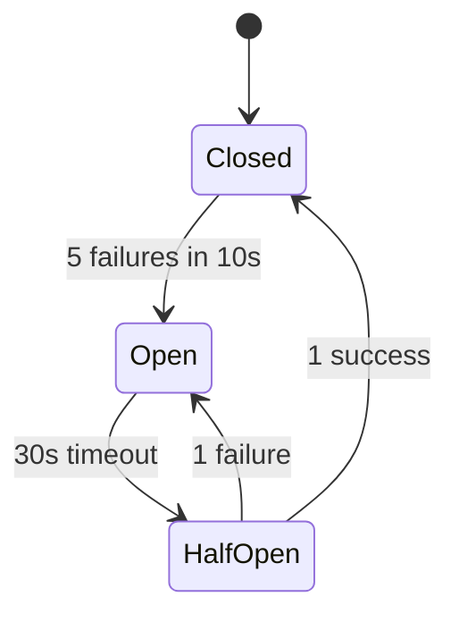

# 11 — Failure Scenarios & Reliability Design: URL Shortener

---

## Objective

Analyze the failure modes of every critical component, define recovery strategies, and establish the reliability patterns that ensure the system meets its 99.99% availability SLA for the redirect path.

---

## Reliability Targets by Component

| Component | Availability Target | Max Downtime/Year | Strategy |
|---|---|---|---|
| Redirect path | 99.99% | 52 min | Multi-region, CDN serving during outage |
| URL creation | 99.9% | 8.7 hours | Multi-AZ, graceful degradation |
| Analytics pipeline | 99.5% | 43 hours | Eventual processing, Kafka buffering |
| Admin / management UI | 99% | 87 hours | Best-effort |

---

## Component Failure Analysis

### 1. Redis Cache Failure

**Scenario**: Redis cluster node fails or Redis becomes unreachable.

**Impact without mitigation**: All redirects fail (cache miss → DB hit → if DB also overloaded, cascade failure).

**Mitigation**:
```
1. Redis Cluster mode: 6 nodes (3 primary + 3 replica)
   - Survives loss of 1 primary (failover in < 30s)
2. Circuit breaker around Redis client:
   - After 5 consecutive timeouts → open circuit
   - Fall through to PostgreSQL read replica
   - Close circuit after 30s probe success
3. Local Caffeine cache (60s TTL):
   - Continues serving hot URLs for 60s without Redis
4. Application fallback:
   - Redis down → directly query Postgres read replica
   - Log "cache_unavailable" metric → alert
```

**Recovery**: Redis failover is automatic (Redis Cluster handles replica promotion). Application reconnects automatically via retry.

---

### 2. PostgreSQL Primary Failure

**Scenario**: DB primary goes down (hardware failure, OOM, corruption).

**Impact without mitigation**: URL creation fails; analytics flush fails; redirects continue from cache.

**Mitigation**:
```
1. Multi-AZ PostgreSQL (AWS RDS Multi-AZ):
   - Standby replica in different AZ
   - Automatic failover in 60-120 seconds
   - Application reconnects via same endpoint (CNAME switches)
2. Read replicas still available during primary failover:
   - Redirects continue serving from cache + read replica
   - URL creation queued or returns 503 (acceptable short outage)
3. PgBouncer:
   - Connection pool absorbs reconnection surge
   - Prevents thundering herd of app reconnections
```

**SLA impact**: Primary failover = 1-2 minutes where URL creation fails. Redirects unaffected (cache + read replica). This is acceptable for 99.9% creation SLA.

---

### 3. Kafka Cluster Failure

**Scenario**: Kafka brokers down; unable to publish click events.

**Impact without mitigation**: Redirects block waiting for Kafka publish (if synchronous); analytics events lost.

**Mitigation**:
```
1. Fire-and-forget publish (non-blocking):
   - Redirect does NOT wait for Kafka acknowledgment
   - Click event publish is async, on separate thread
   - Redirect latency unaffected
2. In-memory buffer (producer buffer.memory = 32MB):
   - Kafka producer buffers events when broker unreachable
   - Events published when Kafka recovers (within seconds)
3. Local fallback log (V2):
   - If Kafka is down > 5min, write click events to local disk log
   - Background job replays from disk log when Kafka recovers
4. Kafka cluster HA:
   - 3 brokers, RF=3, min.insync.replicas=2
   - Survives 1 broker loss with < 30s leader election downtime
```

**SLA impact**: Kafka outage = click events buffered in memory (< 32MB) or lost if outage > buffer fill time. Redirects unaffected. Analytics has a gap.

---

### 4. Application Pod Crash (OOM / JVM Crash)

**Scenario**: One or more application pods crash due to OOM or unhandled exception.

**Impact without mitigation**: Requests in-flight to crashed pod fail.

**Mitigation**:
```
1. Kubernetes Pod restart policy: Always
   - Pod restarts within 5-10 seconds
   - Failed requests retried by load balancer (ALB retry policy)
2. Kubernetes rolling deployment:
   - New version deployed incrementally (1 pod at a time)
   - `maxUnavailable: 25%` — 75% of pods always healthy
3. Liveness + Readiness probes:
   - Liveness: `/health/live` — crash loop detection → restart
   - Readiness: `/health/ready` — traffic only routed to ready pods
4. Pod anti-affinity:
   - Pods spread across AZs — no single AZ loses all pods
5. Minimum 3 pods at all times:
   - HPA min replicas = 3
```

**SLA impact**: Single pod crash = brief latency increase, no user-visible errors (ALB routes to healthy pods within seconds).

---

### 5. Short Code Collision

**Scenario**: Two concurrent requests generate the same random short code.

**Impact without mitigation**: Second request fails with DB unique constraint violation.

**Mitigation**:
```
Collision resolution strategy:
1. Generate random 6-char Base62 code
2. Attempt INSERT with ON CONFLICT DO NOTHING
3. If 0 rows inserted (conflict) → retry with new random code
4. Max retries: 5 (collision at 5M codes / 56B key space is negligible)
5. If still failing after 5 retries → alert (indicates key exhaustion approaching)

Collision probability:
- At 5M URLs/day, P(collision) per attempt ≈ 5M / 56B ≈ 0.009%
- Expected retries per creation ≈ 0.009% → statistically zero at current scale
```

**Pre-generated key pool (KGS) — V2 alternative**:
- Background job pre-generates 1M unused keys, stores in `key_pool` table
- Creation service picks a key atomically: `SELECT short_code FROM key_pool WHERE used = FALSE LIMIT 1 FOR UPDATE SKIP LOCKED`
- No collision possible; no retry needed
- Cost: operational complexity of key generation service

---

### 6. Expiration Race Condition

**Scenario**: URL expires exactly as a redirect request arrives.

**State**: Redis TTL fires, Redis key deleted. Simultaneously, redirect service fetches from Postgres and sees `status = ACTIVE` (DB not yet updated by expiration job).

**Mitigation**:
```
1. Redis TTL is the authoritative expiration for the redirect path:
   - Redis key deleted on expiry → cache miss → fall to DB
   - DB lookup: check expiresAt < NOW() → return 410 Gone even if status not yet updated
2. Expiration check in application:
   - Always check: if (url.expiresAt != null && url.expiresAt.isBefore(now)) → expired
   - This check happens even when reading from cache (include expiresAt in cached value)
3. Background expiration job:
   - Runs every minute, updates status = EXPIRED in DB for overdue URLs
   - Redis TTL handles the real-time expiry; DB update is eventual
```

**SLA impact**: At worst, an expired URL may redirect for < 60 seconds after expiry (if expiresAt check is missed and background job hasn't run). Acceptable behavior.

---

### 7. Analytics Consumer Lag Spike

**Scenario**: ClickHouse cluster slow → analytics consumer falls behind → Kafka lag grows.

**Impact**: Analytics dashboard shows stale data; if lag exceeds Kafka retention (24h), events are lost.

**Mitigation**:
```
1. Kafka consumer lag monitoring:
   - Alert: lag > 100K messages → scale consumer pods
   - Critical: lag > 1M → PagerDuty
2. KEDA (Kubernetes Event-Driven Autoscaling):
   - Scale consumer pods automatically based on Kafka lag metric
   - Min: 2 pods, Max: 32 pods (= partition count)
3. ClickHouse batch size tuning:
   - Larger batches = more efficient ClickHouse inserts
   - Trade-off: larger batches = more data loss if consumer crashes mid-batch
   - Use batch_size=10,000 with 5-second timeout
4. Extend retention to 7 days if analytics SLA is strict:
   - Cost: 7x Kafka storage; operational impact: more disk per broker
```

---

### 8. Cache Stampede (Thundering Herd)

**Scenario**: Popular URL's cache entry expires. 10,000 simultaneous requests all miss cache and query DB.

**Impact**: DB overwhelmed by 10,000 concurrent reads for one URL → query latency spike → cascading failure.

**Mitigation**:
```
1. Probabilistic early expiration (XFetch):
   - Randomly expire cache early (probability increases as TTL approaches 0)
   - Background thread refreshes cache before simultaneous expiry
2. Request coalescing (mutex/lock):
   - First thread to miss cache acquires lock
   - Others wait for lock and read the result set by first thread
   - Implemented via Redis SETNX (set if not exists) as distributed lock
3. Stale-while-revalidate:
   - Serve stale cached value while asynchronously refreshing
   - No thundering herd; users get (briefly) stale data
4. Caffeine refreshAfterWrite:
   - Local cache in each pod refreshes in background after write time
   - Most effective for very hot URLs
```

---

### 9. SSRF via Malicious Long URL

**Scenario**: Attacker creates short URL pointing to internal service (`http://10.0.0.1:8080/admin`).

**Impact**: Attacker uses short URL redirect to probe internal network.

**Mitigation**:
```
1. URL validation at creation:
   - Resolve DNS of target domain
   - Check resolved IPs against private ranges
   - Block: 10.x.x.x, 192.168.x.x, 172.16-31.x.x, 127.x.x.x, ::1
2. DNS rebinding protection:
   - Re-validate at redirect time (DNS may have changed since creation)
3. Firewall rule:
   - Application pods have no route to internal management interfaces
   - Network policy: redirect service pods cannot reach non-public IPs
```

---

### 10. Distributed Transaction: Create URL + Cache + Outbox

**Scenario**: URL written to Postgres, then application crashes before publishing Kafka event.

**Impact**: Cache warmer never fires; analytics never initialized; URL exists but no downstream events.

**Mitigation**: Outbox pattern
```
Transaction:
  BEGIN
    INSERT INTO short_urls (...)
    INSERT INTO outbox_events (..., published=false)
  COMMIT

Outbox publisher (separate thread):
  SELECT * FROM outbox_events WHERE published = false
  → Publish to Kafka
  → UPDATE outbox_events SET published = true

If app crashes between DB commit and Kafka publish:
  → Outbox record remains published=false
  → On restart, outbox publisher picks it up and publishes
  → Exactly-once publishing guaranteed via Kafka idempotent producer
```

---

## CAP Theorem Position

**For the redirect path**: System chooses **Availability + Partition Tolerance** (AP):
- During network partition between regions, each region serves redirects from its local cache + read replica
- Stale reads are acceptable (eventual consistency)
- URL creation writes may fail during partition — acceptable (creation is not life-critical)

**For URL creation uniqueness**: System chooses **Consistency + Partition Tolerance** (CP):
- URL alias uniqueness is enforced by PostgreSQL primary (single writer)
- During primary failure, creation fails (returns 503) — data consistency over availability

---

## Circuit Breaker Design



**Implemented for**:
- Redis client → falls back to DB on open
- PostgreSQL read replica → falls back to primary on open
- Safe Browsing API → allow URL creation without scan on open (log + alert)
- ClickHouse writer → buffer to disk on open

**Library**: Resilience4j (Spring Boot compatible, lightweight, annotation-driven)

---

## Disaster Recovery

| Scenario | RTO | RPO | Strategy |
|---|---|---|---|
| Single AZ failure | < 1 min | 0 | Multi-AZ deployment; automatic |
| Region failure | < 15 min | < 5 min | Manual DNS failover to secondary region |
| DB corruption | < 4 hours | < 1 hour | Restore from hourly snapshot; WAL replay |
| Mass delete (accidental) | < 30 min | 0 (soft delete) | Restore status in DB; soft deletes are recoverable |
| Kafka data loss | < 2 hours | < 24 hours | Replay from S3 backup sink (MSK → S3 connector) |

---

## Interview Discussion Points

- **What breaks first at 10x traffic?** Redis becomes the bottleneck — CPU saturation on Redis nodes as they handle millions of GET/INCR operations. Solution: Redis read replicas + local Caffeine cache to absorb reads
- **How do you test failure scenarios?** Chaos Engineering with AWS Fault Injection Simulator or Gremlin: terminate Redis nodes, introduce DB latency, kill Kafka brokers — verify system degrades gracefully with correct fallbacks
- **What's your recovery plan for a Kafka topic corruption?** Kafka topic corruption is extremely rare (physical disk failure). Recovery: restore from S3 Kafka backup sink (MSK Connector), replay events from backup. Accept analytics gap for the backup lag period
- **How do you prevent a cascading failure?** Rate limiting + circuit breakers + bulkhead pattern: isolate redirect service from analytics consumer — if ClickHouse is down, it doesn't affect redirects at all (async, separate pod)
- **Why is Multi-AZ not enough, and when do you add multi-region?** Multi-AZ protects against single datacenter failure (AWS AZ). Multi-region is needed for: regional AWS outage (rare but happens), compliance (EU data sovereignty), latency reduction for global users
