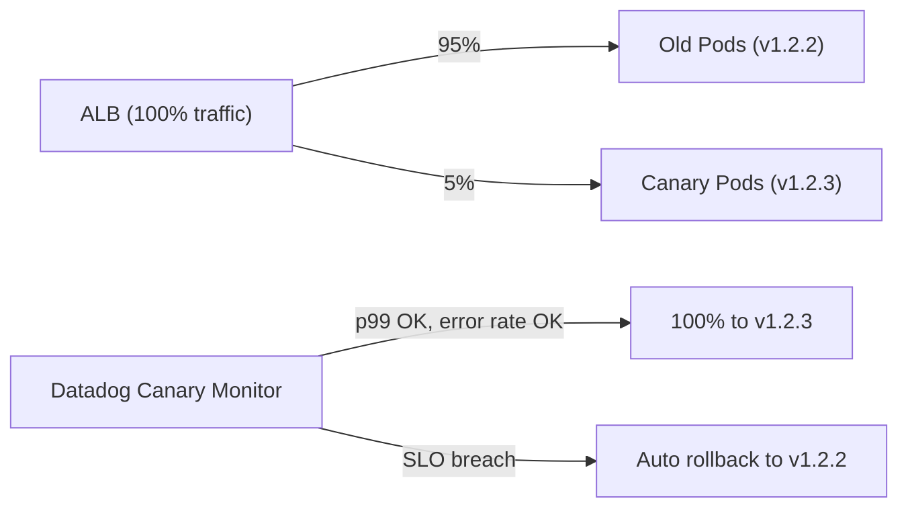

# 13 — Deployment Architecture: URL Shortener

---

## Objective

Define the Dockerization, Kubernetes deployment topology, CI/CD pipeline, environment strategy, and production deployment flow for the URL shortener service.

---

## Environment Strategy

| Environment | Purpose | Infrastructure | Data |
|---|---|---|---|
| `local` | Developer iteration | Docker Compose | Seeded fake data |
| `dev` | Integration testing | EKS (shared, small) | Anonymized prod subset |
| `staging` | Pre-production validation | EKS (mirrors prod) | Anonymized prod data |
| `prod` | Live traffic | EKS (multi-AZ) | Real data |

**Environment isolation**:
- Separate AWS accounts per environment (dev, staging, prod) via AWS Organizations
- Separate Kubernetes namespaces within dev environment for team branches
- Infrastructure as Code (Terraform) — all environments defined identically, parameterized by env vars

---

## Docker Configuration

### Multi-Stage Dockerfile

```dockerfile
# Stage 1: Build
FROM eclipse-temurin:21-jdk-alpine AS builder
WORKDIR /app
COPY pom.xml .
COPY src ./src
RUN mvn -q -DskipTests clean package

# Stage 2: Runtime (minimal image)
FROM eclipse-temurin:21-jre-alpine AS runtime
WORKDIR /app

# Non-root user (security)
RUN addgroup -S appgroup && adduser -S appuser -G appgroup
USER appuser

# Copy only the JAR (not build tools)
COPY --from=builder /app/target/url-shortener.jar ./app.jar

# JVM tuning for container-aware memory
ENV JAVA_OPTS="-XX:MaxRAMPercentage=75.0 \
               -XX:+UseG1GC \
               -XX:+UseContainerSupport \
               -XX:+ExitOnOutOfMemoryError \
               -Djava.security.egd=file:/dev/./urandom"

EXPOSE 8080
HEALTHCHECK --interval=30s --timeout=5s CMD wget -qO- http://localhost:8080/health/live || exit 1

ENTRYPOINT ["sh", "-c", "java $JAVA_OPTS -jar app.jar"]
```

**Key decisions**:
- `eclipse-temurin:21-jre-alpine` — smallest JRE image (~80MB vs ~500MB for full JDK)
- `XX:UseContainerSupport` — JVM respects container memory limits (not host memory)
- `XX:ExitOnOutOfMemoryError` — let Kubernetes restart on OOM rather than limping along
- Non-root user — security best practice (container breakout mitigation)

---

## Local Development (Docker Compose)

```yaml
version: "3.9"
services:
  app:
    build: .
    ports: ["8080:8080"]
    environment:
      SPRING_DATASOURCE_URL: jdbc:postgresql://postgres:5432/urlshortener
      SPRING_REDIS_HOST: redis
      SPRING_KAFKA_BOOTSTRAP_SERVERS: kafka:9092
    depends_on: [postgres, redis, kafka]

  postgres:
    image: postgres:15-alpine
    environment:
      POSTGRES_DB: urlshortener
      POSTGRES_PASSWORD: localpassword
    volumes:
      - postgres_data:/var/lib/postgresql/data
    ports: ["5432:5432"]

  redis:
    image: redis:7-alpine
    ports: ["6379:6379"]

  kafka:
    image: confluentinc/cp-kafka:7.5.0
    environment:
      KAFKA_PROCESS_ROLES: broker,controller
      KAFKA_LISTENERS: PLAINTEXT://:9092,CONTROLLER://:9093
      KAFKA_CONTROLLER_QUORUM_VOTERS: 1@kafka:9093
    ports: ["9092:9092"]

  clickhouse:
    image: clickhouse/clickhouse-server:23.8
    ports: ["8123:8123"]

volumes:
  postgres_data:
```

---

## Kubernetes Deployment

### Namespace Structure

```
k8s namespaces:
├── url-shortener-prod
│   ├── redirect-service (Deployment)
│   ├── api-service (Deployment)
│   ├── analytics-consumer (Deployment)
│   └── expiration-job (CronJob)
├── url-shortener-staging
└── monitoring
    ├── prometheus
    ├── grafana
    └── jaeger
```

---

### Redirect Service Deployment

```yaml
apiVersion: apps/v1
kind: Deployment
metadata:
  name: redirect-service
  namespace: url-shortener-prod
spec:
  replicas: 5
  strategy:
    type: RollingUpdate
    rollingUpdate:
      maxUnavailable: 1       # At most 1 pod down at a time
      maxSurge: 2             # Can spin up 2 extra pods during update
  selector:
    matchLabels:
      app: redirect-service
  template:
    metadata:
      labels:
        app: redirect-service
    spec:
      affinity:
        podAntiAffinity:
          requiredDuringSchedulingIgnoredDuringExecution:
          - labelSelector:
              matchLabels:
                app: redirect-service
            topologyKey: topology.kubernetes.io/zone    # Spread across AZs
      containers:
      - name: redirect-service
        image: 123456789.dkr.ecr.us-east-1.amazonaws.com/url-shortener:v1.2.3
        ports:
        - containerPort: 8080
        resources:
          requests:
            cpu: "500m"
            memory: "512Mi"
          limits:
            cpu: "2000m"
            memory: "1Gi"
        env:
        - name: SPRING_PROFILES_ACTIVE
          value: "prod,redirect"
        - name: DB_PASSWORD
          valueFrom:
            secretKeyRef:
              name: db-credentials
              key: password
        livenessProbe:
          httpGet:
            path: /health/live
            port: 8080
          initialDelaySeconds: 30
          periodSeconds: 10
          failureThreshold: 3
        readinessProbe:
          httpGet:
            path: /health/ready
            port: 8080
          initialDelaySeconds: 10
          periodSeconds: 5
          failureThreshold: 2
        startupProbe:
          httpGet:
            path: /health/startup
            port: 8080
          failureThreshold: 30
          periodSeconds: 5
```

---

### Horizontal Pod Autoscaler

```yaml
apiVersion: autoscaling/v2
kind: HorizontalPodAutoscaler
metadata:
  name: redirect-service-hpa
spec:
  scaleTargetRef:
    apiVersion: apps/v1
    kind: Deployment
    name: redirect-service
  minReplicas: 3
  maxReplicas: 50
  metrics:
  - type: Resource
    resource:
      name: cpu
      target:
        type: Utilization
        averageUtilization: 60        # Scale out at 60% CPU
  - type: Resource
    resource:
      name: memory
      target:
        type: Utilization
        averageUtilization: 70
  behavior:
    scaleUp:
      stabilizationWindowSeconds: 60
      policies:
      - type: Pods
        value: 5
        periodSeconds: 60             # Add max 5 pods per minute
    scaleDown:
      stabilizationWindowSeconds: 300 # Wait 5 min before scaling down
```

---

### Analytics Consumer with KEDA (Event-Driven Autoscaling)

```yaml
apiVersion: keda.sh/v1alpha1
kind: ScaledObject
metadata:
  name: analytics-consumer-scaler
spec:
  scaleTargetRef:
    name: analytics-consumer
  minReplicaCount: 2
  maxReplicaCount: 32              # = Kafka partition count
  triggers:
  - type: kafka
    metadata:
      bootstrapServers: kafka:9092
      consumerGroup: analytics-click-ingester
      topic: url.redirected
      lagThreshold: "10000"        # 1 pod per 10K messages of lag
```

---

## CI/CD Pipeline

```mermaid
graph LR
    Dev["Developer Push"] --> GithubActions["GitHub Actions"]
    GithubActions --> UnitTest["Unit Tests"]
    GithubActions --> IntegTest["Integration Tests (Testcontainers)"]
    UnitTest --> Build["Docker Build"]
    IntegTest --> Build
    Build --> ECR["Push to ECR"]
    ECR --> DeployDev["Deploy to Dev (auto)"]
    DeployDev --> E2ETest["E2E Tests"]
    E2ETest --> DeployStaging["Deploy to Staging (auto)"]
    DeployStaging --> SmokeTest["Smoke Tests + Load Test"]
    SmokeTest --> ApprovalGate["Manual Approval (prod)"]
    ApprovalGate --> DeployProd["Deploy to Prod (Canary)"]
    DeployProd --> Monitor["Monitor SLOs (15 min)"]
    Monitor --> FullRollout["Full Rollout or Rollback"]
```



### GitHub Actions Pipeline Stages

| Stage | Runs On | Duration | Gate |
|---|---|---|---|
| Lint + Static Analysis | PR | 2 min | Block merge on failure |
| Unit Tests | PR + main | 3 min | Block merge on failure |
| Integration Tests (Testcontainers) | main | 8 min | Block deploy on failure |
| SAST Security Scan (Snyk) | main | 3 min | Block deploy on HIGH severity |
| Docker Build + Push | main | 4 min | Block deploy on failure |
| Deploy to Dev | main | 2 min | Auto |
| E2E Tests | main | 5 min | Block staging deploy on failure |
| Deploy to Staging | main | 2 min | Auto |
| Smoke + Load Test | main | 10 min | Block prod deploy on p99 > 200ms |
| Manual Approval | staging | N/A | Required for prod deploy |
| Canary Deploy (5% traffic) | approved | 2 min | Auto |
| Canary Monitor | prod | 15 min | Auto rollback if SLO breach |
| Full Rollout | prod | 5 min | Auto if canary healthy |

---

## Deployment Strategies

### Canary Release (Primary Strategy)



**Canary progression**:
- 5% → 20% → 50% → 100%
- Each step: 10 minutes monitoring window
- Auto-promote if: p99 latency within 10% of baseline, error rate < 0.1%
- Auto-rollback if: p99 > 2x baseline, error rate > 1%

### Blue-Green (for Database Migrations)

When a migration requires schema changes:
1. Apply additive schema migration to running DB (backward compatible)
2. Deploy new app version (Blue) reading new schema while Green serves traffic
3. Validate Blue with health checks
4. Switch all traffic to Blue
5. Remove deprecated column in next sprint (after Green is gone)

**Never**: Deploy schema changes that break the old app version. Always additive first, remove later.

---

## Infrastructure as Code (Terraform)

```
infrastructure/
├── environments/
│   ├── dev/
│   │   └── main.tf
│   ├── staging/
│   │   └── main.tf
│   └── prod/
│       └── main.tf
├── modules/
│   ├── eks-cluster/
│   ├── rds-postgres/
│   ├── elasticache-redis/
│   ├── msk-kafka/
│   └── cloudfront/
└── global/
    └── ecr/
```

**State management**: Terraform remote state in S3 with DynamoDB locking.

**Change management**: Terraform Cloud runs plan on PR; apply only after review.

---

## Feature Flags

**Tool**: LaunchDarkly (or self-hosted Unleash)

| Flag | Default | Purpose |
|---|---|---|
| `enable-geo-routing` | false | Gradual rollout of geo-routing feature |
| `enable-301-caching` | false | Test CDN caching for permanent URLs |
| `enable-malware-scan` | true | Can disable if Safe Browsing API is down |
| `enable-analytics-v2` | false | New ClickHouse query engine |
| `redirect-cache-ttl-seconds` | 86400 | Dynamic tuning without redeploy |

**Flag evaluation in redirect hot path**: Flags cached locally (1-minute TTL) — never make network call per redirect.

---

## Database Migration Strategy

**Tool**: Flyway

```
db/migration/
├── V1__create_short_urls_table.sql
├── V2__create_users_table.sql
├── V3__add_tags_column_to_short_urls.sql
├── V4__create_url_click_counts_table.sql
└── V5__add_geo_rules_column.sql
```

**Migration rules**:
- All migrations run automatically at application startup
- Never modify an applied migration (breaks checksum validation)
- Breaking changes: always 2-step (add → remove in next sprint)
- Test migrations: run against production-sized data clone in staging before prod

---

## Interview Discussion Points

- **How do you do zero-downtime deployments?** Rolling update strategy with `maxUnavailable=1` ensures at least N-1 pods are always serving. Combined with readiness probes, new pods only receive traffic when fully initialized
- **How do you handle database migrations in production?** Flyway runs at startup. Migrations must be backward compatible (no drop column until old version is gone). Blue-green deployment allows old and new app versions to coexist on the same schema during rollout window
- **What's your rollback strategy?** Canary auto-rollback within 15 minutes for application changes. For DB migrations, rollback is only possible if migration was additive (forward-only is the standard). Plan migrations that can be toggled off via feature flag
- **Why Kubernetes over managed services like App Runner?** EKS gives control over: pod scheduling, affinity rules, resource limits, custom autoscaling (KEDA), sidecar containers (Jaeger agent, Fluentd). Managed services are simpler but less flexible for production SLO management
- **How does a startup approach this vs Taking?** Startup: Railway/Render, managed Postgres, Upstash Redis, no Kubernetes, deploy button. Taking: full EKS, Terraform, multi-region, change freezes, canary with automated rollback. The architecture is the same; the operational sophistication scales with team size
