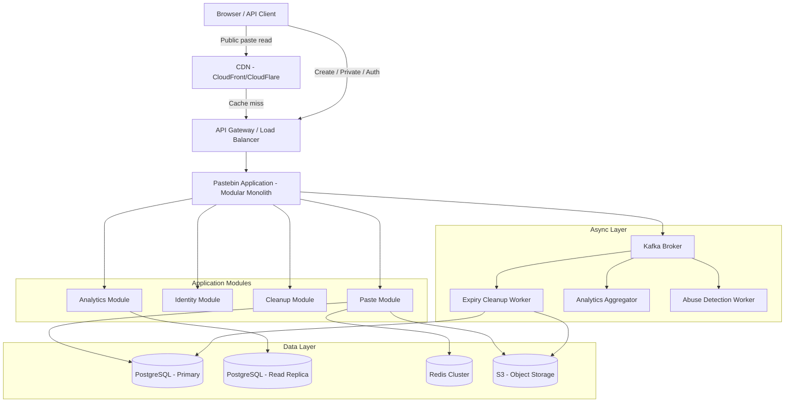
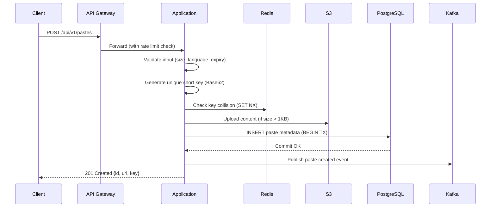
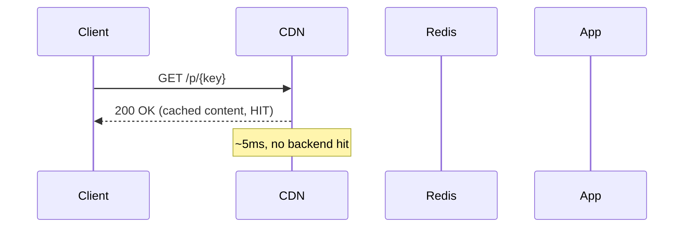
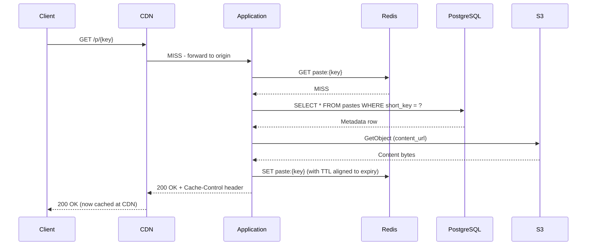

# 01 — High-Level Architecture: Pastebin / Code Sharing Platform

---

## Objective

Select the right architectural pattern for a Pastebin platform, justify the choice over alternatives, and diagram the system at a high level including all major components, data flows, and external integrations.

---

## Architecture Decision: Modular Monolith with DDD

### Why Modular Monolith?

A Pastebin platform at the scale we're targeting (~4 RPS writes, ~40 RPS reads) does **not** need microservices. The operational overhead of microservices (service mesh, distributed tracing, inter-service communication, independent deployments) is unjustifiable at this scale.

A **Modular Monolith with DDD** gives:
- Clean internal module boundaries (Paste, Identity, Cleanup, Analytics)
- Simple operational model (one deployable unit)
- Easy local development
- Full ACID transactions within the process
- Clear migration path to microservices if needed

### When to Extract to Microservices

| Trigger | Extracted Service |
|---------|------------------|
| Cleanup job causes memory/CPU contention on main app | Extract Expiry Cleanup Service |
| Analytics queries slow down main DB | Extract Analytics Service with own DB |
| Abuse detection requires ML pipeline | Extract Content Moderation Service |
| API access feature scales to 10x traffic | Extract Paste Delivery Service |
| Team grows > 15 engineers | Extract by DDD bounded context |

### Why NOT Microservices from Day One?

- Distributed transactions add complexity (paste creation + S3 upload must be atomic)
- Eventual consistency for basic read/write is unnecessary complexity for this scale
- Network latency between services adds to write path latency
- Independent deployment is a benefit only when teams can deploy independently — at early stage, it's overhead

---

## Architecture Overview



---

## Component Responsibilities

### API Gateway / Load Balancer
- TLS termination
- Rate limiting per IP (unauthenticated) and per user (authenticated)
- Request routing
- Logging of all inbound requests (with correlation ID injection)
- Technologies: AWS ALB, NGINX, or Spring Cloud Gateway (if extracted)

### CDN (CloudFront / CloudFlare)
- Caches public paste content at edge nodes globally
- Serves `/raw/{key}` and `/p/{key}` for public pastes
- Cache-Control headers set based on paste expiry
- On paste deletion/expiry: cache invalidation request sent to CDN

### Pastebin Application (Modular Monolith)

#### Paste Module
- Core business logic: create, read, delete, fork paste
- Short key generation (Base62)
- Content routing: small pastes inline in DB, large pastes to S3
- Access control enforcement (public/unlisted/private/password)

#### Identity Module
- User registration, login (JWT issuance)
- API key management for programmatic access
- OAuth2 social login (Google, GitHub)

#### Cleanup Module
- Schedules expiry events via Kafka on paste creation
- Processes expiry events: soft-delete in DB, delete from S3, invalidate CDN cache

#### Analytics Module
- Tracks paste view events (async, via Kafka)
- Aggregates view counts, unique visitors
- Generates dashboard data for authenticated users

### PostgreSQL (Primary)
- Stores paste metadata (key, owner, language, size, expiry, access level)
- Stores user data, API keys
- Source of truth for all structural data

### PostgreSQL (Read Replica)
- Serves analytics queries, user paste list queries
- Reduces read load on primary

### Redis Cluster
- Caches hot paste metadata (LRU eviction)
- Caches full paste content for small pastes (<1 KB)
- Stores rate limiting counters (sliding window)
- Stores idempotency keys for paste creation

### S3 (Object Storage)
- Stores all paste content > 1 KB
- Lifecycle policies: transition to Glacier after 1 year for "never expire" pastes
- Versioning enabled for recovery
- Server-side encryption (SSE-S3 or SSE-KMS)

### Kafka
- Decouples paste creation from side effects
- Topics: `paste.created`, `paste.expired`, `paste.viewed`, `paste.abuse-flagged`
- Ensures cleanup and analytics processing survive application restarts

---

## Request Flow: Paste Creation



---

## Request Flow: Paste Read (Cache Hit)



---

## Request Flow: Paste Read (Cache Miss)



---

## Migration Path: Monolith → Microservices

```
Phase 1 (MVP): Single deployable Spring Boot app
              ↓ Traffic grows, cleanup contention observed
Phase 2:      Extract Expiry Cleanup Service (background job, own process)
              ↓ Analytics queries slow primary DB
Phase 3:      Extract Analytics Service (own DB, ClickHouse or TimescaleDB)
              ↓ Team grows, abuse detection needs ML
Phase 4:      Extract Content Moderation Service (Python ML service)
              ↓ Paste delivery needs geo-distribution
Phase 5:      Extract Paste Delivery Service (stateless, CDN-optimized)
```

**Migration Strategy:**
- Use the Strangler Fig pattern — extract one module at a time
- Each extracted service starts consuming Kafka events from the monolith
- Monolith remains the write path until the extracted service is proven stable
- Database per service: start with a separate schema in the same PostgreSQL, then separate instance

---

## Technology Stack Justification

| Component | Choice | Justification |
|-----------|--------|---------------|
| Application | Spring Boot 3.x + Java 21 | Virtual threads for high concurrency, mature ecosystem |
| Database | PostgreSQL 15+ | JSONB for flexible metadata, strong consistency, proven at scale |
| Cache | Redis 7 (Cluster) | Sub-millisecond reads, LRU eviction, TTL support |
| Object Storage | AWS S3 / MinIO (local) | Unlimited scale, lifecycle policies, 11 9s durability |
| Message Queue | Apache Kafka | Durable events, replay capability, exactly-once semantics |
| CDN | CloudFront or CloudFlare | Edge caching for global low-latency reads |
| API Gateway | AWS ALB / Kong | TLS, rate limiting, routing |
| Container | Docker + Kubernetes | Reproducible deployments, horizontal scaling |

---

## Tradeoffs Summary

| Decision | Pro | Con |
|----------|-----|-----|
| Modular Monolith | Simple ops, easy transactions | Single point of failure (mitigated by replicas) |
| S3 for content | Unlimited scale, cheap storage | Higher read latency without caching |
| Kafka for events | Durable, replayable side effects | Operational complexity, eventual consistency |
| CDN for reads | Global low latency | Stale content on delete (invalidation needed) |
| Redis for hot cache | Sub-ms read performance | Cache invalidation complexity |

---

## Alternatives Considered

### Pure Microservices from Start
- **Rejected**: Operational overhead vastly outweighs benefits at this traffic level. A 4 RPS write system does not need 6 independent services.

### Event Sourcing for Paste State
- **Rejected**: Paste content is immutable after creation. Event sourcing adds complexity without benefit. Version history (advanced feature) can be modeled with a simple `paste_versions` table.

### GraphQL API
- **Rejected**: REST is sufficient. GraphQL benefits appear when clients need flexible field selection across related resources — Pastebin is simple enough that REST endpoints map cleanly.

### MongoDB for Content Storage
- **Rejected**: MongoDB GridFS for large files is worse than S3. For metadata, PostgreSQL with JSONB is equally flexible with better transactional guarantees.
