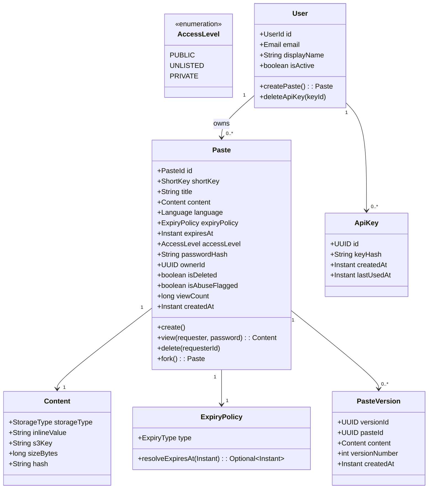

# 02 — Domain Modeling: Pastebin / Code Sharing Platform

---

## Objective

Define the core domain model using Domain-Driven Design (DDD) principles. Identify aggregates, entities, value objects, domain events, and domain services. Build a shared ubiquitous language that can be used across the team.

---

## Ubiquitous Language

| Term | Definition |
|------|------------|
| **Paste** | A unit of text or code content shared via a unique short link |
| **Short Key** | The unique alphanumeric identifier in the paste URL (e.g., `abc123`) |
| **Content** | The actual text/code stored in the paste |
| **Language** | The programming or markup language declared for syntax highlighting |
| **ExpiryPolicy** | The configured lifetime of a paste (1h, 1d, 1w, 1m, never) |
| **AccessLevel** | The visibility control: PUBLIC, UNLISTED, PRIVATE |
| **Owner** | The authenticated user who created the paste (null for anonymous) |
| **Fork** | A new paste created as a copy of an existing paste |
| **Version** | An immutable snapshot of paste content at a point in time |
| **ViewEvent** | A recorded instance of a paste being viewed |
| **ExpiryEvent** | A domain event signaling that a paste's lifetime has ended |
| **AbuseFlag** | A marker indicating a paste has been reported or detected as abusive |

---

## Aggregate Design

### Aggregate 1: Paste (Root)

The **Paste** is the primary aggregate root. All operations on paste content, access, and lifecycle flow through this aggregate.

```
Paste (Aggregate Root)
├── PasteId          (Value Object)
├── ShortKey         (Value Object)
├── Title            (Value Object, optional)
├── Content          (Value Object — inline or S3 reference)
├── Language         (Value Object)
├── ExpiryPolicy     (Value Object)
├── ExpiresAt        (derived from ExpiryPolicy + createdAt)
├── AccessLevel      (Value Object: PUBLIC | UNLISTED | PRIVATE)
├── PasswordHash     (Value Object, nullable)
├── OwnerId          (Reference — not embedded User aggregate)
├── IsDeleted        (boolean)
├── IsAbuseFlagged   (boolean)
├── ViewCount        (eventually consistent counter)
├── ContentSize      (bytes)
├── ContentHash      (SHA-256 for deduplication)
├── CreatedAt
└── Versions[]       (child entity list — only if versioning enabled)
```

#### Invariants Enforced by Paste Aggregate
1. Content size must not exceed 10 MB
2. A deleted paste cannot be viewed
3. An expired paste cannot be viewed
4. A PRIVATE paste can only be viewed by its owner
5. A password-protected paste requires password verification before content access
6. ShortKey must be unique across all pastes (enforced at DB level + application level)
7. ExpiresAt, once set, cannot be extended (business rule — may relax in V2)

---

### Aggregate 2: User

The **User** aggregate is kept intentionally thin — it exists to provide identity. Paste ownership is modeled as a reference (OwnerId) in the Paste aggregate, not embedding.

```
User (Aggregate Root)
├── UserId           (Value Object)
├── Email            (Value Object)
├── PasswordHash     (Value Object)
├── DisplayName      (Value Object)
├── ApiKeys[]        (child entity)
│   ├── ApiKeyId
│   ├── KeyHash      (stored as hash, not plaintext)
│   ├── CreatedAt
│   └── LastUsedAt
├── CreatedAt
└── IsActive         (boolean)
```

#### Invariants Enforced by User Aggregate
1. Email must be unique
2. A deactivated user cannot create new pastes
3. API keys are stored as hashed values only
4. Maximum 10 API keys per user (configurable)

---

## Value Objects

### PasteId
```
PasteId
├── value: UUID (internal database ID)
```
- Used internally for joins, foreign keys
- Never exposed in public API (ShortKey is the external identifier)

### ShortKey
```
ShortKey
├── value: String (6-8 chars, Base62: [a-z][A-Z][0-9])
```
- Immutable after creation
- Globally unique
- Derived from counter-based or random generation (see Database Design)

### ExpiryPolicy
```
ExpiryPolicy
├── type: Enum { ONE_HOUR, ONE_DAY, ONE_WEEK, ONE_MONTH, NEVER }
├── resolveExpiresAt(createdAt: Instant): Optional<Instant>
```
- Pure value computation — no side effects
- `NEVER` returns `Optional.empty()` — no expiry timestamp

### Content
```
Content
├── storageType: Enum { INLINE, S3_REFERENCE }
├── inlineValue: String (nullable, for small content)
├── s3Key: String (nullable, for large content)
├── sizeBytes: long
├── hash: String (SHA-256)
```
- Decision boundary: content < 1 KB → INLINE in DB; content ≥ 1 KB → S3_REFERENCE
- Hash enables deduplication: identical content shares S3 object

### AccessLevel
```
AccessLevel: Enum { PUBLIC, UNLISTED, PRIVATE }
```
- PUBLIC: indexed, CDN-cacheable, no auth required
- UNLISTED: not indexed, link-only access, no auth required
- PRIVATE: only owner can access, requires authentication

### Language
```
Language
├── value: String (e.g., "java", "python", "markdown", "plaintext")
├── isSupported(): boolean
├── getMimeType(): String
```
- Validated against an allowed language list
- Sent to client for client-side syntax highlighting (PrismJS, Highlight.js)
- Not processed server-side (server does not parse code)

---

## Domain Events

Domain events are published by aggregates when important state transitions occur. They are the mechanism for decoupled side effects.

### PasteCreated
```
PasteCreated {
  pasteId: UUID
  shortKey: String
  ownerId: UUID (nullable)
  accessLevel: AccessLevel
  expiresAt: Instant (nullable)
  contentSize: long
  language: String
  createdAt: Instant
}
```
**Consumers:**
- Cleanup Module: schedules expiry event if expiresAt is set
- Analytics Module: records creation metric
- Abuse Detection: queues content for async scanning

### PasteViewed
```
PasteViewed {
  pasteId: UUID
  shortKey: String
  viewerIp: String (hashed for privacy)
  viewedAt: Instant
  isAuthenticated: boolean
}
```
**Consumers:**
- Analytics Module: increments view counter (eventually consistent)

### PasteDeleted
```
PasteDeleted {
  pasteId: UUID
  shortKey: String
  deletedBy: UUID (user or system)
  reason: Enum { USER_REQUESTED, EXPIRED, ABUSE_FLAGGED }
  deletedAt: Instant
}
```
**Consumers:**
- Cleanup Module: deletes S3 object, invalidates CDN cache

### PasteExpired
```
PasteExpired {
  pasteId: UUID
  shortKey: String
  expiredAt: Instant
}
```
**Consumers:**
- Triggers same flow as PasteDeleted with reason = EXPIRED

### PasteAbuseFlagged
```
PasteAbuseFlagged {
  pasteId: UUID
  shortKey: String
  flaggedBy: String (userId or "SYSTEM")
  reason: String
  flaggedAt: Instant
}
```
**Consumers:**
- Moderation queue for human review

---

## Domain Services

Domain services encapsulate operations that don't naturally belong to a single aggregate.

### ShortKeyGenerationService
- Generates unique Base62 short keys
- Handles collision detection (checks DB + Redis)
- Strategy: Counter-based (preferred) or random with retry (simpler)
- Does NOT belong to Paste aggregate because key uniqueness requires global knowledge

### ContentDeduplicationService
- Given content bytes, checks if identical content (same SHA-256) already exists in S3
- Returns existing S3 key if match found — avoids storing duplicate content
- Belongs at domain service level because it crosses S3 and DB boundaries

### PasteAccessControlService
- Given a paste and a requester context (userId, provided password), determines if access is allowed
- Enforces: deleted check, expired check, access level check, password check
- Returns: `AccessDecision { ALLOWED | DENIED_PRIVATE | DENIED_PASSWORD | DENIED_EXPIRED | DENIED_DELETED }`

### ExpirySchedulingService
- On PasteCreated: if paste has expiry, publishes a delayed ExpiryEvent to Kafka with a future timestamp
- On ExpiryEvent received: delegates to Paste aggregate to mark as expired, then publishes PasteDeleted

---

## Domain Model Diagram



---

## Aggregate Boundary Decisions

### Why is ViewCount inside Paste aggregate if it's eventually consistent?

ViewCount is a derived metric on the Paste, not a separate entity. However, updating it synchronously on every view would create a write hotspot on popular pastes. The solution:

1. The Paste aggregate has a `viewCount` field (for display)
2. PasteViewed events are published to Kafka
3. Analytics module aggregates views and periodically **updates** `viewCount` in batch
4. This is intentionally eventual — the count shown may lag by minutes

**Alternative considered:** Store view count in Redis and show it from there. Problem: Redis data can be lost; reconciliation on restart is complex. The Kafka-driven batch update to PostgreSQL is more durable.

### Why not embed User inside Paste?

Paste references `OwnerId` (a UUID) rather than embedding the User aggregate. This avoids:
- Circular aggregate dependencies
- Stale user data in Paste if user updates their name
- Oversized aggregates that are hard to load

User display name is resolved at query time (JOIN or separate fetch) rather than stored in Paste.

---

## Interview Discussion Points

- Why use value objects for ShortKey instead of a plain String?
- How does ContentDeduplicationService prevent re-storing the same code snippet?
- What happens to domain events if the application crashes after DB commit but before Kafka publish? (Outbox pattern answer)
- How does the Paste aggregate enforce its invariants when content is stored in S3 (external to the aggregate's state)?
- Should ExpiresAt be computed eagerly on creation or lazily on each read? (Eager is better — stored for efficient DB queries and index-based cleanup)
