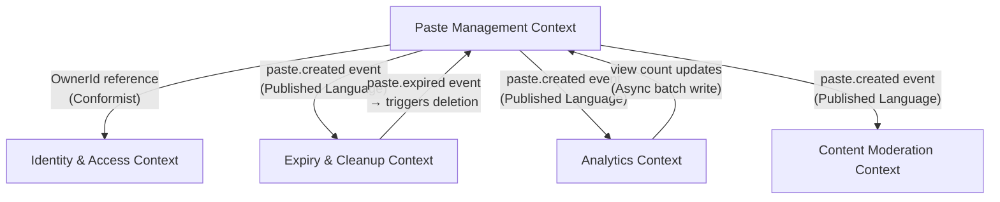

# 03 — DDD Bounded Contexts: Pastebin / Code Sharing Platform

---

## Objective

Define the bounded contexts within the Pastebin system. Establish the responsibilities, language, and integration contracts for each context. Map how contexts communicate and what data crosses boundaries.

---

## Bounded Context Map



---

## Context 1: Paste Management

**Core responsibility:** Create, retrieve, delete, fork, and control access to pastes.

### What lives here
- Paste aggregate (root)
- ShortKey generation
- Content routing (inline vs S3)
- Access control enforcement
- Password verification
- Content deduplication (via hash check)

### Ubiquitous Language (internal)
- Paste, ShortKey, Content, AccessLevel, ExpiryPolicy, Owner, Fork

### API boundary
- Exposes REST endpoints: `POST /pastes`, `GET /pastes/{key}`, `DELETE /pastes/{key}`
- Exposes domain events to Kafka: `paste.created`, `paste.deleted`
- Consumes events from: Cleanup context (`paste.expired`)

### Integration with other contexts
| Context | Integration Pattern | Data Shared |
|---------|-------------------|-------------|
| Identity | Conformist — reads User token, uses OwnerId | OwnerId (UUID only) |
| Cleanup | Upstream — publishes paste.created with expiresAt | pasteId, shortKey, expiresAt |
| Analytics | Upstream — publishes paste.viewed event | pasteId, timestamp |
| Moderation | Upstream — publishes paste.created with content reference | pasteId, contentHash, s3Key |

### What does NOT belong here
- User profile management → Identity context
- View count aggregation → Analytics context
- S3 object deletion → Cleanup context (this context marks as deleted; cleanup does the actual work)
- Abuse scoring → Moderation context

---

## Context 2: Identity & Access

**Core responsibility:** Authenticate users, issue tokens, manage API keys.

### What lives here
- User aggregate
- Registration, login flows
- JWT issuance and validation
- API key generation and hashing
- OAuth2 integration (GitHub, Google)

### Ubiquitous Language (internal)
- User, Credential, Token, ApiKey, Session, Permission, Role

### API boundary
- `POST /auth/register`
- `POST /auth/login`
- `POST /auth/oauth/callback`
- `GET /users/me`
- `POST /users/me/api-keys`
- `DELETE /users/me/api-keys/{id}`

### Integration with other contexts
- **Downstream to Paste Management**: Paste Management trusts the JWT to extract `sub` (userId). It does not call back into Identity for authorization — token is self-contained.
- **Anti-Corruption Layer**: Paste Management has its own `OwnerRef` concept (just an ID). If Identity changes its User model, Paste Management is unaffected as long as the JWT `sub` claim format is stable.

### Design Decision: Shared vs Separate DB

In the Modular Monolith phase: Identity and Paste Management share the same PostgreSQL instance but use **separate schemas** (`identity.*` and `paste.*`). No cross-schema JOINs are written — lookups use application-level joins. This enforces the boundary even before microservice extraction.

---

## Context 3: Expiry & Cleanup

**Core responsibility:** Track paste expirations and orchestrate cleanup of content from S3 and metadata from PostgreSQL.

### What lives here
- ExpiryScheduler (creates delayed Kafka messages)
- ExpiryConsumer (processes expiry events)
- S3 cleanup logic (delete object)
- CDN invalidation requests
- Soft-delete marking in paste metadata table

### Ubiquitous Language (internal)
- ExpiryEvent, CleanupJob, DeletionRecord, CdnInvalidation

### Integration patterns

**Consuming:**
- Listens to `paste.created` events — extracts `expiresAt`, schedules expiry

**Publishing:**
- Publishes `paste.expired` event back — Paste Management context consumes this to soft-delete the paste

**How Delayed Scheduling Works:**

Option A — Kafka with time-based polling (chosen):
- On `paste.created`: record `(pasteId, expiresAt)` in `expiry_schedule` table
- Scheduled DB poll runs every minute: `SELECT * FROM expiry_schedule WHERE expires_at <= NOW() AND processed = false`
- Publishes `paste.expired` events for matches, marks `processed = true`

Option B — Kafka Streams with timestamp-based routing:
- More complex, requires Kafka Streams setup
- Benefit: millisecond-precision expiry triggering

Option C — Redis TTL + keyspace notifications:
- Set Redis key with TTL matching expiry; on key eviction, trigger cleanup
- Problem: Redis TTL eviction is not guaranteed to fire exactly on time; on Redis restart, keys may be lost
- **Rejected** as sole mechanism (use as secondary signal only)

**Chosen:** Option A for MVP (simple DB poll). Migrate to Option B when cleanup volume exceeds 1M/day.

### Failure Handling
- If cleanup worker crashes, DB poll on restart catches missed expirations (idempotent)
- S3 delete failure: retry with exponential backoff; publish to Dead Letter Queue after 5 failures
- CDN invalidation failure: retry; tolerate stale content for max 1 TTL window (configurable, e.g., 5 minutes)

---

## Context 4: Analytics

**Core responsibility:** Aggregate paste view data, provide reporting to paste owners, surface platform-level metrics.

### What lives here
- ViewEvent consumer
- View count aggregator
- User dashboard data (top pastes, views over time)
- Platform-level metrics (total pastes, views per day)

### Ubiquitous Language (internal)
- ViewEvent, ViewCount, PasteStats, DashboardReport, TimeSeries

### Data Model (separate from Paste Management)
- `paste_view_events(paste_id, viewed_at, viewer_hash, session_id)` — raw events table
- `paste_stats(paste_id, total_views, unique_views, last_updated)` — aggregated table

**Important:** Analytics context writes `total_views` back to the Paste Management table as a denormalized field via a scheduled batch job. This avoids the Paste Management context depending on Analytics context for display.

### Why not just use PostgreSQL view count directly?

Updating `view_count` on every paste read creates a **write hotspot**:
- Popular paste with 1,000 concurrent readers = 1,000 concurrent UPDATE operations on the same row
- PostgreSQL row-level locking would serialize these → massive latency
- Solution: write-behind pattern via Kafka, batch aggregate, periodic DB flush

### Read Replica Strategy
- Analytics queries (`GROUP BY`, `DATE_TRUNC`, large aggregations) run against the **read replica** only
- Never run analytics aggregations on the primary PostgreSQL

---

## Context 5: Content Moderation

**Core responsibility:** Detect and act on abusive, malicious, or illegal paste content.

### What lives here
- AbuseDetectionWorker (async content scanner)
- UserReportProcessor (handles manual abuse reports)
- ModerationQueue (items pending human review)
- TakedownProcessor (acts on confirmed abuse flags)

### Ubiquitous Language (internal)
- AbuseFlag, ModerationDecision, TakedownOrder, ContentSignature

### Integration
- Consumes `paste.created` events; fetches content from S3 for scanning
- On confirmed abuse: publishes `paste.abuse-flagged` event
- Paste Management context subscribes to `paste.abuse-flagged` and sets `isAbuseFlagged = true`

### Scanning Strategy (MVP vs Advanced)

| Stage | Technique | Latency |
|-------|-----------|---------|
| MVP | Hash-based blocklist (known malware signatures) | < 10ms |
| V2 | Regex pattern matching (PII, known spam patterns) | < 50ms |
| V3 | ML-based classifier (NSFW text, phishing detection) | ~500ms async |

**Scanning is always async** — paste is accessible immediately after creation. If abuse is detected, it is taken down retroactively (typically within seconds to minutes).

---

## Context Integration Summary Table

| From Context | To Context | Mechanism | Data |
|-------------|-----------|-----------|------|
| Paste Management | Cleanup | Kafka event | pasteId, expiresAt |
| Paste Management | Analytics | Kafka event | pasteId, viewedAt |
| Paste Management | Moderation | Kafka event | pasteId, s3Key, contentHash |
| Cleanup | Paste Management | Kafka event | pasteId (expired) |
| Analytics | Paste Management | Batch DB update | pasteId, viewCount |
| Moderation | Paste Management | Kafka event | pasteId (flagged) |
| Identity | Paste Management | JWT token (HTTP header) | userId, roles |

---

## Anti-Corruption Layer (ACL) Patterns Used

### Paste Management ← Identity
- Paste Management never calls the Identity database directly
- It reads `sub` from JWT claim, stores as `owner_id` (a plain UUID)
- If Identity changes internal user ID format, an ACL transformer converts to internal format
- No User entity object crosses the boundary — only a primitive UUID

### Analytics ← Paste Management
- Analytics has its own `PasteReference` (just an ID and creation timestamp)
- When Paste Management sends `paste.created` event, Analytics maps it to its own internal model
- Analytics does not depend on Paste Management's schema

---

## Module Packaging (Modular Monolith)

```
com.pastebin
├── paste/           ← Paste Management context
│   ├── domain/
│   ├── application/
│   ├── infrastructure/
│   └── api/
├── identity/        ← Identity & Access context
│   ├── domain/
│   ├── application/
│   ├── infrastructure/
│   └── api/
├── cleanup/         ← Expiry & Cleanup context
│   ├── domain/
│   ├── application/
│   └── infrastructure/
├── analytics/       ← Analytics context
│   ├── domain/
│   ├── application/
│   └── infrastructure/
└── moderation/      ← Content Moderation context
    ├── domain/
    ├── application/
    └── infrastructure/
```

**Package dependency rule:** No package in one context may import from another context's `domain` package. Communication flows only through:
1. Domain events (via Kafka or in-process event bus)
2. Shared kernel (common types: UserId, PasteId — primitive wrappers only)
3. Public API interfaces (interfaces, not implementations)

---

## Interview Discussion Points

- How do you enforce bounded context boundaries in a monolith without microservices?
- What happens to the Analytics context when you extract it to its own service — what breaks?
- Why does Paste Management not call the Identity database even though they're in the same process?
- How do you handle the case where a paste is deleted before the Moderation scan completes?
- Is it acceptable for the CDN to serve a deleted paste for up to 5 minutes? How would you reduce this window?
