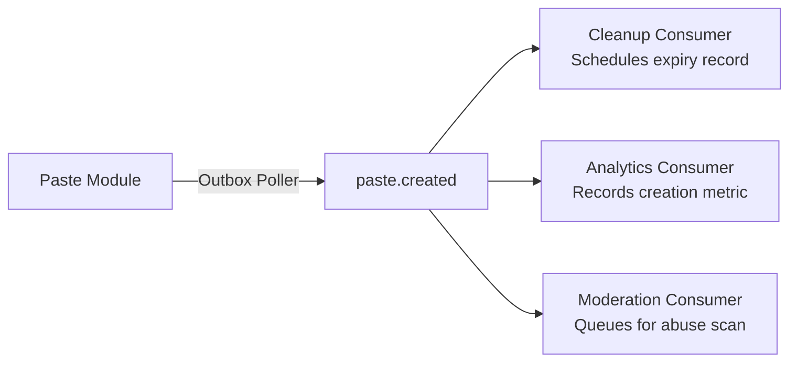
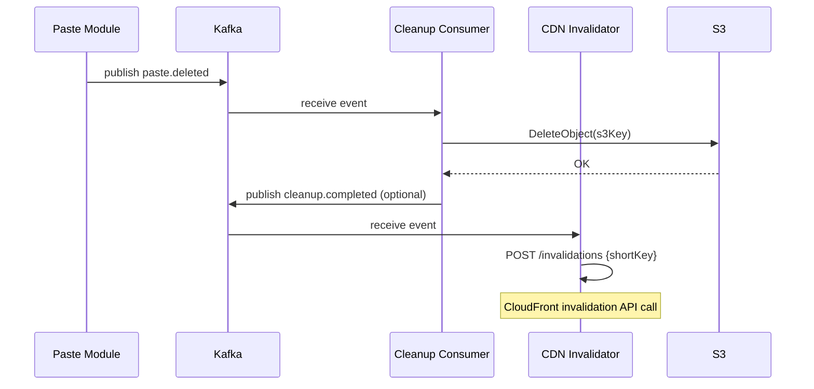
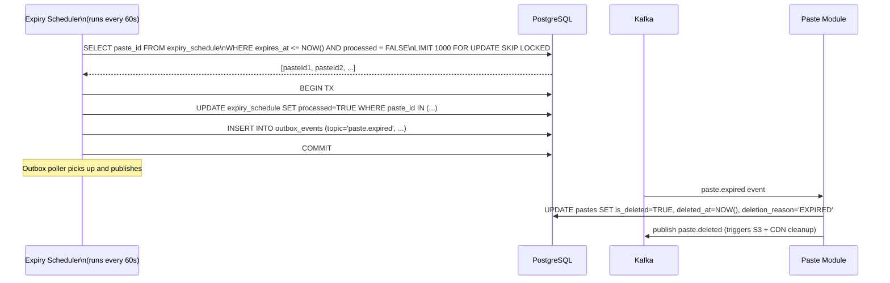

# 06 — Event Flow: Pastebin / Code Sharing Platform

---

## Objective

Document all asynchronous event flows in the system. Define Kafka topics, message schemas, producer/consumer ownership, ordering guarantees, and error handling strategies for each event type.

---

## Why Events? (Design Rationale)

The Pastebin write path has multiple side effects:
- Scheduling expiry cleanup
- Recording analytics
- Triggering abuse scanning
- Invalidating CDN cache on deletion

Handling all of these synchronously in the HTTP request path would:
1. Increase write latency (sequential external calls)
2. Create tight coupling (Paste Module knows about Cleanup, Analytics, Moderation)
3. Risk data inconsistency (if one side effect fails, partial state)
4. Make the system brittle (if Analytics is down, paste creation fails)

**Event-driven side effects** solve these by decoupling and deferring work. The core write path (DB + S3) is synchronous and fast; everything else is async.

---

## Kafka Topic Architecture

```
Topic Design Philosophy:
- One topic per domain event type
- Key = pasteId (ensures ordering per paste)
- Partition count = 12 (sufficient for expected throughput, divisible by common consumer counts)
- Replication factor = 3 (min in-sync replicas = 2)
- Retention = 7 days (for replay on consumer failure)
```

| Topic | Producer | Consumer(s) | Partitions | Key |
|-------|----------|-------------|-----------|-----|
| `paste.created` | Paste Module | Cleanup, Analytics, Moderation | 12 | pasteId |
| `paste.viewed` | Paste Module | Analytics | 12 | pasteId |
| `paste.expired` | Cleanup Module | Paste Module | 6 | pasteId |
| `paste.deleted` | Paste Module | Cleanup, CDN Invalidator | 6 | pasteId |
| `paste.abuse-flagged` | Moderation Module | Paste Module, Alert Service | 6 | pasteId |
| `paste.cleanup.dlq` | Cleanup Worker | Ops Alert | 3 | pasteId |

---

## Outbox Pattern

**Problem:** What happens if the application crashes after committing the paste to PostgreSQL but before publishing the Kafka event?

```
TX Commit → ✓ Paste saved in DB
App Crash → ✗ paste.created event never published
Result: Paste exists but is never cleaned up, never counted in analytics
```

**Solution: Transactional Outbox Pattern**

```sql
-- Outbox table (same DB transaction as paste insert)
CREATE TABLE paste.outbox_events (
    id          UUID            PRIMARY KEY DEFAULT gen_random_uuid(),
    topic       VARCHAR(128)    NOT NULL,
    partition_key VARCHAR(128)  NOT NULL,
    payload     JSONB           NOT NULL,
    created_at  TIMESTAMPTZ     NOT NULL DEFAULT NOW(),
    published   BOOLEAN         NOT NULL DEFAULT FALSE,
    published_at TIMESTAMPTZ
);
```

**Flow:**
1. `BEGIN` transaction
2. `INSERT INTO paste.pastes (...)`
3. `INSERT INTO paste.outbox_events (topic='paste.created', payload={...})`
4. `COMMIT` — both inserts are atomic
5. Outbox poller (separate thread) reads unpublished events and publishes to Kafka
6. On successful Kafka publish: `UPDATE outbox_events SET published=TRUE`

**Outbox Poller:**
- Runs every 100ms in a separate thread
- Reads up to 100 unpublished events per poll
- Publishes in order (created_at ASC)
- At-least-once delivery: consumer must be idempotent

---

## Event: `paste.created`

### Schema
```json
{
  "eventId": "evt_550e8400-e29b-41d4-a716-446655440000",
  "eventType": "paste.created",
  "version": "1.0",
  "occurredAt": "2026-05-17T12:00:00Z",
  "payload": {
    "pasteId": "paste_abc123",
    "shortKey": "abc123",
    "ownerId": "usr_xyz",
    "accessLevel": "PUBLIC",
    "language": "java",
    "contentSize": 4096,
    "contentHash": "a9b8c7...",
    "s3Key": "pastes/2026/05/abc123.txt",
    "expiresAt": "2026-05-18T12:00:00Z",
    "isPasswordProtected": false,
    "createdAt": "2026-05-17T12:00:00Z"
  }
}
```

### Consumer Flows



**Cleanup Consumer:**
- If `expiresAt` is present: INSERT into `expiry_schedule(paste_id, expires_at)`
- If `expiresAt` is null: no action
- Idempotent: `INSERT ... ON CONFLICT DO NOTHING`

**Analytics Consumer:**
- Increment daily paste creation counter
- Record language distribution metric
- No DB write on this hot path (use Redis counter, batch flush)

**Moderation Consumer:**
- Fetch content from S3 using `s3Key`
- Run through blocklist scanner
- If flagged: publish to `paste.abuse-flagged`
- If clean: update moderation status to APPROVED (optional)

---

## Event: `paste.viewed`

### Schema
```json
{
  "eventId": "evt_abc",
  "eventType": "paste.viewed",
  "version": "1.0",
  "occurredAt": "2026-05-17T13:00:00Z",
  "payload": {
    "pasteId": "paste_abc123",
    "shortKey": "abc123",
    "viewerHash": "sha256(ip_address + date)",
    "isAuthenticated": false,
    "referrer": "https://twitter.com"
  }
}
```

### Consumer Flow

**Analytics Consumer:**
- Append to `analytics.paste_view_events` (append-only, partitioned table)
- Every 5 minutes: aggregate view counts for active pastes, UPDATE `paste_stats`
- Every hour: batch UPDATE `pastes.view_count` from `paste_stats`

**Why not update `pastes.view_count` directly from the event consumer?**
- `paste.viewed` can fire thousands of times per minute for a popular paste
- Concurrent UPDATEs to the same row → row-level lock contention → serialization
- Batching into `paste_stats` and periodic flush eliminates the hotspot

---

## Event: `paste.deleted`

### Schema
```json
{
  "eventId": "evt_xyz",
  "eventType": "paste.deleted",
  "version": "1.0",
  "occurredAt": "2026-05-17T14:00:00Z",
  "payload": {
    "pasteId": "paste_abc123",
    "shortKey": "abc123",
    "s3Key": "pastes/2026/05/abc123.txt",
    "reason": "USER_REQUESTED",
    "accessLevel": "PUBLIC",
    "deletedAt": "2026-05-17T14:00:00Z"
  }
}
```

### Consumer Flows



**S3 Delete failure handling:**
- Retry up to 5 times with exponential backoff
- On 5th failure: publish to `paste.cleanup.dlq` (Dead Letter Queue)
- Ops alert fires on DLQ messages
- Manual intervention or scheduled retry job processes DLQ

---

## Event: `paste.expired`

This event is produced by the Cleanup Module (not the application) when it detects a paste's `expires_at` has passed.

### Expiry Detection Flow



**`FOR UPDATE SKIP LOCKED` pattern:**
- Critical for running multiple cleanup instances without double-processing
- Each instance acquires locks only on rows it can process immediately
- Other instances skip locked rows and pick up different batches
- Allows horizontal scaling of the cleanup job

---

## Event: `paste.abuse-flagged`

```json
{
  "eventId": "evt_mod123",
  "eventType": "paste.abuse-flagged",
  "version": "1.0",
  "occurredAt": "2026-05-17T12:05:00Z",
  "payload": {
    "pasteId": "paste_abc123",
    "shortKey": "abc123",
    "flaggedBy": "SYSTEM",
    "flagType": "MALWARE",
    "confidence": 0.97,
    "flaggedAt": "2026-05-17T12:05:00Z"
  }
}
```

**Consumer Flows:**

**Paste Module Consumer:**
- UPDATE `pastes SET is_abuse_flagged = TRUE` where `pasteId` matches
- Paste becomes inaccessible to public (access control checks `is_abuse_flagged`)
- Owner receives notification (optional, via notification service)

**Alert Service Consumer:**
- High-confidence flags (> 0.95): immediate Slack/PagerDuty alert
- Low-confidence flags (< 0.7): add to human review queue only

---

## Consumer Group Design

```
Consumer Groups:

paste.created topic:
  - cleanup-consumer-group      (1-3 instances)
  - analytics-consumer-group    (2-4 instances)
  - moderation-consumer-group   (2-4 instances)

paste.viewed topic:
  - analytics-views-consumer-group (4-8 instances, high volume)

paste.deleted topic:
  - s3-cleanup-consumer-group    (1-3 instances)
  - cdn-invalidator-group        (1-2 instances)

paste.expired topic:
  - paste-module-expiry-group    (1-3 instances)
```

---

## Message Ordering Guarantees

| Topic | Key | Ordering Guarantee |
|-------|-----|-------------------|
| `paste.created` | pasteId | All events for a given paste on same partition → in-order |
| `paste.viewed` | pasteId | Same paste views ordered per partition |
| `paste.deleted` | pasteId | Created before deleted (guaranteed by key) |
| `paste.expired` | pasteId | Same partition as deleted → ordering maintained |

**Why ordering matters for paste lifecycle:**
- `paste.created` must be processed by Cleanup before `paste.expired`
- `paste.deleted` must be processed before CDN invalidation attempts
- Same partition key ensures this ordering within a consumer group

---

## Failure Scenarios and Recovery

| Failure | Impact | Recovery |
|---------|--------|---------|
| Kafka broker down | Events buffered in outbox table | Resume when Kafka recovers; outbox poller retries |
| S3 delete fails | Paste marked deleted in DB, content still in S3 | DLQ retry; S3 orphan cleanup job runs weekly |
| CDN invalidation fails | Expired paste still served for up to TTL window | Alert ops; acceptable for ≤ 5 minutes |
| Analytics consumer lag | view_count not updated | Eventual consistency — resolves on backfill |
| Moderation crash | Paste not scanned | Reprocess from Kafka retention (7 days) |
| Outbox poller crash | Events delayed | Restart poller; no data loss (outbox is durable in DB) |

---

## Dead Letter Queue (DLQ) Pattern

Any event that fails after 5 retries with exponential backoff is published to `paste.cleanup.dlq`:

```json
{
  "originalTopic": "paste.deleted",
  "originalEvent": { ... },
  "failureReason": "S3 AccessDenied: NoSuchBucket",
  "attemptCount": 5,
  "lastAttemptAt": "2026-05-17T14:30:00Z"
}
```

**DLQ handling:**
- Ops team reviews DLQ events daily
- Automated: retry DLQ events after manual triage (fix root cause first)
- Automated: weekly orphan cleanup job scans S3 for objects that should have been deleted

---

## Interview Discussion Points

- Why use the Outbox Pattern instead of Kafka transactions?
- What is `FOR UPDATE SKIP LOCKED` and why is it critical for the cleanup job?
- How do you prevent a paste from being double-expired (concurrent cleanup instances)?
- What happens to a paste that gets the `paste.expired` event but the subsequent `paste.deleted` event processing fails?
- If Kafka goes down for 6 hours, what data is at risk? (Answer: no data loss — outbox buffers in DB; events replay on recovery)
- How would you handle a paste that is deleted and simultaneously being viewed by many users — what is the user experience during CDN invalidation?
