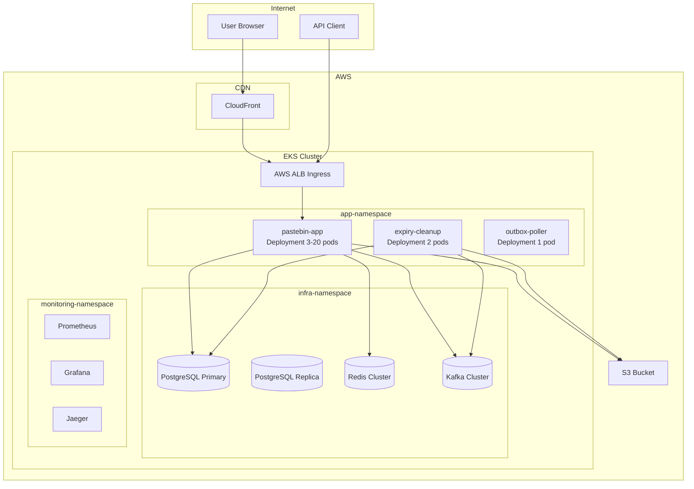
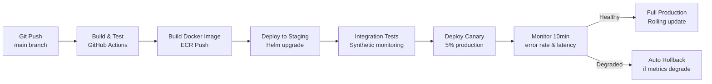

# 13 — Deployment Architecture: Pastebin / Code Sharing Platform

---

## Objective

Design the full deployment architecture from local development to production. Cover Docker containerization, Kubernetes orchestration, CI/CD pipeline, blue-green and canary deployment strategies, environment management, and infrastructure-as-code.

---

## Deployment Philosophy

1. **Immutable infrastructure** — never SSH into a server to make changes; update via deploy
2. **Infrastructure as Code** — everything in version control (Terraform, Helm charts)
3. **Environment parity** — dev/staging/prod use same container images, different configs
4. **Zero-downtime deploys** — rolling updates with readiness probes, no maintenance windows
5. **Fail fast** — canary gates catch regressions before full rollout

---

## Local Development Setup

```
Developer machine:
  ├── Docker Desktop / Rancher Desktop
  ├── docker-compose.yml (local deps)
  └── Spring Boot app (IntelliJ / VS Code)

docker-compose services:
  - PostgreSQL 15 (ports: 5432)
  - Redis 7 (ports: 6379)
  - Kafka + Zookeeper / KRaft (ports: 9092)
  - MinIO (S3-compatible) (ports: 9000, 9001)
  - Schema Registry (ports: 8081)
  - LocalStack (AWS services mock)
  - Jaeger (tracing UI) (ports: 16686)
  - Grafana + Prometheus (ports: 3000, 9090)
```

**Application config profile:** `application-local.yml`
```yaml
spring:
  datasource:
    url: jdbc:postgresql://localhost:5432/pastebin_dev
  data:
    redis:
      host: localhost
      port: 6379
  kafka:
    bootstrap-servers: localhost:9092

cloud:
  aws:
    s3:
      endpoint: http://localhost:9000
    credentials:
      access-key: minioadmin
      secret-key: minioadmin
```

---

## Container Design

### Dockerfile (Multi-Stage Build)

```dockerfile
# Stage 1: Build
FROM eclipse-temurin:21-jdk-alpine AS builder
WORKDIR /app
COPY pom.xml .
RUN mvn dependency:go-offline -q
COPY src/ src/
RUN mvn package -DskipTests -q

# Stage 2: Runtime
FROM eclipse-temurin:21-jre-alpine AS runtime
RUN addgroup -S pastebin && adduser -S pastebin -G pastebin
WORKDIR /app
COPY --from=builder /app/target/*.jar app.jar
RUN chown pastebin:pastebin app.jar

USER pastebin
EXPOSE 8080 8081

ENTRYPOINT ["java", \
  "-XX:+UseContainerSupport", \
  "-XX:MaxRAMPercentage=75.0", \
  "-Djava.security.egd=file:/dev/./urandom", \
  "-jar", "app.jar"]
```

**Key decisions:**
- Multi-stage build: final image has no JDK (smaller, fewer vulnerabilities)
- Non-root user (`pastebin`) — container security
- `MaxRAMPercentage=75.0` — JVM uses 75% of container memory limit (not host RAM)
- Alpine base — minimal attack surface

**Image tags:**
```
pastebin-app:latest           # Dev branch
pastebin-app:1.2.3            # Semantic versioned release
pastebin-app:sha-abc1234      # Git commit SHA (immutable, for rollback)
```

---

## Kubernetes Architecture



---

## Kubernetes Resource Definitions

### Application Deployment

```yaml
apiVersion: apps/v1
kind: Deployment
metadata:
  name: pastebin-app
  namespace: app
spec:
  replicas: 3
  strategy:
    type: RollingUpdate
    rollingUpdate:
      maxSurge: 1
      maxUnavailable: 0    # Zero downtime: always at least 3 pods
  selector:
    matchLabels:
      app: pastebin-app
  template:
    metadata:
      labels:
        app: pastebin-app
    spec:
      containers:
        - name: pastebin-app
          image: pastebin-app:1.2.3
          ports:
            - containerPort: 8080
          resources:
            requests:
              memory: "512Mi"
              cpu: "250m"
            limits:
              memory: "1Gi"
              cpu: "1000m"
          env:
            - name: SPRING_PROFILES_ACTIVE
              value: "prod"
            - name: DB_PASSWORD
              valueFrom:
                secretKeyRef:
                  name: pastebin-db-secret
                  key: password
          readinessProbe:
            httpGet:
              path: /actuator/health/readiness
              port: 8081
            initialDelaySeconds: 10
            periodSeconds: 5
            failureThreshold: 3
          livenessProbe:
            httpGet:
              path: /actuator/health/liveness
              port: 8081
            initialDelaySeconds: 30
            periodSeconds: 10
            failureThreshold: 5
          lifecycle:
            preStop:
              exec:
                command: ["sleep", "10"]  # Graceful drain before SIGTERM
```

### Horizontal Pod Autoscaler

```yaml
apiVersion: autoscaling/v2
kind: HorizontalPodAutoscaler
metadata:
  name: pastebin-app-hpa
spec:
  scaleTargetRef:
    apiVersion: apps/v1
    kind: Deployment
    name: pastebin-app
  minReplicas: 2
  maxReplicas: 20
  metrics:
    - type: Resource
      resource:
        name: cpu
        target:
          type: Utilization
          averageUtilization: 60
    - type: Resource
      resource:
        name: memory
        target:
          type: Utilization
          averageUtilization: 70
    - type: External
      external:
        metric:
          name: kafka_consumer_group_lag
          selector:
            matchLabels:
              consumer_group: paste-view-aggregator
        target:
          type: AverageValue
          averageValue: "1000"
```

### Ingress (AWS ALB)

```yaml
apiVersion: networking.k8s.io/v1
kind: Ingress
metadata:
  name: pastebin-ingress
  annotations:
    kubernetes.io/ingress.class: alb
    alb.ingress.kubernetes.io/scheme: internet-facing
    alb.ingress.kubernetes.io/certificate-arn: arn:aws:acm:us-east-1:...
    alb.ingress.kubernetes.io/ssl-policy: ELBSecurityPolicy-TLS13-1-2-2021-06
spec:
  rules:
    - host: api.pastebin.io
      http:
        paths:
          - path: /
            pathType: Prefix
            backend:
              service:
                name: pastebin-app-service
                port:
                  number: 8080
```

---

## Environment Strategy

| Environment | Purpose | Infra | Data |
|------------|---------|-------|------|
| Local | Developer dev | docker-compose | Synthetic test data |
| Dev | Integration testing | K8s (small) | Anonymized subset |
| Staging | Pre-release validation | K8s (production-like) | Anonymized production copy |
| Production | Live traffic | K8s (full scale) | Real data |

**Config management per environment:**
- Environment-specific values: Kubernetes ConfigMaps
- Secrets: AWS Secrets Manager → Kubernetes External Secrets Operator
- Feature flags: LaunchDarkly / custom flag service

---

## CI/CD Pipeline



### GitHub Actions Pipeline

```yaml
name: CI/CD Pipeline
on:
  push:
    branches: [main]

jobs:
  build-and-test:
    runs-on: ubuntu-latest
    steps:
      - uses: actions/checkout@v4
      - name: Set up JDK 21
        uses: actions/setup-java@v4
        with:
          java-version: '21'
      - name: Run tests
        run: mvn test
      - name: Run security scan (OWASP)
        run: mvn dependency-check:check
      - name: Static analysis (SpotBugs)
        run: mvn spotbugs:check

  build-image:
    needs: build-and-test
    runs-on: ubuntu-latest
    steps:
      - name: Build Docker image
        run: docker build -t pastebin-app:${{ github.sha }} .
      - name: Scan image (Trivy)
        run: trivy image --exit-code 1 --severity HIGH,CRITICAL pastebin-app:${{ github.sha }}
      - name: Push to ECR
        run: |
          aws ecr get-login-password | docker login --username AWS --password-stdin $ECR_REGISTRY
          docker push $ECR_REGISTRY/pastebin-app:${{ github.sha }}

  deploy-staging:
    needs: build-image
    runs-on: ubuntu-latest
    steps:
      - name: Deploy to staging
        run: |
          helm upgrade pastebin-app ./helm/pastebin \
            --set image.tag=${{ github.sha }} \
            --namespace staging \
            --atomic --timeout 5m

  deploy-production-canary:
    needs: deploy-staging
    runs-on: ubuntu-latest
    steps:
      - name: Deploy canary (5%)
        run: |
          helm upgrade pastebin-app-canary ./helm/pastebin \
            --set image.tag=${{ github.sha }} \
            --set replicaCount=1 \
            --namespace production

      - name: Wait and validate canary (10 minutes)
        run: |
          sleep 600
          ./scripts/validate-canary.sh  # Checks error rate via Prometheus API

  deploy-production-full:
    needs: deploy-production-canary
    runs-on: ubuntu-latest
    steps:
      - name: Full production deploy
        run: |
          helm upgrade pastebin-app ./helm/pastebin \
            --set image.tag=${{ github.sha }} \
            --namespace production \
            --atomic --timeout 10m
```

---

## Deployment Strategies

### Rolling Update (Default)

- Kubernetes default strategy
- Replaces pods one at a time (maxUnavailable=0, maxSurge=1)
- Readiness probe must pass before old pod removed
- Zero-downtime for stateless services

**Limitation:** Both old and new code run simultaneously during rollout. Cannot use if DB migration is backward-incompatible.

### Blue-Green (For Major Releases)

```
Blue environment: current production
Green environment: new version

Steps:
1. Deploy green environment (separate Deployment)
2. Run smoke tests against green
3. Switch ALB target group from blue to green (atomic, ~2 seconds)
4. Monitor for 15 minutes
5. If healthy: decommission blue
6. If degraded: switch ALB back to blue (instant rollback)
```

**When to use:** Major version changes, DB schema migrations requiring downtime, architectural changes.

### Canary Release (For Risk-Sensitive Changes)

```
Step 1: 5% of traffic → canary pods (new version)
Step 2: Monitor for 10 minutes (error rate, latency, business metrics)
Step 3: 25% → 50% → 100% (automated if metrics healthy)
Step 4: 0% if any metric degrades (auto-rollback)
```

**Implementation:** Kubernetes traffic splitting via Istio VirtualService weight annotations or NGINX ingress weight annotations.

---

## Database Migrations

**Tool:** Flyway (schema version control)

**Migration safety rules:**
1. **Never** drop columns in the same release as removing code that uses them
2. **Never** add NOT NULL columns without a DEFAULT in the same migration
3. **Always** add columns as nullable first; backfill; then add NOT NULL constraint
4. **Always** test migrations on a staging DB with production-sized data

**Zero-downtime migration pattern:**
```
Deploy N:   Add new column (nullable)
Deploy N+1: Write to both old and new column
Deploy N+2: Read from new column, write to both
Deploy N+3: Read from new column, write to new column only
Deploy N+4: Drop old column
```

---

## Infrastructure as Code (Terraform)

```
terraform/
  ├── modules/
  │   ├── eks/          # EKS cluster definition
  │   ├── rds/          # PostgreSQL via RDS
  │   ├── elasticache/  # Redis via ElastiCache
  │   ├── msk/          # Kafka via Amazon MSK
  │   └── s3/           # S3 bucket + CloudFront
  ├── environments/
  │   ├── dev/
  │   ├── staging/
  │   └── production/
  └── global/
      └── iam/          # IAM roles and policies
```

**State management:** Terraform state in S3 + DynamoDB lock table (prevents concurrent state modification).

---

## Interview Discussion Points

- Why `maxUnavailable=0` in rolling update strategy? What is the tradeoff?
- How does a canary deployment help you detect a regression in paste creation that only affects 0.1% of requests?
- What is the `preStop` hook doing and why is it needed for zero-downtime deploys?
- How do you handle a DB migration that adds a NOT NULL column to a 100M-row table without downtime?
- Why is Kubernetes readiness probe important? What happens if you deploy without it?
- What is the risk of running blue-green deploy with Kafka consumers? (Old consumers still running might process new events differently)
- How does Terraform state locking prevent team members from simultaneously destroying and creating the same infrastructure?
