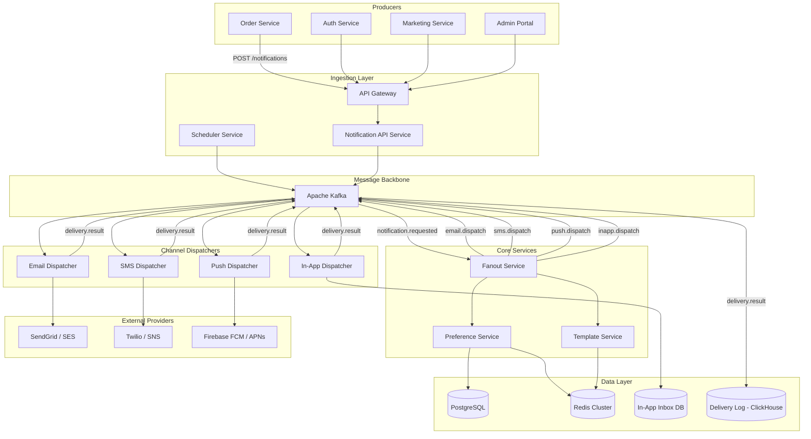
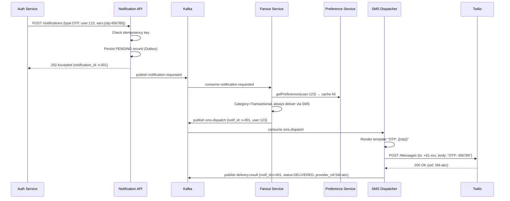
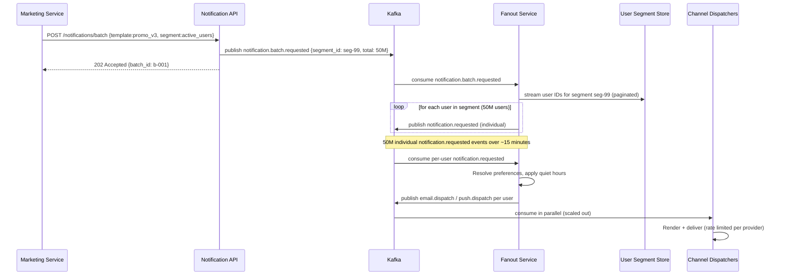

# 01 — High-Level Architecture: Notification System

---

## Objective

Select the correct architectural pattern for a centralized notification platform, justify the choice, diagram all major components and data flows, and describe how the architecture evolves from MVP to production scale.

---

## Architecture Decision: Event-Driven with Modular Services

### Why Event-Driven Architecture?

A Notification System is a canonical event-driven problem. Every notification is triggered by an event elsewhere in the system (order placed → send confirmation, password changed → send alert). The workload is inherently:

- **Asynchronous by nature** — producers don't need to wait for delivery confirmation
- **Fan-out heavy** — one event triggers delivery to multiple users, multiple channels, multiple devices
- **Burst-prone** — batch campaigns create 50,000 msg/sec spikes that cannot block producers
- **Retry-dependent** — external providers are unreliable; all failures must be retried durably

An event-driven architecture with Kafka as the backbone satisfies all of these properties simultaneously.

### Why NOT a Synchronous Microservices Model?

If a producer calls a synchronous Notification API that directly calls SendGrid:
- Producer is blocked waiting for external provider response
- Provider outage cascades to the producer (e.g., order service fails because SendGrid is down)
- No natural retry mechanism — the producer would need to implement retries
- Campaign-scale throughput is impossible (SendGrid rate limit < campaign volume)

The event-driven model decouples producers from delivery completely.

### Architecture Style: Event-Driven + Modular Decomposition

Rather than a pure microservices model, the system is decomposed into **focused services with clear contracts**, each owning a specific concern. Services communicate via Kafka topics. The decomposition is:

| Service | Responsibility |
|---------|---------------|
| Notification API | Accept requests from producers, validate, enqueue |
| Fanout Service | Route notification to correct channels per user preferences |
| Email Dispatcher | Consume email jobs, render template, call email provider |
| SMS Dispatcher | Consume SMS jobs, call SMS provider, handle DND |
| Push Dispatcher | Consume push jobs, resolve device tokens, call FCM/APNs |
| In-App Dispatcher | Consume in-app jobs, write to inbox DB |
| Template Service | Store and render templates with variable substitution |
| Preference Service | Store and serve user notification preferences |
| Scheduler Service | Manage scheduled future notifications |
| Delivery Log Service | Write all delivery events to the audit/log store |

### When to Use Modular Monolith Instead

At a startup with < 5 engineers:
- Deploy all dispatchers as modules in a single Spring Boot application
- Use internal event bus (Spring Events) instead of Kafka initially
- Extract to separate services when a single dispatcher is the scaling bottleneck

---

## Architecture Overview



---

## Component Responsibilities

### Notification API Service
- Accepts notification requests from internal producers (REST or gRPC)
- Validates: notification type, target user(s), template ID, variables
- Assigns a globally unique `notification_id` (UUID v4 or Snowflake ID)
- Checks idempotency key — rejects duplicate submissions
- Persists notification record (status: PENDING) via Outbox pattern
- Publishes `notification.requested` event to Kafka
- Returns `202 Accepted` with `notification_id` immediately
- Does NOT render templates or resolve preferences (separation of concerns)

### Fanout Service
- Consumes `notification.requested` events
- Resolves target users (single user, user list, or cohort segment)
- For each target user:
  - Fetches user preferences from Preference Service (cache-first)
  - Determines which channels to use (preference + notification category rules)
  - Applies quiet hours check
  - Publishes one job per channel to the appropriate dispatch topic
- Handles the "big fanout" problem: for a 50M-user campaign, publishes 50M × channels jobs
- Scales horizontally with Kafka consumer group partitioning

### Email / SMS / Push / In-App Dispatchers
- Each is an independent, stateless consumer group
- Consumes channel-specific dispatch topics (`email.dispatch`, `sms.dispatch`, etc.)
- Fetches template from Template Service (in-memory cache)
- Renders template with user variables
- Calls external provider API
- Publishes delivery result event (`delivery.result` topic)
- On provider error: uses Kafka retry topic or DLQ based on error type
- Each dispatcher scales independently based on its channel load

### Template Service
- REST API for template CRUD (admin-facing)
- Template versioning (v1, v2 per template ID)
- Variables: Mustache or Handlebars syntax (`{{first_name}}`)
- Channel-specific rendering: email templates include HTML, SMS templates enforce 160-char limit
- All templates cached in Redis with long TTL (invalidated on update)

### Preference Service
- Stores per-user per-channel opt-in/out settings
- Stores per-user per-category settings (Marketing, Transactional, Product Updates)
- Caches aggressively in Redis (preference changes are infrequent vs notification reads)
- Exposes gRPC API for low-latency access from Fanout Service
- Writes to PostgreSQL (source of truth); cache write-through on updates

### Scheduler Service
- Accepts scheduled notification requests (deliver at time T)
- Stores scheduled jobs in PostgreSQL with `scheduled_at` timestamp
- Polling-based or event-based trigger (every 10 seconds, scan for due jobs)
- Publishes to `notification.requested` when due time arrives
- Handles cancellation of scheduled notifications before delivery

### Delivery Log Service
- Consumes all `delivery.result` events from Kafka
- Writes to ClickHouse (append-only, time-series optimized, analytics-ready)
- Never deletes records (append-only audit trail)
- Separate read path for analytics dashboards (no impact on delivery path)

---

## Request Flow: Transactional Notification (OTP)



---

## Request Flow: Batch Campaign Fanout



---

## Migration Path: Startup → Taking Scale

```
Phase 1 (MVP):        Single Spring Boot app
                      Internal event bus, direct provider calls
                      PostgreSQL + Redis only
                      ↓ Volume grows, provider calls blocking
Phase 2:              Extract Kafka backbone
                      Split Email/SMS dispatchers as separate services
                      Add Preference and Template caching
                      ↓ Batch campaigns needed
Phase 3:              Add Fanout Service
                      Add Scheduler Service
                      Add DLQ + retry infrastructure
                      ↓ Analytics needed
Phase 4:              Add ClickHouse for delivery analytics
                      Add A/B testing for templates
                      ML-based optimal send time
                      ↓ Global scale
Phase 5:              Multi-region Kafka (MirrorMaker 2)
                      Region-aware dispatcher routing
                      Global preference store with replication
```

---

## Technology Stack Justification

| Component | Choice | Justification |
|-----------|--------|---------------|
| Application | Spring Boot 3.x + Java 21 | Virtual threads handle high concurrency Kafka consumption cheaply |
| Message backbone | Apache Kafka | Durable, replayable, supports exactly-once, scales to 50K msg/sec |
| Metadata DB | PostgreSQL 15+ | Transactional, supports Outbox pattern, strong consistency |
| Cache | Redis 7 Cluster | Preference + template cache; sub-ms lookup on critical path |
| Delivery analytics | ClickHouse | Column-oriented, handles 100M+ row aggregation in seconds |
| Email provider | SendGrid (primary) / AWS SES (fallback) | Rate limit pooling, dual-provider reduces single-provider risk |
| SMS provider | Twilio (primary) / SNS (fallback) | Global coverage, delivery receipts |
| Push provider | Firebase FCM + APNs | Industry standard, batch push support |
| Container | Docker + Kubernetes | Independent scaling per dispatcher |

---

## Tradeoffs Summary

| Decision | Pro | Con |
|----------|-----|-----|
| Event-driven (Kafka) | Decouples producers, durable retries, burst absorption | Operational complexity, eventual delivery (not synchronous) |
| Per-channel dispatcher isolation | Scale each channel independently, provider failure isolation | More services to operate, inter-service complexity |
| Fanout Service | Single responsibility, horizontal scale | Large campaigns create sustained Kafka write pressure |
| Preference cache (Redis) | Sub-ms lookup on delivery critical path | Cache invalidation complexity on preference updates |
| ClickHouse for analytics | Analytics don't impact delivery performance | Additional infrastructure, ETL pipeline needed |

---

## Alternatives Considered

### Synchronous per-notification API chain
- **Rejected**: Ties producer availability to external provider availability. One SendGrid outage brings down Order Service.

### AWS SNS + SQS managed approach
- **Partially adopted**: SNS and SQS are fine for simpler systems. Rejected as the primary backbone because custom Fanout, preference enforcement, and template rendering require custom logic not available in managed SNS.

### One shared Kafka topic for all channels
- **Rejected**: A single `notification.dispatch` topic means email slowness (rate-limited) blocks push delivery. Per-channel topics allow independent consumer scaling and backpressure isolation.

### Redis Streams instead of Kafka
- **Rejected**: Redis Streams lack Kafka's durability guarantees, consumer group rebalancing maturity, and replay capability needed for DLQ recovery.
