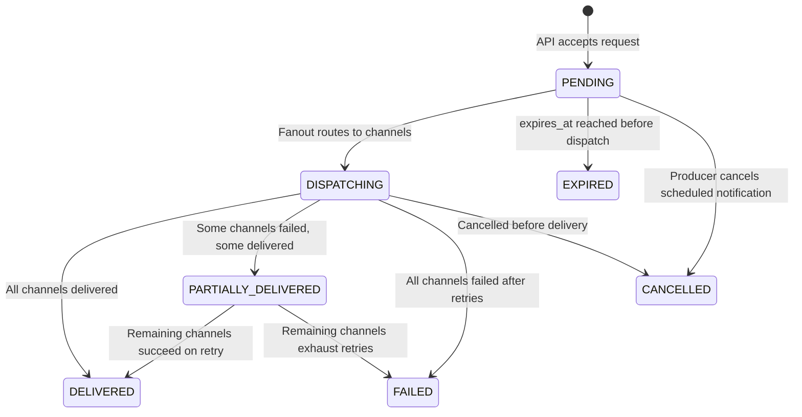
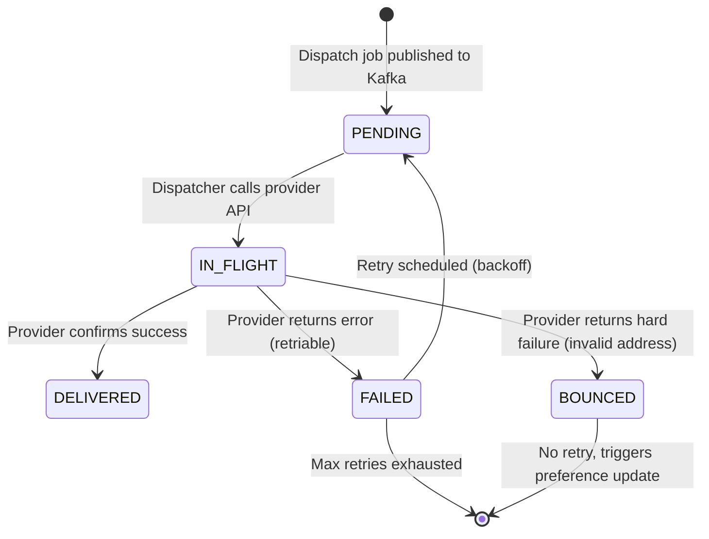
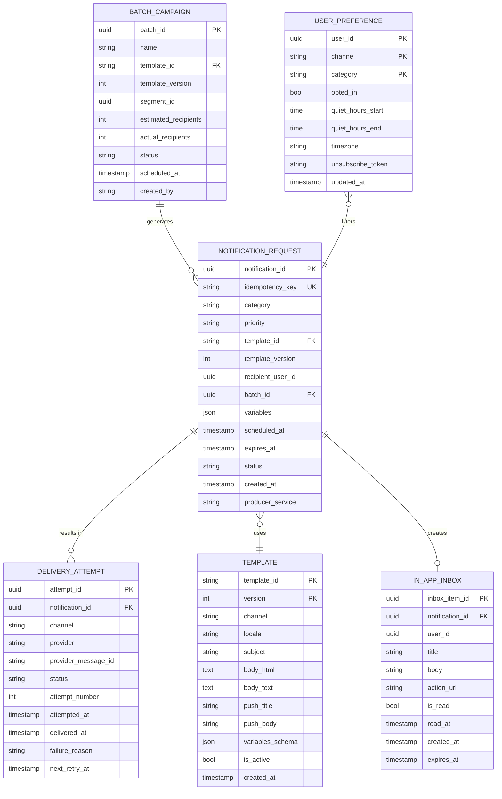

# 02 — Domain Modeling: Notification System

---

## Objective

Identify the core domain concepts, their relationships, lifecycle states, and business rules that govern the Notification System. This model drives database schema, API design, and event definitions.

---

## Core Domain Concepts

### 1. Notification Request

The central aggregate. Represents a producer's intent to notify a user.

**Attributes:**
| Field | Type | Description |
|-------|------|-------------|
| `notification_id` | UUID | Globally unique, assigned on ingest |
| `idempotency_key` | String | Producer-provided deduplication key |
| `category` | Enum | TRANSACTIONAL, MARKETING, PRODUCT_UPDATE, SYSTEM_ALERT |
| `priority` | Enum | CRITICAL, HIGH, NORMAL, LOW |
| `template_id` | String | Reference to template |
| `template_version` | Integer | Pinned template version at time of send |
| `recipient_user_id` | UUID | Target user (or null for batch) |
| `batch_id` | UUID | For campaign-level notifications |
| `variables` | JSON | Template variable values (e.g., `{first_name: "Alice"}`) |
| `scheduled_at` | Timestamp | Null = immediate; future = scheduled |
| `expires_at` | Timestamp | After this, notification is dropped if not yet dispatched |
| `status` | Enum | PENDING, DISPATCHING, DELIVERED, FAILED, CANCELLED, EXPIRED |
| `created_at` | Timestamp | When API accepted the request |
| `producer_service` | String | Which service submitted (for audit) |

**Business Rules:**
- A notification in DELIVERED state cannot transition back
- A notification in CANCELLED state cannot be dispatched
- CRITICAL priority notifications bypass quiet hours
- TRANSACTIONAL category ignores marketing opt-out preferences
- Variables are stored at creation time (not re-evaluated at delivery time)

---

### 2. Delivery Attempt

Records each actual delivery action to an external provider. There can be multiple per notification (one per channel, plus retries).

**Attributes:**
| Field | Type | Description |
|-------|------|-------------|
| `attempt_id` | UUID | Unique per attempt |
| `notification_id` | UUID | Parent notification |
| `channel` | Enum | EMAIL, SMS, PUSH, IN_APP |
| `provider` | String | sendgrid, twilio, fcm, apns, internal |
| `provider_message_id` | String | External reference (e.g., Twilio SID) |
| `status` | Enum | PENDING, IN_FLIGHT, DELIVERED, FAILED, BOUNCED |
| `attempt_number` | Integer | 1 for first attempt, increments on retry |
| `attempted_at` | Timestamp | When the dispatcher sent the request |
| `delivered_at` | Timestamp | When provider confirmed delivery (if available) |
| `failure_reason` | String | Provider error code + message on failure |
| `next_retry_at` | Timestamp | Scheduled retry time (if applicable) |

**Business Rules:**
- Max 5 retry attempts per channel per notification
- Retry delay: exponential backoff (1m, 5m, 15m, 60m, 240m)
- After max retries exhausted, attempt moves to FAILED and notification moves to FAILED
- BOUNCED status (e.g., invalid email) does NOT retry — triggers hard unsubscribe

---

### 3. Template

Defines the message structure for a notification category and channel.

**Attributes:**
| Field | Type | Description |
|-------|------|-------------|
| `template_id` | String | Human-readable ID (e.g., `order-confirmed-email`) |
| `version` | Integer | Incremented on each update |
| `channel` | Enum | EMAIL, SMS, PUSH, IN_APP |
| `locale` | String | `en-US`, `hi-IN`, etc. |
| `subject` | String | Email subject line (email only) |
| `body_html` | Text | HTML body (email only) |
| `body_text` | Text | Plain text body / SMS body |
| `push_title` | String | Push notification title |
| `push_body` | String | Push notification body |
| `variables_schema` | JSON | Expected variables with types and required flags |
| `is_active` | Boolean | Soft delete |
| `created_by` | String | Operator who created |
| `created_at` | Timestamp | |

**Business Rules:**
- Dispatchers pin to the `template_version` stored on the Notification Request — template updates do not affect in-flight notifications
- A template must have at least one active version before a notification can use it
- SMS templates must warn (or reject) if rendered body exceeds 160 characters
- Variables in template must match variables_schema — dispatch fails validation otherwise

---

### 4. User Notification Preference

Represents a user's choices about receiving notifications.

**Attributes:**
| Field | Type | Description |
|-------|------|-------------|
| `user_id` | UUID | |
| `channel` | Enum | EMAIL, SMS, PUSH, IN_APP |
| `category` | Enum | TRANSACTIONAL, MARKETING, PRODUCT_UPDATE, SYSTEM_ALERT |
| `opted_in` | Boolean | True = receive on this channel for this category |
| `quiet_hours_start` | Time | e.g., 22:00 (local time) |
| `quiet_hours_end` | Time | e.g., 08:00 (local time) |
| `timezone` | String | User timezone for quiet hours calculation |
| `updated_at` | Timestamp | Last preference change |
| `unsubscribe_token` | String | Used in one-click unsubscribe links |

**Business Rules:**
- TRANSACTIONAL + CRITICAL notifications are delivered regardless of opted_in (with narrow exceptions per regulation)
- Quiet hours apply to NORMAL and LOW priority only
- A hard bounce (provider-level) sets opted_in = false for EMAIL and cannot be re-enabled by the user alone
- The unsubscribe_token is single-use and invalidated after use

---

### 5. Batch Campaign

Represents a multi-user notification campaign.

**Attributes:**
| Field | Type | Description |
|-------|------|-------------|
| `batch_id` | UUID | |
| `name` | String | Human-readable campaign name |
| `template_id` | String | |
| `template_version` | Integer | Pinned at launch time |
| `segment_id` | UUID | Reference to user segment definition |
| `estimated_recipients` | Integer | Count at launch time |
| `actual_recipients` | Integer | Updated as fanout completes |
| `status` | Enum | DRAFT, SCHEDULED, RUNNING, COMPLETED, CANCELLED |
| `scheduled_at` | Timestamp | |
| `started_at` | Timestamp | |
| `completed_at` | Timestamp | |
| `created_by` | String | Operator |

---

### 6. In-App Notification (Inbox Item)

Represents a notification stored for display in the application UI.

**Attributes:**
| Field | Type | Description |
|-------|------|-------------|
| `inbox_item_id` | UUID | |
| `notification_id` | UUID | Parent notification |
| `user_id` | UUID | |
| `title` | String | Rendered title |
| `body` | String | Rendered body |
| `action_url` | String | Deep link on click |
| `is_read` | Boolean | |
| `read_at` | Timestamp | |
| `created_at` | Timestamp | |
| `expires_at` | Timestamp | Auto-clean after 30 days |

---

## Notification Lifecycle State Machine

---

## Delivery Attempt Lifecycle

---

## Domain Events

| Event Name | Trigger | Payload |
|-----------|---------|---------|
| `notification.requested` | API accepts notification | notification_id, category, priority, user_id, template_id, variables |
| `notification.batch.requested` | API accepts batch campaign | batch_id, segment_id, template_id |
| `email.dispatch` | Fanout routes to email channel | notification_id, user_id, email_address, template_id, version, variables |
| `sms.dispatch` | Fanout routes to SMS channel | notification_id, user_id, phone_number, template_id, version, variables |
| `push.dispatch` | Fanout routes to push channel | notification_id, user_id, device_tokens[], template_id, version, variables |
| `inapp.dispatch` | Fanout routes to in-app channel | notification_id, user_id, title, body, action_url |
| `delivery.result` | Dispatcher completes attempt | notification_id, attempt_id, channel, status, provider_ref, failure_reason |
| `notification.delivered` | All channels delivered | notification_id, delivered_at |
| `notification.failed` | All retries exhausted | notification_id, channels_failed[], last_failure_reason |
| `user.unsubscribed` | Hard bounce or user opt-out | user_id, channel, category, reason |
| `notification.cancelled` | Producer or scheduler cancels | notification_id, cancelled_by |

---

## Entity Relationship Overview

---

## Aggregate Boundaries

| Aggregate | Root | Invariants |
|-----------|------|-----------|
| **Notification** | NotificationRequest | Status transitions are ordered; idempotency_key is unique |
| **DeliveryAttempt** | DeliveryAttempt | Attempt number monotonically increases; max retry count enforced |
| **Template** | Template (per version) | Version is immutable once published |
| **Preference** | UserPreference | TRANSACTIONAL/CRITICAL cannot be fully disabled |
| **Campaign** | BatchCampaign | Template version pinned at RUNNING state entry |

---

## Design Decisions

**Why separate DeliveryAttempt from NotificationRequest?**
A notification has one logical request but potentially many physical delivery actions (retries, multi-channel). Mixing them creates a complex state machine in a single entity. Separate aggregates allow clean retry logic without corrupting the original notification record.

**Why store template_version on the request at creation time?**
If a template is updated after a notification is created but before it's dispatched (scheduled notification), the delivered message should use the version the producer intended, not a silently updated version. Version pinning prevents silent content changes.

**Why is variables stored on the notification record (not computed at delivery)?**
For scheduled notifications, the variable values (e.g., OTP, order total) are valid at creation time but may not be at delivery time. Storing them at ingest ensures the producer's values are used exactly as intended.

---

## Interview Discussion Points

- Why is idempotency_key on the NotificationRequest, not on DeliveryAttempt?
- What happens when a user deletes their account mid-delivery — how do you cancel in-flight notifications?
- How do you model a notification that should be delivered via "best available channel" (PUSH if device exists, else SMS, else email)?
- What are the tradeoffs of storing PII (phone number, email) in the delivery attempt vs. resolving it fresh at dispatch time?
- How does the domain model evolve when you add a new channel (e.g., WhatsApp)?
