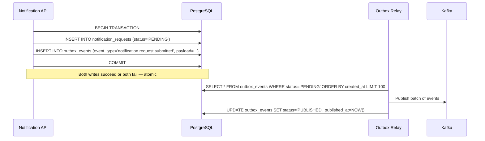
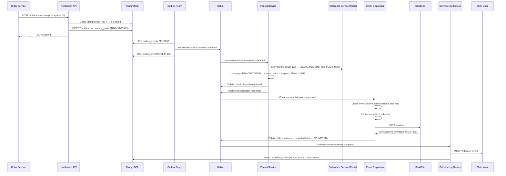
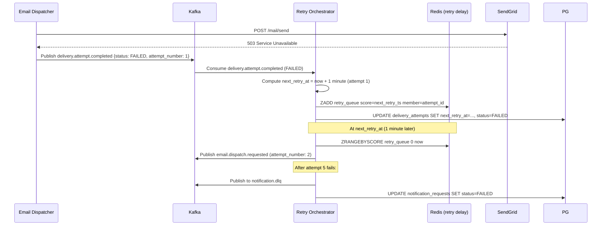
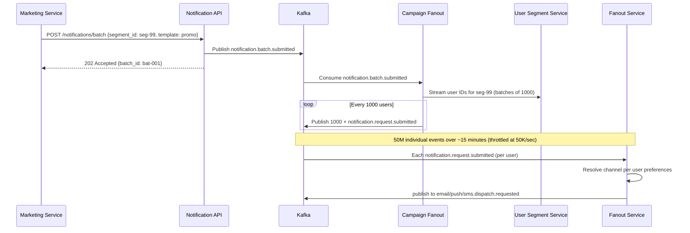
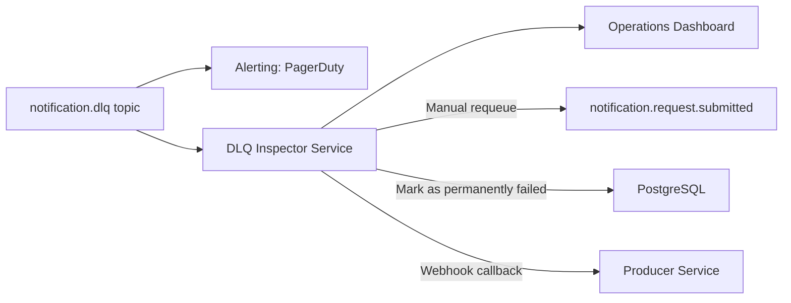

# 06 — Event Flow: Notification System

---

## Objective

Define all Kafka topics, event schemas, producer/consumer relationships, message flow sequences, and the Outbox pattern implementation. This is the backbone of the async delivery architecture.

---

## Kafka Topic Design

### Topic Naming Convention

```
{domain}.{entity}.{action}
```

Examples: `notification.request.submitted`, `email.dispatch.requested`, `delivery.attempt.completed`

### Full Topic Registry

| Topic | Partitions | Retention | Producers | Consumers | Purpose |
|-------|-----------|-----------|-----------|-----------|---------|
| `notification.request.submitted` | 30 | 7 days | Notification API (via Outbox) | Fanout Service | Single notification intake |
| `notification.batch.submitted` | 6 | 7 days | Notification API | Campaign Fanout | Batch/campaign intake |
| `email.dispatch.requested` | 60 | 3 days | Fanout Service | Email Dispatcher | Per-user email delivery jobs |
| `sms.dispatch.requested` | 30 | 3 days | Fanout Service | SMS Dispatcher | Per-user SMS delivery jobs |
| `push.dispatch.requested` | 60 | 3 days | Fanout Service | Push Dispatcher | Per-user push jobs |
| `inapp.dispatch.requested` | 20 | 3 days | Fanout Service | In-App Dispatcher | Per-user in-app jobs |
| `delivery.attempt.completed` | 60 | 7 days | All dispatchers | Delivery Log, Retry Orchestrator, Webhook Service | Delivery outcome events |
| `notification.retry.email` | 30 | 7 days | Retry Orchestrator | Email Dispatcher | Delayed email retries |
| `notification.retry.sms` | 20 | 7 days | Retry Orchestrator | SMS Dispatcher | Delayed SMS retries |
| `notification.retry.push` | 30 | 7 days | Retry Orchestrator | Push Dispatcher | Delayed push retries |
| `notification.dlq` | 10 | 30 days | Retry Orchestrators | Operations / Alert System | Exhausted retries |
| `user.preference.updated` | 10 | 3 days | Preference Service | Fanout Service (cache invalidation) | Preference change events |

### Partition Count Rationale

- `email.dispatch.requested`: 60 partitions because email has the highest volume (27M/day) and is rate-limited by providers. More partitions = more parallel consumers without rebalancing.
- `notification.request.submitted`: 30 partitions = 30 parallel Fanout workers. Partition key = `user_id` ensures ordering per user.
- `notification.dlq`: 10 partitions — DLQ has very low volume (only exhausted retries); ops team processes manually.

---

## Partition Key Strategy

| Topic | Partition Key | Rationale |
|-------|-------------|-----------|
| `notification.request.submitted` | `recipient_user_id` | All notifications for a user go to the same partition → ordering preserved per user |
| `email.dispatch.requested` | `notification_id` | Even distribution; email dispatcher doesn't need user-level ordering |
| `sms.dispatch.requested` | `notification_id` | Same as email |
| `push.dispatch.requested` | `notification_id` | Same — device tokens fan-out happens inside dispatcher |
| `delivery.attempt.completed` | `notification_id` | Groups all attempts for a notification on one partition |

---

## Event Schemas

### `notification.request.submitted`

```json
{
  "event_id": "evt-uuid-001",
  "event_type": "notification.request.submitted",
  "schema_version": "1.0",
  "occurred_at": "2026-05-17T08:00:00Z",
  "payload": {
    "notification_id": "ntf-550e8400",
    "idempotency_key": "order-service-ORD789-confirmed",
    "category": "TRANSACTIONAL",
    "priority": "HIGH",
    "recipient_user_id": "usr-123",
    "template_id": "order-confirmed",
    "template_version": 3,
    "variables": { "first_name": "Alice", "order_id": "ORD-789" },
    "channels_override": null,
    "expires_at": "2026-05-18T08:00:00Z",
    "producer_service": "order-service",
    "producer_trace_id": "trace-abc"
  }
}
```

### `email.dispatch.requested`

```json
{
  "event_id": "evt-uuid-002",
  "event_type": "email.dispatch.requested",
  "schema_version": "1.0",
  "occurred_at": "2026-05-17T08:00:01Z",
  "payload": {
    "notification_id": "ntf-550e8400",
    "attempt_id": "att-uuid-001",
    "recipient_user_id": "usr-123",
    "recipient_email": "alice@example.com",
    "template_id": "order-confirmed",
    "template_version": 3,
    "variables": { "first_name": "Alice", "order_id": "ORD-789" },
    "priority": "HIGH",
    "attempt_number": 1,
    "expires_at": "2026-05-18T08:00:00Z"
  }
}
```

### `delivery.attempt.completed`

```json
{
  "event_id": "evt-uuid-003",
  "event_type": "delivery.attempt.completed",
  "schema_version": "1.0",
  "occurred_at": "2026-05-17T08:00:05Z",
  "payload": {
    "notification_id": "ntf-550e8400",
    "attempt_id": "att-uuid-001",
    "channel": "EMAIL",
    "provider": "sendgrid",
    "provider_message_id": "SG-msg-abc123",
    "status": "DELIVERED",
    "attempt_number": 1,
    "failure_reason": null,
    "failure_code": null,
    "is_final": true
  }
}
```

---

## Outbox Pattern Implementation

The Transactional Outbox pattern guarantees that a Kafka message is published if and only if the corresponding database write succeeds. Without it, a crash between DB write and Kafka publish creates a missed notification.

### Write Path with Outbox



### Outbox Relay Design
- Relay is a separate background thread or microservice
- Polling interval: 100ms (configurable)
- Batch size: 100 events per poll cycle
- On Kafka publish failure: leave events as PENDING, retry on next poll
- At-least-once delivery: if relay crashes after Kafka publish but before DB update, event is re-published → consumers must be idempotent
- Deduplication: consumers use `event_id` to detect and discard duplicate events

---

## Complete Notification Flow: Transactional



---

## Retry Flow



### Retry Backoff Schedule

| Attempt # | Delay Before Retry | Cumulative Time |
|-----------|-------------------|----------------|
| 1 (initial) | — | 0 |
| 2 | 1 minute | T+1m |
| 3 | 5 minutes | T+6m |
| 4 | 15 minutes | T+21m |
| 5 | 60 minutes | T+81m |
| 6 | 4 hours | T+5h 21m |
| DLQ | — | After 6 attempts |

---

## Fan-Out Flow: Batch Campaign



**Throttle Control:** Campaign Fanout respects the `throttle_rps` field from the campaign. It uses a token bucket (Redis-backed) to pace its publish rate. This prevents a 50M-user campaign from saturating Kafka or downstream dispatchers in seconds.

---

## Dead Letter Queue (DLQ) Processing



### DLQ Alert Rules
- DLQ depth > 1000 messages: PagerDuty alert (P2)
- DLQ depth > 10,000 messages: PagerDuty alert (P1) — likely provider outage
- Any CRITICAL priority notification in DLQ: immediate P1 alert

---

## Consumer Group Design

| Consumer Group | Consumers | Scale | Notes |
|---------------|----------|-------|-------|
| `fanout-service-cg` | 30 instances | 1 per partition | Scales with `notification.request.submitted` partitions |
| `email-dispatcher-cg` | 60 instances | 1 per partition | Large because email volume is highest |
| `sms-dispatcher-cg` | 30 instances | 1 per partition | SMS volume lower; provider rate-limited |
| `push-dispatcher-cg` | 60 instances | 1 per partition | High volume, fast provider (FCM batch API) |
| `inapp-dispatcher-cg` | 20 instances | 1 per partition | Write to DB, no external provider calls |
| `delivery-log-cg` | 60 instances | Match delivery.attempt partitions | High throughput writes to ClickHouse |
| `retry-orchestrator-cg` | 20 instances | Handles all channels | Low volume, just scheduling retries |

---

## Event Schema Versioning

- All events include `schema_version` field
- Consumers use envelope deserialization: read version → choose appropriate schema
- Backward-compatible additions (new optional fields): same `schema_version`
- Breaking changes: increment `schema_version` + deploy consumers before producers
- Schema Registry (Confluent or Glue Schema Registry) enforces compatibility rules at publish time

---

## Interview Discussion Points

- Why use the Outbox pattern instead of dual writes (DB + Kafka in the same method)?
- What happens if the Outbox relay crashes after publishing to Kafka but before marking the event as PUBLISHED?
- How does partition key = `user_id` on `notification.request.submitted` prevent per-user ordering issues in a multi-channel fan-out scenario?
- When does the retry delay mechanism (Redis sorted set) outperform Kafka's native retry delay topics?
- What is the risk of a campaign fanout producing 50M Kafka messages, and how does throttle_rps mitigate it?
- How do you ensure a consumer is idempotent when Kafka delivers the same event twice after a rebalance?
