# 13 — Deployment Architecture: Notification System

---

## Objective

Define the complete deployment topology for the Notification System: containerization, Kubernetes setup, CI/CD pipeline, environment separation, infrastructure-as-code strategy, and multi-region considerations.

---

## Deployment Philosophy

The Notification System is a **platform service** — it is critical infrastructure relied upon by every other service in the organization. Its deployment strategy must:
- Allow individual services (dispatchers) to be updated independently
- Never fully interrupt notification delivery during deployments
- Support safe rollout with automatic rollback
- Provide full environment parity from local dev to production

---

## Service Inventory for Deployment

| Service | Type | Replicas (Prod) | Scaling |
|---------|------|----------------|---------|
| notification-api | Deployment | 10–50 pods | HPA (CPU) |
| fanout-service | Deployment | 30 pods (= Kafka partitions) | KEDA (Kafka lag) |
| campaign-fanout | Deployment | 6–30 pods | KEDA (Kafka lag) |
| email-dispatcher | Deployment | 30–60 pods | KEDA (Kafka lag) |
| sms-dispatcher | Deployment | 15–30 pods | KEDA (Kafka lag) |
| push-dispatcher | Deployment | 30–60 pods | KEDA (Kafka lag) |
| inapp-dispatcher | Deployment | 10–20 pods | KEDA (Kafka lag) |
| template-service | Deployment | 3–5 pods | HPA (CPU) |
| preference-service | Deployment | 5–10 pods | HPA (CPU) |
| scheduler-service | Deployment | 2 pods (leader election) | StatefulSet |
| delivery-log-service | Deployment | 20–60 pods | KEDA (Kafka lag) |
| outbox-relay | Deployment | 3–5 pods | HPA (CPU) |
| retry-orchestrator | Deployment | 5–10 pods | KEDA (Kafka lag) |

---

## Kubernetes Architecture

### Namespace Structure

```
namespaces:
  notification-core     → API, Fanout, Scheduler, Outbox Relay
  notification-email    → Email Dispatcher + circuit breaker config
  notification-sms      → SMS Dispatcher
  notification-push     → Push Dispatcher
  notification-inapp    → In-App Dispatcher
  notification-platform → Template, Preference, Delivery Log
  notification-infra    → Kafka, Redis, PostgreSQL (or cloud-managed)
```

### Why Separate Namespaces?
- Each dispatcher team can own their namespace independently
- Network policies enforce: email-dispatcher cannot talk to sms-dispatcher DB
- Resource quotas per namespace prevent one dispatcher from starving others
- RBAC: email team has admin rights only on `notification-email` namespace

### Pod Configuration (Email Dispatcher Example)

```yaml
resources:
  requests:
    cpu: 500m
    memory: 512Mi
  limits:
    cpu: 2000m
    memory: 2Gi

livenessProbe:
  httpGet:
    path: /actuator/health/liveness
  initialDelaySeconds: 30
  periodSeconds: 10

readinessProbe:
  httpGet:
    path: /actuator/health/readiness
  initialDelaySeconds: 15
  periodSeconds: 5

terminationGracePeriodSeconds: 60   # Allow in-flight provider calls to complete
```

**Why 60-second termination grace period?**
An email dispatcher mid-provider-call should not be killed immediately on pod shutdown. 60 seconds allows the HTTP call to SendGrid (< 5 seconds typical) to complete, the delivery result to be published to Kafka, and the Kafka offset to be committed before shutdown.

### KEDA ScaledObject (Email Dispatcher)

```yaml
apiVersion: keda.sh/v1alpha1
kind: ScaledObject
metadata:
  name: email-dispatcher-scaler
spec:
  scaleTargetRef:
    name: email-dispatcher
  minReplicaCount: 5
  maxReplicaCount: 60
  triggers:
    - type: kafka
      metadata:
        bootstrapServers: kafka.notification-infra:9092
        consumerGroup: email-dispatch-cg
        topic: email.dispatch.requested
        lagThreshold: "500"   # Scale up when lag > 500 per replica
        activationLagThreshold: "100"
```

---

## CI/CD Pipeline

### Pipeline Stages

```mermaid
graph LR
    PR[Pull Request] --> Build[Build + Unit Tests]
    Build --> StaticAnalysis[Sonar + Security Scan]
    StaticAnalysis --> ContainerBuild[Docker Build]
    ContainerBuild --> IntegrationTest[Integration Tests\nTestcontainers]
    IntegrationTest --> PushRegistry[Push to ECR]
    PushRegistry --> DeployStaging[Deploy to Staging]
    DeployStaging --> SmokeTest[Smoke Tests + Load Test]
    SmokeTest --> Canary[Canary Deploy\n5% prod traffic]
    Canary --> Monitor[Monitor SLOs\n30 min]
    Monitor --> FullDeploy[Full Production Deploy]
```



### Integration Test Strategy (Testcontainers)

Each service's integration tests spin up real dependencies:
- Kafka (via `confluentinc/cp-kafka` container)
- PostgreSQL (via `postgres:15` container)
- Redis (via `redis:7` container)
- Mock HTTP server for provider APIs (WireMock)

Tests cover:
- Outbox pattern: DB write + Kafka publish atomicity
- Idempotency: duplicate submission returns 409 with same response
- Preference enforcement: opted-out users don't receive dispatch jobs
- Retry flow: provider failure → retry topic → re-dispatch after delay

### Canary Deployment Strategy

```
Traffic split during canary:
  New version (canary): 5% of pods
  Old version (stable): 95% of pods

Canary success criteria (automatic promotion):
  - Error rate < 0.1% for 30 consecutive minutes
  - p99 latency within 10% of baseline
  - No P1/P2 alerts fired

Automatic rollback if:
  - Error rate > 0.5%
  - DLQ depth grows > 500 during canary window
  - Any circuit breaker opens during canary window
```

### Blue-Green for Database Schema Changes

When a database migration changes an existing schema:
1. Apply migration as **backward-compatible** (add columns, never drop/rename in same deploy)
2. Deploy new version alongside old (blue-green at app layer)
3. Wait for all old pods to drain
4. Drop old columns in a follow-up migration in the next sprint

**Example:**
- Sprint 1: Add `new_column VARCHAR(100) DEFAULT NULL` → backward compatible
- Sprint 2: All pods on new version → old column can be dropped

---

## Environment Strategy

| Environment | Purpose | Scale | Key Differences |
|-------------|---------|-------|----------------|
| Local Dev | Developer testing | Single pod per service | Docker Compose, H2/embedded Kafka |
| CI | Automated test runs | Testcontainers | No external providers |
| Staging | Pre-prod validation | 10% of prod scale | Real Kafka/Redis/PostgreSQL, mock providers |
| Production | Live traffic | Full scale | Real providers, full KEDA |
| DR (Disaster Recovery) | Failover target | Warm standby | Active-passive, same infra as prod |

### Staging Parity

Staging must mirror prod in:
- Kafka topic partitions (same count)
- PostgreSQL partition scheme (same monthly partitions)
- Redis cluster size (can be smaller but same cluster mode)
- All environment variables except provider credentials (use sandbox credentials)

**What differs:**
- Provider credentials → staging accounts on SendGrid sandbox, Twilio test credentials
- Scale: staging runs at 10% of pod counts
- Retention: 3-day Kafka retention vs 7-day in prod

---

## Infrastructure as Code

All infrastructure defined in:
- **Terraform**: Cloud resources (EKS cluster, RDS PostgreSQL, ElastiCache Redis, MSK Kafka, ECR)
- **Helm Charts**: Kubernetes deployments, services, KEDA ScaledObjects
- **Argo CD**: GitOps continuous delivery (Helm releases synced from Git)

### Helm Chart Structure

```
notification-system/
  Chart.yaml
  values.yaml                  # defaults
  values-staging.yaml          # staging overrides
  values-production.yaml       # production overrides
  templates/
    deployment.yaml
    service.yaml
    configmap.yaml
    hpa.yaml (or keda-scaledobject.yaml)
    networkpolicy.yaml
    poddisruptionbudget.yaml
```

### PodDisruptionBudget (Critical)

For each dispatcher:
```yaml
apiVersion: policy/v1
kind: PodDisruptionBudget
metadata:
  name: email-dispatcher-pdb
spec:
  minAvailable: "50%"   # At least 50% of pods must be available during voluntary disruptions
  selector:
    matchLabels:
      app: email-dispatcher
```

Without PDB: a `kubectl drain` during node maintenance could evict all email dispatcher pods simultaneously → email delivery halts.

---

## Multi-Region Architecture

### Active-Passive (Phase 1)

```
Primary region: ap-south-1 (Mumbai)
DR region:      ap-southeast-1 (Singapore)

Kafka MirrorMaker 2:
  Replicates all Kafka topics from primary to DR
  Lag: < 10 seconds

PostgreSQL:
  RDS Multi-AZ within primary region
  Cross-region read replica in DR (used for passive reads)
  Promotion to primary requires manual trigger (not automatic — risk of split-brain)

Redis:
  Active only in primary region
  On failover: DR starts with cold cache (acceptable — DB is source of truth)

DNS Failover:
  Route 53 health checks on primary ALB
  Manual promotion: CNAME update in 2–5 minutes
```

### Active-Active (Phase 2, at Hyperscale)

```
Regions: ap-south-1, us-east-1, eu-west-1
Routing: GeoDNS routes producers to nearest region
Each region: full stack (API, dispatchers, Kafka, PostgreSQL, Redis)

Challenge: Idempotency key deduplication across regions
Solution: User is always routed to the same region (consistent hashing by user_id in GeoDNS)
          Cross-region idempotency not needed — each user's notifications are region-local
```

---

## Local Development Setup

```yaml
# docker-compose.yml (abbreviated)
services:
  notification-api:
    image: notification-api:dev
    environment:
      SPRING_DATASOURCE_URL: jdbc:postgresql://postgres:5432/notif
      SPRING_KAFKA_BOOTSTRAP_SERVERS: kafka:9092
      REDIS_HOST: redis

  postgres:
    image: postgres:15
    environment:
      POSTGRES_DB: notif
      POSTGRES_PASSWORD: dev

  kafka:
    image: confluentinc/cp-kafka:7.5
    environment:
      KAFKA_AUTO_CREATE_TOPICS_ENABLE: "true"

  redis:
    image: redis:7

  wiremock:
    image: wiremock/wiremock:3.0
    # Mocks SendGrid, Twilio, FCM for local dev
```

Developer flow:
1. `docker-compose up` → all infra in 30 seconds
2. Start individual Spring Boot service in IDE (connects to Docker infra)
3. WireMock simulates provider responses (configurable: success, 503, 429)

---

## Interview Discussion Points

- Why use KEDA for dispatcher autoscaling instead of standard Kubernetes HPA?
- Why does the Email Dispatcher need a 60-second `terminationGracePeriodSeconds`?
- What is PodDisruptionBudget and why is it critical for dispatcher services?
- How does GitOps with Argo CD improve deployment safety for a multi-service system like this?
- What happens during canary deployment if the canary instances start producing Kafka messages with a new schema version?
- Why is active-active multi-region easier for a notification system when you use GeoDNS user-affinity routing?
