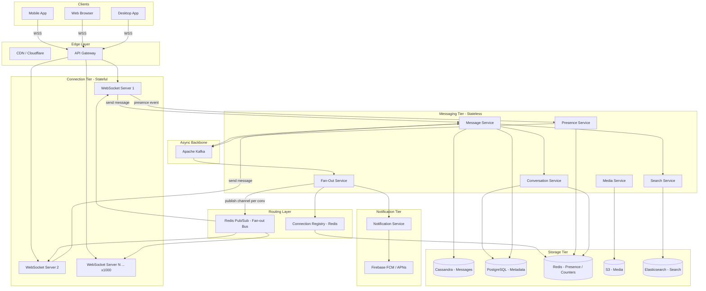
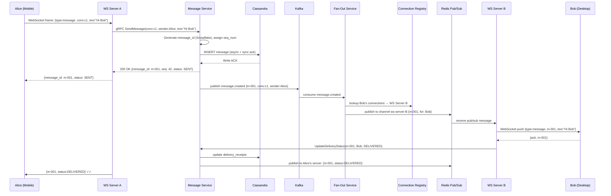
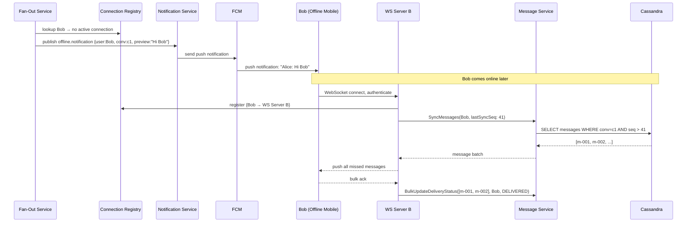

# 01 — High-Level Architecture: Chat Application

---

## Objective

Select the correct architectural style for a real-time messaging platform, justify every major design decision, and provide full component diagrams, request flows, and an evolution path from MVP to FAANG scale.

---

## Architecture Decision: Event-Driven Microservices with WebSocket Gateway Layer

### Why NOT a Monolith?

A chat application has fundamentally different scaling axes that cannot share a single process:

| Component | Scaling Driver |
|-----------|---------------|
| WebSocket connection servers | Connection count (memory-bound) |
| Message storage | Write throughput (I/O-bound) |
| Presence service | Read/write frequency (RAM-bound) |
| Fan-out service | CPU-bound (group message expansion) |
| Push notification | External provider rate limits |
| Media handling | Bandwidth-bound |

A monolith would require you to scale all components together when only one is the bottleneck. At 50M concurrent connections, scaling the entire application just to handle connection state is prohibitively expensive.

### Architecture Style: Gateway + Event-Driven Service Mesh

The architecture splits into three tiers:

1. **Connection tier** — Stateful WebSocket gateway servers that hold live connections
2. **Messaging tier** — Stateless services that process, route, and persist messages
3. **Storage tier** — Purpose-built stores for each data access pattern

Services communicate via **Apache Kafka** for durable, ordered message passing. The connection tier uses **Redis Pub/Sub** for sub-millisecond fan-out to live connections — Kafka is too slow for real-time delivery (10–50ms) but provides the durability guarantee.

### Why NOT pure Kafka for real-time delivery?

Kafka consumer poll loops introduce 10–50ms of latency by default. For a chat application where p99 < 500ms end-to-end, adding 50ms just for Kafka consume is unacceptable on the hot path. The solution is a **two-tier fan-out**:

- **Kafka**: durable, ordered, replayed for offline users / history
- **Redis Pub/Sub**: ephemeral, sub-ms, for live connection routing

### When to Use a Simpler Architecture

| Scale | Approach |
|-------|---------|
| < 10K concurrent users | Modular monolith, PostgreSQL, Redis Pub/Sub only |
| 10K–1M concurrent users | Split connection servers from persistence; add Kafka |
| > 1M concurrent users | Full microservices, Cassandra, multi-region, dedicated fan-out |

---

## System Components

| Service | Responsibility |
|---------|---------------|
| **API Gateway** | TLS termination, auth token validation, route HTTP + WebSocket upgrade |
| **WebSocket Gateway (Chat Server)** | Maintain persistent WebSocket connections, route inbound messages, push outbound messages |
| **Message Service** | Validate, assign IDs, persist messages to Cassandra, publish to Kafka |
| **Fan-Out Service** | Expand group messages to recipient list, publish per-recipient delivery jobs |
| **Presence Service** | Track online/offline/idle state, typing indicators, last-seen timestamps |
| **Notification Service** | Send push notifications to offline users |
| **Conversation Service** | Manage conversation metadata (participants, name, settings, unread counts) |
| **Media Service** | Issue pre-signed S3 upload URLs, generate thumbnails, virus scan |
| **Search Service** | Elasticsearch-backed full-text message search |
| **Connection Registry** | Redis-based mapping of userId → WebSocket server ID for routing |

---

## High-Level Architecture Diagram



---

## Component Deep Dive

### WebSocket Gateway (Chat Server)

The most critical and hardest-to-scale component. Each server:

- Maintains N persistent WebSocket connections (target: 50,000 per server)
- Receives messages from clients → forwards to Message Service via gRPC
- Subscribes to Redis Pub/Sub channels for each conversation its connected users participate in
- Pushes incoming Pub/Sub messages to the appropriate WebSocket connections
- Sends heartbeat ping every 30 seconds; closes connections that miss 2 heartbeats
- On disconnect: publishes `user.disconnected` event to update presence

**Key constraint**: Chat servers are stateful. A user's messages can only be pushed to the specific server holding their connection. This is solved by the Connection Registry.

### Connection Registry (Redis)

A Redis hash map:
```
user:{userId}:connections → { deviceId1: serverId1, deviceId2: serverId2 }
server:{serverId}:users  → Set of userIds on this server
```

When Fan-Out needs to deliver message to userId:
1. Look up `user:{userId}:connections` → get list of (serverId, deviceId) pairs
2. For each serverId → publish to `ws-server:{serverId}` Redis channel
3. WebSocket server receives → finds the specific connection → pushes to WebSocket

If serverId resolves to a dead server → message goes to Notification Service instead.

### Message Service

- Validates message payload (size, content policy)
- Assigns `message_id`: **Snowflake ID** (contains timestamp + server ID + sequence)
- Assigns `sequence_num`: monotonically increasing per conversation (from Redis INCR)
- Persists to Cassandra (synchronous write for durability)
- Publishes `message.created` to Kafka (after Cassandra write succeeds)
- Returns `202 Accepted` to WebSocket server once Cassandra write completes

**Ordering guarantee**: The `sequence_num` per conversation is the ordering signal. Clients display messages sorted by `sequence_num`, not wall clock time (which has clock skew issues in distributed systems).

### Fan-Out Service

Kafka consumer for `message.created` events.

For 1:1 messages:
- Look up recipient → Connection Registry → Redis Pub/Sub direct delivery

For group messages (up to 1,000 members):
- Load conversation member list from Conversation Service cache
- For each member: check Connection Registry
  - If online → Redis Pub/Sub to their server
  - If offline → publish to `notification.offline.{userId}` Kafka topic

**Critical optimization**: Fan-out for large groups is async. The sender's delivery acknowledgment is not gated on all 1,000 members receiving the message. The sender gets `SENT` confirmation immediately; `DELIVERED` comes back asynchronously as members receive it.

### Presence Service

- Receives heartbeat signals from WebSocket servers (every 30 seconds per connected user)
- Maintains Redis key: `presence:{userId}` with TTL of 90 seconds
  - If key exists and is refreshed → user is ONLINE
  - If key expires without refresh → user goes OFFLINE automatically
- Typing indicator: ephemeral Redis key `typing:{conv_id}:{userId}` with 5-second TTL
  - No explicit "stopped typing" signal needed — key just expires
- Last-seen: updated in PostgreSQL only on disconnect (not on every heartbeat)
- Presence changes broadcast to conversation members via Redis Pub/Sub

---

## Message Delivery Flow (1:1, Both Online)



---

## Offline Message Delivery Flow



---

## Technology Stack Justification

| Component | Choice | Why |
|-----------|--------|-----|
| Application | Spring Boot 3.x + Java 21 (Virtual Threads) | Virtual threads make 50K concurrent connections per JVM feasible without reactive programming complexity |
| WebSocket | Spring WebSocket + STOMP or raw WS | STOMP adds subscription abstraction; raw WS for lower overhead |
| Message backbone | Apache Kafka | Durable, ordered, replayable — critical for offline sync and audit |
| Real-time fan-out | Redis Pub/Sub | Sub-millisecond latency, ephemeral (not persisted), scales to thousands of channels |
| Connection registry | Redis | Sub-ms lookup, TTL-based automatic cleanup on server death |
| Message store | Apache Cassandra | Time-series writes, partition by conv_id, linear write scale, no single point of contention |
| Metadata store | PostgreSQL | Conversations, users, members — relational, transactional, low write volume |
| Presence | Redis with TTL | Presence is ephemeral; Redis TTL gives automatic offline detection without explicit disconnects |
| Search | Elasticsearch | Full-text search, tokenization, relevance scoring on message content |
| Media | S3 + CloudFront CDN | Direct client uploads (no chat server bandwidth), global CDN distribution |
| Orchestration | Kubernetes | Independent scaling of WS servers, Fan-Out, Message Service |

---

## Tradeoffs Summary

| Decision | Tradeoff |
|----------|---------|
| Redis Pub/Sub for delivery (not Kafka) | Sub-ms delivery vs. no persistence — messages on Kafka are the durable copy |
| Cassandra for messages | Linear write scale vs. no joins, no strong consistency, eventual reads |
| Snowflake IDs for message ordering | Global uniqueness + approximate ordering vs. complexity of ID generator fleet |
| Sequence numbers per conversation | Strong ordering within conv vs. need for distributed counter (Redis INCR) |
| Fan-out on write for groups | O(members) fan-out per message vs. O(1) write — pull-on-read doesn't work for real-time |
| Stateful WebSocket servers | Enables direct push delivery vs. makes scaling harder (sticky sessions) |

---

## Alternatives Considered

### XMPP (Extensible Messaging and Presence Protocol)
- Mature protocol designed exactly for chat
- Rejected: XML overhead, complex federation, poor mobile battery behavior, limited control over internal implementation
- WhatsApp originally used XMPP — they replaced it with a custom binary protocol

### Long Polling instead of WebSockets
- Works through firewalls, simpler server implementation
- Rejected: 1–3 second polling interval introduces unacceptable latency; each poll creates a new HTTP request (connection overhead at scale)

### Server-Sent Events (SSE)
- Simpler than WebSockets, one-directional
- Rejected: Chat requires bidirectional — SSE handles server→client push but client→server still needs HTTP requests

### Single-region Architecture
- Much simpler operationally
- Rejected: Unacceptable latency for global users. A user in Mumbai sending a message that routes through US-East adds 200ms minimum

### Redis Streams instead of Kafka for message durability
- Redis Streams provide consumer groups and persistence
- Rejected: At 4 TB/day message throughput, Redis Streams hit memory limits. Kafka's disk-based storage scales better. Redis Streams suitable for smaller deployments.
