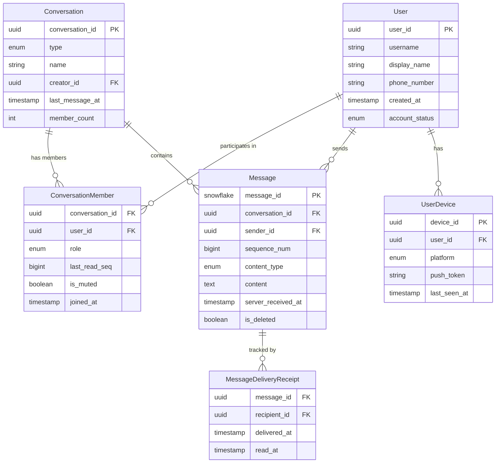

# 02 — Domain Modeling: Chat Application

---

## Objective

Define the core domain entities, their relationships, aggregates, value objects, and invariants for the chat platform. This drives the bounded context decomposition, API design, and storage schema.

---

## Core Domain Entities

### User
Represents an authenticated identity on the platform.

| Field | Type | Notes |
|-------|------|-------|
| user_id | UUID / Snowflake | Globally unique, immutable |
| username | String | Unique, case-insensitive handle |
| display_name | String | Shown in UI |
| phone_number | String (E.164) | Optional, used for contacts |
| email | String | Login credential |
| profile_picture_url | String | CDN URL |
| created_at | Timestamp | |
| status_message | String | "At the gym", "Busy", etc. |
| account_status | Enum | ACTIVE, SUSPENDED, DELETED |

**Invariants**:
- username must be unique across the platform
- deleted accounts retain user_id reference (soft delete) to preserve message history attribution

---

### Conversation
The aggregate root for all messaging activity. A conversation is the container for messages between participants.

| Field | Type | Notes |
|-------|------|-------|
| conversation_id | UUID | Globally unique |
| type | Enum | DIRECT (1:1), GROUP, CHANNEL |
| name | String | Null for DIRECT; required for GROUP/CHANNEL |
| creator_id | UUID | User who created the conversation |
| created_at | Timestamp | |
| last_message_id | UUID | Pointer to latest message |
| last_message_at | Timestamp | For sorting conversation list |
| member_count | Int | Denormalized for quick display |
| is_archived | Boolean | Soft-archive by user |
| settings | JSON | Per-conversation config (mute, notifications) |

**Invariants**:
- DIRECT conversations can have exactly 2 participants
- GROUP conversations have 2–1,000 members
- CHANNEL type can have up to 10,000 members (broadcast model)
- `last_message_at` must always reflect the most recent non-deleted message

---

### Message
The most written, most read entity in the system.

| Field | Type | Notes |
|-------|------|-------|
| message_id | Snowflake ID | Globally unique, encodes timestamp |
| conversation_id | UUID | Foreign key (partition key in Cassandra) |
| sender_id | UUID | Who sent it |
| sequence_num | BigInt | Monotonic per conversation |
| content_type | Enum | TEXT, IMAGE, VIDEO, AUDIO, FILE, LINK, STICKER |
| content | String | Plain text, or JSON for rich media |
| media_url | String | CDN URL for media messages |
| media_metadata | JSON | Width/height, file size, MIME type |
| reply_to_message_id | UUID | Nullable — for threaded replies |
| sent_at | Timestamp | Client-side send time |
| server_received_at | Timestamp | Server-authoritative timestamp |
| status | Enum | SENDING, SENT, DELIVERED, READ, FAILED |
| is_deleted | Boolean | Soft delete |
| is_edited | Boolean | True if content was modified post-send |
| edited_at | Timestamp | Last edit timestamp |

**Invariants**:
- message_id and sequence_num are immutable once assigned
- Soft-deleted messages retain their record (replaced with "This message was deleted") to preserve threading and sequence continuity
- Only the sender can delete a message for-everyone within a 24-hour window
- sequence_num is assigned by the server, never trusted from the client

---

### MessageDeliveryReceipt
Tracks the delivery and read state per message per recipient. This is the entity behind the "double tick / blue tick" feature.

| Field | Type | Notes |
|-------|------|-------|
| message_id | UUID | |
| recipient_id | UUID | |
| conversation_id | UUID | For efficient lookup |
| delivered_at | Timestamp | When device received the message |
| read_at | Timestamp | When user opened/viewed the message |

**Design note**: For group messages with 1,000 members, this creates 1,000 receipt records per message. At 4 billion messages/day with 30% group, that's 1.2 billion receipts/day. This requires a separate, append-only storage strategy. In practice, WhatsApp only shows a summary (e.g., "500/1,000 delivered") for large groups.

---

### ConversationMember
Tracks participation in a conversation with per-member settings.

| Field | Type | Notes |
|-------|------|-------|
| conversation_id | UUID | |
| user_id | UUID | |
| role | Enum | OWNER, ADMIN, MEMBER |
| joined_at | Timestamp | |
| last_read_seq | BigInt | Last sequence_num the user has read |
| is_muted | Boolean | Suppress push notifications |
| mute_expires_at | Timestamp | Null = muted forever |
| custom_nickname | String | Per-conversation alias |
| is_removed | Boolean | Soft remove (kicked from group) |

**Key insight**: `last_read_seq` is the foundation for unread count calculation. Unread count = current `max_seq` of conversation minus `last_read_seq` for this member.

---

### UserPresence
Ephemeral state — lives in Redis, not persisted.

| Field | Type | Notes |
|-------|------|-------|
| user_id | UUID | |
| status | Enum | ONLINE, AWAY, OFFLINE |
| last_active_at | Timestamp | Updated on heartbeat |
| device_type | Enum | MOBILE, WEB, DESKTOP |
| typing_in_conv | UUID | Nullable — conversation where user is typing |

---

### UserDevice
Tracks registered devices for multi-device sync and push notifications.

| Field | Type | Notes |
|-------|------|-------|
| device_id | UUID | |
| user_id | UUID | |
| device_type | Enum | MOBILE, WEB, DESKTOP |
| platform | Enum | IOS, ANDROID, WEB, MACOS, WINDOWS |
| push_token | String | FCM token / APNs token |
| last_sync_seq | Map<conv_id, seq_num> | Per-conversation sync watermark |
| last_seen_at | Timestamp | |
| is_active | Boolean | |

---

## Domain Relationships



---

## Aggregates and Consistency Boundaries

### Aggregate 1: Conversation (Aggregate Root)
Contains: Conversation + ConversationMember list
- **Invariant**: member_count must match the actual count of active ConversationMember records
- **Invariant**: Only OWNER/ADMIN can add or remove members
- **Consistency**: Strong consistency within Conversation aggregate (PostgreSQL transaction)
- **Operations**: createConversation, addMember, removeMember, updateSettings, archiveConversation

### Aggregate 2: Message (Aggregate Root)
Contains: Message + MessageDeliveryReceipts (partial — receipts are eventually consistent)
- **Invariant**: sequence_num is unique and monotonically increasing per conversation
- **Invariant**: Only sender can edit or delete a message
- **Consistency**: Message write is strongly consistent (Cassandra QUORUM write). Receipts are eventually consistent
- **Operations**: sendMessage, editMessage, deleteMessage, addReaction

### Aggregate 3: User (Aggregate Root)
Contains: User + UserDevices + UserPresence (Redis)
- **Invariant**: Active devices are bounded (e.g., max 5 simultaneous devices)
- **Consistency**: User profile is strongly consistent (PostgreSQL). Presence is eventually consistent (Redis TTL)
- **Operations**: registerDevice, deregisterDevice, updateProfile, updatePresence

---

## Value Objects

| Value Object | Description |
|-------------|-------------|
| `MessageContent` | Encapsulates content_type + raw content + media metadata. Validates per content type (TEXT max 4096 chars, media must have URL) |
| `ConversationSettings` | Immutable config blob: `{mute_until, notifications_enabled, theme}` |
| `DeliveryStatus` | Ordered enum: SENDING < SENT < DELIVERED < READ. Status can only advance, never regress |
| `SequenceNumber` | Long value, per-conversation scope. Monotonic invariant enforced by server |
| `MediaAttachment` | URL + MIME type + size in bytes + dimensions (for images). Validated at upload time |
| `Mention` | `{user_id, display_name, offset_in_content}` — embedded in message content for @mentions |

---

## Domain Events

These are the integration events published to Kafka for cross-service communication:

| Event | Published By | Consumed By |
|-------|-------------|-------------|
| `MessageCreated` | Message Service | Fan-Out Service, Search Service, Notification Service |
| `MessageDelivered` | WebSocket Server | Message Service (receipt update), Fan-Out (ACK to sender) |
| `MessageRead` | WebSocket Server | Message Service, Conversation Service (update last_read_seq) |
| `MessageEdited` | Message Service | Fan-Out Service (push edit to active clients) |
| `MessageDeleted` | Message Service | Fan-Out Service (push delete event to clients) |
| `ConversationCreated` | Conversation Service | Fan-Out Service |
| `MemberAdded` | Conversation Service | Fan-Out Service (notify new member) |
| `MemberRemoved` | Conversation Service | Fan-Out Service (notify group) |
| `UserWentOnline` | Presence Service | Fan-Out (broadcast to contacts) |
| `UserWentOffline` | Presence Service | Fan-Out (broadcast to contacts), Conversation Service (update last_seen) |
| `TypingStarted` | Presence Service | Fan-Out (ephemeral broadcast — NOT Kafka) |

---

## Domain Invariants and Business Rules

| Rule | Enforcement Point |
|------|------------------|
| A message sequence number is unique and monotonic per conversation | Message Service, Redis INCR atomic operation |
| A DELIVERED status cannot regress to SENT | DeliveryStatus value object, server-side validation |
| A deleted message content is replaced but record is preserved | Message Service soft-delete logic |
| A user cannot send messages to a conversation they are not a member of | Message Service validates membership before write |
| A user cannot read messages older than their join_at timestamp in a group | Message Service filters by member join_at |
| Push tokens are invalidated on logout or token rotation | Device Registry, async cleanup job |
| Media URLs must resolve to a pre-scanned, CDN-served object | Media Service pre-sign + virus scan flow |

---

## Modeling Decision: Why sequence_num Instead of Timestamp for Ordering?

Using wall clock timestamps for ordering creates problems in distributed systems:

1. **Clock skew**: Two servers may disagree by milliseconds, causing messages sent close together to appear reordered
2. **Simultaneous sends**: Two users sending at the exact same millisecond have ambiguous ordering
3. **Client timestamp manipulation**: If we trusted client-provided timestamps, a malicious client could inject messages at arbitrary positions

**Solution**: The server assigns a `sequence_num` per conversation using `INCR` in Redis:
```
INCR seq:{conversation_id}  → atomic, monotonic
```

Clients sort by `sequence_num`. Wall clock time (`sent_at`) is shown in the UI but not used for ordering. This is the same approach used by iMessage and Signal.

**Tradeoff**: The Redis INCR creates a hot key per active conversation. Mitigated by:
- Redis Cluster partitioning conversation IDs across shards
- Fallback: if Redis is unavailable, use Cassandra's monotonic timestamp as a tiebreaker (Lamport clock style)
