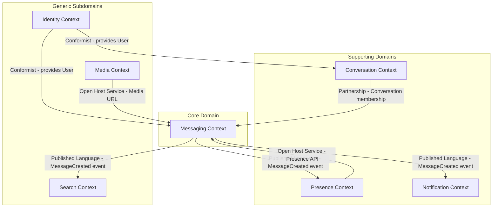

# 03 — DDD Bounded Contexts: Chat Application

---

## Objective

Define the bounded contexts that partition the chat domain into independently deployable, cohesive units. Describe each context's responsibilities, the ubiquitous language within it, and how contexts integrate with each other.

---

## Why DDD Boundaries Matter for Chat

A chat application looks deceptively simple — "just store and send messages." But the domain has several distinct subdomains that, if conflated, create coupling that prevents independent scaling:

- **Messaging** (the core domain): creating, routing, delivering messages
- **Presence**: tracking who is online in real-time
- **Conversations**: managing groups, membership, permissions
- **Identity**: users, authentication, contacts
- **Notifications**: offline delivery via external channels
- **Media**: binary content upload and retrieval
- **Search**: full-text indexing and querying

Each has a fundamentally different:
- Data access pattern (write-heavy vs. read-heavy vs. ephemeral)
- Consistency requirement (strong vs. eventual vs. none)
- Scaling axis (connections, storage throughput, CPU)
- Technology stack preference

---

## Bounded Context Map

---

## Context Relationships

| Relationship | Pattern | Notes |
|-------------|---------|-------|
| Identity → Messaging | **Conformist** | Messaging trusts Identity's User model; uses JWT token as userId claim without re-validating user data |
| Identity → Conversation | **Conformist** | Same as above |
| Conversation → Messaging | **Partnership** | Both contexts must agree on ConversationMember validity. Messaging validates membership by calling Conversation Service |
| Messaging → Notification | **Published Language** | `MessageCreated` event is the contract. Notification context consumes it without coupling to Messaging internals |
| Messaging → Search | **Published Language** | Same event. Search indexes independently |
| Messaging → Presence | **Open Host Service** | Messaging calls Presence API to check online status before Fan-Out decision |
| Media → Messaging | **Open Host Service** | Media publishes a REST API for pre-signed URL generation. Messaging stores only the CDN URL |

---

## Bounded Context 1: Messaging Context (Core Domain)

### Responsibility
The heart of the system. Owns message creation, delivery state machine, and conversation-level ordering guarantees.

### Ubiquitous Language

| Term | Meaning in this context |
|------|------------------------|
| Message | An immutable unit of communication with content, sender, conversation, and sequence number |
| Send | The act of writing a message to a conversation and publishing it for delivery |
| Sequence Number | Server-assigned monotonic counter per conversation — the ordering authority |
| Delivery Receipt | The acknowledgment that a specific device received a specific message |
| SENT | Server has persisted the message |
| DELIVERED | At least one of the recipient's devices received the message |
| READ | Recipient's application brought the message into view |
| Fan-Out | Expanding a single message event to all eligible recipients |

### Core Aggregates
- `Message` (root), `MessageDeliveryReceipt`
- Sequence number: managed via Redis INCR, owned by Messaging Context

### APIs Provided
- `SendMessage(conversation_id, sender_id, content)` → `message_id, seq_num`
- `GetMessageHistory(conversation_id, after_seq, limit)` → `[Message]`
- `UpdateDeliveryStatus(message_id, recipient_id, status, timestamp)`
- `EditMessage(message_id, sender_id, new_content)`
- `DeleteMessage(message_id, sender_id, scope: [ME | EVERYONE])`

### Events Published (Published Language)
- `MessageCreated { message_id, conv_id, sender_id, seq_num, content_type, sent_at }`
- `MessageDelivered { message_id, recipient_id, delivered_at }`
- `MessageRead { message_id, recipient_id, read_at }`
- `MessageEdited { message_id, new_content, edited_at }`
- `MessageDeleted { message_id, scope, deleted_at }`

### Storage
- **Apache Cassandra**: Primary message store (partitioned by conv_id, clustered by seq_num)
- **Redis**: Sequence counter (`seq:{conv_id}`), delivery status cache, message ID deduplication

### What This Context Does NOT Own
- Who is a member of a conversation (Conversation Context)
- Whether the recipient is online (Presence Context)
- Push notification delivery (Notification Context)
- Binary media storage (Media Context)

---

## Bounded Context 2: Conversation Context

### Responsibility
Manages the lifecycle of conversations — creation, membership, settings, and access control.

### Ubiquitous Language

| Term | Meaning |
|------|---------|
| Conversation | A named container for messaging between participants |
| Member | A user who has been added to and not removed from a conversation |
| Owner | The user who created the conversation; can transfer ownership |
| Admin | A member elevated to manage membership |
| Last Read Seq | The highest sequence number the member has acknowledged |
| Unread Count | Derived: max_seq - last_read_seq for a member |

### Core Aggregates
- `Conversation` (root), `ConversationMember`

### APIs Provided
- `CreateConversation(creator_id, type, member_ids, name?)` → `conversation_id`
- `GetConversation(conversation_id)` → `Conversation`
- `AddMember(conversation_id, requester_id, new_user_id)`
- `RemoveMember(conversation_id, requester_id, target_user_id)`
- `GetMembers(conversation_id)` → `[ConversationMember]`
- `GetUserConversations(user_id, pagination)` → `[ConversationSummary]`
- `UpdateLastReadSeq(conversation_id, user_id, seq_num)` ← called by Messaging Context

### Storage
- **PostgreSQL**: Source of truth for all conversation and membership data
- **Redis**: Conversation member list cache (key: `conv:members:{conv_id}`, TTL: 5 min)
- **Redis**: User conversation list cache (key: `user:convs:{user_id}`, TTL: 2 min)

---

## Bounded Context 3: Presence Context

### Responsibility
Real-time tracking of user online/offline state, typing indicators, and last-seen timestamps.

### Ubiquitous Language

| Term | Meaning |
|------|---------|
| Heartbeat | A periodic signal from a connected client proving it is still alive |
| Online | User has an active WebSocket connection; heartbeat received within 90 seconds |
| Offline | No heartbeat received for > 90 seconds; TTL expired |
| Away | Optional state set explicitly by user or inferred (no interaction for 5 minutes) |
| Typing | Ephemeral state: user is actively typing in a specific conversation |
| Last Seen | Timestamp of most recent disconnect; shown to conversation partners |

### Key Design: TTL-Based Presence

Presence is NOT event-driven in the traditional sense. Instead:
- Every connected device sends heartbeat → WebSocket server refreshes `presence:{userId}` Redis key (TTL: 90s)
- No heartbeat → key expires → Redis keyspace notification fires → Presence Service marks user offline
- This pattern is self-healing: server restarts are transparent to clients

### APIs Provided
- `GetPresence(user_ids[])` → `Map<userId, PresenceState>` (gRPC for low latency)
- `GetTypingIndicators(conversation_id)` → `[userId]`
- `SetTyping(user_id, conversation_id, is_typing: bool)`

### Events Published
- `UserWentOnline { user_id, device_type, timestamp }`
- `UserWentOffline { user_id, last_seen, timestamp }`

### Storage
- **Redis only**: `presence:{userId}` (TTL 90s), `typing:{conv_id}:{userId}` (TTL 5s)
- **PostgreSQL**: `last_seen_at` on User record — written only on clean disconnect, NOT on every heartbeat

### What NOT to do
- Do NOT write presence state to PostgreSQL on every heartbeat (100M users × 1 write/30s = 3.3M writes/sec — catastrophic)
- Do NOT publish presence changes to Kafka for every heartbeat (same volume problem)

---

## Bounded Context 4: Identity Context

### Responsibility
User registration, authentication, device management, contacts.

### Ubiquitous Language

| Term | Meaning |
|------|---------|
| User | An authenticated identity with a unique user_id |
| Device | A registered client application instance with a push token |
| Contact | A mutual connection between two users |
| Token | A short-lived JWT credential proving user identity |

### APIs Provided
- `AuthenticateUser(credential)` → `JWT + refresh_token`
- `GetUser(user_id)` → `UserProfile`
- `RegisterDevice(user_id, device_type, push_token)` → `device_id`
- `GetContacts(user_id)` → `[UserProfile]`

### Integration Pattern
All other bounded contexts treat `user_id` (from JWT) as a trusted opaque identifier. They do NOT call Identity Context on the message hot path — the JWT signature validates identity at the API Gateway level.

---

## Bounded Context 5: Notification Context

### Responsibility
Deliver push notifications to offline users via FCM, APNs, or other channels.

### Integration with Messaging
Consumes `MessageCreated` events from Kafka. For each message:
1. Calls Presence Context to confirm recipient is offline
2. Looks up push token from Identity Context (device registry)
3. Delivers push notification with message preview

This is the same Notification System from design #3, reused here as a separate service. Chat System publishes events; Notification System handles the delivery.

---

## Bounded Context 6: Media Context

### Responsibility
Manages upload, storage, transformation, and retrieval of binary attachments.

### Flow
1. Client requests pre-signed S3 URL from Media Service
2. Client uploads directly to S3 (bypasses chat server — critical at scale)
3. S3 event triggers Media Service: virus scan, thumbnail generation, CDN URL creation
4. Media Service returns final CDN URL to client
5. Client sends message with CDN URL embedded

### Storage
- **S3**: Binary blobs
- **CloudFront CDN**: Served globally with caching
- **PostgreSQL**: Media metadata (file_id, uploader, conv_id, size, MIME, scan_status)

---

## Bounded Context 7: Search Context

### Responsibility
Full-text search across message history.

### Integration
Consumes `MessageCreated` events from Kafka. Indexes message content into Elasticsearch. Provides search API: `SearchMessages(user_id, query, conv_ids?, date_range?)`.

### Challenges
- Only index messages the querying user has access to (membership check at search time)
- Cassandra is not suited for full-text search — this is why a separate index is needed
- Index lag: messages are searchable within 1–5 seconds of being sent (acceptable)
- For encrypted messages (E2E), server-side search is impossible — Elasticsearch cannot index ciphertext

---

## Anti-Corruption Layers

### Messaging ↔ Conversation
When Message Service needs to validate membership (can this user send to this conv?), it calls Conversation Service via gRPC. However, it does NOT import Conversation's domain model directly. It uses a lightweight `MembershipValidator` adapter that translates Conversation's gRPC response into the Messaging Context's internal `bool isMember` check.

### Messaging ↔ Identity
Message Service receives `user_id` from JWT. It does NOT call Identity Service to validate user existence on the hot path. Instead, user existence is implicitly trusted (the JWT proves it). An async job periodically syncs soft-deleted users and suppresses their messages.

---

## Context Ownership Summary

| Data | Owner | Other Contexts Access Via |
|------|-------|--------------------------|
| Message content, sequence, receipts | Messaging | Events (Kafka) |
| Conversation membership, roles | Conversation | gRPC API, events |
| User presence, typing | Presence | gRPC API (read), events (writes) |
| User profile, auth | Identity | JWT (at gateway), gRPC (when needed) |
| Push token, device | Identity | gRPC (by Notification) |
| Media binary, CDN URL | Media | REST API (pre-sign), events (scan result) |
| Message search index | Search | REST API |
