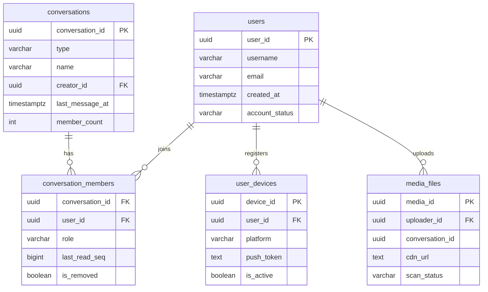

# 05 — Database Design: Chat Application

---

## Objective

Design the data layer for a chat platform that stores 4 billion messages per day, supports real-time delivery, efficient history retrieval, and conversation management. Justify the choice of Cassandra for messages vs PostgreSQL for metadata. Address partitioning, indexing, ordering guarantees, and archival.

---

## Database Technology Choices

| Data Domain | Database | Justification |
|-------------|----------|---------------|
| Messages | Apache Cassandra | Time-series append pattern, partition by conv_id, linear write scale, no hot locks |
| Conversations & Members | PostgreSQL | Relational, transactional, low write volume, foreign key integrity |
| Presence & Counters | Redis | Ephemeral, sub-ms reads, TTL-based auto-expiry |
| Search Index | Elasticsearch | Full-text, tokenization, relevance scoring |
| Media Metadata | PostgreSQL | Simple relational, low volume |

---

## Why Cassandra for Messages (Not PostgreSQL)

### The Core Problem with PostgreSQL at Chat Scale

| Metric | PostgreSQL Reality |
|--------|--------------------|
| Max write throughput per node | ~10,000–20,000 writes/sec (with indexes) |
| Required write throughput | 1,000,000 msg/sec at peak |
| Storage growth | 4 TB/day → single PostgreSQL node fills up in days |
| Sequential scan for history | `SELECT * WHERE conv_id = ? ORDER BY seq DESC LIMIT 50` works fine initially — but with 100M rows per popular conversation, even with index it becomes slow |
| Lock contention | Every INSERT acquires a lock on the index page — at 1M inserts/sec this becomes catastrophic |

### Why Cassandra Fits

| Cassandra Property | How It Helps |
|-------------------|-------------|
| Partition by `conv_id` | All messages for a conversation are on the same node — efficient range scans |
| Cluster by `sequence_num DESC` | History reads are sequential reads of a partition — Cassandra's strength |
| Append-only writes | No updates to message rows (soft delete via is_deleted flag + separate write) |
| Tunable consistency | QUORUM for writes (2/3 replicas) → durability. LOCAL_ONE for history reads → latency |
| Linear horizontal scale | Add nodes → add write throughput. No master bottleneck |
| TTL support | Old messages automatically expire (for Slack-style 90-day retention tiers) |

**Cassandra is NOT a silver bullet**:
- No secondary indexes that scale well — can't query by sender across all conversations
- No joins — conversation name must be denormalized into message response
- No aggregations — COUNT(*) per conversation requires a counter table
- Schema changes on large tables are painful

---

## Cassandra Schema: Messages

```sql
CREATE KEYSPACE chat WITH replication = {
  'class': 'NetworkTopologyStrategy',
  'us-east-1': 3,
  'eu-west-1': 3
};

-- Primary message table
CREATE TABLE chat.messages (
    conversation_id UUID,
    time_bucket     TEXT,      -- YYYYMM: partition by month to prevent hot partitions
    sequence_num    BIGINT,
    message_id      UUID,
    sender_id       UUID,
    content_type    TEXT,
    content         TEXT,
    media_url       TEXT,
    media_metadata  TEXT,       -- JSON blob
    reply_to_id     UUID,
    sent_at         TIMESTAMP,
    server_at       TIMESTAMP,
    is_deleted      BOOLEAN,
    is_edited       BOOLEAN,
    edited_at       TIMESTAMP,
    PRIMARY KEY ((conversation_id, time_bucket), sequence_num)
) WITH CLUSTERING ORDER BY (sequence_num DESC)
  AND compaction = {'class': 'TimeWindowCompactionStrategy',
                    'compaction_window_unit': 'DAYS',
                    'compaction_window_size': 1};
```

### Partition Key Design: `(conversation_id, time_bucket)`

**Why time_bucket?**
A single partition for a conversation that's been active for 3 years would accumulate billions of rows — a "hot partition" that Cassandra nodes cannot handle. Splitting by month (YYYYMM) bounds each partition to at most 30 days of messages.

**Query pattern for history**:
```sql
-- Most recent messages (current month)
SELECT * FROM messages
WHERE conversation_id = ? AND time_bucket = '202605'
ORDER BY sequence_num DESC
LIMIT 50;
```

If the user scrolls back past the month boundary, the client sends a new query for the previous time_bucket.

**Tradeoff**: Cross-bucket queries require the client to issue multiple requests. This is acceptable because users rarely scroll back months in a conversation.

---

## Cassandra Schema: Message Delivery Receipts

```sql
-- Stores per-recipient delivery and read timestamps
CREATE TABLE chat.message_receipts (
    conversation_id UUID,
    sequence_num    BIGINT,
    recipient_id    UUID,
    delivered_at    TIMESTAMP,
    read_at         TIMESTAMP,
    PRIMARY KEY ((conversation_id, sequence_num), recipient_id)
);
```

**Note on group receipts**: For a 1,000-member group, every message creates 1,000 rows in this table. At 4 billion messages/day with 30% group → ~1.2 billion receipt rows/day. Options:

1. **Full receipts** (WhatsApp DM style): Store all. At ~100 bytes/row = 120 GB/day just for receipts. Feasible with archival.
2. **Summary only** (Slack channel style): Store only aggregated counts. `delivered_count / member_count`. Don't store per-user receipt for large groups.
3. **Hybrid**: Full receipts for groups < 50 members; summary only for > 50.

Design recommendation: Hybrid approach (option 3).

---

## Cassandra Schema: Unread Message Counters

Using Cassandra counters for unread counts is unreliable (counter tables have consistency issues). Better to use Redis:

```
HSET unread:{user_id}  {conversation_id}  {unread_count}
```

On message delivered to user: `HINCRBY unread:{user_id} {conv_id} 1`
On messages read: `HSET unread:{user_id} {conv_id} 0`

---

## PostgreSQL Schema: Conversations

```sql
CREATE TABLE conversations (
    conversation_id UUID PRIMARY KEY DEFAULT gen_random_uuid(),
    type            VARCHAR(10) NOT NULL CHECK (type IN ('DIRECT', 'GROUP', 'CHANNEL')),
    name            VARCHAR(255),
    creator_id      UUID NOT NULL REFERENCES users(user_id),
    created_at      TIMESTAMPTZ NOT NULL DEFAULT NOW(),
    last_message_id UUID,
    last_message_at TIMESTAMPTZ,
    member_count    INT NOT NULL DEFAULT 0,
    is_deleted      BOOLEAN NOT NULL DEFAULT FALSE,
    settings        JSONB DEFAULT '{}'
);

CREATE INDEX idx_conversations_last_message ON conversations(last_message_at DESC)
    WHERE is_deleted = FALSE;
```

```sql
CREATE TABLE conversation_members (
    conversation_id UUID NOT NULL REFERENCES conversations(conversation_id),
    user_id         UUID NOT NULL REFERENCES users(user_id),
    role            VARCHAR(10) NOT NULL DEFAULT 'MEMBER'
                    CHECK (role IN ('OWNER', 'ADMIN', 'MEMBER')),
    joined_at       TIMESTAMPTZ NOT NULL DEFAULT NOW(),
    last_read_seq   BIGINT NOT NULL DEFAULT 0,
    is_muted        BOOLEAN NOT NULL DEFAULT FALSE,
    mute_expires_at TIMESTAMPTZ,
    is_removed      BOOLEAN NOT NULL DEFAULT FALSE,
    removed_at      TIMESTAMPTZ,
    custom_nickname VARCHAR(100),
    PRIMARY KEY (conversation_id, user_id)
);

-- For "get all conversations for a user" (inbox query)
CREATE INDEX idx_members_user_id ON conversation_members(user_id)
    WHERE is_removed = FALSE;
```

```sql
CREATE TABLE users (
    user_id         UUID PRIMARY KEY DEFAULT gen_random_uuid(),
    username        VARCHAR(50) UNIQUE NOT NULL,
    display_name    VARCHAR(100) NOT NULL,
    phone_number    VARCHAR(20) UNIQUE,
    email           VARCHAR(255) UNIQUE NOT NULL,
    profile_pic_url TEXT,
    created_at      TIMESTAMPTZ NOT NULL DEFAULT NOW(),
    last_seen_at    TIMESTAMPTZ,
    status_message  VARCHAR(255),
    account_status  VARCHAR(10) NOT NULL DEFAULT 'ACTIVE'
                    CHECK (account_status IN ('ACTIVE', 'SUSPENDED', 'DELETED'))
);
```

```sql
CREATE TABLE user_devices (
    device_id       UUID PRIMARY KEY DEFAULT gen_random_uuid(),
    user_id         UUID NOT NULL REFERENCES users(user_id),
    device_type     VARCHAR(10) NOT NULL CHECK (device_type IN ('MOBILE', 'WEB', 'DESKTOP')),
    platform        VARCHAR(10) NOT NULL CHECK (platform IN ('IOS', 'ANDROID', 'WEB', 'MACOS', 'WINDOWS')),
    push_token      TEXT,
    is_active       BOOLEAN NOT NULL DEFAULT TRUE,
    registered_at   TIMESTAMPTZ NOT NULL DEFAULT NOW(),
    last_seen_at    TIMESTAMPTZ
);

CREATE INDEX idx_devices_user_id ON user_devices(user_id) WHERE is_active = TRUE;
```

---

## PostgreSQL Schema: Media Metadata

```sql
CREATE TABLE media_files (
    media_id        UUID PRIMARY KEY DEFAULT gen_random_uuid(),
    uploader_id     UUID NOT NULL REFERENCES users(user_id),
    conversation_id UUID NOT NULL,
    original_name   VARCHAR(255),
    content_type    VARCHAR(100) NOT NULL,
    file_size_bytes BIGINT NOT NULL,
    cdn_url         TEXT NOT NULL,
    s3_key          TEXT NOT NULL,
    width_px        INT,
    height_px       INT,
    duration_secs   INT,      -- for audio/video
    scan_status     VARCHAR(10) NOT NULL DEFAULT 'PENDING'
                    CHECK (scan_status IN ('PENDING', 'CLEAN', 'FLAGGED')),
    uploaded_at     TIMESTAMPTZ NOT NULL DEFAULT NOW()
);
```

---

## ER Diagram: Relational Layer



---

## Indexing Strategy

### Cassandra (message table)
| Access Pattern | Key Design |
|---------------|-----------|
| Load history for a conversation (most common) | Partition key `(conv_id, time_bucket)`, cluster by `seq DESC` |
| Find a specific message by ID | `message_id` is stored in the row; lookup requires knowing conv_id (always known from client context) |
| Find messages by sender | NOT supported natively — requires Elasticsearch |

### PostgreSQL
| Table | Index | Purpose |
|-------|-------|---------|
| `conversations` | `(last_message_at DESC)` | Sorted inbox query |
| `conversation_members` | `(user_id)` WHERE not removed | "Get my conversations" |
| `conversation_members` | `(conversation_id)` | "Get all members of a conv" |
| `users` | `(username)` UNIQUE | Username lookup |
| `users` | `(phone_number)` UNIQUE | Phone-based contact discovery |
| `user_devices` | `(user_id)` WHERE active | Push token lookup |

---

## Partitioning Strategy

### Cassandra
- Data is naturally partitioned by `(conversation_id, time_bucket)`
- Virtual nodes (vnodes) distribute partitions across the cluster
- Replication factor: 3 per region (writes go to 2/3 = QUORUM)

### PostgreSQL (for conversation_members at scale)
- If member count exceeds 100M rows: partition `conversation_members` by `conversation_id % 16` (hash partitioning)
- At current scale (< 10M conversations), a single partitioned table with proper indexes is sufficient

---

## Sharding Considerations

### Cassandra Auto-Sharding
Cassandra distributes partitions automatically via consistent hashing. Adding nodes rebalances partitions without manual sharding.

### PostgreSQL — When to Shard
- PostgreSQL becomes a bottleneck when: > 10M conversations, > 100M members, query latency degrades
- Shard by `conversation_id % N` (hash sharding) — all member records for a conversation land on one shard
- Use a router service (or PgBouncer + Citus) to route queries

---

## Soft Delete Strategy

### Messages
- Never hard-delete messages — the `sequence_num` gap would confuse clients
- Set `is_deleted = TRUE` + overwrite `content = ''`
- Clients render "This message was deleted" for is_deleted rows
- Delete-for-me: tracked in a separate `message_hide` table per user (not shown to that user only)

### Conversations
- Set `is_deleted = TRUE` on the conversation
- Keep all `conversation_members` records — for history attribution

### Users
- Set `account_status = 'DELETED'`
- Messages retain `sender_id` reference — display as "Deleted User"
- Remove push tokens immediately

---

## Data Archival Strategy

### Messages (Cassandra → S3)
```
Hot tier:   Cassandra, SSD — last 90 days
Warm tier:  Cassandra, HDD — 90 days to 2 years (Slack free tier end)
Cold tier:  Apache Iceberg on S3 — > 2 years

Archive job: Daily batch, export partitions older than 90 days to S3 Parquet via Apache Spark
Re-hydration: If user requests very old message, read from S3 → serve with slightly higher latency (acceptable)
```

### Media (S3 tiering)
```
S3 Standard:          < 30 days (frequently accessed)
S3 Standard-IA:       30–365 days
S3 Glacier Instant:   1–3 years
S3 Glacier Deep:      > 3 years
```
S3 Lifecycle policies automate tier transitions.

---

## Consistency Tradeoffs

| Operation | Consistency Level | Justification |
|-----------|------------------|---------------|
| Message write | Cassandra QUORUM | 2/3 replicas must confirm — durable, survives 1 node failure |
| Message read (history) | Cassandra LOCAL_ONE | Accept slightly stale data for 50ms read latency |
| Sequence number assign | Redis INCR | Atomic, single-node, guaranteed monotonic |
| Conversation membership | PostgreSQL SERIALIZABLE | Must not allow race condition on member count |
| Presence read | Redis (eventual) | Stale by 30s max — acceptable for presence |
| Delivery receipt write | Cassandra LOCAL_QUORUM | Best-effort update; occasional staleness acceptable |

---

## Cassandra-Style Thinking: Key Lessons

1. **Design tables for queries, not for normalization.** Cassandra has no joins. If a query needs conversation name + messages, denormalize the name into the message or do two reads.
2. **Partition key determines which node serves the query.** Get the partition key wrong and you have a hot node.
3. **Avoid unbounded partitions.** A conversation with 5 years of messages would be one massive partition without the time_bucket split.
4. **Wide rows are a feature, not a bug.** A single partition key with thousands of rows (messages per conversation) is exactly what Cassandra is optimized for.
5. **Counter tables are a trap.** Use Redis for counters. Cassandra counter columns have limited consistency guarantees and cannot be combined with regular columns.
