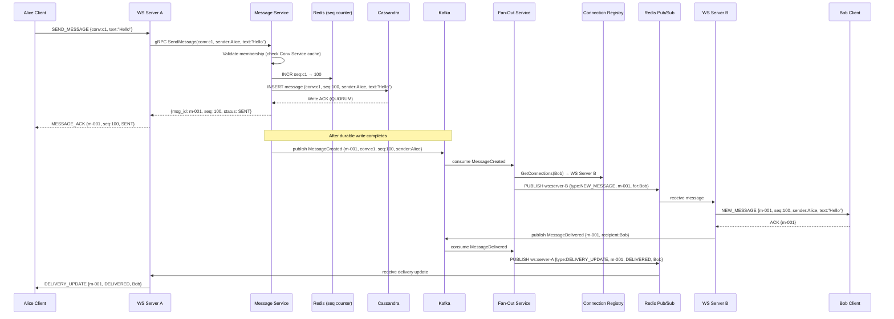
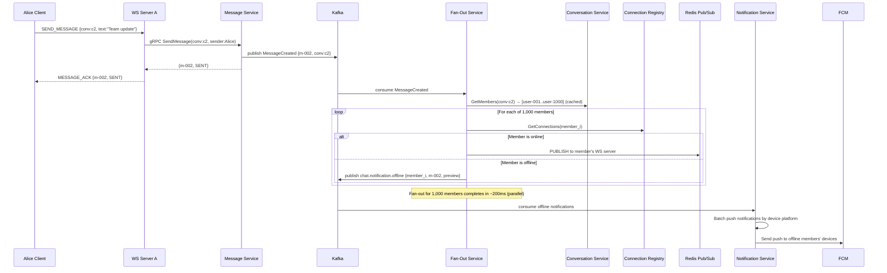
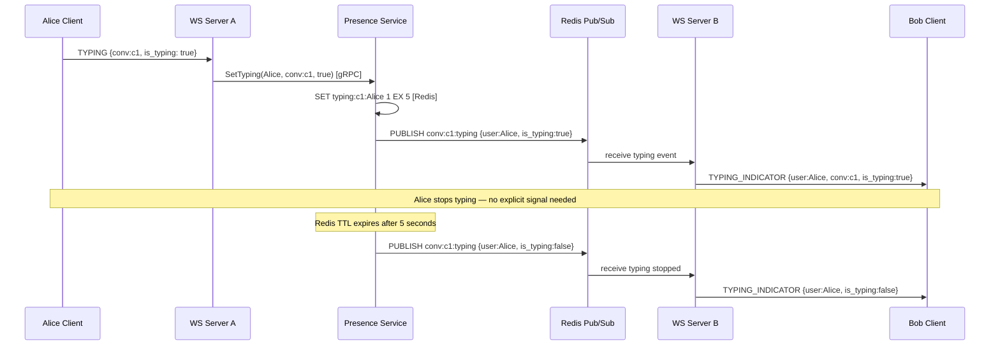
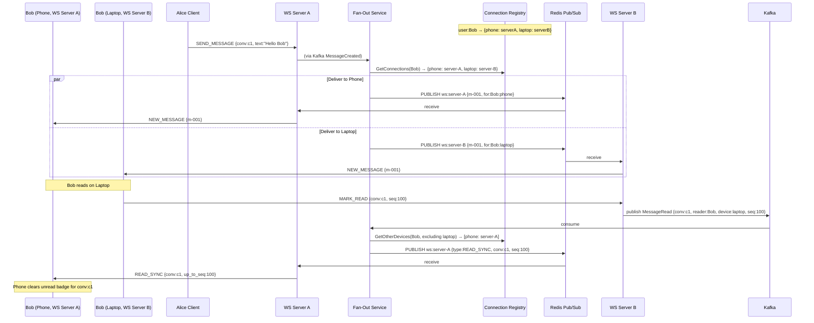

# 06 — Event Flow: Chat Application

---

## Objective

Map every significant event in the chat system — from message creation through delivery, receipts, presence changes, typing indicators, and multi-device sync. Show Kafka topic design, event schemas, sequencing diagrams, and failure paths.

---

## Event Architecture Overview

The system uses two event buses with different characteristics:

| Bus | Technology | Latency | Durability | Use Case |
|-----|-----------|---------|-----------|---------|
| **Real-time bus** | Redis Pub/Sub | < 1ms | None (ephemeral) | Push messages to live WebSocket connections |
| **Durable bus** | Apache Kafka | 10–50ms | Yes (replicated) | Cross-service integration, offline sync, audit |

**Critical rule**: A message is published to Kafka AFTER it is durably written to Cassandra. The Kafka event is evidence that the message is safe. A message published to Redis Pub/Sub before Cassandra write would risk loss.

---

## Kafka Topic Design

| Topic | Partitioning Key | Retention | Consumers |
|-------|-----------------|-----------|----------|
| `chat.message.created` | `conversation_id` | 7 days | Fan-Out Service, Search Indexer, Analytics |
| `chat.message.delivered` | `conversation_id` | 24 hours | Message Service (receipt update), Fan-Out (ACK sender) |
| `chat.message.read` | `conversation_id` | 24 hours | Message Service, Conversation Service (last_read_seq) |
| `chat.message.edited` | `conversation_id` | 7 days | Fan-Out Service |
| `chat.message.deleted` | `conversation_id` | 7 days | Fan-Out Service, Search Indexer |
| `chat.presence.changed` | `user_id` | 1 hour | Fan-Out Service (broadcast to contacts) |
| `chat.conversation.created` | `conversation_id` | 7 days | Fan-Out Service, Notification Service |
| `chat.member.added` | `conversation_id` | 7 days | Fan-Out Service |
| `chat.member.removed` | `conversation_id` | 7 days | Fan-Out Service |
| `chat.notification.offline` | `user_id` | 1 hour | Notification Service (push delivery) |
| `chat.message.dlq` | `conversation_id` | 30 days | Manual review, reprocessing |

**Why partition by `conversation_id`?**
- All events for the same conversation land on the same Kafka partition
- Fan-Out Service consumers process events in order per conversation
- No risk of out-of-order fan-out for the same conversation (message 102 delivered before 101)

---

## Event Schemas

### `MessageCreated`
```json
{
  "event_type": "MessageCreated",
  "event_id": "evt-uuid",
  "timestamp": "2026-05-17T10:00:00.123Z",
  "conversation_id": "conv-abc123",
  "message_id": "msg-001",
  "sequence_num": 100,
  "sender_id": "user-001",
  "content_type": "TEXT",
  "content_preview": "Hello!",
  "media_url": null,
  "reply_to_id": null,
  "server_received_at": "2026-05-17T10:00:00.123Z"
}
```

### `MessageDelivered`
```json
{
  "event_type": "MessageDelivered",
  "event_id": "evt-uuid",
  "timestamp": "2026-05-17T10:00:00.500Z",
  "conversation_id": "conv-abc123",
  "message_id": "msg-001",
  "recipient_id": "user-002",
  "device_id": "device-xyz",
  "delivered_at": "2026-05-17T10:00:00.500Z"
}
```

### `MessageRead`
```json
{
  "event_type": "MessageRead",
  "event_id": "evt-uuid",
  "timestamp": "2026-05-17T10:00:05Z",
  "conversation_id": "conv-abc123",
  "up_to_sequence_num": 100,
  "reader_id": "user-002",
  "read_at": "2026-05-17T10:00:05Z"
}
```

### `PresenceChanged`
```json
{
  "event_type": "PresenceChanged",
  "event_id": "evt-uuid",
  "timestamp": "2026-05-17T10:00:00Z",
  "user_id": "user-001",
  "status": "OFFLINE",
  "last_active_at": "2026-05-17T09:55:00Z"
}
```

---

## Flow 1: Message Send (1:1, Both Online)



---

## Flow 2: Message Send (Group, 1,000 Members)



**Scaling note**: Fan-Out for 1,000 members requires 1,000 Redis Pub/Sub publishes. At 1M msg/sec with 30% group messages → 300K group messages × 1,000 avg recipients = 300 billion fan-out operations/sec at extreme scale. This requires Fan-Out to be massively parallelized using multiple Kafka partitions per conversation.

**Real-world optimization (WhatsApp)**: For very large groups, use a "push to WS pool" model — Fan-Out publishes one message per WS server (not per member). Each WS server then delivers to all connected members of that group it hosts.

---

## Flow 3: Typing Indicator (Ephemeral — Not on Kafka)

Typing indicators are ephemeral and must NOT be persisted or go through Kafka (too slow).



---

## Flow 4: Offline Sync (User Reconnects After Being Offline)

```mermaid
sequenceDiagram
    participant Bob as Bob (reconnecting)
    participant WSB as WS Server B
    participant ConnReg as Connection Registry
    participant ConvSvc as Conversation Service
    participant MsgSvc as Message Service
    participant Cass as Cassandra

    Bob->>WSB: WebSocket connect (JWT, last_sync_seq_map: {c1:95, c2:45})
    WSB->>ConnReg: HSET user:Bob {device:phone → server-B}
    WSB->>ConvSvc: GetConversations(Bob) → [{c1, max_seq:100}, {c2, max_seq:50}]

    WSB->>Bob: SYNC_REQUIRED {c1: missed=5, latest=100; c2: missed=5, latest=50}

    Bob->>MsgSvc: REST GET /messages?conv=c1&after_seq=95&limit=50
    MsgSvc->>Cass: SELECT WHERE conv_id=c1 AND time_bucket='202605' AND seq > 95
    Cass-->>MsgSvc: [msg-096, msg-097, msg-098, msg-099, msg-100]
    MsgSvc-->>Bob: [5 messages]

    Bob->>WSB: MARK_READ {conv:c1, up_to_seq:100}
    WSB->>Kafka: publish MessageRead {conv:c1, reader:Bob, up_to_seq:100}
    Kafka->>ConvSvc: update last_read_seq(Bob, c1) = 100
```

---

## Flow 5: Multi-Device Sync

Bob has a phone and a laptop both connected simultaneously.



---

## Flow 6: Presence Change Propagation

```mermaid
sequenceDiagram
    participant WSServer as WS Server (any)
    participant PresenceSvc as Presence Service
    participant Redis
    participant Kafka
    participant FanOut as Fan-Out Service
    participant ConvSvc as Conversation Service
    participant ConnReg as Connection Registry
    participant RedisPS as Redis Pub/Sub

    Note over WSServer: Alice disconnects (or heartbeat stops)

    WSServer->>PresenceSvc: UserDisconnected(Alice, device: phone)
    PresenceSvc->>Redis: DEL presence:Alice:phone
    PresenceSvc->>Redis: Check if any other Alice devices online
    Redis-->>PresenceSvc: None
    PresenceSvc->>Redis: SET last_seen:Alice = NOW()
    PresenceSvc->>Kafka: publish PresenceChanged {Alice, OFFLINE, last_seen: NOW()}

    Kafka->>FanOut: consume PresenceChanged

    FanOut->>ConvSvc: GetConversations(Alice) → [c1, c2, c3]
    FanOut->>ConvSvc: GetOnlineMembers([c1, c2, c3]) → {c1: [Bob], c2: [Carol, Dave], c3: []}

    loop for each online member in Alice's conversations
        FanOut->>ConnReg: GetConnections(member)
        FanOut->>RedisPS: PUBLISH ws:server {PRESENCE_UPDATE, Alice, OFFLINE}
    end
```



**Optimization**: Fan-out of presence changes is expensive for users with many conversations. WhatsApp limits presence visibility to contacts only. Slack shows presence within shared workspaces only. This scoping is essential to prevent presence fan-out from dominating the system.

---

## Event Ordering Guarantees

| Event Type | Ordering Guarantee | How |
|------------|------------------|-----|
| Messages in a conversation | Total order within conversation | Same Kafka partition (partitioned by conv_id) |
| Delivery receipts | Best-effort ordering | Same partition as parent message |
| Presence changes | Per-user ordering | Partitioned by user_id on PresenceChanged topic |
| Typing indicators | No ordering needed | Ephemeral, last-write-wins via Redis TTL |
| Multi-device sync events | Same device gets correct order | Fan-Out publishes per-device with conv_id key |

---

## Dead Letter Queue Strategy

When Fan-Out cannot deliver a message after 3 retries:
1. Publish to `chat.message.dlq` topic with failure reason
2. Alert operations team
3. On DLQ processing: attempt re-delivery after 5-minute backoff
4. After 3 DLQ reprocessing attempts: mark message as `UNDELIVERABLE` in Cassandra
5. Offline user notification: push "You have undeliverable messages — please contact support"

**Note**: Delivery failure is distinct from message loss. The message is safe in Cassandra. The fan-out failure means some recipients may not have received the real-time push — they will get the message via offline sync on next reconnect.
