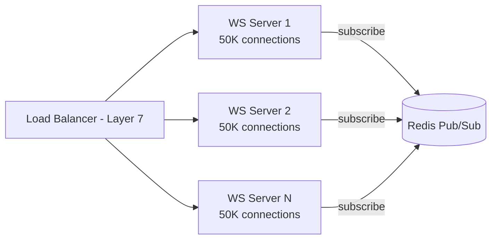
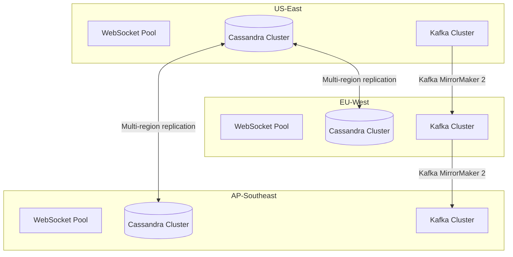

# 07 — Scaling Strategy: Chat Application

---

## Objective

Define how each component scales under load. Address WebSocket connection scaling, message fan-out at group scale, presence at 100M DAU, Cassandra write throughput, and the strategies for handling peak traffic without service degradation.

---

## Scaling Axes

Each component in the chat system has a different primary scaling constraint:

| Component | Primary Constraint | Scaling Strategy |
|-----------|-------------------|-----------------|
| WebSocket Servers | Memory (connections) + CPU (fan-out per connection) | Horizontal: more servers, sticky routing |
| Message Service | Write throughput to Cassandra | Horizontal stateless services |
| Fan-Out Service | CPU (member list expansion) | Horizontal Kafka consumers |
| Presence Service | Redis throughput (heartbeats) | Redis Cluster sharding |
| Cassandra | Write/read throughput, storage | Add nodes (linear scale) |
| Connection Registry | Redis read/write latency | Redis Cluster |
| Kafka | Throughput, partition count | Add brokers + partitions |
| Notification Service | External provider rate limits | Separate pool per provider |

---

## WebSocket Server Scaling

### The Connection Problem

At 50 million concurrent WebSocket connections:
- Each connection holds a TCP socket (~10 KB kernel buffer + application state)
- 50,000 connections per JVM with Java 21 virtual threads = 1,000 servers
- Each server subscribes to Redis Pub/Sub channels for every active conversation its users participate in

### Memory Math per Server
```
50,000 connections × 10 KB per socket = 500 MB TCP buffers
50,000 users × ~20 active conversations = 1M Redis Pub/Sub subscriptions
1M subscriptions × ~200 bytes = 200 MB Redis channel state
JVM overhead + heap = 4–8 GB
Total per server: ~10 GB RAM → use 16 GB instances
```

### Horizontal Scaling



**Sticky sessions**: The load balancer must route WebSocket connections from the same client consistently to the same server. When a client reconnects, it should return to the same server (or any server, since connection state is in Redis, not the server).

**Connection Registry** is the key: when a server receives a message delivery event for user X, it checks the registry, finds the server, and routes accordingly via Redis Pub/Sub.

### Horizontal Scaling Limit for WebSocket Servers

At each server subscribing to 1M Redis channels:
- Redis Pub/Sub channel count grows: 1,000 servers × 1M channels = potential 1 billion channel subscriptions
- Redis Pub/Sub does not scale infinitely — channels are in-memory in Redis

**Solution**: Group-level channels instead of user-level channels
- Instead of publishing to `user:{userId}` channel, publish to `ws-server:{serverId}` channel
- Fan-Out publishes one message per server, the server delivers to all connected users for that message
- Reduces Redis channel count from 1 billion to 1,000 (one per WS server)

---

## Fan-Out Scaling

### The Fan-Out Problem

A message to a 1,000-member group requires:
- 1 Cassandra write
- 1 Kafka event
- Fan-Out Service: 1,000 Connection Registry lookups + up to 1,000 Redis publishes

At 1M messages/second with 30% group messages at 500 avg recipients:
- Fan-Out operations per second: 300K × 500 = **150 million Redis publishes/sec**

This is beyond what a single Redis cluster can handle.

### Fan-Out Optimization Strategies

#### Strategy 1: Fan-Out per WS Server (Server-Level Channels)
Instead of publishing per recipient, publish per WebSocket server:
- Fan-Out Service knows which server each user is on
- Publishes to `ws-server:{serverId}` with metadata `{message, conv_id, recipient_list_on_this_server}`
- Each WS server broadcasts to its own connected users

**Reduces fan-out from**: 1M Redis publishes per group message  
**To**: N Redis publishes where N = number of WS servers with online members of that group

For a 500-member group spread across 1,000 servers:
- Worst case: 500 server publishes per message
- Practical: most large groups cluster on fewer servers → avg ~100 publishes per message

#### Strategy 2: Lazy Fan-Out for Large Groups
For groups with > 500 members:
- Do NOT fan-out immediately. Instead, publish `message_ready` event to a channel.
- Each WS server subscribes to the conversation channel (not the user channel)
- WS server broadcasts to ALL connected members of that conversation on its local server

This is analogous to Kafka's consumer group model applied to WebSocket delivery.

#### Strategy 3: Tiered Fan-Out

| Group Size | Strategy |
|-----------|---------|
| 2–50 members | Immediate fan-out per user (direct Redis Pub/Sub) |
| 51–500 members | Fan-out per WS server |
| 500+ members | Conversation-level channel; WS servers pull and broadcast locally |

---

## Presence Service Scaling

### Heartbeat Volume Problem

With 50M concurrent connections, each sending a heartbeat every 30 seconds:
- **Heartbeat rate**: 50M / 30 = **1.67 million writes/second** to Redis

### Redis Cluster for Presence

```
Redis Cluster (16 shards):
  Shard 0: presence keys for user_ids 0–6.25%
  Shard 1: presence keys for user_ids 6.25–12.5%
  ...
  Shard 15: presence keys for user_ids 93.75–100%

Each shard: ~3M users × 200 bytes = 600 MB RAM
Heartbeat per shard: ~100K writes/sec → well within Redis limits
```

Redis Cluster handles automatic sharding via hash slots. 16,384 hash slots distributed across 16 shard pairs (master + replica each).

### Reducing Heartbeat Pressure

Option 1: **WS server aggregation**: Instead of every client heartbeating independently, the WS server sends a single batch heartbeat to Presence Service every 30 seconds: `MSET presence:user1=1 EX 90, presence:user2=1 EX 90, ...`

This reduces the number of Redis round trips from 50M per 30 sec to 1,000 (one per WS server) per 30 sec with batch pipelines.

---

## Cassandra Write Scaling

### Write Throughput Target
- 1M messages/second at peak
- Each message = 1 Cassandra write (QUORUM = 2/3 replicas)

### Cassandra Cluster Sizing

| Parameter | Value |
|-----------|-------|
| Write throughput per node | ~50,000 writes/sec (SSD, optimal) |
| Nodes needed for 1M writes/sec | 1M / 50K = **20 nodes** with replication |
| Replication factor | 3 (2 replicas must ACK for QUORUM) |
| Effective write throughput per node | 50K writes × (1/1.5 due to QUORUM overhead) |
| Cluster size for write scaling | **60 nodes** (20 logical × 3 replicas) |
| Storage per node (4 TB disk) | 4 TB × 60 = 240 TB total raw |
| Data stored (with RF=3) | 240 TB / 3 = **80 TB net** (covers ~20 days at 4 TB/day) |
| Scale strategy | Add nodes linearly as data grows |

### Compaction Strategy

Using **TimeWindowCompactionStrategy (TWCS)**:
- Compacts data within time windows (1 day per window)
- Old windows are never re-compacted (immutable SSTable per day)
- Dramatically reduces write amplification for time-series data
- Expired TTL data is cleaned up during minor compaction

---

## Read Scaling

### Message History Reads

| Read Type | Strategy |
|-----------|---------|
| Recent messages (< 7 days) | Cassandra LOCAL_ONE (single replica read — fast) |
| Older messages (7–90 days) | Cassandra LOCAL_QUORUM (consistent but slower) |
| Archived messages (> 90 days) | Read from S3 via Iceberg → served with higher latency |

### Conversation Inbox Reads

Loading a user's conversation list is read-heavy (every app open):
- Cached in Redis: `user:convs:{userId}` → list of `{conv_id, last_message_preview, unread_count}` sorted by `last_message_at`
- Cache TTL: 2 minutes (trades freshness for throughput)
- Cache invalidation: on `MessageCreated` event, invalidate `user:convs:{userId}` for all conversation members
- Cold start (cache miss): read from PostgreSQL `conversation_members` JOIN `conversations`

### Read Replicas for PostgreSQL

- `conversations` and `conversation_members` are read far more often than written
- PostgreSQL read replicas (2 per region) serve read queries
- Primary handles writes only
- Connection pooling: PgBouncer in transaction mode

---

## Load Balancing Strategy

### Layer 7 Load Balancer (NGINX / AWS ALB)

For WebSocket connections:
- Connection draining: when a WS server is being removed, drain connections gracefully (30-second window)
- Health checks: if WS server stops responding to `/health`, remove from rotation immediately
- Sticky sessions: NOT required (but useful). Connection state is in Redis, so reconnection to any server works

### Load Distribution of WebSocket Servers

Rather than random load balancing, use **geographic and conversation affinity**:
- Route users from the same geographic cluster to nearby WS servers
- Users who share many conversations tend to be on the same servers → reduces cross-server Redis Pub/Sub traffic

---

## Rate Limiting

### Per-User Rate Limits (Token Bucket)

| Action | Limit | Burst |
|--------|-------|-------|
| Send message | 60/min | 10 immediate burst |
| Media upload | 10/min | 3 immediate burst |
| Typing indicator | 2/sec (debounced at client) | N/A |
| Search | 30/min | 5 immediate burst |
| API read | 600/min | 100 immediate burst |

Rate limiting enforced at the API Gateway using Redis token bucket:
- Key: `rate_limit:{user_id}:{action}`
- Atomic INCR + EXPIRE operations
- `Retry-After` header returned to client on 429

### System-Level Throttling

For group fan-out protection:
- Maximum fan-out rate: 500K Redis publishes/sec per Fan-Out consumer instance
- If fan-out queue depth exceeds threshold → shed lowest-priority (non-transactional) fan-outs
- Priority: 1:1 messages > small group messages > large group messages > presence broadcasts

---

## Backpressure Handling

### Kafka Consumer Backpressure

If Fan-Out Service cannot keep up with Kafka (`chat.message.created` lag grows):
1. **Scale out**: Add more Fan-Out consumer instances (Kubernetes HPA based on consumer lag metric)
2. **Shed load**: If lag exceeds 30 seconds, skip fan-out for non-critical messages (presence updates, read receipts) — they'll be eventually consistent
3. **Priority lanes**: Use separate Kafka topics for high-priority (1:1) vs. low-priority (large group) fan-outs

### WebSocket Server Backpressure

If a WS server's Redis Pub/Sub subscription backlog grows (cannot process messages fast enough):
1. Apply server-side rate limiting on outbound WebSocket frames
2. Batch small messages together before sending (reduces WebSocket frame overhead)
3. Circuit break for specific connections that are consuming too slowly (slow client)

---

## Multi-Region Architecture

For global deployment (US, Europe, Asia-Pacific):



**Cassandra multi-region**: NetworkTopologyStrategy with 3 replicas per region. A QUORUM write in US requires 2 US replicas — EU replicas sync asynchronously.

**User home region**: Each user is assigned a home region based on their geographic location. Messages for that user are first written to their home region's Cassandra cluster. Multi-region replication makes the message eventually available in all regions.

**Cross-region messaging**: If Alice (US) messages Bob (EU):
- Alice's message is written to US Cassandra
- Fan-Out Service checks Bob's device → Bob's WS connection is in EU region
- Fan-Out publishes to cross-region Kafka (via MirrorMaker) → EU Fan-Out delivers to Bob
- Latency: US write + cross-Atlantic Kafka (~100ms) + EU delivery = ~200ms total

---

## Performance Bottlenecks and Mitigations

| Bottleneck | Symptoms | Mitigation |
|-----------|---------|-----------|
| Hot Cassandra partition | Slow writes for popular conversations | time_bucket partitioning limits partition size |
| Redis Pub/Sub saturation | Message delivery delays | Server-level channels reduce publish count 1000x |
| Fan-Out lag | Group messages delayed | Horizontal Fan-Out consumers + priority separation |
| Connection Registry hot key | Popular users read from same Redis slot | Redis Cluster + local WS server cache of recent lookups |
| Large group member load | Slow fan-out for 1,000-member groups | Cache member list in Fan-Out service (5-min TTL) |
| Kafka partition count too low | Consumer lag under peak | Pre-provision 1,000 partitions for message.created topic |
| PostgreSQL inbox query | Slow conversation list load | Redis cache + read replicas + proper indexing |
