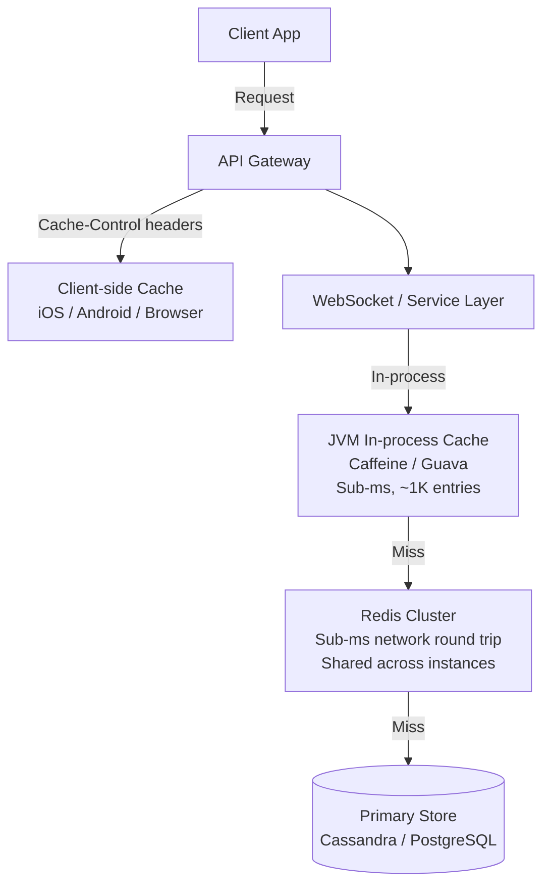

# 09 — Caching Strategy: Chat Application

---

## Objective

Define the multi-layer caching architecture that makes a chat platform fast at scale. Identify what to cache, what NOT to cache, TTL strategies, invalidation approaches, and cache failure handling for each data access pattern.

---

## Caching Principles for Chat

Chat applications have unique caching characteristics:

1. **Presence is ephemeral** — it must live in cache (Redis), not a database. The cache IS the source of truth.
2. **Messages are append-only** — once written, message content never changes (except soft delete/edit). Reads after the initial write are pure cache hits.
3. **Conversation lists change frequently** — every new message shifts the inbox order. Cache TTLs must be short or invalidation must be precise.
4. **Conversation membership changes rarely** — a user's group memberships are highly cacheable.
5. **Typing indicators must never be persisted** — their lifecycle is defined by cache TTL.

---

## Cache Layers



---

## Redis Cache Design (Primary Cache Layer)

### 1. Presence State

| Key | Value | TTL | Invalidation |
|-----|-------|-----|-------------|
| `presence:{userId}:{deviceId}` | `{status, last_active_at}` | **90 seconds** | Refreshed on heartbeat; auto-expires = offline |
| `last_seen:{userId}` | `timestamp string` | **7 days** | Updated on clean disconnect |
| `typing:{convId}:{userId}` | `1` | **5 seconds** | Auto-expires = stopped typing |

**Why 90 seconds for presence TTL?**
- Heartbeat interval: 30 seconds
- If a client misses 2 heartbeats (network hiccup), it shouldn't go offline
- 3 missed heartbeats (90 seconds without refresh) → definitively offline

### 2. Connection Registry (WS Server Mapping)

| Key | Value | TTL | Notes |
|-----|-------|-----|-------|
| `conn:{userId}` | `Hash: {deviceId → serverId}` | **90 seconds** (per field) | Each device refreshes its entry on heartbeat |
| `server_conn:{serverId}` | `Set of userIds` | **90 seconds** | Used by admin/monitoring to count connections per server |

When a WS server dies, all its entries expire naturally within 90 seconds. No manual cleanup needed.

### 3. Conversation Membership Cache

| Key | Value | TTL | Invalidation |
|-----|-------|-----|-------------|
| `conv:members:{convId}` | `Sorted Set: {userId, joinedAt}` | **5 minutes** | Delete on member add/remove event |
| `user:convs:{userId}` | `List: [{convId, lastMsgAt, unreadCount}]` | **2 minutes** | Delete on new message to any of user's conversations |
| `conv:member_count:{convId}` | `Integer` | **5 minutes** | Invalidate on member change |

**Why short TTL for user:convs?**
This is the inbox — it changes every time any of the user's contacts sends a message. Precise invalidation is impractical (would require publishing per-user events for every new message). Instead, accept 2-minute staleness for the inbox sort order — messages are delivered in real-time via WebSocket anyway.

### 4. Unread Counts

| Key | Value | TTL | Update Strategy |
|-----|-------|-----|----------------|
| `unread:{userId}` | `Hash: {convId → count}` | **No TTL (persistent)** | HINCRBY on message delivered; HSET to 0 on MARK_READ |

Unread counts are persistent in Redis (backed by PostgreSQL on recovery). They MUST survive Redis restarts — see Recovery section.

### 5. Sequence Number (Per Conversation)

| Key | Value | TTL | Notes |
|-----|-------|-----|-------|
| `seq:{convId}` | `BigInt` | **No TTL** | Monotonic counter, backed by Cassandra |

If Redis fails, the sequence number falls back to: Cassandra `SELECT MAX(sequence_num) WHERE conv_id = ?` (expensive but safe on failure path only).

### 6. Message ID Deduplication (Idempotency)

| Key | Value | TTL | Purpose |
|-----|-------|-----|---------|
| `msg:idem:{idempotencyKey}` | `{messageId, sequenceNum}` | **24 hours** | Prevent duplicate sends on client retry |

### 7. Conversation Settings & User Preferences

| Key | Value | TTL | Invalidation |
|-----|-------|-----|-------------|
| `conv:settings:{convId}` | `JSON blob` | **15 minutes** | Invalidate on settings update |
| `user:muted_convs:{userId}` | `Set of convIds` | **5 minutes** | Invalidate on mute/unmute |

---

## JVM In-Process Cache (L1)

Applied in Message Service and Fan-Out Service for frequently-read, slowly-changing data:

| Data | Cache | Size | TTL | Notes |
|------|-------|------|-----|-------|
| Conversation member list (hot convs) | Caffeine | 10K entries | 1 min | Hot conversations queried on every fan-out |
| User device push tokens | Caffeine | 100K entries | 5 min | Needed for every offline user notification |
| Recent sequence numbers | Caffeine | 100K entries | 30 sec | Avoid Redis round trip for recent convs |

**Why Caffeine?**
- Fastest Java cache library (async loading, W-TinyLFU eviction)
- Sub-microsecond hit time (no network)
- Bounded memory (evicts LFU entries)

**Consistency tradeoff**: L1 can serve stale data up to 1 minute. For fan-out, this means a very recently removed member might still receive a message. Acceptable — the message is shown but is harmless (they already had access when the message was sent).

---

## Client-Side Caching

Mobile and web clients maintain a local cache (SQLite on mobile, IndexedDB on web):

| Data | Storage | TTL |
|------|---------|-----|
| Recent messages (last 7 days per conversation) | SQLite / IndexedDB | Forever (until explicit clear) |
| Conversation list | SQLite / IndexedDB | Forever |
| User profile data | SQLite / IndexedDB | 24 hours |
| Media thumbnails | Image cache | 30 days |

On reconnect, the client sends its `last_sync_seq` per conversation. Server only pushes delta (missed messages) — not full history. This makes reconnection cheap regardless of offline duration.

---

## Cache Invalidation Strategies

### Write-Through for Critical Data

For **unread counts** (must be accurate):
- On every `MessageDelivered` event: `HINCRBY unread:{userId} {convId} 1`
- On every `MessageRead` event: `HSET unread:{userId} {convId} 0`
- Simultaneously update PostgreSQL async (Kafka consumer)
- Redis is the read source; PostgreSQL is the recovery source

### Event-Driven Invalidation for Membership

On `MemberAdded` or `MemberRemoved` Kafka event:
- `DEL conv:members:{convId}` — forces next read to re-fetch from PostgreSQL
- `DEL user:convs:{userId}` for the affected user

### TTL-Based Expiry for Ephemeral Data

Presence, typing indicators, and connection registry entries use TTL-based expiry exclusively. No explicit invalidation logic needed — Redis cleans up automatically.

### Read-Through on Cache Miss

Standard read-through pattern for conversation settings:
```
1. Check Redis: GET conv:settings:{convId}
2. If hit → return
3. If miss → query PostgreSQL → SET in Redis with TTL → return
```

---

## Cache Warming

### On Service Startup

Fan-Out Service cold-starts with an empty L1 cache. First fan-out for any conversation requires a Redis (or PostgreSQL) lookup. This is acceptable — L1 warms up naturally within minutes as traffic flows.

### Conversation Member List Pre-warming

After a new group is created, the Fan-Out Service proactively loads the member list into Redis (triggered by the `ConversationCreated` Kafka event). This prevents a cold Redis lookup on the first message.

### User Inbox Pre-warming

When a user connects via WebSocket, the WS server proactively fetches and caches their conversation list:
```
On WebSocket connect:
  → GET user:convs:{userId} from Redis
  → If miss: load from PostgreSQL → cache in Redis
  → Push conversation list snapshot to client
```

---

## Cache Failure Handling

### Redis Cluster Node Failure

- Redis Cluster automatically promotes a replica when a master fails (< 30 seconds)
- During failover window: cache misses fall through to PostgreSQL and Cassandra
- Presence data: lost for online users whose keys were on the failed shard
  - Recovery: WebSocket servers re-publish all current users' heartbeats to new master
  - Recovery time: < 30 seconds of WS server heartbeat cycle

### Complete Redis Cluster Outage

**Short-term (< 5 minutes)**:
- Connection Registry unavailable → Fan-Out cannot route messages → fallback to Kafka-based routing (slower but durable)
- Presence unavailable → show all users as "offline" (degraded, not broken)
- Unread counts unavailable → show 0 (refreshed on reconnect)

**Longer outage**:
- Sequence number counter unavailable → fallback to Cassandra MAX(seq) query per conversation (expensive — rate limit to prevent overload)
- Message idempotency check unavailable → accept potential duplicates; deduplicate client-side using message_id

**Recovery**:
- Warm up unread counts from PostgreSQL (batch job reads `last_read_seq` → recount)
- Warm up conversation member lists from PostgreSQL
- Presence re-established naturally as clients send heartbeats

---

## CDN Caching for Media

Media files are served via CloudFront CDN with aggressive caching:

| Asset Type | Cache-Control | Edge Cache TTL |
|-----------|--------------|--------------|
| Images (profile pictures) | `public, max-age=86400` | 24 hours |
| Message media (photos, videos) | `private, max-age=3600` (signed) | 1 hour (signed URL expiry) |
| Thumbnails | `public, max-age=604800` | 7 days |

**Why `private` for message media?**
Message media is access-controlled — only conversation members should view it. `public` CDN caching would share URLs across users. Signed URLs with `private` cache directive ensure each user's URL is their own.

**Cache invalidation on CDN**: When a message is deleted-for-everyone, the CDN URL is revoked by rotating the signing key for that specific resource path (CloudFront invalidation API).

---

## What NOT to Cache

| Data | Reason |
|------|--------|
| Message content itself (full text) | Already fast in Cassandra (SSD); caching 4B messages/day would require enormous Redis memory |
| Delivery receipt details per recipient | Too fine-grained; aggregated counts are cacheable but per-user receipts are not |
| Audit logs | Append-only, write path; reading audit logs is rare and can tolerate high latency |
| Elasticsearch search results | Results change as new messages arrive; staleness is confusing |
| User authentication tokens | Handled by JWT expiry — no server-side session cache needed |

---

## Cache Performance Targets

| Cache Layer | Hit Rate Target | Latency Target |
|------------|----------------|---------------|
| Redis (presence) | 100% (no DB fallback) | < 1ms |
| Redis (connection registry) | 99%+ | < 1ms |
| Redis (conversation members) | 90%+ | < 1ms |
| Redis (unread counts) | 99%+ | < 1ms |
| L1 JVM (member list in Fan-Out) | 60–80% (hot convs) | < 0.1ms |
| CDN (media thumbnails) | 95%+ | < 50ms (edge) |

A cache miss on conversation members costs ~5ms (PostgreSQL query). At 90% hit rate with 1M fan-outs/sec → 100K PostgreSQL queries/sec at miss rate. This is why the member list must be actively refreshed, not just TTL-expired.
