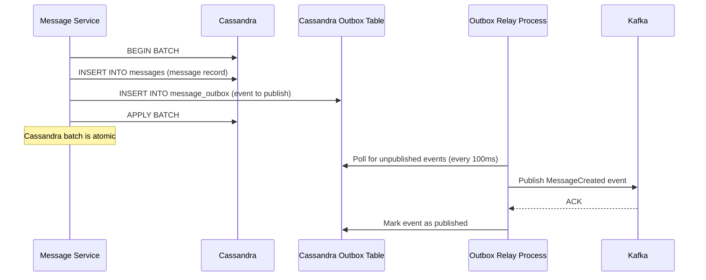

# 10 — Message Queue Design: Chat Application

---

## Objective

Design the Kafka-based message queue infrastructure for the chat platform. Cover topic architecture, partition strategy, consumer group design, delivery guarantees, dead letter queues, retry mechanisms, and the interplay between Kafka (durable bus) and Redis Pub/Sub (ephemeral bus).

---

## Dual-Bus Architecture Rationale

The system intentionally uses two queuing technologies:

| Bus | Technology | Latency | Durability | When |
|-----|-----------|---------|-----------|------|
| Real-time delivery bus | Redis Pub/Sub | < 1ms | None | Push to live WebSocket connections |
| Durable integration bus | Apache Kafka | 10–50ms | Yes (3 replicas) | Cross-service events, offline sync, audit |

**The rule**: Every message is written to Cassandra first, then published to Kafka. Redis Pub/Sub is used only for the live delivery path (after Kafka publish is guaranteed). This means if Redis Pub/Sub fails, the message is still safe in Cassandra and Kafka — the recipient will get it on reconnect.

---

## Kafka Topic Architecture

### Core Topics

```
chat.message.created
  Purpose:    New message created; trigger fan-out and search indexing
  Partition:  By conversation_id (all events for a conv go to same partition)
  Partitions: 1,000 (pre-provisioned for 1M msg/sec peak)
  Replicas:   3 (ACKS=all for producer)
  Retention:  7 days
  Consumers:  Fan-Out Service, Search Indexer, Analytics Pipeline

chat.message.delivered
  Purpose:    Update delivery receipts and notify sender
  Partition:  By conversation_id
  Partitions: 500
  Replicas:   3
  Retention:  24 hours (receipt events are processed quickly)
  Consumers:  Message Service (write to Cassandra), Fan-Out (notify sender)

chat.message.read
  Purpose:    Mark messages as read; update last_read_seq in conversation_members
  Partition:  By conversation_id
  Partitions: 500
  Replicas:   3
  Retention:  24 hours
  Consumers:  Conversation Service, Fan-Out (blue ticks to sender)

chat.message.edited
  Purpose:    Notify recipients that a message content was updated
  Partition:  By conversation_id
  Partitions: 200
  Replicas:   3
  Retention:  7 days
  Consumers:  Fan-Out Service, Search Indexer (re-index updated content)

chat.message.deleted
  Purpose:    Fan-out delete events; remove from search index
  Partition:  By conversation_id
  Partitions: 200
  Replicas:   3
  Retention:  7 days
  Consumers:  Fan-Out Service, Search Indexer

chat.presence.changed
  Purpose:    Broadcast user online/offline status to conversation partners
  Partition:  By user_id
  Partitions: 200
  Replicas:   2 (presence less critical than messages)
  Retention:  1 hour
  Consumers:  Fan-Out Service

chat.notification.offline
  Purpose:    Push notification delivery for offline users
  Partition:  By user_id
  Partitions: 500
  Replicas:   3
  Retention:  24 hours (after 24 hours, push is irrelevant)
  Consumers:  Notification Service

chat.conversation.events
  Purpose:    Member add/remove, group creation, settings changes
  Partition:  By conversation_id
  Partitions: 200
  Replicas:   3
  Retention:  30 days
  Consumers:  Fan-Out Service, Analytics

chat.message.dlq
  Purpose:    Dead letter queue for failed fan-out messages
  Partition:  By conversation_id
  Partitions: 100
  Replicas:   3
  Retention:  30 days
  Consumers:  Manual reprocessing, alerting
```

---

## Partition Count Justification

### `chat.message.created`

Target throughput: 1M messages/second at peak
Kafka partition throughput: ~100K–200K messages/sec per partition (with replication overhead)

```
Partitions needed = peak_throughput / partition_throughput
                  = 1,000,000 / 1,000 (targeting 1K msg/sec per partition for headroom)
                  = 1,000 partitions
```

Why 1K msg/sec per partition (well below the 100K limit)?
- Each consumer processes one partition at a time
- Consumer processing (Redis Pub/Sub publishes) takes ~1ms per message
- 1 consumer thread handles ~1K msg/sec
- 1,000 partitions → 1,000 consumer threads in the Fan-Out consumer group

---

## Consumer Group Design

### Fan-Out Service Consumer Group

```
Consumer Group: fanout-service
Topics subscribed: chat.message.created, chat.message.edited, chat.message.deleted

Instances: 50 pods × 20 threads = 1,000 consumer threads
Partition assignment: Each consumer thread handles assigned partitions
Commit interval: After every batch (auto-commit disabled — manual commit after fan-out completes)
```

**Why manual commit?**
If the consumer commits offset before completing the fan-out, and then the pod dies, those messages are never re-fanned. Manual commit only after Redis Pub/Sub publishes and offline notification publishes ensures at-least-once delivery.

### Message Service Consumer Group (Receipt Updates)

```
Consumer Group: message-service-receipts
Topics: chat.message.delivered, chat.message.read

Processing: Batch update Cassandra every 500ms
Commit: After Cassandra batch write ACKs
Parallelism: 20 consumer threads (receipt updates are lighter than message creation)
```

### Search Indexer Consumer Group

```
Consumer Group: search-indexer
Topics: chat.message.created, chat.message.edited, chat.message.deleted

Processing: Batch index to Elasticsearch every 2 seconds
Acceptable lag: 5 seconds (messages don't need to be searchable instantly)
Error handling: On Elasticsearch error → retry 3× → DLQ (search-specific DLQ)
```

---

## Producer Configuration

### Message Service (Publishing `message.created`)

```yaml
acks: all                        # wait for leader + 2 replica ACKs
retries: 3                       # retry on transient failure
retry.backoff.ms: 100
max.block.ms: 5000               # fail fast if Kafka is unavailable (don't block write path)
compression.type: lz4            # reduces bandwidth for JSON payloads
batch.size: 32768                # 32 KB batching
linger.ms: 5                     # wait 5ms for batching before send
enable.idempotence: true         # exactly-once producer semantics (dedup at Kafka level)
transactional.id: msg-svc-{id}  # Kafka transaction for Outbox pattern
```

**`acks: all` + `enable.idempotence: true` + `transactional.id`** = exactly-once Kafka producer. Combined with QUORUM Cassandra write, no message can be lost or duplicated at the infrastructure level.

### WebSocket Server (Publishing delivery/read receipts)

```yaml
acks: 1                          # leader only — faster, receipt loss is acceptable
retries: 1
compression.type: lz4
batch.size: 65536
linger.ms: 50                    # batch receipts aggressively (not real-time critical)
```

Receipt events are high-volume but less critical — occasional loss is acceptable (client will reconcile on next sync).

---

## Outbox Pattern for Message Durability

**Problem**: If the Message Service writes to Cassandra but then crashes before publishing to Kafka, the message is persisted but no one gets notified. It becomes a "ghost message" — stored but undelivered.

**Solution**: Outbox pattern



**Cassandra Outbox Table**:
```sql
CREATE TABLE chat.message_outbox (
    shard_id        INT,          -- 0-9, rotate for read distribution
    created_at      TIMESTAMP,
    event_id        UUID,
    event_type      TEXT,
    payload         TEXT,         -- JSON serialized event
    published       BOOLEAN,
    PRIMARY KEY ((shard_id), created_at, event_id)
) WITH CLUSTERING ORDER BY (created_at ASC, event_id ASC)
  AND default_time_to_live = 86400;  -- auto-delete after 24h
```

The Outbox Relay is a separate lightweight process that reads unpublished events and publishes to Kafka. It can have multiple instances (leader election via Redis lock to prevent duplicate publishing).

**Tradeoff**: Adds ~50ms latency to the Kafka publish (polling interval). Acceptable because Kafka is not on the real-time path (Redis Pub/Sub handles live delivery).

---

## Retry Strategy

### Consumer Retry on Processing Failure

Fan-Out Service retry behavior:

```
Attempt 1: Process message
           If Redis unavailable → retry with backoff
           
Attempt 2: 100ms delay → retry
           
Attempt 3: 1 second delay → retry
           
After 3 failures:
  → Publish to chat.message.dlq with failure_reason
  → Commit offset (don't block the partition for other messages)
  → Alert: if DLQ depth > 1000 messages → PagerDuty
```

**Why commit offset even on failure?**
Not committing blocks the entire partition — all subsequent messages are held back. DLQ captures the failure for recovery. The alternative (blocking) can cascade to full consumer lag.

### Dead Letter Queue Processing

DLQ consumers run periodically (every 15 minutes):
1. Read from `chat.message.dlq`
2. Check if the failure condition is resolved (e.g., Redis back online)
3. If yes: re-process the message (re-publish to original topic)
4. If still failing: increment failure_count; after 5 retries → mark as permanently failed, store in PostgreSQL `failed_deliveries` table

---

## Exactly-Once vs At-Least-Once

| Operation | Guarantee | Implementation |
|-----------|----------|---------------|
| Message write to Cassandra | Exactly-once (idempotency key) | `idempotency_key` → deduplicate before INSERT |
| Publish to Kafka | Exactly-once | Kafka idempotent producer + transactions |
| Fan-out Redis Pub/Sub | At-most-once (ephemeral) | Redis Pub/Sub has no delivery guarantee |
| Fan-out to offline (Kafka) | At-least-once | Manual offset commit after publish |
| Receipt update to Cassandra | At-least-once | Cassandra LWT (Lightweight Transaction) for idempotent updates |

**For message delivery, the system is at-least-once end-to-end**. The client-side `message_id` is the deduplication key — clients discard messages they've already received (based on `message_id`).

---

## Kafka Cluster Sizing

| Parameter | Value |
|-----------|-------|
| Peak throughput | 1M msg/sec × 1KB avg = 1 GB/s |
| Kafka broker write throughput | ~500 MB/s per broker (SSD) |
| Brokers needed for throughput | 1 GB/s × 3 replicas / 500 MB/s = **6 brokers minimum** |
| Brokers for partition leadership | 1,000 partitions / 200 per broker = **5 brokers** |
| Production cluster | **12 brokers** (2× safety margin + headroom) |
| Replication factor | 3 (survives 2 broker failures) |
| Min ISR | 2 (producer acks=all requires 2 replicas in-sync) |
| Retention total storage | 7 days × 1 GB/s × 86400 × 3 replicas = **~1.8 PB** |
| Storage per broker | 1.8 PB / 12 = **150 TB per broker** (use cloud-attached storage) |

---

## Redis Pub/Sub Design

### Channel Naming

| Channel | Published By | Subscribed By |
|---------|-------------|--------------|
| `ws:server:{serverId}` | Fan-Out Service | That specific WS server |
| `conv:typing:{convId}` | Presence Service | All WS servers with members of that conversation |
| `conv:presence:{convId}` | Presence Service | All WS servers with members of that conversation |

**Subscriptions per WS server**:
- 1 channel for server-level delivery (`ws:server:{serverId}`) — constant
- N channels for typing/presence per active conversation — managed dynamically

WS servers subscribe and unsubscribe to conversation channels as users connect/disconnect or open/close conversations.

### Redis Pub/Sub Limitations

| Limitation | Mitigation |
|-----------|-----------|
| No message durability | OK — Kafka is the durable layer. Redis Pub/Sub is only for live connections |
| Slow subscriber blocks fast one | Not applicable — each WS server is its own subscriber |
| No message replay | OK — offline users use Kafka/Cassandra for sync |
| Redis Pub/Sub is single-threaded per channel | Use `ws:server:{serverId}` channel — one channel per WS server, high throughput per channel |

### Alternative: Redis Streams

Redis Streams provide persistence + consumer groups, unlike Pub/Sub. However, for live WebSocket delivery:
- Pub/Sub latency: < 0.5ms
- Streams consumer group latency: 1–5ms (polling interval)
- For 100M messages/day real-time delivery, 0.5ms vs 5ms matters

Redis Streams could replace Kafka for smaller scale (< 100K msg/sec) but not at WhatsApp scale.
