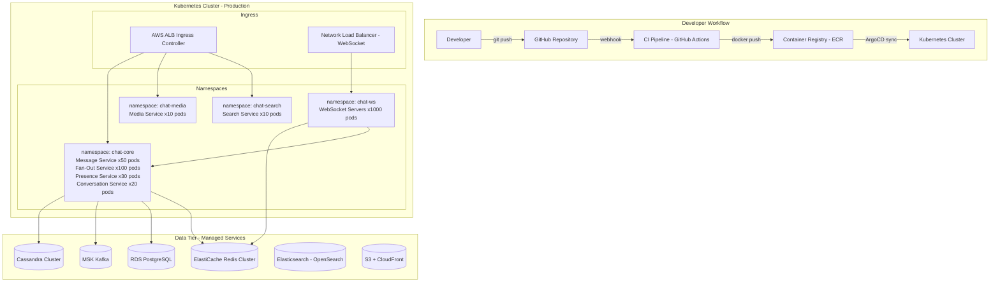

# 13 — Deployment Architecture: Chat Application

---

## Objective

Define the containerization, Kubernetes deployment, CI/CD pipeline, environment strategy, and production deployment patterns for the chat platform. Cover how each service is deployed, scaled, and updated without dropping connections or losing messages.

---

## High-Level Deployment View



---

## Service Deployment Specifications

### WebSocket Servers

```yaml
# Deployment spec (abbreviated)
kind: Deployment
metadata:
  name: websocket-server
  namespace: chat-ws
spec:
  replicas: 1000
  strategy:
    type: RollingUpdate
    rollingUpdate:
      maxUnavailable: 0      # Never reduce below desired — connections cannot be interrupted
      maxSurge: 50           # Bring up new pods before removing old ones
  template:
    spec:
      containers:
      - name: ws-server
        image: chat/ws-server:v2.1.0
        resources:
          requests:
            memory: "12Gi"
            cpu: "4"
          limits:
            memory: "16Gi"
            cpu: "8"
        ports:
        - containerPort: 8080  # HTTP upgrade to WebSocket
        livenessProbe:
          httpGet:
            path: /health
            port: 8080
          initialDelaySeconds: 30
          periodSeconds: 10
          failureThreshold: 3
        readinessProbe:
          httpGet:
            path: /ready
            port: 8080
          periodSeconds: 5
        lifecycle:
          preStop:
            exec:
              command: ["/bin/sh", "-c", "sleep 60"]  # 60-second drain before pod stops
```

**Why `maxUnavailable: 0`?**
WebSocket servers hold live connections. If a pod is terminated before connections are migrated, users experience disconnects. Setting `maxUnavailable: 0` + `maxSurge: 50` means new pods are started and verified healthy before old pods are drained.

**Connection drain during rolling update**:
1. Kubernetes sends SIGTERM to pod
2. `preStop` hook sleeps 60 seconds — pod stops accepting new connections (removed from service)
3. Existing connections are allowed to close naturally or time out
4. Pod exits; Kubernetes terminates it after `terminationGracePeriodSeconds: 90`

### Message Service

```yaml
kind: Deployment
metadata:
  name: message-service
spec:
  replicas: 50
  strategy:
    type: RollingUpdate
    rollingUpdate:
      maxUnavailable: 5
      maxSurge: 10
  template:
    spec:
      containers:
      - name: message-service
        resources:
          requests:
            memory: "4Gi"
            cpu: "2"
          limits:
            memory: "8Gi"
            cpu: "4"
```

Message Service is stateless — rolling update is straightforward. In-flight gRPC calls fail fast; WS servers retry automatically.

### Fan-Out Service

```yaml
kind: Deployment
metadata:
  name: fanout-service
spec:
  replicas: 100   # starts here, HPA scales up to 500
---
kind: HorizontalPodAutoscaler
metadata:
  name: fanout-service-hpa
spec:
  scaleTargetRef:
    apiVersion: apps/v1
    kind: Deployment
    name: fanout-service
  minReplicas: 100
  maxReplicas: 500
  metrics:
  - type: External
    external:
      metric:
        name: kafka_consumer_lag
        selector:
          matchLabels:
            consumer_group: fanout-service
            topic: chat.message.created
      target:
        type: AverageValue
        averageValue: "1000"  # Scale out when avg lag per pod > 1000 messages
```

Fan-Out scales based on Kafka consumer lag — the most accurate signal for whether it's keeping up with message volume.

---

## CI/CD Pipeline

### Pipeline Stages

```mermaid
graph LR
    Push[git push] --> Build[Build Stage\ncompile + unit tests]
    Build --> Scan[Security Scan\nSonarQube + Snyk]
    Scan --> DockerBuild[Docker Build\nmulti-stage Dockerfile]
    DockerBuild --> IntTest[Integration Tests\nTestcontainers]
    IntTest --> Push2[Push to ECR\ntagged with git SHA]
    Push2 --> Deploy_Staging[Deploy to Staging\nArgoCD sync]
    Deploy_Staging --> E2ETest[E2E Tests\nReal WebSocket tests]
    E2ETest --> Deploy_Canary[Canary Deploy\n5% traffic]
    Deploy_Canary --> SLOCheck[SLO Gate\n15 min observation]
    SLOCheck --> Deploy_Full[Full Rollout\nArgoCD progressive]
```



### GitHub Actions CI Workflow

```yaml
name: CI/CD Pipeline
on:
  push:
    branches: [main]

jobs:
  build:
    runs-on: ubuntu-latest
    steps:
      - uses: actions/checkout@v4
      - name: Build and Unit Test
        run: ./gradlew build test
      - name: Security Scan
        run: snyk test --severity-threshold=high
      - name: Docker Build
        run: |
          docker build -t chat/message-service:${{ github.sha }} .
          docker push $ECR_REGISTRY/chat/message-service:${{ github.sha }}

  integration-test:
    needs: build
    runs-on: ubuntu-latest
    steps:
      - name: Integration Tests
        run: ./gradlew integrationTest
        # Starts Cassandra, Redis, Kafka via Testcontainers
        # Tests real message send → Cassandra write → Kafka publish flow

  deploy-staging:
    needs: integration-test
    environment: staging
    steps:
      - name: Update Staging Manifests
        run: |
          sed -i "s|image: .*|image: $ECR_REGISTRY/chat/message-service:${{ github.sha }}|" \
            k8s/staging/message-service.yaml
          git commit -am "Deploy ${{ github.sha }} to staging"
          git push  # ArgoCD picks this up automatically

  deploy-production:
    needs: deploy-staging
    environment: production
    steps:
      - name: Canary Deploy (5%)
        run: kubectl apply -f k8s/production/canary-message-service.yaml
      - name: Wait and Verify SLOs
        run: ./scripts/check-slos.sh --duration=15m --max-error-rate=0.1%
      - name: Full Rollout
        run: kubectl apply -f k8s/production/message-service.yaml
```

---

## Deployment Strategies

### WebSocket Servers: Blue-Green with Connection Drain

Standard rolling update is dangerous for WebSocket servers (drops connections). Strategy:

```
Step 1: Provision "green" WS servers alongside existing "blue" servers
Step 2: Update load balancer to route NEW connections to green servers only
Step 3: Blue servers stop accepting new connections (readinessProbe returns 503)
Step 4: Wait for blue server connections to drain naturally (up to 10 minutes)
Step 5: Terminate blue servers after connections drop to 0 (or after 10-min timeout)
Step 6: Complete rollout
```

In Kubernetes: Use a second Deployment (`ws-server-green`) with a shared Service. Label selector switches between blue and green.

### Message Service: Rolling Update with Canary

```
Step 1: Deploy 5% of pods with new version (canary)
Step 2: Monitor: message_send_error_rate, cassandra_write_latency, kafka_publish_latency
Step 3: If SLOs met for 15 minutes → roll out to 100%
Step 4: If SLO violation detected → immediately rollback canary pods (kubectl rollout undo)
```

Canary traffic is selected at random by Kubernetes (no user affinity needed — Message Service is stateless).

### Fan-Out Service: Rolling Update (Kafka consumer rebalance)

When Fan-Out pods are replaced:
1. Old pod finishes processing current Kafka batch → commits offset → exits
2. Kafka triggers consumer group rebalance → reassigns partitions to remaining pods
3. New pod starts → assigned partitions → begins consuming
4. Rebalance latency: 10–30 seconds (brief lag increase is acceptable)

---

## Environment Strategy

| Environment | Purpose | Scale | Data |
|------------|---------|-------|------|
| **Local** | Developer testing | Single-machine (Docker Compose) | Synthetic test data |
| **Integration** | CI pipeline testing | Testcontainers (ephemeral) | Synthetic |
| **Staging** | Pre-production validation | 5% of production scale | Anonymized production snapshot |
| **Performance** | Load testing | 100% of production scale | Synthetic high-volume |
| **Production** | Live traffic | Full scale | Real user data |

### Docker Compose for Local Development

```yaml
# docker-compose.yml
services:
  cassandra:
    image: cassandra:4.1
    ports: ["9042:9042"]
    environment:
      CASSANDRA_DC: local

  redis:
    image: redis:7
    ports: ["6379:6379"]

  kafka:
    image: confluentinc/cp-kafka:7.5
    ports: ["9092:9092"]
    environment:
      KAFKA_AUTO_CREATE_TOPICS_ENABLE: "true"

  message-service:
    image: chat/message-service:local
    depends_on: [cassandra, redis, kafka]
    environment:
      CASSANDRA_HOSTS: cassandra
      REDIS_HOST: redis
      KAFKA_BOOTSTRAP: kafka:9092
```

Single command: `docker-compose up` → full local environment. Developers don't need to install Cassandra/Redis/Kafka on their machine.

---

## Infrastructure as Code

All infrastructure is managed via Terraform:

```
terraform/
  modules/
    cassandra-cluster/    # EC2 instances, storage volumes, security groups
    redis-cluster/        # ElastiCache Redis Cluster
    kafka-cluster/        # MSK (Managed Streaming for Kafka)
    postgresql/           # RDS PostgreSQL + read replicas
    kubernetes/           # EKS cluster, node groups, IRSA roles
    cloudfront/           # CDN distribution + signing key pair
    s3/                   # Media bucket + lifecycle policies
  environments/
    staging/
      main.tf
      variables.tf
    production/
      main.tf
      variables.tf
```

**Cassandra**: NOT managed as a cloud service (no AWS equivalent). Deployed as EC2 instances with EBS NVMe volumes. Operator: DataStax Cassandra Kubernetes Operator manages pod placement, repair scheduling, and rolling upgrades.

---

## Feature Flags

Deployed via a feature flag service (LaunchDarkly or self-hosted Unleash):

| Flag | Purpose |
|------|---------|
| `enable_message_reactions` | Roll out emoji reactions gradually |
| `enable_e2ee` | Toggle E2EE per user cohort |
| `enable_large_group_lazy_fanout` | Enable optimized fan-out for groups > 500 |
| `enable_message_search` | Enable/disable search per user |
| `fanout_max_group_size` | Dynamically limit group message fan-out |

Feature flags allow:
- Controlled rollout to % of users without code deployment
- Kill switch for problematic features without rollback
- A/B testing of UI changes

---

## Secret Management in Kubernetes

```yaml
# Secrets stored in AWS Secrets Manager, not Kubernetes Secrets
# Retrieved at pod startup via AWS Secrets Manager CSI Driver

kind: SecretProviderClass
spec:
  provider: aws
  parameters:
    objects: |
      - objectName: "chat/prod/cassandra-password"
        objectType: "secretsmanager"
      - objectName: "chat/prod/redis-auth-token"
        objectType: "secretsmanager"
      - objectName: "chat/prod/jwt-private-key"
        objectType: "secretsmanager"
```

Secrets are mounted as files into pods — never stored as Kubernetes Secrets (which are base64-encoded, not encrypted by default without additional tooling).

---

## Disaster Recovery Runbook

### Recovery Time Objective: < 5 minutes

```
T+0:   AWS region incident confirmed
T+1:   Route53 health check fails → automatic DNS failover to backup region
T+2:   Backup region load balancers receive traffic
T+3:   WebSocket clients reconnect to backup region servers
T+4:   Clients send last_sync_seq → backup region serves messages from replicated Cassandra
T+5:   All features operational in backup region
```

### Backup Region Pre-warming

To achieve 5-minute RTO:
- Backup region runs at 10% capacity continuously (warm standby)
- Cassandra replication active (all writes to primary are async-replicated)
- Kafka MirrorMaker 2 replicates all topics
- Redis: pre-seeded with recent conversation metadata on startup

Full cold-start would take 30+ minutes (seed databases, warm caches). Warm standby collapses this to 5 minutes.
