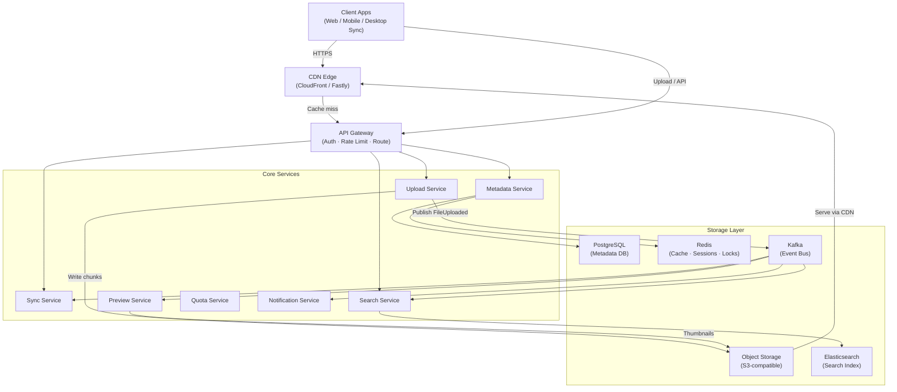
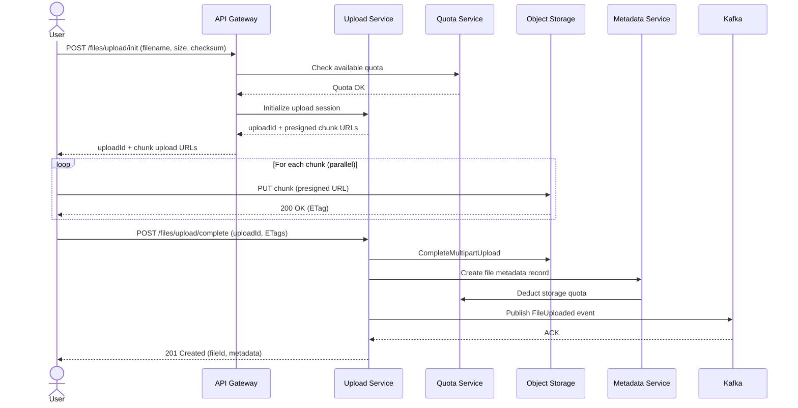
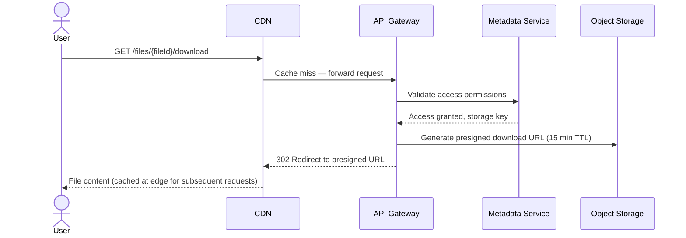
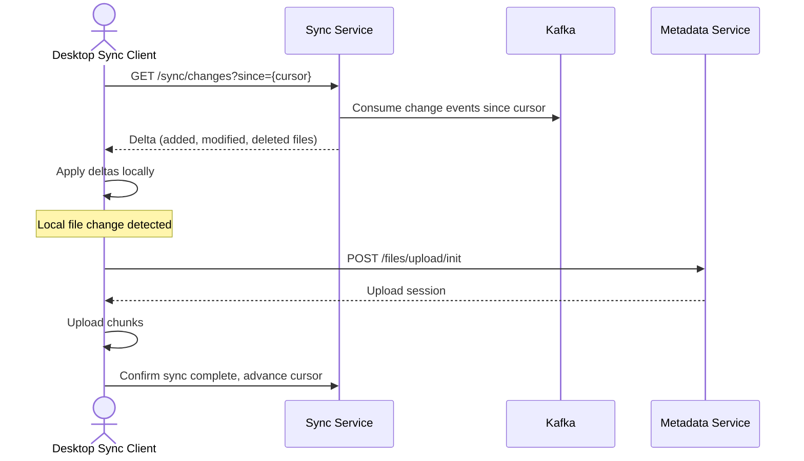

# 01 — High-Level Architecture: File Storage System

## Objective
Define the overall system architecture, justify the architectural style chosen, describe all major service components, and provide visual diagrams of the system's structure and key request flows.

---

## Architecture Choice: Event-Driven Microservices

### Why Not a Modular Monolith?
A modular monolith works well up to ~10M users and a single engineering team. For a global file storage system at Google Drive / Dropbox scale:
- Upload throughput is completely independent of metadata operations — different scaling axes.
- Transcoding/preview generation is CPU-intensive and should scale independently without affecting upload latency.
- Sync engine, versioning, sharing, and search have fundamentally different consistency and latency requirements.
- Teams owning different domains need independent deployability.

### Why Microservices + Event-Driven?
- File upload, chunk storage, metadata indexing, notification, and sync are naturally asynchronous stages.
- Decoupling via events (Kafka) allows each service to scale and fail independently.
- Event sourcing on file changes enables the sync client's change feed without tight coupling.

### When NOT to Use This Architecture
- Team size < 10 engineers: operational overhead of 8+ services will dominate.
- Early-stage startup: deploy a monolith first, extract services as bottlenecks emerge.
- Strict transactional requirements across every operation: event-driven eventual consistency is a tradeoff.

---

## System Components

| Service | Responsibility |
|---------|----------------|
| **API Gateway** | Auth, rate limiting, routing, TLS termination |
| **Upload Service** | Chunked/resumable upload, chunk manifest, presigned URL generation |
| **Storage Service** | Abstraction over object storage (S3/GCS), chunk deduplication |
| **Metadata Service** | File/folder hierarchy, versioning, sharing permissions |
| **Sync Service** | Change feed, delta computation for sync clients |
| **Search Service** | Elasticsearch-backed file/folder search |
| **Preview Service** | Thumbnail generation, PDF preview, video preview |
| **Notification Service** | Share invitations, collaboration events, quota alerts |
| **Quota Service** | Per-user/team storage accounting, enforcement |
| **CDN Layer** | Edge caching for downloads and previews |

---

## High-Level Architecture Diagram

---

## Upload Flow (Sequence Diagram)

---

## Download Flow

---

## Sync Client Flow

---

## Service Communication Strategy

| Interaction | Protocol | Justification |
|-------------|----------|---------------|
| Client → API Gateway | HTTPS REST | Industry standard, firewall-friendly |
| Upload Service → Object Storage | S3 multipart API | Native protocol, presigned URL offloads transfer |
| Services → Kafka | Async events | Decoupling, durability, replay capability |
| Metadata Service → PostgreSQL | JDBC/JOOQ | ACID for metadata consistency |
| Search Service ← Kafka | Consumer | Near-real-time index updates |
| API Gateway → Services | HTTP/gRPC | gRPC for internal low-latency paths (sync, quota) |

---

## Migration Path: Monolith → Microservices

| Phase | Action |
|-------|--------|
| **Phase 0** | Single Spring Boot app with modular packages: upload, metadata, search, sync |
| **Phase 1** | Extract Upload Service first (highest load, independent scaling) |
| **Phase 2** | Extract Search Service (Elasticsearch dependency isolates it cleanly) |
| **Phase 3** | Extract Sync Service (stateful, needs change feed from Kafka) |
| **Phase 4** | Extract Preview/Notification (async, low risk) |
| **Phase 5** | Full microservices with service mesh (Istio) |

---

## Tradeoffs

| Decision | Pro | Con |
|----------|-----|-----|
| Presigned URLs (client → S3 direct) | Upload bypasses app servers, massive bandwidth saving | Short-lived URL management, quota enforcement timing gap |
| Event-driven metadata updates | Loose coupling, async indexing | Eventual consistency window (search may lag seconds) |
| Separate Quota Service | Single source of truth for storage accounting | Extra hop per upload, needs distributed locking |
| CDN for downloads | Edge caching, low latency globally | Cache invalidation on file update/delete is tricky |

---

## Alternatives Considered

| Alternative | Reason Rejected |
|-------------|-----------------|
| GraphQL API | File upload streaming is awkward in GraphQL; REST + multipart is standard |
| Single database for all | Doesn't scale — metadata vs blob storage have different scaling profiles |
| Server-side upload relay | App servers become bandwidth bottleneck at 6 GB/s ingress |
| Polling-based sync | Inefficient at scale; misses changes, high RPS on metadata DB |

---

## Risks

- **Presigned URL abuse**: If leaked, anyone can upload to your bucket. Mitigate: short TTL (15 min), bucket policy enforcement.
- **Kafka consumer lag**: If Search consumer falls behind, users see stale search results. Monitor lag; set SLO.
- **Metadata DB as bottleneck**: Heavy browse operations at 11,600 RPS require read replicas + Redis cache.
- **Deduplication race condition**: Two users uploading same chunk simultaneously — use conditional writes (if-not-exists).

---

## Interview-Level Discussion Points

- **Why presigned URLs instead of streaming through app servers?** — At 6 GB/s ingress, app servers become the bottleneck. Presigned URLs offload transfer entirely to object storage infrastructure.
- **How do you handle upload resumption?** — Store chunk manifest (which ETags arrived) in Redis with uploadId key. Client can resume from last confirmed chunk.
- **How does the sync client know what changed?** — Kafka-backed change feed with cursor (offset) per device. Client polls Sync Service with its last cursor.
- **What's your consistency model?** — Metadata: strong (PostgreSQL primary). Search: eventual (Kafka → ES, ~seconds lag). CDN: eventual (cache invalidation propagation).
