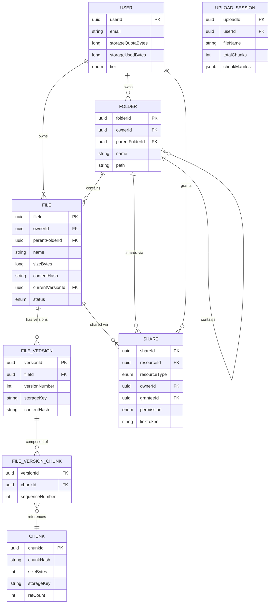

# 02 — Domain Modeling: File Storage System

## Objective
Identify all core domain entities, their attributes, relationships, and behaviors that form the foundation of a production file storage system. Domain modeling drives database schema, API design, and service boundaries.

---

## Core Domain Entities

### 1. User
Represents an individual or identity that owns storage quota and can create files.

| Attribute | Type | Notes |
|-----------|------|-------|
| userId | UUID | Primary identifier |
| email | string | Unique, verified |
| displayName | string | — |
| storageQuotaBytes | long | Total allowed bytes |
| storageUsedBytes | long | Current usage (atomic counter) |
| tier | enum | FREE / PRO / BUSINESS / ENTERPRISE |
| createdAt | timestamp | — |
| status | enum | ACTIVE / SUSPENDED / DELETED |

### 2. File
The central entity — represents a logical file in the system. Decoupled from physical storage (a File points to chunks, not raw bytes).

| Attribute | Type | Notes |
|-----------|------|-------|
| fileId | UUID | Primary identifier |
| ownerId | UUID | FK → User |
| parentFolderId | UUID | FK → Folder (nullable for root) |
| name | string | Original filename |
| mimeType | string | Detected at upload |
| sizeBytes | long | Total file size |
| contentHash | string | SHA-256 of entire file |
| currentVersionId | UUID | FK → FileVersion |
| status | enum | UPLOADING / ACTIVE / TRASHED / DELETED |
| isShared | boolean | Has active share links |
| uploadedAt | timestamp | — |
| lastModifiedAt | timestamp | Updated on new version |

**Key design decision**: `status` field implements soft delete (TRASHED → DELETED after 30 days). Actual blob deletion is async after permanent delete confirmation.

### 3. FileVersion
Each edit or re-upload creates a new version. Versions are immutable once created.

| Attribute | Type | Notes |
|-----------|------|-------|
| versionId | UUID | Primary identifier |
| fileId | UUID | FK → File |
| versionNumber | int | Monotonically increasing per file |
| sizeBytes | long | Size of this version |
| contentHash | string | SHA-256 of this version's content |
| storageKey | string | Object storage key (path in S3) |
| uploadedBy | UUID | FK → User |
| createdAt | timestamp | — |
| isCurrentVersion | boolean | Denormalized from File.currentVersionId |

### 4. Folder
Represents a hierarchical container. Folders can be nested arbitrarily deep.

| Attribute | Type | Notes |
|-----------|------|-------|
| folderId | UUID | Primary identifier |
| ownerId | UUID | FK → User |
| parentFolderId | UUID | FK → Folder (null = root) |
| name | string | Folder name |
| path | string | Materialized path (e.g. `/root/documents/2024/`) |
| createdAt | timestamp | — |
| status | enum | ACTIVE / TRASHED / DELETED |

**Materialized path** enables efficient subtree queries (find all children of folder X) without recursive CTE. Tradeoff: path must be updated on folder move (recursive update).

### 5. Chunk
A physical segment of a file's content, stored independently in object storage. Enables deduplication and resumable uploads.

| Attribute | Type | Notes |
|-----------|------|-------|
| chunkId | UUID | Primary identifier |
| chunkHash | string | SHA-256 of chunk content |
| sizeBytes | int | Typically 5–10 MB |
| storageKey | string | Object storage key |
| refCount | int | Number of FileVersions referencing this chunk |
| createdAt | timestamp | — |

**Deduplication**: `chunkHash` is globally unique. If two users upload the same chunk → only one physical object stored, `refCount` incremented. Deleting a file version decrements `refCount`; physical deletion only when `refCount = 0`.

### 6. FileVersionChunk (Join Entity)
Maps a FileVersion to its ordered list of chunks.

| Attribute | Type | Notes |
|-----------|------|-------|
| versionId | UUID | FK → FileVersion |
| chunkId | UUID | FK → Chunk |
| sequenceNumber | int | Chunk order in the file |

### 7. Share
Represents an access grant — a User sharing a file/folder with another user or generating a public link.

| Attribute | Type | Notes |
|-----------|------|-------|
| shareId | UUID | Primary identifier |
| resourceId | UUID | FK → File or Folder |
| resourceType | enum | FILE / FOLDER |
| ownerId | UUID | FK → User (granter) |
| shareType | enum | USER / PUBLIC_LINK |
| granteeId | UUID | FK → User (null if PUBLIC_LINK) |
| permission | enum | VIEW / COMMENT / EDIT |
| linkToken | string | URL-safe token for public links |
| expiresAt | timestamp | Optional expiry |
| isRevoked | boolean | — |
| createdAt | timestamp | — |

### 8. UploadSession
Tracks an in-progress chunked upload. Expires after 24 hours of inactivity.

| Attribute | Type | Notes |
|-----------|------|-------|
| uploadId | UUID | Primary identifier |
| userId | UUID | FK → User |
| fileName | string | — |
| totalSizeBytes | long | — |
| totalChunks | int | — |
| receivedChunks | int | Counter |
| chunkManifest | JSONB | {chunkIndex: {hash, etag, received}} |
| status | enum | IN_PROGRESS / COMPLETING / FAILED |
| createdAt | timestamp | — |
| expiresAt | timestamp | 24h after creation |

### 9. StorageQuota (Event-Sourced Ledger)
Each storage quota change (file uploaded, deleted, versioned) is recorded as an event. The current usage is the sum. Prevents the "check-then-update" race condition.

| Attribute | Type | Notes |
|-----------|------|-------|
| eventId | UUID | Primary identifier |
| userId | UUID | FK → User |
| delta | long | Positive (used) or negative (freed) bytes |
| reason | enum | FILE_UPLOADED / FILE_DELETED / VERSION_DELETED |
| referenceId | UUID | FK → FileVersion that caused the change |
| createdAt | timestamp | — |

**Alternative**: Atomic increment on `User.storageUsedBytes`. Simpler, but loses audit trail. At Google Drive scale, the event ledger provides reconciliation capability.

---

## Domain Entity Relationships

---

## Key Domain Behaviors

### File Deletion Flow
1. User deletes file → `File.status = TRASHED`, `File.trashedAt = now`.
2. After 30 days (or immediate "permanent delete"): `File.status = DELETED`.
3. Async cleanup job: for each FileVersion of the deleted file → decrement `Chunk.refCount` for each referenced chunk.
4. For chunks where `refCount = 0` → schedule for physical deletion from object storage.
5. Update `User.storageUsedBytes` (subtract).

### Deduplication Flow
1. Client computes SHA-256 hash of each chunk before upload.
2. Client sends chunk hash to Upload Service: "Do I need to upload this chunk?"
3. Upload Service queries `Chunk` table by `chunkHash`.
4. If found: skip upload, reference existing chunk in `FileVersionChunk`.
5. If not found: generate presigned URL, client uploads, new `Chunk` record created.

### Version Retention Policy
- Free tier: last 30 versions, max 30 days old.
- Pro tier: unlimited versions for 180 days.
- Business tier: unlimited versions for 1 year.
- Version deletion: decrement `refCount` on referenced chunks → garbage collect when `refCount = 0`.

---

## Interview-Level Discussion Points

- **Why separate File from FileVersion?** — A `File` is the logical object (has a name, owner, location in folder hierarchy). A `FileVersion` is an immutable snapshot of its content. This separation allows versioning without duplicating metadata. The current state is `File` + `File.currentVersionId`.
- **Why is Chunk globally deduplicated?** — Two users uploading the same 100 MB ISO → one physical 100 MB object in S3. `refCount = 2`. At Google Drive scale with millions of duplicate documents (same PDF shared across organizations), deduplication saves 20–40% storage. Client-side hashing before upload is called "smart sync" — only the hash travels across the network, not the bytes.
- **What's the risk of materialized path for folders?** — On folder rename or move, the `path` of all descendants must be updated (recursive UPDATE). For deep folder trees with many files, this can be slow. Mitigate with: async background update + optimistic UI (show new name immediately). Alternative: closure table (separate table of ancestor→descendant relationships) — more complex, better for arbitrary depth traversal.
- **Why model quota as an event ledger?** — Atomic `storageUsedBytes` is fine at small scale. At FAANG scale, concurrent uploads can create race conditions (read-modify-write on the same row under high contention). Event sourcing: each upload/delete writes a delta event, total usage is sum of deltas. Reconciliation job validates sum against actual objects in storage monthly.
