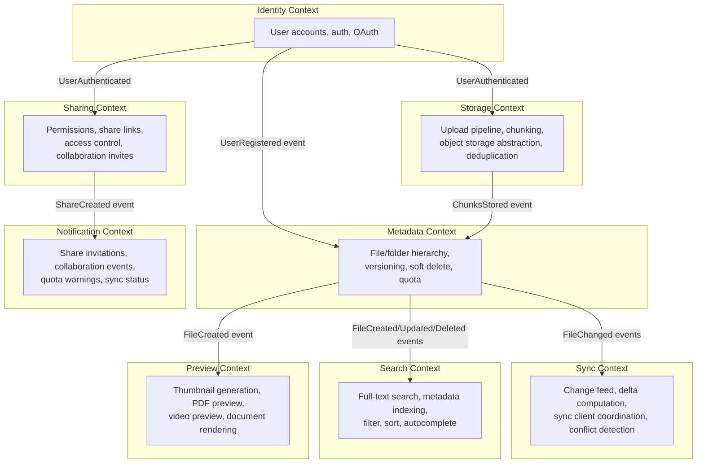

# 03 — DDD Boundaries: File Storage System

## Objective
Define the bounded contexts of the file storage system, establish clear ownership and language per context, map how contexts communicate, and justify the decomposition decisions. Poor boundary definition leads to tight coupling that prevents independent scaling and team ownership.

---

## Bounded Contexts Overview

---

## Context 1: Identity Context

### Responsibility
User registration, authentication, session management, OAuth2 integration (Google, Microsoft SSO).

### Ubiquitous Language
`Account`, `Session`, `AccessToken`, `RefreshToken`, `OAuthProvider`, `EmailVerification`

### Owns
- User account data (email, password hash, OAuth links)
- Session management (JWT issuance + validation)

### Does NOT Own
- Storage quota (owned by Metadata Context)
- File permissions (owned by Sharing Context)

### Integration
- Publishes `UserRegistered` event → Metadata Context creates default root folder and initializes quota.
- Publishes `AccountDeleted` event → Metadata Context schedules GDPR purge.
- All other contexts consume user identity via JWT validation (stateless — no cross-service calls at request time).

### Anti-Corruption Layer
Other contexts receive `UserId` (UUID) as an opaque identifier. They never call back to Identity Context to validate — JWT is self-contained. If Identity Context is unavailable, other contexts continue serving requests with cached token validation.

---

## Context 2: Storage Context

### Responsibility
Physical storage of file bytes: chunked upload pipeline, presigned URL generation, content-addressed chunk storage, deduplication, and object storage abstraction (S3 today, GCS tomorrow — without changing consumers).

### Ubiquitous Language
`UploadSession`, `Chunk`, `ChunkHash`, `PresignedUrl`, `StorageKey`, `MultipartUpload`, `ChunkManifest`

### Owns
- `UploadSession` lifecycle
- `Chunk` table (physical storage index)
- Object storage interaction (S3 API calls)

### Does NOT Own
- Logical file metadata (File, Folder) — those are Metadata Context
- Access control — that's Sharing Context

### Integration
- Publishes `UploadCompleted` event with `{uploadId, contentHash, storageKey, sizeBytes}` → Metadata Context creates FileVersion record.
- Consumes `FileVersionDeleted` event → decrements chunk `refCount`, schedules physical deletion when `refCount = 0`.

### Key Design Decision: Deduplication Boundary
Content-addressed storage (deduplication) is entirely within Storage Context. Metadata Context has no concept of chunk storage — it only receives a `storageKey` opaque reference. This keeps the deduplication algorithm encapsulated.

---

## Context 3: Metadata Context

### Responsibility
Logical file system: file and folder hierarchy, file versioning, soft delete and trash, storage quota accounting, and consistency of the logical file tree.

### Ubiquitous Language
`File`, `Folder`, `FileVersion`, `FileTree`, `StorageQuota`, `TrashBin`, `VersionHistory`, `MoveOperation`

### Owns
- `files`, `folders`, `file_versions`, `storage_quota_events` tables
- File state machine (UPLOADING → ACTIVE → TRASHED → DELETED)
- Quota enforcement (check-and-deduct on upload, add-back on delete)

### Does NOT Own
- Physical storage (Storage Context)
- Access decisions (Sharing Context — Metadata Context knows who owns a file but not who has been granted access)

### Integration
- Consumes `UploadCompleted` → creates `FileVersion`, updates `File.currentVersionId`, records quota event.
- Publishes `FileCreated`, `FileUpdated`, `FileDeleted`, `FileMoved` events → consumed by Search, Sync, Preview, Notification contexts.
- Publishes `FileVersionDeleted` → consumed by Storage Context for chunk `refCount` management.

### Critical Consistency Requirement
Quota enforcement must be atomic: `check quota available` + `deduct quota` cannot be two separate operations (TOCTOU race). Solution: PostgreSQL row-level lock on the quota counter + conditional update in one transaction.

---

## Context 4: Sharing Context

### Responsibility
All aspects of access control: user-to-user sharing, public link generation, permission management (view/comment/edit), link revocation, and share expiry.

### Ubiquitous Language
`Share`, `Permission`, `Grantee`, `PublicLink`, `LinkToken`, `AccessGrant`, `Revocation`, `CollaborationInvite`

### Owns
- `shares` table
- Permission evaluation logic (given userId + resourceId → what permissions does this user have?)
- Link token generation and validation

### Does NOT Own
- File content (Storage Context)
- File metadata (Metadata Context — Sharing Context holds `resourceId` as an opaque UUID)

### Integration
- Consumes `FileDeleted` → revokes all associated shares (cascade).
- Consumes `UserDeleted` → revokes all shares where grantee is deleted user.
- Publishes `ShareCreated` → Notification Context sends invite email.
- Publishes `ShareRevoked` → Notification Context sends revocation notice.

### Access Check Flow (Anti-Corruption)
On every download request:
1. API Gateway validates JWT (Identity Context — stateless, no call).
2. Metadata Context confirms file exists and is ACTIVE.
3. Sharing Context answers: does `userId` have at least VIEW permission on `fileId`?
4. Only if yes → Storage Context generates presigned download URL.

This call sequence is synchronous on the hot path — must be < 50ms total. Cache Sharing Context decisions in Redis (TTL 60s) with invalidation on permission change.

---

## Context 5: Sync Context

### Responsibility
Enabling sync clients (desktop, mobile) to discover changes to their files since a given cursor, compute minimal deltas, and coordinate multi-device conflict detection.

### Ubiquitous Language
`SyncCursor`, `ChangeFeed`, `Delta`, `SyncState`, `DeviceRegistration`, `ConflictEvent`, `MergeStrategy`

### Owns
- `sync_cursors` table (per user per device, tracks last consumed change offset)
- `sync_events` table (ordered log of changes per user)
- Conflict detection logic

### Does NOT Own
- Actual file content (Storage Context)
- File metadata (Metadata Context — Sync Context reads events from it but doesn't own the data)

### Integration
- Consumes all `File*` events from Metadata Context → appends to user's sync event log.
- Sync client polls Sync Context with `since={cursor}` → receives ordered list of changes.
- On conflict detected (same file modified on two devices) → publishes `ConflictDetected` event → Notification Context alerts user.

### Conflict Resolution Strategy
| Strategy | When Used |
|----------|-----------|
| Last-write-wins | Simple files (images, PDFs) — user accepts potential data loss |
| Conflict copy | Both versions kept (file → "file (conflicted copy from Device B)") |
| Merge | Only for text files via diff/merge algorithm (optional V2 feature) |

---

## Context 6: Search Context

### Responsibility
Full-text and metadata search across files and folders for a user and their shared content. Near-real-time index maintenance.

### Ubiquitous Language
`SearchIndex`, `SearchResult`, `Relevance`, `Filter`, `Facet`, `IndexEvent`

### Owns
- Elasticsearch index (per user's accessible files)
- Search result ranking logic

### Integration
- Consumes `FileCreated`, `FileUpdated`, `FileDeleted`, `FileMoved` from Metadata Context → updates Elasticsearch index.
- Consumes `ShareCreated`, `ShareRevoked` from Sharing Context → updates index permissions (search only returns files user has access to).

### Critical Design: Search Scope
Search must respect permissions. A user searching "Q3 report" should only see files they own or were granted access to. Two strategies:
1. **Post-filter**: search all files, then filter by permissions (risk: leaks existence of files the user shouldn't know about).
2. **Index per user** (current design): each user's index contains only their accessible files. Permission changes trigger index update. Chosen for privacy correctness.

---

## Context 7: Preview Context

### Responsibility
Asynchronous generation of file previews: image thumbnails, PDF page previews, video poster frames.

### Ubiquitous Language
`PreviewJob`, `Thumbnail`, `PreviewStatus`, `PreviewVariant` (small/medium/large thumbnail)

### Owns
- Preview job queue (Kafka topic)
- Preview metadata (which previews exist for which fileVersionId)
- Preview storage keys in object storage

### Integration
- Consumes `FileCreated` → enqueues preview generation job.
- Writes preview images to object storage (same S3 bucket, different prefix).
- Publishes `PreviewGenerated` → Metadata Context stores preview URL reference.

---

## Context 8: Notification Context

### Responsibility
Delivery of all notifications to users: share invitations, collaboration updates, quota warnings, sync conflict alerts.

### Ubiquitous Language
`Notification`, `Channel` (email/push/in-app), `NotificationPreference`, `DeliveryStatus`

### Owns
- Notification delivery infrastructure
- User notification preferences

### Integration
- Purely a consumer — receives events from all other contexts and converts them to user-facing notifications.
- No other context calls Notification Context synchronously.

---

## Context Map Summary

| From | To | Integration Type | Events |
|------|----|-----------------|--------|
| Identity | Metadata | Published Event | UserRegistered, AccountDeleted |
| Storage | Metadata | Published Event | UploadCompleted |
| Metadata | Storage | Published Event | FileVersionDeleted |
| Metadata | Search | Published Event | FileCreated/Updated/Deleted/Moved |
| Metadata | Sync | Published Event | FileCreated/Updated/Deleted |
| Metadata | Preview | Published Event | FileCreated |
| Sharing | Notification | Published Event | ShareCreated, ShareRevoked |
| Sharing | Search | Published Event | ShareCreated, ShareRevoked |
| Sync | Notification | Published Event | ConflictDetected |

---

## Interview-Level Discussion Points

- **Why separate Storage and Metadata contexts?** — Storage Context handles bytes and deduplication. Metadata Context handles the logical file system. Mixing them creates a god service. Storage can be swapped (S3 → GCS) without touching Metadata. Metadata can add versioning rules without touching storage.
- **Where does quota enforcement live?** — Metadata Context. It is the source of truth for logical file size and ownership. Storage Context doesn't enforce quota — it would require cross-context knowledge (knowing owner's quota limit).
- **How does Search know what a user can see?** — Per-user index updated by events from both Metadata (file changes) and Sharing (permission changes). This is eventually consistent — a freshly shared file may not appear in search for a few seconds.
- **What's the ACL check latency on download?** — Sharing Context permission check is the hot path. Cache in Redis with `{userId}:{fileId}` key, TTL 60 seconds. On share revocation → invalidate cache key immediately. Sub-millisecond cache hit vs 10ms DB query.
