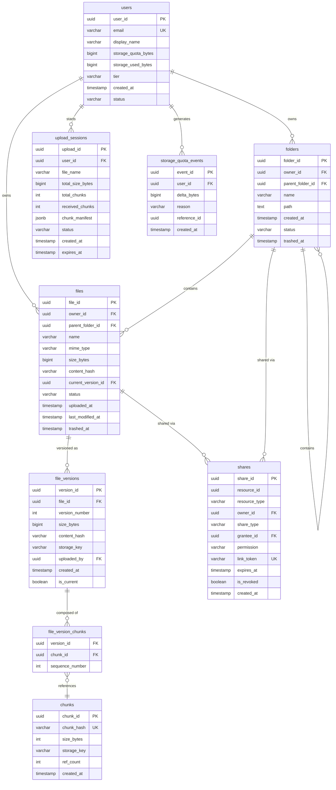

# 05 — Database Design: File Storage System

## Objective
Define the complete database schema, partitioning strategy, indexing approach, sharding considerations, and data archival strategy for a file storage system. The database must handle 11,600 RPS of metadata reads, 1,200 RPS of writes, and terabytes of metadata for hundreds of millions of files.

---

## Database Technology Choices

| Component | Technology | Justification |
|-----------|-----------|---------------|
| **Primary metadata store** | PostgreSQL (Aurora) | ACID transactions (quota enforcement), mature ecosystem, JSONB for chunk manifest |
| **Session / cache** | Redis | Sub-millisecond access for upload sessions, permission cache |
| **Search index** | Elasticsearch | Full-text search, faceted filtering, near-real-time indexing |
| **Object storage** | S3 (or compatible) | File bytes — not in PostgreSQL, ever |
| **Analytics** | ClickHouse / BigQuery | Cold query on file access patterns, storage analytics |

**Why not MongoDB?** — Quota enforcement requires ACID transactions across multiple collections. Flexible schema is not a benefit here — our schema is well-defined. PostgreSQL's JSONB covers the flexible parts (chunk manifest, version metadata).

**Why not Cassandra?** — Cassandra excels at write-heavy, single-partition reads. Our access patterns require complex JOINs (folder hierarchy, version lookup, permission check in one query). Cassandra would require denormalization that adds correctness complexity.

---

## ER Diagram



---

## Table Design Details

### `files` Table — Critical Considerations

```sql
-- Partial index for active files per owner (most frequent query pattern)
CREATE INDEX idx_files_owner_active ON files (owner_id, parent_folder_id) 
WHERE status = 'ACTIVE';

-- Index for trash cleanup job
CREATE INDEX idx_files_trashed_at ON files (trashed_at) 
WHERE status = 'TRASHED';

-- Index for deduplication check
CREATE UNIQUE INDEX idx_files_content_hash ON files (content_hash) 
WHERE status = 'ACTIVE';
```

### `chunks` Table — Deduplication Core

The `chunk_hash` column is the deduplication key. Before any upload, the client queries this table:
```sql
SELECT chunk_id, storage_key FROM chunks WHERE chunk_hash = $1;
```
If found: skip upload, reuse. If not: upload to S3, insert chunk record.

`ref_count` is critical — only decrement on version deletion, never delete a chunk with `ref_count > 0`.

### `upload_sessions` Table — Cleanup

```sql
-- Expired sessions cleanup job (runs every hour)
DELETE FROM upload_sessions WHERE expires_at < NOW() AND status = 'IN_PROGRESS';
```

The `chunk_manifest` JSONB column holds the per-chunk upload state:
```json
{
  "0": {"hash": "sha256:...", "etag": "etag-from-s3", "received": true},
  "1": {"hash": "sha256:...", "etag": null, "received": false}
}
```

### `storage_quota_events` Table — Append-Only Ledger

Never UPDATE or DELETE from this table. It is an immutable audit trail.

```sql
-- Current usage for a user (computed)
SELECT COALESCE(SUM(delta_bytes), 0) FROM storage_quota_events WHERE user_id = $1;

-- Reconciliation: compare with users.storage_used_bytes
-- If they differ, the cached counter is stale → fix the counter
```

---

## Partitioning Strategy

### `files` Table — Partition by `owner_id` HASH
- 16 hash partitions.
- Queries are always scoped by `owner_id` (a user only sees their own files).
- Hash partitioning spreads writes evenly across partitions.
- Tradeoff: cross-owner queries (admin analytics) require full partition scan.

```sql
PARTITION BY HASH (owner_id);
-- 16 partitions: files_p0, files_p1, ... files_p15
```

### `file_versions` Table — Partition by `file_id` HASH
- 8 hash partitions.
- Version reads are always scoped to a single `file_id`.

### `storage_quota_events` Table — Partition by `created_at` RANGE (Monthly)
- Monthly partitions: `quota_events_2024_01`, `quota_events_2024_02`, ...
- Old partitions (> 2 years) detached and archived to S3 Parquet.
- Current month + last 2 months kept in hot storage.

### `shares` Table — No Partitioning Initially
- At current scale, shares table is much smaller than files table.
- If it grows: partition by `owner_id` HASH.

---

## Indexing Strategy

### Primary Access Patterns

| Query | Index |
|-------|-------|
| List files in folder for a user | `idx_files_owner_parent` on `(owner_id, parent_folder_id, status)` |
| Get file by ID | Primary key (`file_id`) |
| Check if file with same name exists in folder | `(parent_folder_id, name, status)` — unique where status=ACTIVE |
| Find chunk by hash | Unique index on `chunks(chunk_hash)` |
| List shares for a file | `idx_shares_resource` on `(resource_id, resource_type, is_revoked)` |
| Check user has access to file | `idx_shares_grantee` on `(grantee_id, resource_id, is_revoked, permission)` |
| Trash cleanup | Partial index on `files(trashed_at)` where `status = 'TRASHED'` |
| Upload session by user | `idx_upload_sessions_user` on `(user_id, status, expires_at)` |

### Index Bloat Warning
PostgreSQL B-tree indexes can bloat significantly on write-heavy tables (files, file_versions). Schedule `pg_repack` (online VACUUM + REINDEX) weekly during low-traffic windows.

---

## Sharding Considerations

### When to Shard
PostgreSQL with read replicas and proper partitioning handles up to ~500M file records (estimated). At 1B+ files (multi-petabyte metadata), consider:
- **Vitess** (MySQL sharding proxy) — industry standard for horizontal sharding with shard-aware routing.
- **Citus** (PostgreSQL sharding extension) — shard on `owner_id`, each shard is a PostgreSQL node.

### Shard Key Choice
- Shard by `owner_id` (user or organization ID).
- All files, folders, versions for a user live on the same shard → queries that span a user's namespace are local.
- Cross-user queries (admin dashboards, deduplication analytics) require scatter-gather — mitigate with separate analytics pipeline (ClickHouse).

### Deduplication Across Shards
`chunks` table must be global (not sharded) — deduplication requires a global view of all chunks. At massive scale, chunks table becomes its own scaling challenge:
- Bloom filter in Redis: fast probabilistic check "does this chunk hash exist?" (no false negatives).
- Only on Bloom filter hit: confirm in chunks DB.
- Bloom filter at 1B chunks: ~1.2 GB at 1% false positive rate.

---

## Read Replicas

| Replica | Serves |
|---------|--------|
| Primary (1) | All writes, read-after-write for owner |
| Read Replica 1 (1) | File browser API, folder listing (11,600 RPS) |
| Read Replica 2 (1) | Share lookup, permission checks |
| Read Replica 3 (1) | Search indexer (Elasticsearch consumer), analytics |

### Read-After-Write Consistency
When a user uploads a file and immediately navigates to the folder — they must see their file. Solution: for the uploading user, route metadata reads to the primary for 5 seconds after upload. Other users can use replicas.

---

## Soft Delete & Archival Strategy

| Stage | Duration | State |
|-------|----------|-------|
| Active | Indefinite | `status = ACTIVE` |
| Trashed | 30 days | `status = TRASHED`, `trashed_at = now()` |
| Permanent delete | — | `status = DELETED` (async cleanup starts) |
| Chunk GC | Async | `ref_count = 0` → physical S3 deletion |

### Archival (Old Versions)
- File versions older than the retention policy (e.g., > 180 days for free tier) → `status = ARCHIVED`.
- Archived versions: metadata remains in DB (for UI history), S3 object moved to S3 Glacier (lower cost).
- Retrieval from Glacier: 3–12 hours. Show "Retrieving..." in UI.

### Data Archival (Old File Records)
- Files in `status = DELETED` for > 90 days → move to `files_archive` table (same schema, cold storage PostgreSQL tablespace).
- `files_archive` stored on cheaper storage (EBS `st1` vs `gp3`).

---

## Consistency Guarantees

| Operation | Consistency |
|-----------|-------------|
| Upload + create file record | ACID (Upload Service + Metadata Service in same transaction via outbox) |
| Quota check + deduction | Serializable isolation (row-level lock on quota counter) |
| Chunk deduplication | UPSERT with ON CONFLICT DO NOTHING — idempotent |
| Share permission check | Read replica (eventual) — 60s Redis cache for hot path |
| Search index update | Eventual (Kafka consumer lag — seconds) |

---

## Interview-Level Discussion Points

- **Why not store file bytes in PostgreSQL BLOBs?** — BLOBs in RDBMS bypass file system cache, cause buffer pool pollution, and don't support ranged reads or CDN integration. S3 supports multipart, ranged GET, presigned URLs, CDN integration, and 11-nines durability natively.
- **How do you atomically enforce quota?** — PostgreSQL SELECT FOR UPDATE on `users.storage_used_bytes` + conditional UPDATE in the same transaction. If usage + newFileSize > quota → rollback, return quota exceeded error. No two concurrent uploads can both pass the quota check and both succeed.
- **Why HASH partitioning for files instead of RANGE?** — RANGE on `created_at` would create hot partitions (current month gets all writes). HASH on `owner_id` distributes writes evenly across all partitions.
- **What's the deduplication ratio in practice?** — Google Drive internal data shows ~20–30% of file uploads are exact duplicates (same PDF shared across an organization, same photo uploaded multiple times). Block-level deduplication (within files, not just whole-file) achieves additional 10–15% savings. At 540 PB/year, 20% deduplication = 108 PB saved = ~$2M/month in S3 costs.
- **When would you introduce Citus?** — When single PostgreSQL primary cannot handle write throughput (typically > 50K writes/second sustained). With hash partitioning already in place, Citus shard migration is mechanical — each PostgreSQL partition becomes a Citus shard on a separate node.
