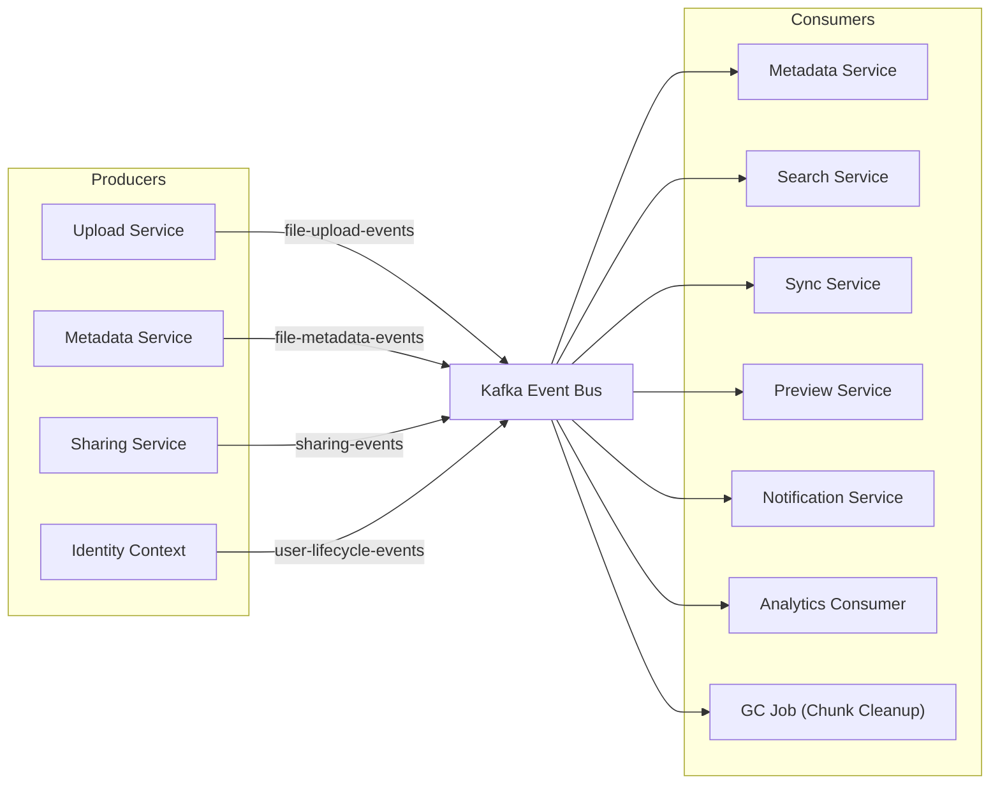
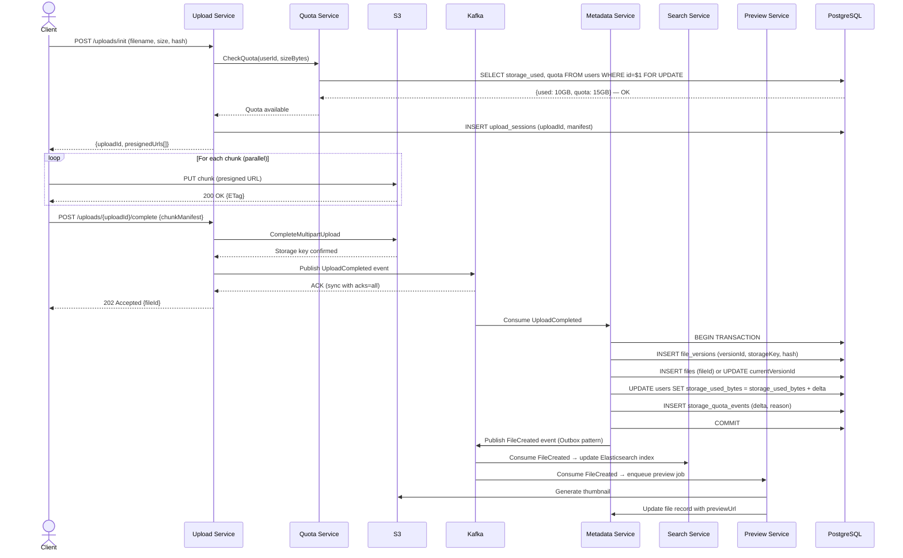
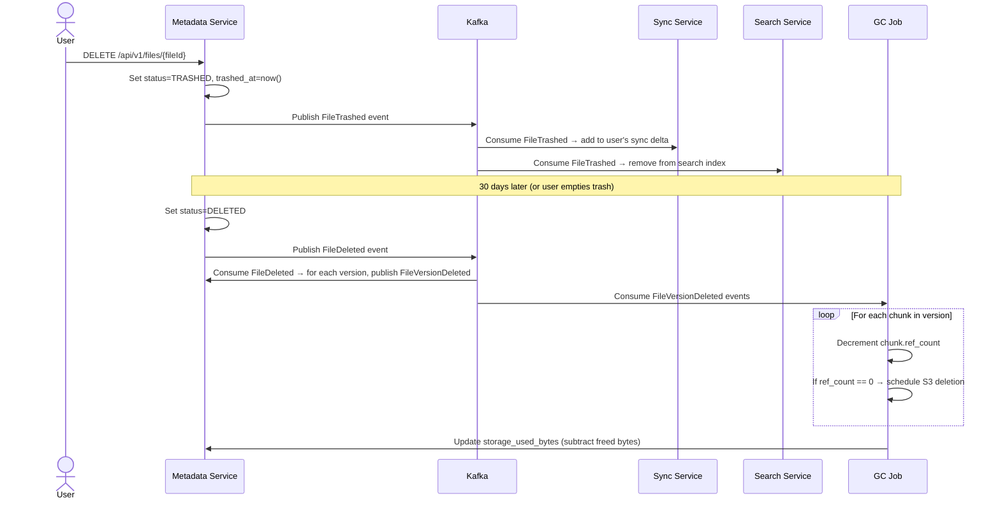
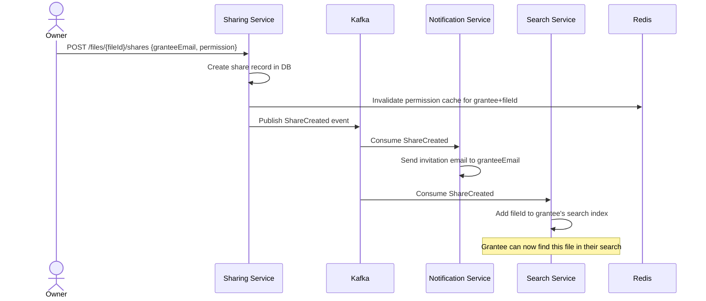
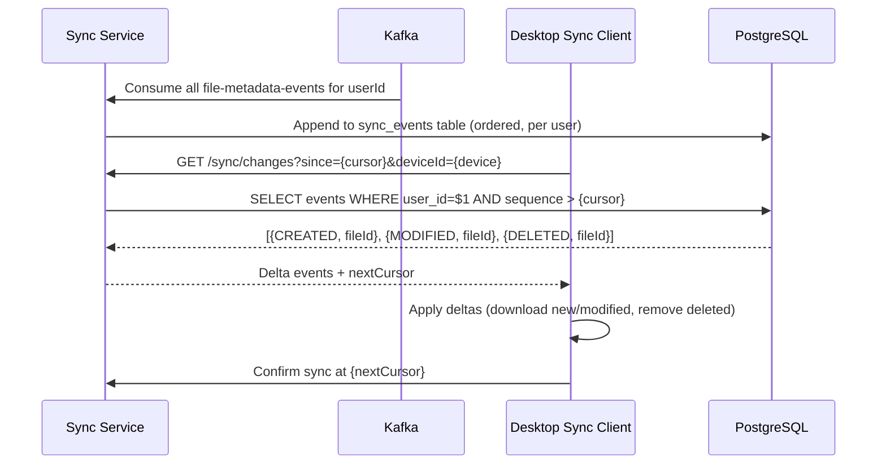
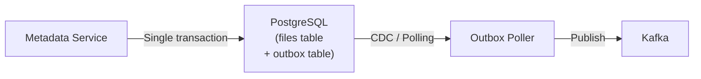

# 06 — Event Flow: File Storage System

## Objective
Define the complete event-driven architecture of the file storage platform — Kafka topic design, event schemas, producer/consumer relationships, sequence diagrams for critical flows, and the guarantees required for each event type.

---

## Event Architecture Overview



---

## Kafka Topic Design

| Topic | Partitioning Key | Partitions | Retention | Consumers |
|-------|-----------------|------------|-----------|-----------|
| `file-upload-events` | `userId` | 32 | 7 days | Metadata Service |
| `file-metadata-events` | `fileId` | 64 | 14 days | Search, Sync, Preview, Notification, Analytics |
| `file-version-deleted-events` | `fileId` | 32 | 7 days | Storage GC Job |
| `sharing-events` | `shareId` | 16 | 14 days | Notification, Search (permissions) |
| `user-lifecycle-events` | `userId` | 8 | 30 days | Metadata, Sharing, Analytics |
| `quota-events` | `userId` | 16 | 90 days | Analytics, Billing |

### Partition Key Reasoning
- **`file-metadata-events` partitioned by `fileId`**: All events for a single file (CREATED → MODIFIED → DELETED) arrive at the same partition → ordering guaranteed per file. Sync Service and Search Service process file events in order.
- **`file-upload-events` partitioned by `userId`**: A user's uploads arrive in order. Metadata Service processes per-user upload completion sequentially — prevents race conditions on quota.

---

## Event Schemas

### UploadCompleted Event
```
Topic: file-upload-events
Key: {userId}

{
  "eventType": "UPLOAD_COMPLETED",
  "uploadId": "uuid",
  "userId": "uuid",
  "fileName": "quarterly-report.pdf",
  "mimeType": "application/pdf",
  "sizeBytes": 52428800,
  "contentHash": "sha256:abc123...",
  "storageKey": "users/user-uuid/2024/01/file-uuid-v3",
  "parentFolderId": "uuid",
  "chunkManifest": ["chunkId1", "chunkId2", ...],
  "timestamp": "2024-01-15T08:00:00Z",
  "version": "1.0"
}
```

### FileCreated Event
```
Topic: file-metadata-events
Key: {fileId}

{
  "eventType": "FILE_CREATED",
  "fileId": "uuid",
  "versionId": "uuid",
  "ownerId": "uuid",
  "name": "quarterly-report.pdf",
  "mimeType": "application/pdf",
  "sizeBytes": 52428800,
  "parentFolderId": "uuid",
  "folderPath": "/root/Finance/2024/",
  "contentHash": "sha256:abc123...",
  "previewAvailable": false,
  "timestamp": "2024-01-15T08:00:01Z"
}
```

### FileVersionDeleted Event
```
Topic: file-version-deleted-events
Key: {fileId}

{
  "eventType": "FILE_VERSION_DELETED",
  "fileId": "uuid",
  "versionId": "uuid",
  "chunkIds": ["chunkId1", "chunkId2"],
  "ownerId": "uuid",
  "timestamp": "..."
}
```

Consumer (Storage GC Job): decrements `ref_count` for each chunk in `chunkIds`. Schedules S3 deletion for chunks where `ref_count` drops to 0.

### ShareCreated Event
```
Topic: sharing-events
Key: {shareId}

{
  "eventType": "SHARE_CREATED",
  "shareId": "uuid",
  "resourceId": "uuid",
  "resourceType": "FILE",
  "ownerId": "uuid",
  "granteeId": "uuid",
  "granteeEmail": "colleague@example.com",
  "permission": "EDIT",
  "shareType": "USER",
  "timestamp": "..."
}
```

---

## Critical Flow: File Upload End-to-End



---

## Critical Flow: File Deletion (Soft → Hard)



---

## Critical Flow: Share Invitation



---

## Sync Client Change Feed Flow



---

## Outbox Pattern for Reliable Event Publishing

**Problem**: Metadata Service updates PostgreSQL (creates FileVersion record) and publishes to Kafka. If Kafka publish fails after DB commit → file exists in DB but no downstream service knows → search index never updated, sync never gets the change.

**Solution: Transactional Outbox**
1. Metadata Service writes file record + outbox event in one PostgreSQL transaction.
2. Outbox Poller (separate process or Debezium CDC) reads unprocessed outbox events.
3. Poller publishes to Kafka. On success → marks outbox event as processed.
4. At-least-once delivery guaranteed. Consumers must be idempotent.



---

## Consumer Group Design

| Consumer Group | Reads From | Parallelism Strategy |
|---------------|------------|---------------------|
| `metadata-service-cg` | `file-upload-events` | 1 consumer per partition (32 partitions) |
| `search-indexer-cg` | `file-metadata-events` | 4 consumers (64 partitions / 16 each) |
| `sync-service-cg` | `file-metadata-events` | 8 consumers |
| `preview-service-cg` | `file-metadata-events` | 4 consumers |
| `notification-service-cg` | `file-metadata-events`, `sharing-events` | 4 consumers per topic |
| `storage-gc-cg` | `file-version-deleted-events` | 2 consumers |
| `analytics-cg` | All topics | 2 consumers (lag-tolerant) |

---

## Dead Letter Queue Strategy

| Topic | DLQ Topic | Retry Strategy |
|-------|-----------|----------------|
| `file-upload-events` | `file-upload-events-dlq` | 3 retries, 30s backoff → DLQ |
| `file-metadata-events` | `file-metadata-events-dlq` | 5 retries, exponential → DLQ |
| `sharing-events` | `sharing-events-dlq` | 3 retries → DLQ |
| `file-version-deleted-events` | `storage-gc-dlq` | 10 retries → DLQ (GC failure = storage leak) |

**GC DLQ Alert**: Any message in `storage-gc-dlq` → PagerDuty alert. Storage leak means paying for unreferenced S3 objects. On-call must manually reconcile.

---

## Exactly-Once Semantics

| Guarantee | Where Applied | Mechanism |
|-----------|--------------|-----------|
| Quota deduction | Kafka consumer (Metadata Service) | Idempotent consumer: check if `uploadId` already processed before deducting |
| Search index update | Search consumer | Elasticsearch `upsert` — idempotent |
| Chunk ref_count decrement | GC job | Idempotent: decrement only if `versionId` not in `processed_versions` table |
| Notification delivery | Notification Service | At-least-once (duplicate email acceptable; not financial) |

---

## Interview-Level Discussion Points

- **Why partition `file-metadata-events` by `fileId`?** — All events for a file (CREATED → MODIFIED × N → DELETED) must be processed in order by the Sync Service and Search Service. Partitioning by `fileId` guarantees ordering within a partition. If partitioned by `userId`, a user with 1M files would have all their events in the same partition → hot partition.
- **How does the outbox pattern differ from a saga?** — Outbox ensures a database write and a Kafka publish are atomic (no split-brain). A saga coordinates multiple service calls with compensating transactions. Both are reliability patterns but solve different problems.
- **What if the GC job crashes mid-decrement?** — GC consumer marks events as processed only after all decrements are committed. If it crashes mid-way → Kafka offset not committed → event replayed on restart. Each decrement is idempotent (check if already decremented for this `versionId`). No double-decrement.
- **Why not use database triggers to emit events?** — Triggers emit events synchronously in the transaction, coupling event publication to DB internals. Schema changes break triggers silently. Outbox pattern is explicit, testable, and decoupled from DB internals.
