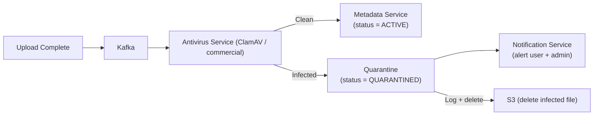

# 08 — Security Design: File Storage System

## Objective
Define the complete security architecture for a file storage platform — covering authentication, authorization, encryption, access control, threat modeling, and compliance. File storage security is non-negotiable: a breach exposes users' most sensitive personal and business documents.

---

## Threat Model

| Threat | Attack Vector | Mitigation |
|--------|--------------|------------|
| Unauthorized file access | Stolen JWT, broken ACL | JWT expiry, permission check on every request |
| Public link abuse | Link shared broadly | Signed URLs with TTL, link revocation |
| Presigned URL theft | URL intercepted | Short TTL (15 min), HTTPS only, IP binding (optional) |
| Server-side data breach | DB compromise | Encryption at rest, access logging |
| Man-in-the-middle | HTTP interception | HTTPS/TLS everywhere, HSTS |
| Malware upload | Virus in file | Async virus scan before file activation |
| Account takeover | Credential stuffing | MFA, rate limiting on login, breached password detection |
| Cross-tenant data leak | Insecure object storage keys | Per-user S3 prefix, IAM roles, no hardcoded keys |
| SSRF via presigned URL | Attacker crafts URL to internal service | Presigned URLs only to S3 (domain allow-list) |
| Enumeration attack | Brute-force fileIds | UUIDs, 404/403 ambiguity |

---

## Authentication

### JWT Strategy
- **Access token**: short-lived (15 minutes), stateless JWT, signed with RS256 (asymmetric — public key verifiable without secret).
- **Refresh token**: long-lived (30 days), opaque random token, stored in PostgreSQL with user binding.
- Refresh token rotation: on each use → issue new refresh token, invalidate old one.
- Token revocation: refresh token invalidation propagates on next access token refresh.
- Access token cannot be revoked mid-lifetime — accept this tradeoff (15 min max exposure window).

### Token Claims
```json
{
  "sub": "user-uuid",
  "email": "user@example.com",
  "tier": "PRO",
  "quotaBytes": 2199023255552,
  "iat": 1705305600,
  "exp": 1705306500,
  "jti": "unique-token-id"
}
```

### OAuth2 / SSO Integration
- Support Google OAuth2, Microsoft Azure AD, and enterprise SAML 2.0.
- OAuth2 flow: Authorization Code + PKCE (for mobile/desktop clients).
- Enterprise SSO: just-in-time provisioning on first login.

### Multi-Factor Authentication (MFA)
- TOTP (Google Authenticator, Authy) — stored TOTP seed in DB (encrypted at application level).
- Recovery codes: 10 one-time codes generated at MFA setup, stored as bcrypt hashes.
- Risk-based MFA: trigger MFA challenge if login from new device, new country, or after breached password detected.

---

## Authorization Model

### RBAC + Resource-Level ACL

File storage uses a hybrid model:
- **RBAC** (Role-Based): `OWNER`, `EDITOR`, `COMMENTER`, `VIEWER` roles per resource.
- **Resource ACL**: each share record grants a specific role to a specific user for a specific resource.

| Role | Read | Write/Upload | Create New Version | Delete | Manage Shares |
|------|------|-------------|-------------------|--------|---------------|
| OWNER | ✓ | ✓ | ✓ | ✓ | ✓ |
| EDITOR | ✓ | ✓ | ✓ | ✗ | ✗ |
| COMMENTER | ✓ | ✗ | ✗ | ✗ | ✗ |
| VIEWER | ✓ | ✗ | ✗ | ✗ | ✗ |

### Permission Inheritance
- If a folder is shared with EDIT permission → all files within that folder inherit EDIT for the same grantee.
- If a file has an explicit share with VIEW → that overrides inherited EDIT from parent folder (explicit is more specific).
- Inheritance computed at access-check time, not stored denormalized.

### Permission Check Algorithm
```
function canAccess(userId, resourceId, requiredPermission):
  1. If userId == file.ownerId → OWNER, all permissions granted
  2. Check shares table: find highest permission for (userId, resourceId)
  3. If no direct share: check parent folder's shares recursively (max 10 levels deep)
  4. If no permission found: DENY
  5. Compare found permission >= requiredPermission
```

Permission checks are cached in Redis: `perm:{userId}:{resourceId}` → `{permission}`, TTL 60s.
On share create/revoke/update → invalidate cache key immediately.

---

## Encryption Strategy

### Encryption at Rest
| Component | Encryption | Key Management |
|-----------|-----------|----------------|
| S3 (file bytes) | AES-256-GCM (SSE-S3 or SSE-KMS) | AWS KMS, per-bucket key |
| PostgreSQL | TDE (Transparent Data Encryption, Aurora feature) | AWS KMS |
| Redis | Encryption at rest (ElastiCache option) | AWS KMS |
| Backups (S3 snapshots) | SSE-S3 | Same as primary bucket |

### Server-Side vs Client-Side Encryption
- **Server-side encryption** (default): server holds encryption keys. Google/Dropbox do this.
- **Client-side (End-to-End) encryption**: client encrypts before upload, server never sees plaintext.
  - Benefit: even with DB breach, files unreadable.
  - Cost: no server-side search, no preview generation, no antivirus scanning.
  - Only viable for specific enterprise use cases (legal, finance).
  - For a general-purpose Drive/Dropbox: server-side encryption is the correct default.

### Encryption in Transit
- HTTPS/TLS 1.3 for all API traffic.
- HSTS (max-age=31536000, includeSubDomains, preload).
- Internal service-to-service: mTLS via service mesh (Istio) or direct TLS.
- S3 data transfer: HTTPS enforced via bucket policy (`aws:SecureTransport: true`).

---

## Presigned URL Security

Presigned URLs allow direct client-to-S3 upload/download without routing through app servers. Security implications:

| Risk | Mitigation |
|------|-----------|
| URL shared maliciously | Short TTL (15 min upload, 6h download) |
| URL captured in browser history/logs | Use POST (for uploads) not GET — not stored in logs |
| S3 bucket exposed directly | Bucket policy: DENY all non-presigned access; DENY public ACLs |
| URL reuse after revocation | For download: CDN signed cookie (revocable); for upload: uploadId invalidated |

### CDN Signed URLs for Downloads
For public/shared files served via CDN:
- CloudFront signed URL: contains HMAC signature of `{resourcePath, expiry, IP condition}`.
- Signed with CloudFront private key (stored in AWS Secrets Manager).
- On file deletion/share revocation → CDN invalidation API + new signing key (key rotation invalidates all existing signed URLs for revoked files).

---

## Malware & Content Security

### Upload Virus Scanning


- Virus scan runs async after upload (not blocking download — file is `status = PROCESSING` until clean).
- ClamAV (open source) for general malware. Commercial scanner (Symantec, SentinelOne) for advanced threats.
- Hash known malicious files → instant rejection without full scan (NSRL database integration).
- **CSAM detection**: PhotoDNA hash matching. Zero tolerance — immediate deletion + NCMEC report + account ban.

---

## Secrets Management

| Secret | Storage | Rotation |
|--------|---------|----------|
| JWT RS256 private key | AWS KMS (HSM-backed) | 90 days |
| DB credentials | AWS Secrets Manager | 30 days (auto-rotation) |
| S3 presigned URL signing key | EC2 instance profile (no stored key) | N/A (role-based) |
| CDN signing private key | AWS Secrets Manager | 180 days |
| OAuth2 client secrets | Secrets Manager | On compromise |
| MFA TOTP seeds | Encrypted column in PostgreSQL (app-level AES-256) | — |

**No static AWS access keys in code, environment variables, or configuration files.** Use IAM roles exclusively (EC2 instance profile, EKS IRSA).

---

## API Security

### Input Validation
- File name: sanitize path traversal characters (`../`, null bytes, special shell characters).
- MIME type: detect from file magic bytes (not from client-declared Content-Type).
- File size: reject at API gateway before upload session creation (prevent quota bypass).

### SQL Injection Prevention
- All DB access via parameterized queries (JDBC PreparedStatement, JPA).
- No dynamic SQL construction from user input.
- ORM (JPA/JOOQ) with strict parameter binding.

### XSS Prevention
- Serve user-uploaded content from a separate domain (e.g., `content.storage.example.com`, not `app.storage.example.com`).
  - **Critical**: if user uploads an HTML file and it's served from the app domain, it can steal cookies of other users on the same origin.
- `Content-Security-Policy: default-src 'none'` for content serving domain.
- `Content-Disposition: attachment` on all user-uploaded content downloads (forces download, prevents inline execution).

### CSRF Protection
- API is JWT-based (not cookie-based) → CSRF not applicable for API endpoints.
- Cookie-based sessions (if implemented): SameSite=Strict, CSRF token validation.

---

## Audit Logging

Every security-relevant action generates an audit log entry:

| Event | Logged Fields |
|-------|--------------|
| File access (download) | userId, fileId, IP, timestamp, grantType (own/share/link) |
| Share created/revoked | actorId, shareId, resourceId, granteeId, permission |
| File deleted | actorId, fileId, deletionType (trash/permanent) |
| Login success/failure | userId, IP, device, MFA used |
| Admin action | adminId, targetId, action, reason |
| Permission denied | userId, fileId, requestedPermission, timestamp |

Audit logs:
- Stored in append-only S3 bucket (no delete permission, no overwrite).
- Retention: 7 years (compliance).
- Encrypted with separate KMS key.
- Accessible only to security team (separate IAM role).

---

## Compliance Considerations

| Regulation | Requirement | Implementation |
|------------|-------------|----------------|
| GDPR | Right to erasure within 30 days | GDPR purge pipeline: delete all file records, S3 objects, search index, Kafka events |
| CCPA | Data portability | Export API: ZIP of all user's files + metadata |
| SOC 2 Type II | Access controls, audit logs | Audit log pipeline + annual penetration test |
| HIPAA (optional, for healthcare) | BAA required, PHI encryption | End-to-end encryption option, access logs per file |

---

## Interview-Level Discussion Points

- **Why serve user content from a separate domain?** — Same-origin policy: JavaScript on `app.example.com` can read cookies set on `app.example.com`. If user uploads an HTML file with JS and it's served on the same origin, it can steal other users' session cookies. Separate domain (`content.example.com`) isolates uploaded content from app context.
- **How do you revoke a public share link that's already been cached by CDN?** — CDN signed URL with short TTL (1h) → on revocation, update signing policy to exclude this resource. For immediate revocation: CDN cache invalidation API (takes ~60s). For zero-tolerance: CDN validates against Sharing Service on each request (performance hit — only for sensitive enterprise tier).
- **What's your defense against quota bypass attacks?** — Attacker uploads file, quota deducted. Attacker deletes file before scan completes. Quota refunded. Repeat. Solution: quota not refunded until file physically deleted from S3 (async GC completes). Temporary over-quota state is acceptable.
- **Why RS256 (asymmetric) instead of HS256 (symmetric) for JWT?** — With HS256, every service that validates JWTs must have the secret key. If any service is compromised, the shared secret is exposed. With RS256, services only need the public key (safe to distribute). Only the authentication service has the private key.
