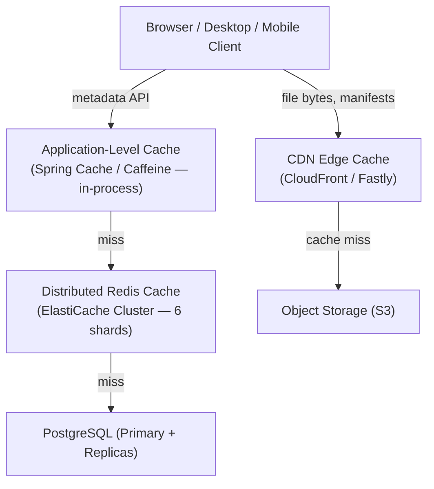
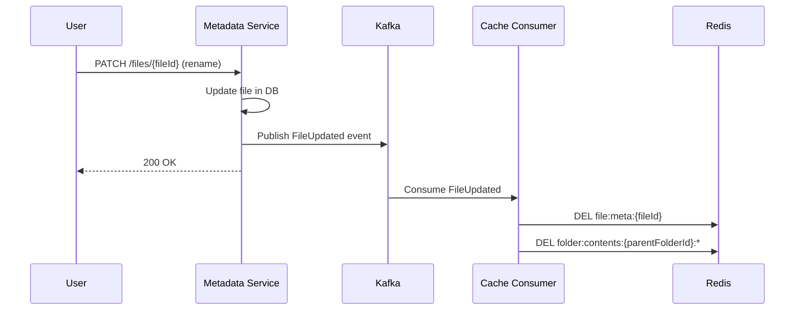

# 09 — Caching Strategy: File Storage System

## Objective
Define the multi-layer caching architecture — what to cache, where, for how long, how to invalidate, and what must never be cached. Poor caching strategy at Google Drive / Dropbox scale leads to billions of unnecessary database queries. Poor invalidation leads to stale data that violates correctness guarantees.

---

## Cache Hierarchy



---

## Cache Layer 1: Browser / Client-Side

### What's Cached
| Resource | Cache-Control Header | Duration |
|----------|---------------------|----------|
| File bytes (CDN-served) | `max-age=31536000, immutable` | 1 year |
| File thumbnail | `max-age=86400` | 24 hours |
| HLS manifest (if video) | `max-age=5` | 5 seconds |
| API responses | `no-store` | None (sensitive user data) |
| Static assets (JS/CSS) | `max-age=31536000, immutable` | 1 year |

**Why `immutable` for file bytes?** — File chunks are content-addressed (named by their SHA-256 hash). Once a chunk is stored at a key, it never changes. Content hash in the URL acts as a cache-busting mechanism. Browsers and CDNs can safely cache forever.

**Why `no-store` for API responses?** — Metadata responses (file listing, permissions) are personalized and security-sensitive. Cannot be cached by shared CDN caches. Browser session storage may be used for specific non-sensitive UI state (folder tree).

---

## Cache Layer 2: CDN Edge Cache

### What CDN Caches
| Content Type | Key | TTL | Invalidation |
|-------------|-----|-----|-------------|
| File chunks (S3) | `s3://{storageKey}` | Immutable (1 year) | Never (content-addressed) |
| File thumbnails | `s3://previews/{fileVersionId}/thumb.jpg` | 24 hours | On new version upload |
| Public share page (HTML) | URL-based | 1 minute | On share revocation |
| File download redirect | `cdn://{fileId}` | NOT cached (auth-dependent) | N/A |

### What CDN Must NOT Cache
- Authenticated download redirects (presigned URL generation must be per-user, per-request).
- API responses that include user-specific data.
- Permission check results.

### CDN Invalidation Triggers
| Event | Invalidated Paths |
|-------|-----------------|
| File deleted | `previews/{fileVersionId}/*` |
| Share revoked on public link | Public share page path |
| File renamed | No CDN path change (storageKey unchanged) |
| New version uploaded | Old version thumbnail (new versionId is new path) |

---

## Cache Layer 3: Distributed Redis Cache

### Schema Design

#### File Metadata Cache
```
Key:   file:meta:{fileId}
Value: JSON {fileId, name, mimeType, sizeBytes, status, currentVersionId, ownerId, parentFolderId, previewUrl}
TTL:   60 seconds
Set:   On Metadata Service response (cache-aside pattern)
Evict: On file update, delete, rename, move (event-driven invalidation)
```

#### Folder Contents Cache
```
Key:   folder:contents:{folderId}:page:{page}:sort:{sortKey}
Value: JSON paginated file list
TTL:   30 seconds (short — folder contents change frequently)
Evict: On any file added to / removed from / moved into / out of this folder
```

Short TTL for folder contents because invalidation is complex (any file change in a folder requires invalidation). The 30s TTL ensures acceptable freshness without precise invalidation.

#### Permission Cache (Access Check)
```
Key:   perm:{userId}:{resourceId}
Value: "OWNER" | "EDITOR" | "COMMENTER" | "VIEWER" | "NONE"
TTL:   60 seconds
Set:   After permission check resolves
Evict: On share create, share revoke, share permission update (immediate cache DEL)
```

This is the most security-sensitive cache entry. On share revocation, must be invalidated **immediately** (not wait for TTL expiry).

#### Upload Session State
```
Key:   upload:session:{uploadId}
Value: JSON {totalChunks, receivedChunks, chunkManifest, status}
TTL:   24 hours (matches upload session expiry)
Evict: On upload complete or explicit cancel
```

#### Storage Quota Fast Check
```
Key:   quota:user:{userId}
Value: {usedBytes, quotaBytes, lastUpdated}
TTL:   10 seconds
Set:   After quota check from DB
Evict: On any upload complete or file delete (delta changes quota)
```

10-second TTL is intentionally short. A 10-second stale quota reading could allow a user to slightly over-quota — acceptable (soft enforcement, correct in the next write cycle).

#### Sync Change Check
```
Key:   sync:user:{userId}:hasChanges
Value: Boolean (true if events since last cursor)
TTL:   5 seconds (lower than sync poll interval)
Set:   When Sync Service appends a new event for userId
Read:  Before querying sync_events DB table
```

90% of sync polls return false (no changes) → 90% of DB queries eliminated.

#### Deduplication Bloom Filter
```
Type:  Redis Bloom Filter (RedisBloom module)
Key:   chunks:bloom
Size:  100M chunks → ~120 MB at 1% FPR
Set:   When new chunk inserted
Check: BEFORE querying chunks table
```

False positive rate (1%) means 1% of "chunk not found" queries hit DB unnecessarily — acceptable. No false negatives (if chunk exists, Bloom filter always says "possibly exists").

---

## Cache Invalidation Strategies

### Strategy 1: Event-Driven Invalidation (Preferred)
Kafka event `FileUpdated` → Metadata Service consumer → `DEL file:meta:{fileId}` in Redis.

Pros: precise invalidation, no stale data beyond processing lag.
Cons: Redis DEL must succeed within seconds of the event — Kafka consumer lag is the enemy.



### Strategy 2: Write-Through (For Permission Cache)
On permission change → immediately delete Redis key + update DB. Never risk stale permission surviving TTL.

### Strategy 3: TTL-Based (For Low-Risk Data)
Folder contents cache (30s TTL). Quota cache (10s TTL). Tolerate slight staleness in exchange for no invalidation complexity.

### Strategy 4: Cache-Aside (Standard Pattern)
Read: check Redis → hit: return. Miss: query DB → write to Redis → return.
Write: update DB → delete from Redis. (Delete, not update — avoids race conditions.)

---

## What MUST NOT Be Cached

| Data | Reason |
|------|--------|
| Permission checks for highly sensitive files | Security risk of stale cache after revocation |
| Active upload session write state | Must be consistent — two tabs uploading same file would create conflicts |
| Virus scan status | Cannot allow serving unscanned files from cache |
| Quota enforcement decision (final check) | Race condition if two concurrent uploads both pass cached quota check |
| Admin operations | All admin actions must be fully audited and real-time |

---

## Redis Cluster Configuration

### Cluster Mode
- 6 master shards + 6 replica shards (1 replica per master).
- Each shard: r6g.large (26 GB RAM) → 6 shards × 26 GB = 156 GB total.
- Stores: file metadata cache, permission cache, upload sessions, quota cache.

### Memory Estimation
| Cache | Entries | Per Entry | Total |
|-------|---------|-----------|-------|
| File metadata | 500M active files × 10% hot = 50M | 500 bytes | 25 GB |
| Permission cache | 100M user-file pairs × 10% active | 50 bytes | 5 GB |
| Upload sessions | 100K concurrent | 2 KB | 200 MB |
| Quota cache | 50M DAU × 10% active | 100 bytes | 500 MB |
| Bloom filter | 100M chunks | 1.2 bytes | 120 MB |
| **Total** | — | — | ~31 GB |

156 GB cluster capacity is more than sufficient, with headroom for growth.

### Eviction Policy
`allkeys-lru`: evict least recently used keys when memory is full.
- Upload sessions: NOT subject to eviction (critical state). Stored with explicit TTL, eviction policy exempted via key prefix classification.

---

## Interview-Level Discussion Points

- **Why 60s TTL for permission cache instead of longer?** — Longer TTL means a revoked share could allow access for longer. 60s is the SLO: "share revocation takes effect within 60 seconds." This is stated in the product terms. Beyond security, it's also a business SLO.
- **Why delete from cache on write instead of updating?** — Read-modify-write race condition: Thread A reads cache (version N), Thread B updates DB + cache (version N+1), Thread A overwrites cache with version N. DELETE forces the next reader to re-fetch from DB. "Cache-aside delete" is the safe pattern.
- **Can you cache the entire file tree in Redis?** — No. A user with 1M files has a tree too large for a single Redis value. File trees are navigated one folder at a time (paginated folder listing) — cache at the folder-page level.
- **How do you handle cache stampede on cold start?** — On deployment or Redis flush, all caches are cold. First 60 seconds: every request hits the DB. Solution: (1) pre-warm popular files before traffic ramp (using a sorted set of most-accessed fileIds from analytics). (2) Jitter TTLs (±10%) to prevent synchronized expiry. (3) Rate limit DB queries during warm-up with a circuit breaker.
