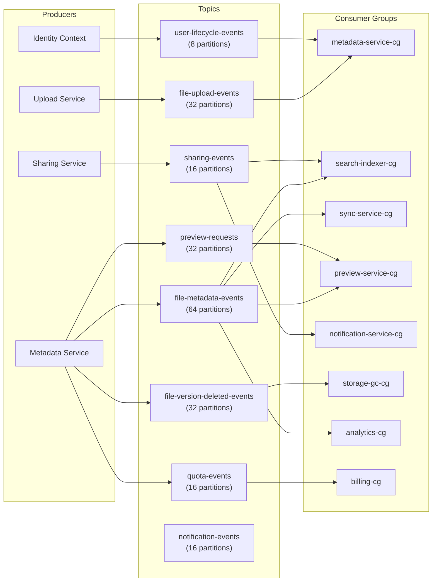

# 10 — Message Queue Design: File Storage System

## Objective
Define the complete Kafka-based messaging architecture — topic design, partition strategies, consumer group patterns, delivery guarantees, DLQ handling, and the specific reliability requirements for each event type in the file storage system.

---

## Why Kafka for File Storage?

| Requirement | How Kafka Addresses It |
|-------------|----------------------|
| Multiple consumers per event | Consumer groups — search, sync, preview, analytics all consume independently |
| Event replay on failure | Kafka retains events for configurable duration — consumers replay from any offset |
| Async processing pipeline | Upload → transcode-like pattern: upload complete → trigger preview, search indexing, sync |
| Outbox pattern support | Kafka consumer position (offset) is the "processed" marker — no separate processed table needed |
| High throughput | 100K+ events/second on a 3-broker cluster |
| Event sourcing | Audit trail of all file system changes |

---

## Topic Architecture



---

## Topic Design Details

### `file-upload-events` (32 partitions)

**Purpose**: Upload Service notifies Metadata Service when a chunked upload is complete and ready to be committed as a new FileVersion.

**Partition key**: `userId`
- Reason: all uploads from the same user process in order. If User A uploads 3 files rapidly, they process sequentially — preventing quota race conditions.

**Retention**: 7 days
- If Metadata Service is down for 7 days, events are lost. Acceptable — this is an exceptional failure. Alternative: trigger reconciliation job from the Upload Service's DB.

**Guarantees needed**: At-least-once delivery + idempotent consumer.
- Consumer (Metadata Service) checks: `IF NOT EXISTS (SELECT 1 FROM file_versions WHERE upload_id = $uploadId)` before inserting. Safe to replay.

**Throughput**: 1,200 events/second at baseline. At 10× (12,000/s): 32 partitions handle ~375 events/partition/second.

---

### `file-metadata-events` (64 partitions)

**Purpose**: The central event bus for all logical file system changes. Consumed by search, sync, preview, and analytics.

**Partition key**: `fileId`
- Reason: all events for a single file (CREATED → MODIFIED → TRASHED → DELETED) arrive at one partition → ordering guaranteed per file. This is critical for Sync Service (must process events in order) and Search Service (delete after create must not revert).

**Retention**: 14 days
- Sync Service cursor may lag 14 days during extended outage. After 14 days → sync client must do a full resync.

**Event Types Published**:
| Event | Trigger |
|-------|---------|
| `FILE_CREATED` | New file uploaded and committed |
| `FILE_MODIFIED` | New version uploaded |
| `FILE_RENAMED` | File name changed |
| `FILE_MOVED` | File moved to different folder |
| `FILE_TRASHED` | File moved to trash |
| `FILE_RESTORED` | File restored from trash |
| `FILE_DELETED` | Permanent deletion initiated |
| `FOLDER_CREATED` | New folder created |
| `FOLDER_RENAMED` | Folder renamed |
| `FOLDER_MOVED` | Folder moved |
| `FOLDER_DELETED` | Folder permanently deleted |

**Guarantees needed**: At-least-once delivery + idempotent consumers per consumer group.
- Search indexer: Elasticsearch UPSERT by `fileId` → idempotent.
- Sync Service: uses Kafka offset as cursor; replaying doesn't duplicate events in `sync_events` table (deduplication by `eventId`).

---

### `file-version-deleted-events` (32 partitions)

**Purpose**: Triggers Storage GC to decrement chunk `ref_count` and schedule physical S3 deletion.

**Partition key**: `fileId`

**Retention**: 7 days
- GC failure for > 7 days = storage leak. Alert at 1 day DLQ lag, escalate at 7 days.

**Guarantees needed**: Exactly-once chunk decrement.
- GC consumer tracks processed `(fileId, versionId)` pairs in `gc_processed` table.
- On replay: check `gc_processed` before decrementing → skip if already processed.

---

### `sharing-events` (16 partitions)

**Purpose**: Share create/revoke/update events consumed by Notification Service and Search Service.

**Partition key**: `resourceId` (fileId or folderId)
- All share events for the same resource arrive in order → Search Service processes them sequentially (avoid race: add permission then remove on replay).

**Retention**: 14 days

---

### `user-lifecycle-events` (8 partitions)

**Purpose**: Account creation, deletion, tier change events.

**Partition key**: `userId`

**Retention**: 30 days

**Critical Event: `ACCOUNT_DELETED`**
- Triggers GDPR purge pipeline across all services.
- Consumer (Metadata Service): schedules deletion of all files owned by userId.
- Consumer (Search Service): removes all user's files from search index.
- Consumer (Sharing Service): revokes all shares granted by or to this user.
- This is a multi-step operation — tracked via a `gdpr_deletion_jobs` table, not in-flight in Kafka.

---

### `quota-events` (16 partitions)

**Purpose**: Immutable ledger of all quota changes — consumed by billing/analytics. Not used for quota enforcement (that's synchronous in the upload path).

**Partition key**: `userId`

**Retention**: 1 year

---

### `preview-requests` (32 partitions)

**Purpose**: Decoupled preview job queue. Metadata Service publishes a preview request; Preview Service workers consume and process.

**Partition key**: `fileId`

**Retention**: 24 hours
- Preview request older than 24h → file already visible without preview. Drop it (user will see generic icon). Preview generated if user navigates to the file.

---

## Consumer Group Strategy

| Consumer Group | Topic | Consumers | Partition Assignment | Lag SLO |
|---------------|-------|-----------|---------------------|---------|
| `metadata-service-cg` | `file-upload-events` | 8 consumers | Round-robin | < 5s |
| `search-indexer-cg` | `file-metadata-events` | 16 consumers | Round-robin | < 30s |
| `sync-service-cg` | `file-metadata-events` | 8 consumers | Round-robin | < 10s |
| `preview-service-cg` | `preview-requests` | 8 consumers | Round-robin | < 5 min |
| `notification-service-cg` | `sharing-events` | 4 consumers | Round-robin | < 60s |
| `storage-gc-cg` | `file-version-deleted-events` | 4 consumers | Round-robin | < 1 hour |
| `analytics-cg` | All topics | 4 consumers/topic | Round-robin | < 1 hour |
| `billing-cg` | `quota-events` | 2 consumers | Round-robin | < 12 hours |

---

## Dead Letter Queue Strategy

| Source Topic | DLQ Topic | Max Retries | Retry Delay | On DLQ |
|-------------|-----------|-------------|-------------|--------|
| `file-upload-events` | `file-upload-events-dlq` | 3 | 30s | Alert + manual replay |
| `file-metadata-events` | `file-metadata-events-dlq` | 5 | Exponential (2s, 4s, 8s, 16s, 32s) | Alert, reprocess search separately |
| `file-version-deleted-events` | `storage-gc-dlq` | 10 | 5 min | CRITICAL alert — storage leak |
| `sharing-events` | `sharing-events-dlq` | 3 | 30s | Alert + notification retry |
| `preview-requests` | `preview-requests-dlq` | 2 | 1 min | Log + discard (non-critical) |

### DLQ Monitoring
- `storage-gc-dlq`: ANY message → PagerDuty CRITICAL. Storage leak is a cost incident.
- `file-upload-events-dlq`: > 100 messages → PagerDuty WARN. Users may see file as stuck in processing.
- `file-metadata-events-dlq`: > 50 messages → Slack alert. Search/sync may be stale.
- All DLQs: retention = 30 days. Manual replay tool for on-call engineers.

---

## Kafka Configuration Details

### Broker Configuration
| Parameter | Value | Reason |
|-----------|-------|--------|
| `replication.factor` | 3 | Survives 2 broker failures |
| `min.insync.replicas` | 2 | Ensures 2 replicas ack before success |
| `unclean.leader.election.enable` | false | No data loss on leader election |
| `log.retention.ms` | Per topic (see above) | Different topics have different replay needs |
| `log.segment.bytes` | 512 MB | Good segment size for retention-based deletion |

### Producer Configuration (Upload/Metadata Services)
| Parameter | Value | Reason |
|-----------|-------|--------|
| `acks` | `all` | Wait for all in-sync replicas to ack |
| `retries` | 10 | Retry transient failures |
| `enable.idempotence` | true | Exactly-once producer delivery |
| `max.in.flight.requests.per.connection` | 1 | With idempotence, ordering guaranteed |
| `linger.ms` | 5 | Batch messages for 5ms to improve throughput |

### Consumer Configuration
| Parameter | Value | Reason |
|-----------|-------|--------|
| `enable.auto.commit` | false | Manual commit after processing (at-least-once) |
| `isolation.level` | `read_committed` | Only read committed transactions |
| `max.poll.records` | 100 | Process in batches for throughput |
| `session.timeout.ms` | 30000 | 30s before consumer considered dead |

---

## Exactly-Once Pattern for Quota Deduction

**Problem**: `file-upload-events` consumer deducts quota from `users.storage_used_bytes`. If event is replayed (Kafka retried) → quota deducted twice.

**Solution**: Idempotent consumer with DB check.

```
Consumer receives UploadCompleted for uploadId=abc:
1. SELECT 1 FROM file_versions WHERE upload_id='abc'
2. If found → already processed → commit Kafka offset, return
3. If not found → process:
   a. INSERT file_versions (upload_id='abc', ...)
   b. UPDATE users SET storage_used_bytes = storage_used_bytes + delta
   c. INSERT storage_quota_events (delta, reason)
   All in one DB transaction.
4. Commit Kafka offset
```

The DB `INSERT file_versions` is idempotent (UNIQUE constraint on `upload_id`). On replay: step 1 returns a row → skip. Safe.

---

## Interview-Level Discussion Points

- **Why separate `file-metadata-events` and `file-upload-events`?** — Upload events are transient (complete → metadata committed → done). Metadata events are persistent business events consumed by multiple long-lived consumers. Different retention, different consumer groups, different partition count. Mixing them creates consumer coupling.
- **Why is `file-version-deleted-events` DLQ monitored as CRITICAL?** — A GC failure means S3 objects are never deleted. At 500 TB/day ingress, uncollected garbage accumulates at potentially millions of dollars per month in S3 costs. Storage leaks are a financial incident, not just a technical one.
- **How do you guarantee ordering of file events for the Sync Service?** — Partition key is `fileId`. All events for a file go to the same partition. Kafka guarantees ordering within a partition. Sync Service consumers never process the same file's events out of order.
- **What's the difference between at-least-once and exactly-once in this context?** — For quota deduction (financial): need idempotent consumer (effectively exactly-once semantics). For search indexing (ES upsert): at-least-once is fine — duplicate index update is idempotent. For notifications (email): at-least-once is acceptable — duplicate email is annoying but not a data integrity issue. Tailor the guarantee to the cost of duplication.
