# 13 — Deployment Architecture: File Storage System

## Objective
Define the end-to-end deployment topology for a production file storage system — Kubernetes cluster design, CI/CD pipeline, multi-region strategy, autoscaling policies, environment separation, and disaster recovery. File storage has unique deployment concerns: stateless upload processing, globally distributed object storage, and sync clients that expect continuous availability.

---

## Infrastructure Overview

```mermaid
graph TB
    subgraph "Global Edge"
        CDN["CloudFront CDN<br/>(200+ PoPs — file chunks, thumbnails)"]
        GA["Global Accelerator<br/>(API traffic — low latency routing)"]
    end

    subgraph "Region: us-east-1 (Primary)"
        ALB["AWS ALB — API Traffic"]
        subgraph "EKS Cluster"
            US["Upload Service (pods)"]
            MS["Metadata Service (pods)"]
            SH["Sharing Service (pods)"]
            SS["Search Service (pods)"]
            SYC["Sync Service (pods)"]
            PV["Preview Service (pods)"]
            NS["Notification Service (pods)"]
            GC["Storage GC Job (CronJob)"]
        end
        subgraph "Data Layer"
            PG["Aurora PostgreSQL (Multi-AZ)<br/>(Primary + 3 read replicas)"]
            RD["ElastiCache Redis (6 shards)"]
            KF["MSK Kafka (3 brokers)"]
            ES["OpenSearch (3 nodes)"]
            S3["S3 (us-east-1)<br/>(video chunks + manifests)"]
        end
    end

    subgraph "Region: eu-west-1"
        ALB2["ALB"]
        EKS2["EKS Cluster (read-focused)"]
        PG2["Aurora Global DB Replica"]
        ES2["OpenSearch Replica"]
        S3EU["S3 (eu-west-1 CRR)"]
    end

    subgraph "Region: ap-southeast-1"
        ALB3["ALB"]
        EKS3["EKS Cluster"]
        PG3["Aurora Global DB Replica"]
        S3AP["S3 (ap-southeast-1 CRR)"]
    end

    CDN -->|"cache miss"| S3
    CDN -->|"cache miss"| S3EU
    GA --> ALB
    GA --> ALB2
    GA --> ALB3
    ALB --> EKS Cluster
    PG -->|"Global DB replication"| PG2
    PG -->|"Global DB replication"| PG3
    S3 -->|"CRR"| S3EU
    S3 -->|"CRR"| S3AP
```

---

## Kubernetes Cluster Design

### Node Pools

| Pool | Services | Node Type | Scaling |
|------|----------|-----------|---------|
| **api-pool** | Upload, Metadata, Sharing, Sharing | c5.2xlarge, spot | HPA: CPU / RPS |
| **compute-pool** | Preview Service (CPU-intensive thumbnail gen) | c5.4xlarge, spot | HPA: Kafka queue depth |
| **sync-pool** | Sync Service (memory-intensive cursor tracking) | r5.xlarge, spot | HPA: RPS |
| **search-pool** | Search Service | c5.xlarge, spot | HPA: CPU |
| **gc-pool** | Storage GC Job (periodic batch) | m5.large, spot | K8s CronJob |

Preview Service on compute-pool: thumbnail generation (ImageMagick, LibreOffice PDF) is CPU-intensive and must not starve API pods.

### Pod Resource Requests/Limits
Properly configured requests/limits are critical for Kubernetes scheduling:

| Service | CPU Request | CPU Limit | Memory Request | Memory Limit |
|---------|------------|-----------|----------------|-------------|
| Upload Service | 500m | 2000m | 512Mi | 2Gi |
| Metadata Service | 500m | 2000m | 1Gi | 4Gi |
| Sync Service | 250m | 1000m | 2Gi | 8Gi |
| Preview Service | 2000m | 8000m | 2Gi | 8Gi |
| Search Service | 500m | 2000m | 1Gi | 4Gi |

---

## Autoscaling Policies

### Horizontal Pod Autoscaler (HPA)

| Service | Scale Trigger | Min Pods | Max Pods |
|---------|-------------|----------|----------|
| Upload Service | CPU > 60% OR upload init RPS > 500/pod | 3 | 50 |
| Metadata Service | CPU > 60% | 3 | 80 |
| Sync Service | RPS > 1000/pod | 5 | 150 |
| Search Service | CPU > 70% | 3 | 30 |
| Preview Service | Kafka `preview-requests` lag > 500 | 2 | 30 |
| Notification Service | Kafka lag > 1000 | 2 | 20 |

Sync Service has highest max pods (150): 50M DAU × 1 poll/10s = 5M RPS. At 1000 RPS/pod: 5,000 pods max theoretical. In practice, Redis "no changes" short-circuit reduces actual DB-hitting requests to ~10%: 500K RPS → 500 pods at 1000 RPS/pod.

### KEDA for Preview Service
- KEDA ScaledObject watching `preview-requests` Kafka topic consumer group lag.
- Lag > 500 → scale up by 3 pods.
- Lag = 0 for 10 min → scale down.
- Preview is best-effort — lag up to 5 min is acceptable (not user-blocking).

### Cluster Autoscaler
- New node provisioning: 2–3 minutes.
- Scale-down grace period: 5 minutes (avoid killing pods mid-preview).
- Spot instance interruption handling: PodDisruptionBudget ensures max 1 pod per service interrupted simultaneously.

---

## CI/CD Pipeline

```mermaid
graph LR
    Dev["PR Merged to main"] --> CI["GitHub Actions CI"]
    subgraph "CI Stages"
        Build["Gradle build<br/>(compile + unit tests)"]
        IT["Integration Tests<br/>(Testcontainers: PG, Redis, Kafka, ES, MinIO)"]
        SEC["Security Scan<br/>(Trivy container + OWASP Dependency Check)"]
        SAST["SAST<br/>(SonarQube)"]
        Push["Push to ECR<br/>(image:git-sha)"]
    end
    CI --> Build --> IT --> SEC --> SAST --> Push

    Push --> ACD["ArgoCD (GitOps)"]
    ACD --> STG["Staging EKS<br/>(smoke + E2E tests)"]
    STG -->|"Auto"| CAN["Canary 5%"]
    CAN -->|"After 30 min monitoring"| PROD["Production 100%"]
```



### Deployment Strategies per Service

| Service | Strategy | Reason |
|---------|----------|--------|
| Upload Service | Rolling update (max-surge=25%) | Stateless; rolling is safe |
| Metadata Service | Blue-Green | DB schema changes require careful traffic switch |
| Sync Service | Rolling (max-unavailable=0) | No connections to drain, but cursor state in Redis |
| Search Service | Blue-Green | Index format changes need instant rollback |
| Preview Service | Rolling | Best-effort; brief unavailability just increases lag |
| Storage GC Job | Job versioning | New CronJob spec; old job completes before new schedule |

### Database Migration Strategy
All migrations use Expand-Contract pattern:
1. **Expand**: add new column, nullable (no locking).
2. **Backfill**: background job fills existing rows.
3. **Switch**: application uses new column.
4. **Contract**: remove old column (separate deployment, after rollback period passes).

Never run `ALTER TABLE ... ADD COLUMN NOT NULL` on a 1B-row table in production.

---

## Multi-Region Deployment

### Data Strategy

| Component | Primary Region | Secondary Regions |
|-----------|---------------|-------------------|
| S3 file chunks | us-east-1 | CRR to eu-west-1, ap-southeast-1 |
| PostgreSQL | us-east-1 (primary) | Aurora Global DB replicas (< 1s lag) |
| Redis | Per-region (no replication — ephemeral) | — |
| Kafka | Per-region MSK | No cross-region replication |
| Elasticsearch | Per-region cluster | Re-indexed from per-region Kafka |

### User Routing
- Route 53 Latency-based routing → nearest region.
- If API in eu-west-1 → reads file metadata from eu-west-1 Aurora replica.
- Read-after-write: user who just uploaded → for 5s → routed to primary for metadata read.
- Downloads: CDN serves from nearest PoP (S3 CRR ensures content is in nearest region).

### GDPR Data Residency
- EU users' file metadata: stored in eu-west-1 Aurora (primary for EU is eu-west-1, not us-east-1).
- S3 CRR can be restricted: EU users' objects stored only in EU S3 buckets.
- Configurable per user's registered country at account creation time.

---

## Environment Strategy

| Environment | Infrastructure | Purpose | Data |
|-------------|---------------|---------|------|
| **local** | Docker Compose | Developer machine | Seed data |
| **dev** | Shared EKS namespace | Integration testing | Anonymized prod snapshot |
| **staging** | Dedicated EKS cluster | Pre-production | Prod-scale anonymized data, 20% capacity |
| **production** | Full EKS + multi-region | Live traffic | Real data |

### Local Docker Compose Stack
```yaml
services:
  postgres:    # PostgreSQL 15
  redis:       # Redis 7 (single node)
  kafka:       # Kafka 3.x + Zookeeper
  opensearch:  # OpenSearch 2.x
  minio:       # MinIO (S3-compatible, local file storage)
  clamav:      # Antivirus scanner
  mailhog:     # Email sink (captures notifications locally)
```

MinIO allows local development without AWS credentials. All S3 SDK calls work unchanged.

---

## Secrets Management

| Secret | Tool | Rotation |
|--------|------|----------|
| DB credentials (PG, Redis) | AWS Secrets Manager + ExternalSecrets Operator | 30 days (auto) |
| JWT RS256 private key | AWS KMS | 90 days |
| CDN CloudFront signing key | Secrets Manager | 180 days |
| S3 access (IAM) | EC2 instance profile / IRSA | N/A (role-based) |
| Kafka SASL credentials | Secrets Manager | 60 days |
| OAuth2 client secrets | Secrets Manager | On compromise |
| ClamAV virus definition updates | Auto-pull from ClamAV mirrors | Daily |

**IRSA (IAM Roles for Service Accounts)**: Each Kubernetes service account has an IAM role with minimal permissions (Upload Service: S3 PutObject only to upload prefix; GC Job: S3 DeleteObject only). No shared credentials, no over-privileged roles.

---

## Disaster Recovery

| Scenario | RTO | RPO | Strategy |
|----------|-----|-----|----------|
| Single pod failure | < 30s | 0 | K8s self-healing |
| AZ failure | < 2 min | 0 | Multi-AZ EKS + Aurora |
| S3 regional outage | < 30 min | 0 | CRR to secondary region; CDN serves cached |
| DB primary failure | < 60s | 0 | Aurora Global DB auto-failover |
| Kafka failure | < 10 min | < 1 min | MSK Multi-AZ; consumer replay |
| Full region failure | < 10 min | < 1s | Route 53 failover + Aurora Global DB promote |

### Full Region Failover Procedure
1. Route 53 health check detects primary region failure.
2. DNS TTL (30s) propagates → traffic routes to secondary (eu-west-1).
3. Aurora Global DB: secondary becomes primary (< 1 min promotion time).
4. S3: secondary region bucket (via CRR) serves as origin.
5. Elasticsearch: secondary cluster serves search (may lag by minutes — acceptable).
6. Redis: cold start in secondary (warm-up job runs: pre-fetch top 10M file metadata from DB).
7. Kafka: consumers replay from last committed offsets in secondary region MSK.
8. Total estimated RTO: 10–15 minutes.

---

## Feature Flags

- LaunchDarkly (or Unleash self-hosted) for all new features.
- Server-side rendering: feature flags evaluated per request (user tier, region, percentage rollout).
- Key flags:
  - `upload.deduplication.enabled`: gradual rollout of deduplication (can affect storage cost reporting)
  - `sync.websocket.enabled`: phased migration from polling to WebSocket
  - `preview.pdf.enabled`: per-tier rollout (Pro users first)
  - `search.elasticsearch.v2.enabled`: new index format A/B test

---

## Interview-Level Discussion Points

- **Why separate node pools for Preview Service?** — Preview generation (ImageMagick, LibreOffice, FFmpeg) is CPU-bound and can consume all node CPU, starving API pods. Separate node pool guarantees API pod CPU is never stolen by preview work.
- **Why Aurora Global Database instead of per-region independent databases?** — User identity, quota, and sharing data must be globally consistent. A share granted in the US must be visible in EU immediately. Aurora Global DB provides < 1s replication lag with automatic failover. Independent databases would require complex sync protocols.
- **How do you handle a deploy failure mid-rollout in canary?** — ArgoCD watches metrics (error rate, P99 latency) during canary period. If error rate > 1% → automated rollback (traffic shifted back to stable). Progressive delivery: 5% → auto-check → 25% → auto-check → 100%.
- **Why IRSA over static IAM credentials?** — Static credentials can be leaked (accidentally committed, exposed in logs). IRSA: IAM role bound to K8s service account via OIDC. Automatically rotated by AWS. Per-service roles with minimal permissions (Upload Service cannot delete files — only GC Job can).
