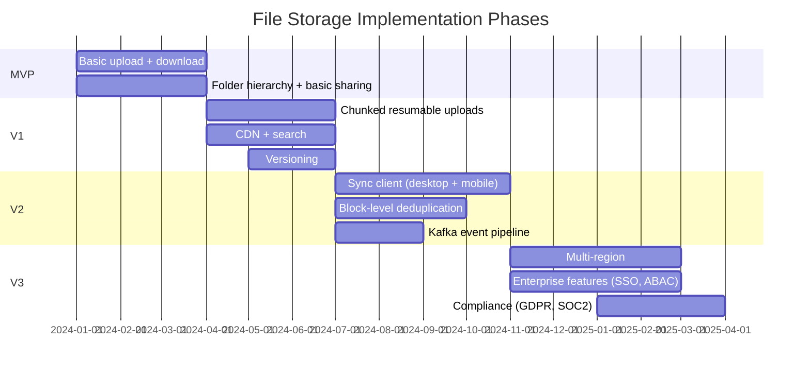

# 15 — Implementation Roadmap: File Storage System

## Objective
Define a realistic, phased implementation path from MVP (basic file upload/download) to a globally scalable file storage platform with deduplication, sync, and collaborative sharing. Each phase is justified by business value, highlights premature complexity traps, and identifies the architectural tipping points that force evolution.

---

## Phase Overview

---

## MVP — Core File Storage (Months 1–3)

### Goal
Users can upload files (up to 100 MB), organize into folders, download, and share via a simple link. Prove storage + retrieval loop works before adding complexity.

### Features
- User registration and login (email + password, JWT)
- File upload (single HTTP request, no chunking — limited to 100 MB)
- File download (presigned S3 URL redirect)
- Folder creation and basic hierarchy (max 3 levels deep initially)
- Simple share link (public, no expiry, no permissions)
- File/folder listing with pagination
- Basic quota enforcement (15 GB free, hard limit)
- File rename and delete (soft delete to trash)
- Admin dashboard (user management, storage overview)

### Architecture
- **Spring Boot modular monolith**: modules: upload, metadata, sharing, user, storage.
- PostgreSQL for all metadata.
- S3 (or MinIO locally) for file bytes.
- No Redis — PostgreSQL for all state.
- No Kafka — synchronous flow.
- NGINX + 2 EC2 instances, RDS PostgreSQL (Multi-AZ for safety from day 1).
- Basic CDN for downloads (CloudFront pointing at S3).

### Infrastructure
- 2 EC2 instances (app + NGINX), 1 RDS PostgreSQL Multi-AZ, S3 bucket, CloudFront.
- Manual deployment (GitHub Actions → SSH deploy).
- No Kubernetes in MVP (operational overhead not justified yet).

### Team
- 2–3 engineers: 1 backend, 1 frontend (React web app), 0.5 infra.

### Risks
- Single HTTP upload fails for files > 100 MB on slow connections.
- No deduplication — duplicate uploads waste storage.
- No versioning — overwriting a file is permanent.
- Public share links never expire — potential abuse.
- PostgreSQL handles all reads at 100K DAU — may strain at 1M.

### MVP Success Criteria
- Upload 100 MB file → download within 5 seconds.
- 1,000 concurrent users without degradation.
- Zero data loss on upload.

---

## V1 — Production-Grade Core (Months 4–6)

### Goal
Chunked resumable uploads, CDN delivery, search, versioning, access-controlled sharing, and first real production deployment. End the "good enough for demo" phase.

### New Features
- Chunked multipart upload (S3 multipart, resumable)
- File size limit: 5 GB
- File versioning: keep last 30 versions (free tier)
- Access-controlled sharing: VIEW / COMMENT / EDIT permissions per user
- Share link expiry and revocation
- Full-text file search (Elasticsearch — file name, MIME type, folder path)
- File preview: image thumbnails, PDF first-page preview
- Email notifications: share invitations, quota approaching limit
- Rate limiting on upload API
- Mobile-responsive web app
- Deduplication: whole-file hash deduplication (fast path — skip upload if hash exists)

### Architecture Evolution
- Extract **Upload Service** from monolith (first bottleneck is upload throughput).
- Redis introduced: upload session state, permission cache, file metadata cache.
- Elasticsearch for search (replace PostgreSQL LIKE queries).
- Kafka introduced for: preview generation (async), notification (async), search index update (async).
- Monolith retains: metadata, sharing, user, folder management.
- PostgreSQL Multi-AZ + 1 read replica for search/browse queries.

### Infrastructure
- EKS cluster (API + preview node pools).
- ElastiCache Redis (primary + replica).
- MSK Kafka (3 brokers).
- OpenSearch (3 nodes).
- CloudFront CDN with origin shield.
- GitHub Actions + ArgoCD for deployment.

### Team
- 5–7 engineers: upload service, search/preview, sharing (enhanced), frontend (web + mobile), DevOps.

### Risks
- Elasticsearch mapping must be planned carefully — schema migration requires re-index.
- Preview generation (ImageMagick, LibreOffice) introduces C library vulnerabilities — update regularly.
- Share permission model complexity increases with inherited folder sharing.

### V1 Success Criteria
- Upload 5 GB file → available within 2 minutes.
- Search returns results in < 500ms.
- File versioning: restore previous version in < 5 seconds.
- 10,000 concurrent users without degradation.

---

## V2 — Sync & Deduplication (Months 7–10)

### Goal
Desktop and mobile sync clients, block-level deduplication, full event-driven architecture, and 10× scale readiness.

### New Features
- **Desktop sync client** (Windows + Mac): file system watcher → upload changes → receive server changes
- **Mobile app sync** (iOS + Android): selective sync, offline access
- **Block-level deduplication**: chunk-level SHA-256 deduplication, ref counting
- **Conflict detection**: detect concurrent edits from two devices, create conflict copies
- **GDPR tools**: data export (ZIP of all files), account deletion with purge pipeline
- **Quota analytics**: storage breakdown by file type, largest files, storage trend
- **Link analytics**: how many times was a share link accessed?
- **Collaborative file comments**: inline comments on files (like Google Drive)
- **File activity log**: who accessed/modified what and when

### Architecture Evolution
- **Sync Service** extracted from monolith: change feed per user, cursor-based delta API.
- **Storage GC Job**: ref_count-based chunk garbage collection. Outbox pattern for reliable event publishing.
- Full Kafka pipeline: all file system changes flow through Kafka → Sync, Search, Preview, Analytics consumers.
- Analytics pipeline: Kafka → ClickHouse for usage analytics (storage breakdown, access patterns).
- Separate **Preview Service** with LibreOffice worker pool for document previews.

### Infrastructure
- KEDA for Preview Service autoscaling (Kafka queue depth).
- ClickHouse for analytics.
- Pre-scaling for business-hours upload peaks.
- Chaos engineering runs (Chaos Monkey) to validate failure handling.

### Team
- 15–20 engineers: sync client (3 — Windows/Mac/mobile), block dedup (2), GDPR (1), analytics (2), preview (1), platform/infra (3), mobile (2 iOS + Android), core platform (3).

### Risks
- Desktop sync clients are notoriously difficult to build correctly (file system events are OS-specific, conflict resolution is nuanced).
- Block-level deduplication requires careful GC to avoid storage leaks.
- Conflict detection edge cases are infinite — ship with "create conflict copy" as the default resolution.

### V2 Success Criteria
- Desktop sync: file change on desktop → visible on web within 5 seconds.
- Block deduplication: storage used after V2 launch < V1 equivalent uploads (measure savings).
- GDPR purge: complete within 24 hours of request for 99% of accounts.
- 100,000 concurrent users without degradation.

---

## V3 — Enterprise & Global (Months 11–18)

### Goal
Multi-region deployment, enterprise features (SSO, RBAC, audit logs), compliance certifications, and platform ecosystem (APIs, developer tools).

### New Features
- **Multi-region**: active-passive deployment in 3 regions, data residency controls
- **Enterprise SSO**: SAML 2.0, Azure AD, Google Workspace integration
- **Advanced RBAC**: team folders, organization-level permissions, admin console
- **Compliance**: SOC 2 Type II audit, GDPR/CCPA controls, audit log export
- **API platform**: public REST + SDK for third-party integration
- **Advanced search**: content search (PDF text, document content via Apache Tika), date range, owner filter
- **Team features**: shared team drives, member management, storage quota per team
- **External collaboration**: invite non-users to view/comment on files (no account required)
- **DLP (Data Loss Prevention)**: scan outgoing shared links for sensitive content (SSN, credit card numbers)
- **End-to-End Encryption (E2EE)**: optional per folder for highest-security users

### Architecture Evolution
- Multi-region Aurora Global Database.
- Per-region Kafka + Elasticsearch clusters.
- Enterprise SSO service (SAML assertion parsing, JIT provisioning).
- Content indexing pipeline: Kafka → Apache Tika (text extraction) → Elasticsearch.
- Compliance event store: append-only audit log (immutable S3 + WORM).
- DLP service: ML classifier on shared link content (PII detection).
- Developer portal: API key management, OAuth2 application registration.

### Infrastructure
- 3-region EKS federation.
- Istio service mesh (mTLS between all services).
- Route 53 Geolocation + Latency routing.
- Dedicated compliance data pipeline (ClickHouse, separate from main analytics).

### Team
- 50–80 engineers: enterprise team (5–8), compliance (3), multi-region platform (4), content search (3), DLP/security (3), developer platform (4), SRE (5–7), mobile (6+), regional teams.

### V3 Success Criteria
- Enterprise accounts: SOC 2 Type II certification achieved.
- Multi-region: European users' data never leaves EU (data residency enforced).
- API platform: > 100 third-party integrations in first year.
- 500M registered users, 50M DAU.

---

## Architecture Evolution Summary

| Phase | Architecture | Key Additions |
|-------|-------------|---------------|
| MVP | Monolith | PostgreSQL, S3, basic CDN |
| V1 | Partial Microservices | Redis, Kafka, ES, EKS, chunked upload, versioning |
| V2 | Event-Driven Microservices | Sync Service, block dedup, GC Job, Flink analytics |
| V3 | Global Microservices + Compliance | Multi-region, SSO, DLP, E2EE, API platform |

---

## Overengineering Traps

| Temptation | Why to Resist |
|------------|--------------|
| Block-level dedup in MVP | Implementation complexity + GC bugs are catastrophic. Whole-file dedup is 80% of the savings with 20% of the complexity. |
| Sync client in V1 | Sync clients are multi-year engineering investments. Build the web app excellently first. |
| Multi-region before 1M users | One region handles 10M+ users easily. Multi-region is for data residency (GDPR) and latency at global scale — not reliability alone. |
| E2EE from the start | E2EE removes search, preview, dedup, antivirus scanning. Implement last, for specific enterprise tier. |
| Kafka in MVP | Synchronous monolith is simpler. Add Kafka when async processing becomes the bottleneck (preview generation blocking, search lag becoming a UX issue). |

---

## Interview-Level Discussion Points

- **Why extract Upload Service first?** — Upload is the highest-bandwidth, most distinct service. It directly interfaces with S3 (special infrastructure concern), has the most distinct scaling profile (CPU for hashing, network for presigned URL generation), and is the first bottleneck under load. All other monolith services can stay together longer.
- **When do you introduce block-level deduplication?** — After you've measured whole-file deduplication savings and storage costs justify the GC complexity. Also after the GC integrity scan (V1 safety net) is in place. Never ship block-level dedup without the integrity scan — a GC bug without the safety net causes data loss.
- **Why not build sync clients in V1?** — Sync clients require: OS-specific file system watchers (different on Windows/Mac/Linux), conflict resolution logic, offline queue management, certificate pinning, background sync respecting OS battery policies. It's a separate product, not a feature. Dropbox spent 2 years building their desktop client. Build web app excellence first, then tackle sync.
