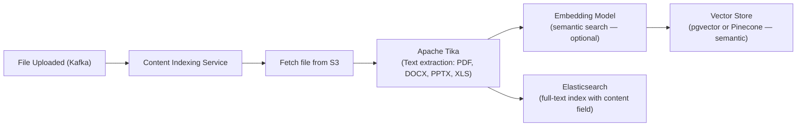
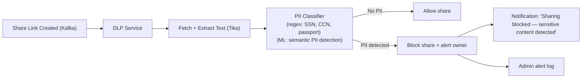

# 16 — Advanced Improvements: File Storage System

## Objective
Document frontier engineering improvements that distinguish world-class file storage platforms (Google Drive, Dropbox, OneDrive) from commodity implementations. Each improvement is grounded in real engineering problems, justified by business or technical impact, and honest about complexity cost.

---

## 1. Operational Transform / CRDT for Collaborative Editing

### Problem
Multiple users editing the same document simultaneously via Google Docs-like experience. Locking (pessimistic) kills collaboration UX. Last-write-wins causes data loss.

### Approach A: Operational Transforms (OT)
Used by Google Docs.
- Client sends operations (not full documents): `INSERT(char='a', position=5)`, `DELETE(position=3, count=1)`.
- Server applies transformation: if User A's operation happened before User B's, transform B's operation to account for A's changes.
- Complex: transform function must be defined for every pair of operation types (N² complexity as document features grow).
- Requires central server to serialize concurrent operations.

### Approach B: CRDTs (Conflict-free Replicated Data Types)
Used by Figma, Notion.
- Data structure designed so concurrent updates always merge deterministically without central coordination.
- YATA (Yet Another Transformation Approach): sequence CRDTs used in Y.js.
- Every character has a globally unique ID (author + counter). Insert/delete operations are deterministic regardless of order.
- Enables peer-to-peer sync (no central server needed for conflict resolution).

### Practical Recommendation
- Integrate Y.js (CRDT library) into the web editor.
- Server stores the CRDT document state (not raw text) — enables full history + partial replay.
- Real-time updates: WebSocket push from server to all editors on document changes.
- Offline: local CRDT state + sync on reconnect.
- For file storage: implement as a "document editing" service layer. Files remain immutable chunks in S3; collaborative documents stored as CRDT state in a separate DocumentDB (or dedicated Postgres schema).

---

## 2. Smart Sync (On-Demand / Virtual Files)

### Problem
User has 500 GB of files in cloud storage. Desktop has 256 GB SSD. Traditional sync: cannot sync all files (not enough disk). Solution: sync only metadata locally, download on access.

### Implementation
- Desktop client shows all files in Finder/Explorer (placeholders).
- File access triggers on-demand download (OS virtual file system integration: macOS APFS Extensions, Windows Cloud Files API).
- Downloaded files are cached locally (LRU eviction when disk full).
- User can "pin" important folders (always available offline).

### Technical Components
- **macOS**: APFS + FileProvider extension API.
- **Windows**: Cloud Files API (same underlying mechanism as OneDrive).
- **Linux**: FUSE filesystem (custom kernel module for virtual file system).
- File status indicators: local (green checkmark), cloud-only (cloud icon), pinned (always available).

### Benefits
- User can have 10 TB of cloud storage with a 256 GB local disk.
- Selective sync: only sync documents folder, not Downloads (configurable).
- No wasted bandwidth for rarely-accessed files.

---

## 3. Advanced Search: Content Indexing

### Problem
Searching for "Q3 revenue" should find files where the text "Q3 revenue" appears inside a PDF or Word document — not just in the filename.

### Architecture

### Apache Tika
- Open-source text extraction library: supports 1,000+ file formats.
- Extracts: text content, metadata (author, creation date, page count).
- Runs in a separate service (CPU-intensive, isolated from API).
- Output: extracted text → stored in Elasticsearch `content` field.

### Search Modes
| Mode | Implementation | Use Case |
|------|---------------|---------|
| Filename search | Elasticsearch `name` field | Fast, always available |
| Full-text search | Elasticsearch `content` field (post-Tika) | "Find all files mentioning X" |
| Semantic search | Vector similarity (pgvector) | "Find files similar to this document" |

### Limitations
- OCR-scanned PDFs: text extraction requires Tesseract OCR (slower, less accurate).
- Binary files (images without text): no content search.
- Content indexing adds 2–10 minutes latency per file (run async).
- Storage: extracted text can be 2–5× larger than the original file's text content.

---

## 4. AI-Powered File Organization

### Features

#### Auto-Tagging
- ML classifier (document category → Finance, Legal, Personal, Work, Medical).
- Tags applied automatically on upload.
- Tags are user-editable and feed into search filters.
- Model: fine-tuned BERT or FastText for document classification.

#### Smart Folder Suggestions
- Based on file name + content → suggest "This looks like a Q3 report — move to Finance/2024/Q3?"
- User accepts or dismisses. Feedback loop improves model.

#### Duplicate Detection (Smart)
- Not just exact hash match — perceptual similarity for images (pHash: detect near-duplicate photos).
- For documents: similarity score from content embeddings → flag likely duplicates.
- User gets "You have 23 similar-looking files — want to review?" notification.

---

## 5. DLP (Data Loss Prevention)

### Problem
Employee shares a file containing credit card numbers or SSNs via a public link → data leak. Platform has no visibility into what's being shared.

### Architecture

### PII Patterns Detected
- Credit card numbers (Luhn algorithm validation)
- US SSNs (`\d{3}-\d{2}-\d{4}`)
- Passwords (entropy-based detection)
- API keys / credentials (regex for common formats)
- Health information patterns (diagnosis codes, drug names — HIPAA context)

### Tradeoffs
- False positives block legitimate shares → user frustration.
- Scanning adds 1–3 seconds to share creation (if synchronous) or allows share creation but revokes if DLP fails (if async).
- Recommended: async. Allow share, scan in background, revoke if PII detected, notify user. Audit log preserved regardless.

---

## 6. Zero-Knowledge Encryption (E2EE)

### Problem
Users (journalists, lawyers, medical professionals) need files encrypted such that even the platform cannot decrypt them. Server-side encryption is not enough — subpoena or breach exposes all data.

### Architecture
- User generates a keypair (RSA-2048 or ECC P-256) in the browser on account creation.
- Private key stored locally (encrypted with user's master password, never sent to server).
- Files encrypted in browser before upload using the public key.
- Server stores only ciphertext.
- Sharing: encryptor re-encrypts symmetric key with grantee's public key.

### Fundamental Limitations
| Feature | E2EE Compatible? |
|---------|-----------------|
| Full-text search | ❌ (server cannot index encrypted text) |
| Thumbnail preview | ❌ (server cannot generate from ciphertext) |
| Virus scanning | ❌ |
| Deduplication | ❌ (ciphertext of same plaintext is different per encryption) |
| Server-side recovery | ❌ (lost private key = permanent data loss) |

### Conclusion
E2EE is a feature for a specific tier of enterprise users who accept the limitations. Never the default — breaks too many platform features.

---

## 7. Architecture Self-Critique

### Weaknesses in This Design

| Weakness | Impact | Mitigation |
|----------|--------|-----------|
| Sync Service polling at 5M RPS (50M DAU) | High pod count even with Redis short-circuit | WebSocket push (V4) eliminates polling for active sessions |
| Block-level dedup ref_count is mutable | Concurrent decrements risk race condition | Row-level lock on chunk.ref_count during decrement; or event sourcing ref_count |
| Search index eventual consistency (30s lag) | User expects instant search after upload | Show "Indexing..." status for newly uploaded files; direct lookup by fileId as fallback |
| GC runs as CronJob (batch) | Deleted files' storage not freed until GC runs | Near-real-time GC: trigger immediately on file deletion event, not on schedule |
| Preview generation blocks search discovery | Previews take minutes; file not previewed in search until then | Show generic icon in search results while preview generates |

### Scaling Limits

| Component | Current Design Limit | Next Level |
|-----------|---------------------|------------|
| PostgreSQL files table | ~500M rows (with partitioning) | Citus/Vitess sharding by owner_id |
| Elasticsearch (per-user search index) | ~1B documents per cluster | Per-organization indexes; federated search |
| Redis (permission cache) | ~150 GB total | Add shards; compress permission entries |
| S3 (storage) | Unlimited (cost-limited) | Tiered storage + eventual own hardware at $40M/year S3 spend |
| Upload Service (presigned URL gen) | ~150K URLs/second (120 pods × 4 cores) | Add pods; CPUs are the ceiling |

### Taking Interviewer Challenges
- "Your deduplication sends file hash from the client. Can a malicious client lie about the hash to get someone else's file?" → Client sends hash for deduplication check only. Server re-hashes after upload. The deduplication result is: "you don't need to upload this chunk" — the server already has a copy. The client receives a reference to their own file record, not access to the original file that provided the chunk. A malicious hash claim means the client wastes bandwidth uploading a chunk that doesn't match the hash — the server detects and rejects.
- "How do you handle a user who deletes their account but shared files with other users?" → Shared files owned by deleted account: files are copied to each grantee's storage (at the moment of sharing) OR the share link is invalidated on owner deletion. Production choice: on `AccountDeleted` event → offer each grantee "Make a copy before this file is deleted in 30 days" notification. After 30 days → share revoked, file deleted. Grantees who accepted the copy own their copy.
- "Your sync uses polling. What's the battery impact on mobile?" → Mobile uses background app refresh (iOS) or WorkManager (Android) — sync polls every 15–30 minutes on battery, continuous when plugged in. Push notification from server to wake app when changes occur (FCM/APNs) — eliminates polling entirely for mobile. Sync client does local diff on wake, only downloads changed files.
- "What's your strategy for a 1 TB file upload?" — 1 TB ÷ 8 MB chunks = 125,000 chunks. Parallel upload of 50 chunks at a time (client-side throttle). Total upload time at 100 Mbps = 22 hours. Solution: client resumes across sessions (cursor saved). Multiday upload support. Show "Large file — upload continues in background." Enterprise tier only (no 5 GB limit). Presigned URLs refreshed by client every 15 minutes for stalled chunks.
