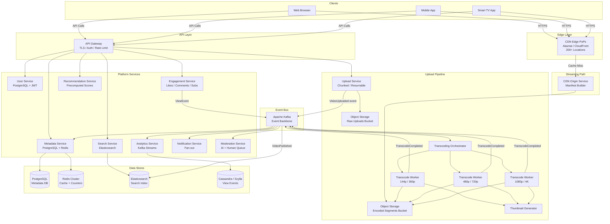
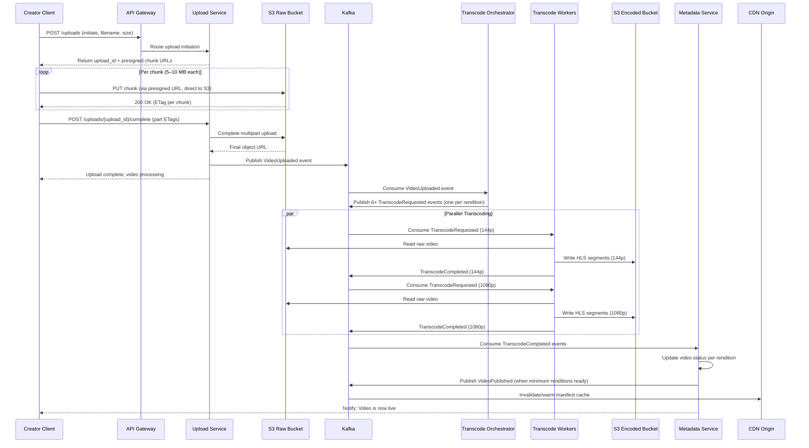
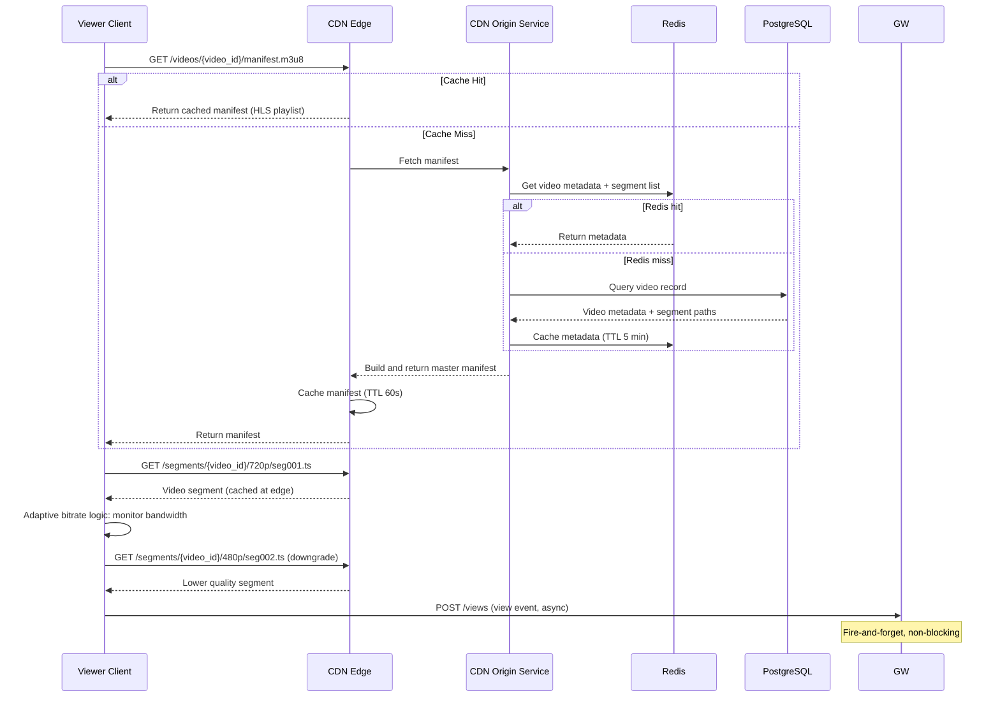

# 01 — High-Level Architecture: Video Streaming Platform

---

## Objective

Define the overarching system architecture, justify the choice of microservices over alternatives, decompose the system into its major components, and describe the end-to-end flow from video upload through transcoding to global delivery. Establish the migration path so this design can be understood as an evolution, not a greenfield fantasy.

---

## 1. Architecture Decision: Why Microservices?

At the scale of YouTube/Netflix, microservices are not a preference — they are a structural necessity. The justification is rooted in the **independent scaling dimensions** of each subsystem.

| Subsystem | Primary Constraint | Scaling Axis |
|---|---|---|
| Upload service | Network I/O, storage write throughput | Horizontal (stateless per chunk) |
| Transcoding workers | CPU, GPU (H.264/H.265 encoding) | Burst-heavy horizontal (HPA on queue depth) |
| CDN / delivery | Bandwidth, geographic proximity | Edge node count + CDN provider capacity |
| Metadata service | Read-heavy, low latency | Read replicas + cache |
| Search | Write throughput of index, query latency | Elasticsearch horizontal shards |
| Recommendations | ML inference latency, batch precompute | GPU-backed inference cluster |
| View/Analytics | Write-heavy event stream | Kafka + stream processing |
| User/Auth | Read-heavy, consistency-critical | Read replicas, stateless JWT |

If these were colocated in a monolith, you cannot independently scale transcoding (CPU-heavy) from metadata reads (I/O-light). Deploying a change to the recommendation algorithm would require redeploying the entire upload service. Fault isolation is impossible — a memory leak in transcoding workers crashes the API.

### When NOT to use Microservices

- Teams of fewer than 20 engineers: network overhead, service mesh complexity, and distributed debugging are productivity killers.
- Early product phase where domain boundaries are unknown: prematurely decomposing leads to chatty inter-service calls and distributed monoliths.
- When consistency requirements are very high: cross-service transactions require Saga patterns which add complexity.

**FAANG vs Startup**: Netflix and YouTube run hundreds of microservices with dedicated teams per service. A startup building a video platform should start with a **modular monolith with clear package boundaries** (see Section 4 below — Migration Path).

---

## 2. System Decomposition

### Core Services

| Service | Responsibility |
|---|---|
| **API Gateway** | TLS termination, auth token validation, rate limiting, request routing |
| **Upload Service** | Accepts chunked uploads, validates, stores to object storage, emits events |
| **Transcoding Orchestrator** | Picks up upload events, partitions transcode jobs, tracks progress |
| **Transcoding Workers** | Stateless CPU-bound workers that encode a single rendition |
| **CDN Origin Service** | Serves video segments and manifests; acts as CDN origin |
| **Metadata Service** | CRUD for videos, channels, playlists; serves video pages |
| **User Service** | Registration, profiles, authentication, JWT issuance |
| **Search Service** | Indexes video metadata; serves full-text and faceted search |
| **Recommendation Service** | Serves pre-computed home feed, up-next videos |
| **Engagement Service** | Handles likes, comments, subscriptions, watch history |
| **Analytics Service** | Ingests view events; computes creator analytics |
| **Notification Service** | Fan-out notifications to subscribers |
| **Moderation Service** | Automated + manual content review pipeline |

### Supporting Infrastructure

| Component | Role |
|---|---|
| Object Storage (S3) | Durable storage for raw uploads, encoded segments, thumbnails |
| PostgreSQL | Metadata persistence (videos, users, channels, comments) |
| Redis Cluster | Caching, view counters, session state, pub/sub |
| Kafka | Event backbone: upload events, view events, transcode events |
| Elasticsearch | Full-text search index, video discovery |
| CDN (Cloudfront/Akamai) | Edge delivery of video segments and thumbnails |
| Kubernetes | Container orchestration, autoscaling of workers |

---

## 3. Full Architecture Diagram



---

## 4. Upload-to-Publish Flow (Sequence)



---

## 5. Video Playback Flow



---

## 6. Service Communication Patterns

| From → To | Protocol | Pattern | Why |
|---|---|---|---|
| Client → API Gateway | HTTPS/HTTP2 | Request/Response | Standard |
| Gateway → Upload Service | HTTP | Sync REST | Needs immediate upload_id back |
| Upload Service → Kafka | Kafka Producer | Async event | Decouple upload from transcode |
| Transcode Orchestrator → Workers | Kafka | Async job dispatch | Backpressure-safe, durable queue |
| Services → PostgreSQL | JDBC | Sync query | ACID requirements |
| Services → Redis | TCP | Sync (microseconds) | Cache reads must be synchronous |
| Metadata → Kafka | Kafka Consumer | Event-driven update | React to transcode completion |
| Services → Elasticsearch | REST | Async indexing | Write-behind; eventual consistency OK |
| Gateway → Other Services | HTTP/gRPC | Sync REST / RPC | Real-time user response needed |
| Analytics → Kafka | Kafka Consumer | Stream processing | High-throughput event processing |

---

## 7. Why NOT a Modular Monolith at This Scale?

| Concern | Monolith Problem | Microservice Solution |
|---|---|---|
| Transcoding CPU | Transcoding workers would compete with API handlers for CPU | Isolated containers with dedicated vCPU limits |
| Deployment velocity | 50+ teams cannot deploy to a single codebase | Independent deployment per service |
| Fault isolation | Transcode crash kills the API | Separate process boundaries |
| Language/runtime choice | Monolith forces one language | Python workers for ML, Java for API, Go for gateway |
| Data ownership | All services share one DB schema — migrations become a bottleneck | Each service owns its schema |

---

## 8. Migration Path: Monolith → Microservices

This is a critical interview point. Nobody starts with 15 microservices.

```
Phase 1 (MVP): Modular Monolith
  - Single Spring Boot app with clean package boundaries
  - SaaS transcoding (Mux, AWS MediaConvert)
  - Single PostgreSQL
  - S3 for video storage
  - Basic CDN

Phase 2 (V1 — Traffic grows): Strangler Fig Pattern
  - Extract Upload Service first (easiest boundary, I/O-bound, isolated)
  - Extract User/Auth Service (security isolation, can become OAuth2 server)
  - Add Kafka for internal events (prepare for async)

Phase 3 (V2 — Scale pressure): Extract Hot Services
  - Extract Analytics (view events overwhelm main DB)
  - Extract Search (Elasticsearch cluster independent of app)
  - Extract Transcoding Orchestrator + Workers

Phase 4 (V3 — Full Microservices): Complete Decomposition
  - Recommendation, Notification, Moderation extracted
  - Service mesh (Istio/Linkerd) for observability + mTLS
  - gRPC for internal service-to-service calls
```

---

## 9. Key Architecture Principles

- **Upload path and read path are physically separated** — different services, different infrastructure. An upload spike does not impact viewer experience.
- **CDN is not optional** — at 25 Tbps peak egress, CDN edge servers absorb traffic that no origin cluster could serve.
- **Kafka is the nervous system** — every state change in the system produces an event; consumers are decoupled and independently scalable.
- **Object storage is immutable after encoding** — segments are written once, read millions of times. This maps perfectly to S3-class storage semantics.
- **Graceful degradation** — if recommendations are down, serve trending videos. If search is slow, return cached results. The video playback path must never be affected by peripheral service failures.

---

## 10. Interview-Level Discussion Points

- Why does the upload go directly to S3 via presigned URLs instead of through the Upload Service? (Bypass application server bandwidth limitations; S3 multipart upload is designed for this)
- How do you handle a partial upload where only 60% of chunks arrived before the client disconnected? (Upload Service maintains upload session state; client can resume using upload_id and re-upload only missing chunks using byte ranges)
- Why is the CDN Origin Service a separate service and not just S3 directly? (Manifest generation is dynamic — it needs to check which renditions are available, sign URLs, inject DRM tokens; pure S3 cannot do this)
- What is the cost of the API Gateway being a single component? (It is a potential bottleneck and single point of failure — deploy as a cluster; use L7 load balancer in front of it; consider per-region gateway instances)
- How does the architecture handle the "thundering herd" on a viral video? (CDN absorbs 95%+ traffic; origin is shielded; manifest cached; Redis counters absorb like/view writes — see caching strategy)
