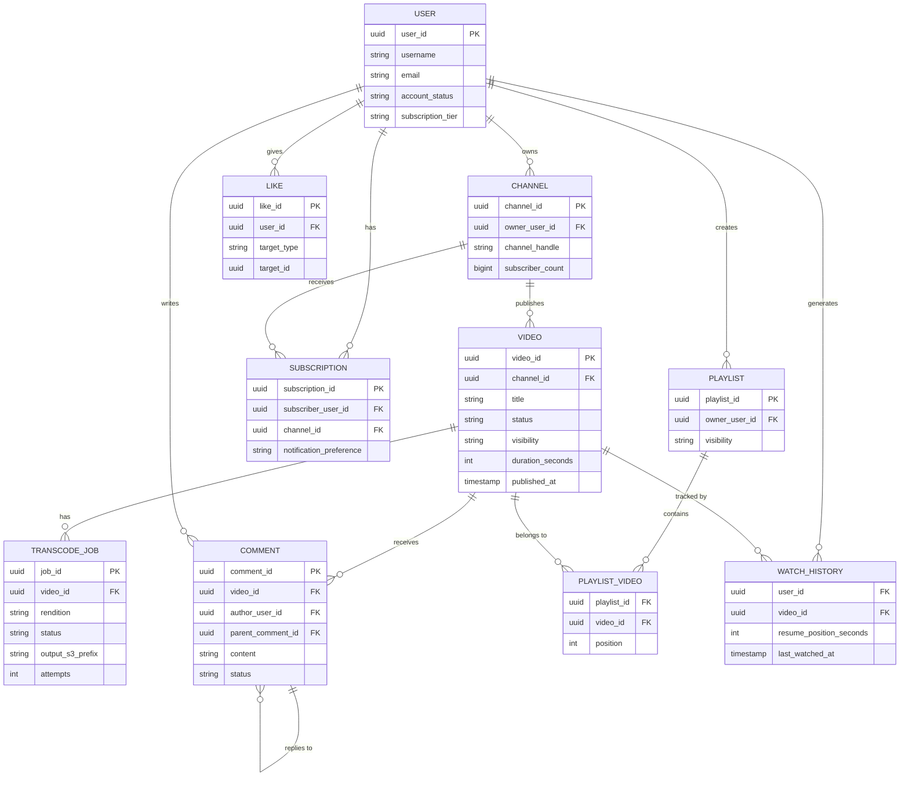

# 02 — Domain Modeling: Video Streaming Platform

---

## Objective

Establish a rich, precise domain model that reflects the real complexity of a video streaming platform. This is not a surface-level CRUD model — it captures behavioral invariants, aggregate boundaries, value objects, domain events, and the lifecycle of each core entity. The domain model drives database schema, API design, and service boundaries.

---

## 1. Core Domain Concepts

The platform has three high-level domain areas:

1. **Content Domain** — Video as the central artifact, with its lifecycle from raw upload to published stream
2. **Engagement Domain** — User interactions with content (views, likes, comments, subscriptions)
3. **Delivery Domain** — The technical representation of content for streaming (segments, manifests, transcode jobs)

---

## 2. Entity Definitions

### 2.1 User

**Description**: A registered account on the platform. Can be a viewer, creator, or both.

**Key Attributes**:
- `user_id` (UUID) — system-generated, immutable
- `username` — unique, URL-safe, changeable with 30-day lock
- `email` — verified, unique
- `display_name` — non-unique, shown in UI
- `avatar_url` — reference to object storage
- `account_status` — ACTIVE, SUSPENDED, DEACTIVATED, PENDING_VERIFICATION
- `role` — VIEWER, CREATOR, MODERATOR, ADMIN (RBAC)
- `created_at`, `last_login_at`
- `country_code` — for compliance and content geo-blocking
- `subscription_tier` — FREE, PREMIUM (for DRM content access)

**Invariants**:
- A user cannot be both SUSPENDED and ACTIVE
- Username changes are rate-limited
- Deactivated users retain data for 30 days (GDPR erasure window)

**Domain Events**:
- `UserRegistered`
- `UserSuspended`
- `UserDeactivated`
- `UserRoleChanged`

---

### 2.2 Channel

**Description**: A creator's branded space on the platform. A User who is a CREATOR owns exactly one primary channel (platform may allow multiple).

**Key Attributes**:
- `channel_id` (UUID) — immutable
- `owner_user_id` — FK to User
- `channel_handle` — unique `@handle`, URL-safe, changeable
- `channel_name` — display name
- `description` — long text
- `banner_url`, `avatar_url` — references to object storage
- `subscriber_count` — denormalized counter (maintained by Engagement domain)
- `total_view_count` — denormalized
- `created_at`
- `is_verified` — verified creator badge
- `country` — primary country for channel
- `custom_url` — premium feature

**Invariants**:
- subscriber_count is an approximation (see Engagement domain)
- Channel handle is globally unique across the platform

**Domain Events**:
- `ChannelCreated`
- `ChannelVerified`
- `ChannelSuspended`

---

### 2.3 Video

**Description**: The central aggregate of the Content domain. Represents a creator's uploaded content throughout its full lifecycle.

**Video Lifecycle States**:

```
DRAFT → UPLOADING → UPLOAD_COMPLETE → PROCESSING → READY → PUBLISHED
                                                           ↘ UNLISTED
                                                           ↘ PRIVATE
PUBLISHED → UNDER_REVIEW → REMOVED
PUBLISHED → DELETED (soft delete, 30-day recovery)
```

**Key Attributes**:
- `video_id` (UUID) — immutable, used in all URLs
- `channel_id` — owning channel
- `title` — max 200 chars
- `description` — max 5000 chars, supports timestamps
- `tags` — array, max 500 chars total
- `category_id` — enum (Music, Gaming, Education, etc.)
- `language_code` — ISO 639-1
- `visibility` — PUBLIC, UNLISTED, PRIVATE, MEMBERS_ONLY
- `status` — DRAFT / UPLOADING / PROCESSING / READY / PUBLISHED / REMOVED / DELETED
- `duration_seconds` — set after first rendition is ready
- `upload_id` — reference to the upload session
- `raw_storage_path` — S3 path of original file
- `default_thumbnail_url`
- `published_at` — nullable; set when creator publishes
- `scheduled_publish_at` — nullable; for scheduled publishing
- `age_restricted` — boolean; 18+ content flag
- `geo_block_countries` — array of country codes
- `license_type` — STANDARD, CREATIVE_COMMONS, etc.
- `created_at`, `updated_at`

**Aggregate Roots**: Video is an aggregate root. Chapters, Subtitles, and Tags belong to the Video aggregate.

**Domain Events**:
- `VideoUploadInitiated`
- `VideoUploaded` (upload complete, raw file in S3)
- `VideoTranscodeRequested`
- `VideoTranscodeCompleted`
- `VideoPublished`
- `VideoUnlisted`
- `VideoDeleted`
- `VideoRemovedByModeration`
- `VideoDMCATakedown`

---

### 2.4 TranscodeJob

**Description**: Represents a single encoding task for one video at one quality rendition. Lives in the Delivery domain.

**Key Attributes**:
- `job_id` (UUID)
- `video_id` — reference
- `rendition` — ENUM (144p, 360p, 480p, 720p, 1080p, 1440p, 2160p)
- `codec` — H.264 (AVC), H.265 (HEVC), AV1
- `status` — QUEUED, PROCESSING, COMPLETED, FAILED, RETRYING
- `worker_id` — which worker claimed this job
- `input_s3_path` — raw video path
- `output_s3_prefix` — where to write segments
- `segment_duration_seconds` — default 6s for HLS
- `attempts` — retry counter (max 3)
- `error_message` — last failure reason
- `started_at`, `completed_at`
- `segments_count` — total HLS segments written
- `playlist_path` — S3 path of .m3u8 playlist for this rendition

**Invariants**:
- One TranscodeJob per (video_id, rendition) pair
- A job cannot transition from COMPLETED back to PROCESSING
- Failure after 3 attempts marks as permanently FAILED; triggers alert

**Domain Events**:
- `TranscodeJobQueued`
- `TranscodeJobStarted`
- `TranscodeJobCompleted`
- `TranscodeJobFailed`
- `TranscodeJobRetried`

---

### 2.5 VideoSegment

**Description**: A value object representing a single HLS/DASH segment file. Not stored in the database as individual rows — the manifest (playlist file) is the source of truth. Stored in object storage.

**Conceptual Attributes**:
- `segment_index` — sequence number
- `duration_seconds` — actual segment duration (may vary, typically ~6s)
- `s3_key` — full storage path
- `byte_range` — for DASH byte-range requests
- `rendition` — quality level this belongs to

**Why Not a DB Row?**: A 2-hour video at 6s segments = 1,200 segments × 7 renditions = 8,400 rows per video. With 6M videos, that's 50 billion rows — impractical in PostgreSQL. Segment metadata lives in the HLS manifest file in S3.

---

### 2.6 Playlist

**Description**: A user-curated ordered list of videos. Can be public, unlisted, or private.

**Key Attributes**:
- `playlist_id` (UUID)
- `owner_user_id`
- `title`, `description`
- `visibility` — PUBLIC, UNLISTED, PRIVATE
- `video_ids` — ordered array (denormalized for fast reads)
- `video_count` — denormalized
- `total_duration_seconds` — denormalized
- `created_at`, `updated_at`
- `thumbnail_video_id` — first video's thumbnail used as cover

**System Playlists**: "Watch Later", "Liked Videos" are auto-created per user.

---

### 2.7 Comment

**Description**: User-generated text response to a video or to another comment (threading up to 2 levels deep — top-level and reply).

**Key Attributes**:
- `comment_id` (UUID)
- `video_id`
- `author_user_id`
- `parent_comment_id` — nullable (null = top-level; non-null = reply)
- `content` — max 10,000 chars, plain text (HTML-escaped)
- `like_count` — denormalized counter
- `reply_count` — denormalized (only on top-level)
- `status` — ACTIVE, HIDDEN_BY_AUTHOR, REMOVED_BY_MODERATOR, SPAM
- `is_pinned` — creator can pin one comment
- `is_creator_comment` — special badge
- `created_at`, `edited_at`

**Invariants**:
- Replies cannot themselves have replies (max depth = 2)
- Only the comment author or a moderator can delete a comment
- `reply_count` is updated on the parent when a reply is added

---

### 2.8 Like

**Description**: A user's affirmative engagement signal on a video. Stored as an event (not a simple counter) to enable undo and deduplication.

**Key Attributes**:
- `like_id` (UUID)
- `user_id`
- `target_type` — VIDEO, COMMENT
- `target_id` — polymorphic reference
- `created_at`

**Implementation Note**: The raw like events are written to Kafka; a consumer maintains denormalized like_count on the Video and Comment records. Redis holds real-time counts. The `likes` table in PostgreSQL is used for "did this user like this video" checks (per-user state, not global count).

---

### 2.9 View

**Description**: A record of a viewing session. Distinct from a simple click — platform applies deduplication rules (same user, same video, within 24 hours = 1 view).

**Key Attributes**:
- `view_id` (UUID)
- `video_id`
- `viewer_user_id` — nullable (anonymous viewers)
- `session_id` — for anonymous tracking
- `watch_duration_seconds` — how long they watched
- `watch_percentage` — 0.0–1.0
- `started_at`
- `client_type` — WEB, IOS, ANDROID, TV, EMBED
- `country_code`
- `ip_address_hash` — hashed, not raw (privacy)

**Scale Challenge**: 1B views/day = ~11,600 writes/second. This is a write-heavy table that cannot live in a standard OLTP schema. See Database Design for Cassandra/time-series approach.

---

### 2.10 Subscription

**Description**: Represents a User's subscription to a Channel.

**Key Attributes**:
- `subscription_id` (UUID)
- `subscriber_user_id`
- `channel_id`
- `notification_preference` — ALL, PERSONALIZED, NONE
- `subscribed_at`
- `is_active` — soft delete

**Scale Challenge**: A creator with 100M subscribers requires 100M rows. Fan-out notifications to 100M subscribers is a known hard problem (see Event Flow document).

---

### 2.11 WatchHistory

**Description**: Per-user record of recently watched videos with resume position.

**Key Attributes**:
- `user_id`
- `video_id`
- `last_watched_at`
- `resume_position_seconds`
- `completion_percentage`

**Storage**: This is stored in Redis per user (sorted set by timestamp) for fast access. Periodically persisted to PostgreSQL for durability. Hot users' history is always in Redis; cold history fetched from PostgreSQL.

---

## 3. Domain Relationships



---

## 4. Value Objects

Value objects have no identity; they are defined entirely by their attributes.

| Value Object | Fields | Used In |
|---|---|---|
| `Rendition` | quality (144p…4K), codec, bitrate_kbps, resolution_width, resolution_height | TranscodeJob |
| `GeoRestriction` | country_codes[], restriction_type (BLOCK/ALLOW) | Video |
| `TimeRange` | start_seconds, end_seconds | Chapter, Ad Marker |
| `StoragePath` | bucket, key, region | Video, TranscodeJob, Thumbnail |
| `VideoMetrics` | view_count, like_count, dislike_count, comment_count, share_count | Video (denormalized) |
| `ContactInfo` | email, phone (nullable) | User |
| `AdMarker` | timestamp_seconds, duration_seconds, ad_type | Video |

---

## 5. Domain Events Catalog

| Event | Publisher | Consumer(s) | Payload |
|---|---|---|---|
| `VideoUploadInitiated` | Upload Service | Analytics | upload_id, user_id, file_size |
| `VideoUploaded` | Upload Service | Transcode Orchestrator | video_id, raw_s3_path, duration_estimate |
| `TranscodeJobQueued` | Transcode Orchestrator | Transcode Workers | job_id, video_id, rendition |
| `TranscodeJobCompleted` | Transcode Worker | Orchestrator, Metadata, CDN | job_id, video_id, rendition, playlist_path |
| `VideoPublished` | Metadata Service | Search, Recommendations, Notifications | video_id, channel_id, tags, category |
| `VideoViewed` | Engagement Service | Analytics, Recommendation, Counter | video_id, user_id, session_id, duration |
| `VideoLiked` | Engagement Service | Counter, Recommendation | video_id, user_id |
| `CommentPosted` | Engagement Service | Notification, Moderation | comment_id, video_id, author_id, content |
| `UserSubscribed` | Engagement Service | Notification, Recommendation | subscriber_id, channel_id |
| `VideoRemovedByModeration` | Moderation Service | CDN Invalidation, Metadata, Notification | video_id, reason |
| `DMCATakedownReceived` | Moderation Service | CDN Invalidation, Upload blocker | video_id, claim_id, claimant |

---

## 6. Aggregate Boundaries and Invariants

| Aggregate | Root | Children | Invariant |
|---|---|---|---|
| Video Aggregate | Video | TranscodeJob, Chapter, AdMarker, Subtitle | A Video cannot be PUBLISHED unless at least one TranscodeJob is COMPLETED |
| User Aggregate | User | WatchHistory (partial) | A suspended User cannot upload |
| Channel Aggregate | Channel | (no children owned) | Channel subscriber_count is eventually consistent |
| Comment Thread | Comment (top-level) | Reply Comments | Reply depth max 1; reply cannot be pinned |
| Playlist | Playlist | PlaylistVideo entries | Max 5,000 videos per playlist |

---

## 7. Design Tradeoffs

| Decision | Chosen Approach | Alternative | Reason |
|---|---|---|---|
| View storage | Cassandra/time-series, not PostgreSQL | PostgreSQL append-only | PostgreSQL cannot sustain 11,600 writes/second on a single table without heroic partitioning |
| Like count | Redis counter + periodic DB flush | DB row per like with COUNT query | COUNT on billion-row table is unacceptably slow |
| Subscriber count | Denormalized on Channel, eventual | Real-time query against subscription table | Subscription table has billions of rows; COUNT is impractical |
| Comment threading | Max depth 2 | Recursive trees | Recursive queries at scale are expensive; deep threading adds little user value |
| Watch history | Redis + periodic PostgreSQL flush | Pure PostgreSQL | User expects instant resume — Redis latency (microseconds) is necessary |

---

## 8. Interview-Level Discussion Points

- Why is `view_id` a UUID and not auto-increment? (Auto-increment on a distributed, sharded table creates a single sequence generator bottleneck; UUIDs are insert-safe on any shard)
- How do you enforce the invariant "a video cannot be published unless transcoding is complete"? (State machine in the Video aggregate; the `status` field transitions are guarded by domain service logic, not application-layer if-statements)
- Why does Like use a separate rows table instead of just a counter? (The per-user state — "did I already like this?" — requires a row lookup; if you only had a counter you cannot answer that question efficiently)
- How would you model paid/premium content differently? (Add a `ContentAccess` aggregate with entitlement records, DRM license references, and rental/purchase models; Video aggregate stays clean)
- What is the risk of denormalized counts (subscriber_count, view_count)? (Counts can diverge from truth if consumers fail; use compensating reads periodically — full recount from source — as a reconciliation job)
