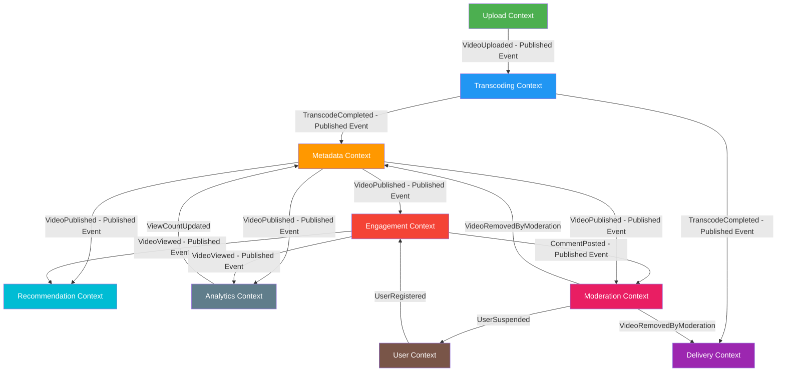

# 03 — DDD Bounded Contexts: Video Streaming Platform

---

## Objective

Define explicit bounded contexts that enforce domain isolation, prevent model pollution across services, and establish the communication contracts between contexts. Each bounded context owns its domain model, its data, and its ubiquitous language. The context map defines how contexts relate and where anti-corruption layers are needed.

---

## 1. Why Bounded Contexts Matter Here

A video streaming platform is deceptively complex because several concepts have the same name but radically different meanings depending on who is thinking about it:

- **"Video"** means:
  - A raw uploaded file to the Upload context
  - A set of HLS segments and manifests to the Delivery context
  - A metadata record with title and tags to the Metadata context
  - An item with like counts and comments to the Engagement context
  - A vector of features (watch time, genre embedding) to the Recommendation context

Without bounded contexts, these meanings bleed together into a single `Video` god object that nobody fully understands.

---

## 2. Bounded Context Catalog

### Context 1: Upload Context

**Purpose**: Manage the lifecycle of a creator's file upload from initiation to raw storage completion.

**Ubiquitous Language**:
- *Upload Session*: A stateful record tracking a multipart upload
- *Chunk*: A fixed-size slice of the upload (5–50 MB)
- *Raw File*: The unprocessed original video file
- *Resumption Token*: Allows a client to continue an interrupted upload

**Entities**: `UploadSession`, `UploadChunk`

**Aggregate Root**: `UploadSession`

**Data Ownership**: Upload session table in PostgreSQL (upload service schema); raw file in S3 raw-uploads bucket.

**Outbound Events**: `VideoUploaded` (the only event this context publishes to the outside world)

**What This Context Does NOT Know**:
- How transcoding works
- What quality renditions exist
- How the video will be displayed to viewers

**Team Ownership**: Upload Platform Team

---

### Context 2: Transcoding Context

**Purpose**: Accept raw video files and produce multi-quality encoded segments suitable for adaptive bitrate streaming.

**Ubiquitous Language**:
- *Transcode Job*: A unit of work for a single rendition
- *Rendition*: A specific quality level (resolution + codec + bitrate)
- *Segment*: A fixed-duration chunk of encoded video (e.g., 6-second .ts file)
- *Manifest*: A playlist file (.m3u8 or .mpd) referencing all segments for a rendition
- *Master Manifest*: Top-level playlist listing all available renditions

**Entities**: `TranscodeJob`, `TranscodeWorker` (implicit), `RenderProfile`

**Aggregate Root**: `TranscodeJob`

**Data Ownership**: `transcode_jobs` table; encoded segments and manifests in S3 encoded-segments bucket.

**Inbound Events**: `VideoUploaded` (from Upload Context)

**Outbound Events**: `TranscodeJobCompleted`, `TranscodeJobFailed`, `VideoProcessingComplete`

**What This Context Does NOT Know**:
- Creator identity or channel details
- View counts or engagement data
- How content will be geo-restricted

**Team Ownership**: Media Processing Team

---

### Context 3: Delivery Context

**Purpose**: Serve video content to viewers efficiently and reliably. Responsible for manifest generation, signed URL creation, CDN coordination, and DRM license integration.

**Ubiquitous Language**:
- *Playback Session*: A viewer's active streaming session
- *Manifest*: The HLS/DASH playlist served to a player
- *Segment URL*: A possibly-signed CDN URL for a video segment
- *Origin Shield*: A caching layer between CDN edge and origin
- *ABR Ladder*: The set of available renditions ordered by bitrate
- *DRM License*: A cryptographic token allowing playback of encrypted content

**Entities**: `PlaybackSession`, `ManifestSpec` (value object), `SignedDeliveryToken`

**Aggregate Root**: `PlaybackSession`

**Data Ownership**: No persistent DB — stateless manifest generation from S3 metadata. Playback tokens in Redis (short TTL).

**Inbound Events**: `VideoProcessingComplete` (to warm manifest cache)

**Outbound Events**: (none — delivery is purely read-path)

**What This Context Does NOT Know**:
- Creator identity
- Engagement data (likes, comments)
- Recommendation scores

**Team Ownership**: CDN & Streaming Infrastructure Team

---

### Context 4: Metadata Context

**Purpose**: Store and serve the "what is this video" information that powers video pages, search indexing, and creator management.

**Ubiquitous Language**:
- *Video Record*: The authoritative description of a published video
- *Channel*: A creator's branded presence
- *Visibility*: The access control setting on a video
- *Status*: Where in its lifecycle a video sits
- *Category*: A classification for discovery

**Entities**: `Video`, `Channel`, `Category`, `VideoStatus` (value object)

**Aggregate Root**: `Video`, `Channel`

**Data Ownership**: `videos`, `channels`, `categories`, `video_tags` tables in PostgreSQL.

**Inbound Events**: `TranscodeJobCompleted` (update video status), `VideoRemovedByModeration` (update status), `DMCATakedown` (force visibility change)

**Outbound Events**: `VideoPublished`, `VideoUnpublished`, `VideoMetadataUpdated`

**What This Context Does NOT Know**:
- How transcoding was done technically
- View counts (owned by Analytics)
- Recommendation scores

**Team Ownership**: Creator Platform Team

---

### Context 5: Engagement Context

**Purpose**: Handle all user interactions with content: views, likes, comments, subscriptions, watch history.

**Ubiquitous Language**:
- *View Event*: A recorded instance of a viewer watching a video
- *Like*: A positive engagement signal from a user on a video or comment
- *Comment*: User-generated text on a video
- *Subscription*: A follower relationship between a user and a channel
- *Watch Position*: Where in a video a user stopped watching

**Entities**: `Like`, `Comment`, `Subscription`, `ViewEvent`, `WatchPosition`

**Aggregate Root**: `Comment` (thread), `Subscription`

**Data Ownership**: `likes`, `comments`, `subscriptions`, `watch_positions` tables; view events stream in Kafka + Cassandra.

**Inbound Events**: None (user actions come via API, not events)

**Outbound Events**: `VideoViewed`, `VideoLiked`, `VideoDisliked`, `CommentPosted`, `UserSubscribed`, `UserUnsubscribed`

**What This Context Does NOT Know**:
- How video is encoded or delivered
- Creator monetization details
- Recommendation algorithm internals

**Team Ownership**: User Engagement Team

---

### Context 6: Recommendation Context

**Purpose**: Generate personalized content recommendations for viewers.

**Ubiquitous Language**:
- *Candidate*: A video that is a potential recommendation
- *Signal*: A behavioral data point (view, like, search query, watch time)
- *Feature Vector*: A numerical representation of user/video for ML models
- *Recall*: The initial large candidate set retrieved from an index
- *Ranking*: The ML-scored ordering of candidates
- *Impression*: A recommended video shown to a user

**Entities**: `UserProfile` (recommendation-specific), `VideoProfile` (recommendation-specific), `RecommendationBatch`

**Aggregate Root**: `RecommendationBatch` (pre-computed per user)

**Data Ownership**: Redis for pre-computed recommendations; feature store (Redis/Cassandra) for real-time features; ML model registry separate.

**Inbound Events**: `VideoViewed`, `VideoLiked`, `UserSubscribed`, `VideoPublished`

**Outbound Events**: None (query-response only)

**What This Context Does NOT Know**:
- Video storage paths
- Upload sessions
- Comment content

**Anti-Corruption Layer**: The Recommendation context has its own `VideoSummary` projection (id, title, thumbnail, duration, category, tags) — it does NOT consume the Video aggregate from the Metadata context directly. An ACL translates `VideoPublished` events into `VideoSummary` records.

**Team Ownership**: Machine Learning / Discovery Team

---

### Context 7: Analytics Context

**Purpose**: Ingest and aggregate behavioral data for creator analytics dashboards and internal platform reporting.

**Ubiquitous Language**:
- *View Count*: The definitive count of qualifying view events for a video
- *Watch Time*: Total minutes watched for a video in a time window
- *Retention Curve*: The percentage of viewers watching at each second of a video
- *Traffic Source*: Where viewers came from (search, recommendation, direct, embed)
- *Unique Viewers*: Deduplicated count of distinct users who watched

**Entities**: No persistent entities — this is primarily a read/aggregate model. Raw events in Kafka; aggregates in Cassandra or ClickHouse.

**Data Ownership**: Kafka topics for raw events; Cassandra/ClickHouse for aggregates.

**Inbound Events**: `VideoViewed`, `VideoLiked`, `CommentPosted`, `UserSubscribed`

**Outbound Events**: `ViewCountUpdated` (fires when a video hits significant milestones — triggers denormalization updates)

**Team Ownership**: Data Engineering Team

---

### Context 8: User Context

**Purpose**: Identity, authentication, authorization, and user profile management.

**Ubiquitous Language**:
- *Identity*: The verified authentication credential (email + password or OAuth)
- *Session*: A short-lived authenticated connection (JWT)
- *Permission*: A specific capability granted to a role
- *Account Status*: The current state of a user's account (active, suspended, etc.)

**Entities**: `User`, `AuthToken`, `OAuthConnection`, `Session`

**Aggregate Root**: `User`

**Data Ownership**: `users`, `auth_tokens`, `oauth_connections` tables.

**Outbound Events**: `UserRegistered`, `UserSuspended`, `UserDeactivated`

**Team Ownership**: Identity & Access Team

---

### Context 9: Moderation Context

**Purpose**: Detect, review, and act on policy-violating content and behavior.

**Ubiquitous Language**:
- *Report*: A user's signal that content violates policy
- *Review Queue*: A prioritized list of content awaiting human review
- *Strike*: A penalty applied to a channel for policy violations
- *Takedown*: Immediate removal of content from public access
- *AutoMod Decision*: An ML-generated moderation verdict

**Entities**: `ContentReport`, `ModerationReview`, `ChannelStrike`, `DMCAClaim`

**Aggregate Root**: `ContentReport`

**Data Ownership**: `content_reports`, `moderation_reviews`, `channel_strikes` tables.

**Inbound Events**: `CommentPosted`, `VideoPublished` (trigger automated review)

**Outbound Events**: `VideoRemovedByModeration`, `DMCATakedown`, `UserSuspended`, `CommentRemoved`

**Team Ownership**: Trust & Safety Team

---

## 3. Context Map

---

## 4. Anti-Corruption Layers (ACL)

An Anti-Corruption Layer is a translation boundary that prevents one bounded context's model from polluting another's.

### ACL: Recommendation ← Engagement

The Recommendation context consumes `VideoViewed` events from the Engagement context. But the Engagement context's `ViewEvent` contains fields that are meaningless to recommendations (client IP hash, resume position). The ACL translates `ViewEvent` into a `ViewSignal` that only contains what recommendations need: `user_id`, `video_id`, `watch_percentage`, `category`, `timestamp`.

### ACL: Analytics ← Multiple Contexts

The Analytics context receives events from Engagement, Metadata, and User contexts. Each context emits events with its own field names and semantics. The ACL in Analytics normalizes these into a canonical `AnalyticsEvent` schema before writing to the aggregation pipeline.

### ACL: Delivery ← Metadata

The Delivery context needs to know which S3 paths correspond to a given video's renditions to build manifests. But the Metadata context's `Video` aggregate has many fields irrelevant to delivery. The ACL maintains a `VideoDeliveryProfile` projection: `{ video_id, renditions[], geo_restrictions[], drm_required }`. This is populated by consuming `TranscodeCompleted` events.

### ACL: Moderation ← Metadata

Moderation needs to screen video content. It receives the `VideoPublished` event but only needs `video_id`, `title`, `description`, `tags`, `category`, and the `raw_s3_path` for video analysis. The ACL translates the full Video aggregate event into a `ContentSubmission` for the moderation queue.

---

## 5. Conformist vs Customer-Supplier Relationships

| Upstream Context | Downstream Context | Relationship | Notes |
|---|---|---|---|
| Upload | Transcoding | **Customer-Supplier** | Transcoding depends on Upload's event format; negotiated contract |
| Transcoding | Metadata | **Customer-Supplier** | Metadata reacts to Transcode events |
| Metadata | Delivery | **Conformist** (via ACL) | Delivery adapts to Metadata's published schema via ACL |
| Engagement | Analytics | **Customer-Supplier** | Analytics team negotiates event schema with Engagement |
| Engagement | Recommendation | **Published Language** | View events use a canonical schema both contexts agree on |
| User | All Other Contexts | **Shared Kernel** | User ID is a shared key; User context is upstream for identity |

---

## 6. Risks and Operational Concerns

| Risk | Description | Mitigation |
|---|---|---|
| Schema coupling | One context changes event schema, breaks all consumers | Schema registry (Confluent Schema Registry); backward-compatible evolution |
| Eventual consistency confusion | Metadata context says video is PUBLISHED but Delivery ACL hasn't updated | TTL-based ACL refresh + event-driven invalidation |
| God service temptation | Metadata context becomes the catch-all for everything | Strict team ownership; context reviews in architecture guild |
| ACL maintenance burden | Each ACL adds translation logic that must be maintained | Codegen from schema registry; contract testing between contexts |
| Event replay ordering | Analytics replays old events, produces wrong aggregates | Include event_sequence or version in every domain event |

---

## 7. Taking vs Startup Differences

**Startup approach**: A startup would likely implement all contexts within a single Spring Boot application with package-level separation, using direct method calls instead of Kafka. The "bounded contexts" exist as conceptual boundaries in the code, not physical service boundaries. This is appropriate and correct for early-stage.

**Taking approach**: Each bounded context is a separate microservice with its own deployment pipeline, schema, and team. The event contracts are governed by a schema registry. Each team can deploy independently. The ACLs are implemented as separate adapter services.

**The trap**: Prematurely extracting bounded contexts into microservices adds enormous operational overhead before you have the team size to justify it. Netflix reportedly has 700+ microservices. That works with 3,000 engineers, not with 30.

---

## 8. Interview-Level Discussion Points

- How do you prevent a change in the Engagement context's `ViewEvent` schema from breaking the Recommendation context? (Schema registry with compatibility enforcement; consumer contract testing; semantic versioning of events)
- Why does the Recommendation context maintain its own `VideoSummary` projection instead of calling the Metadata service? (Avoids tight coupling; allows independent scaling; Recommendation needs fast reads on video features that are structured differently from how Metadata stores them)
- What happens if the Moderation context is slow and a policy-violating video stays public for hours? (SLA for automated moderation is minutes, not seconds; critical violations have a priority queue; the eventual consistency window is acceptable for most cases but not for CSAM which requires near-instant removal)
- How do you handle a situation where two contexts need the same data with different consistency requirements? (Each context maintains its own projection of that data; one context does not read another's database directly — this is the core DDD principle of context isolation)
