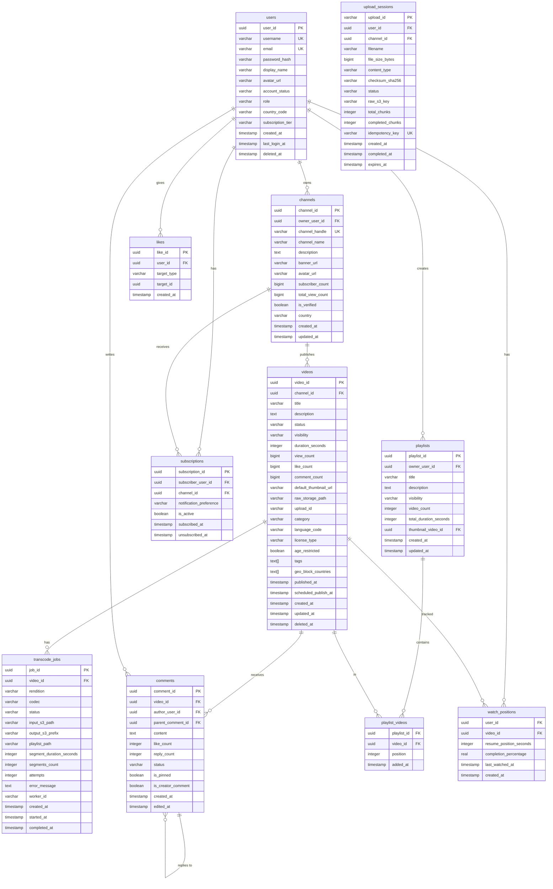

# 05 — Database Design: Video Streaming Platform

---

## Objective

Design the persistence layer to handle the extreme read/write ratios, scale requirements, and diverse access patterns of a global video streaming platform. This includes schema design, partitioning, indexing, sharding considerations, and the multi-database strategy — because no single database technology is optimal for all access patterns in this system.

---

## 1. Multi-Database Strategy

The platform requires at least three storage tiers because the access patterns are fundamentally incompatible:

| Data Type | Store | Justification |
|---|---|---|
| Video metadata, users, channels | PostgreSQL | Relational integrity, complex joins, ACID |
| View events, analytics raw data | Apache Cassandra / ScyllaDB | Write-heavy, time-series, horizontal scale |
| Hot counters, caches, sessions | Redis Cluster | Sub-millisecond latency, atomic operations |
| Full-text search index | Elasticsearch | Inverted index, relevance scoring, facets |
| Video segments, thumbnails, raw uploads | AWS S3 / GCS | Blob storage, 11-9s durability, CDN-friendly |
| Recommendation features | Redis + offline feature store | Real-time features (Redis) + batch features (Parquet/Hive) |

---

## 2. PostgreSQL Schema Design

### 2.1 Complete ER Diagram



---

### 2.2 Key Table Design Decisions

**videos table — partitioning**:

The `videos` table will grow to billions of rows. Partition by `published_at` range (monthly) to keep hot partitions small:

```
Partition strategy: RANGE on published_at
Partition 2026_01: published_at >= '2026-01-01' AND < '2026-02-01'
Partition 2026_02: published_at >= '2026-02-01' AND < '2026-03-01'
```

This ensures most reads (recent videos) hit one partition. Old videos are archived to cheaper storage.

**views table — NOT in PostgreSQL**:

`views` is written at 11,600/second. PostgreSQL cannot sustain this on a single table even with aggressive partitioning. See Section 3 for Cassandra design.

**likes table — deduplication pattern**:

The `likes` table stores one row per (user_id, target_id) pair. Unique index on `(user_id, target_type, target_id)` enforces deduplication at the DB level. This table is NOT queried for counts — counts live in Redis and are periodically flushed to video.like_count.

**subscriptions table — billions of rows**:

With 500M users each subscribing to an average of 30 channels, this table has 15 billion rows. PostgreSQL is not suitable. Options:

- Migrate to Cassandra with partition key `subscriber_user_id` (for "list my subscriptions")
- Maintain a separate column family for `channel_id` → subscribers (for fan-out notification)
- Keep a pruned PostgreSQL table only for recent/active subscriptions; archive to cold storage

---

### 2.3 Index Strategy

```
videos:
  idx_videos_channel_published     ON (channel_id, published_at DESC, video_id)
  idx_videos_status_visibility     ON (status, visibility) WHERE status = 'PUBLISHED'
  idx_videos_category_published    ON (category, published_at DESC)
  idx_videos_tags                  GIN index ON tags[] for array containment queries

comments:
  idx_comments_video_parent        ON (video_id, parent_comment_id, created_at DESC)
  idx_comments_author              ON (author_user_id, created_at DESC)

subscriptions:
  idx_subs_subscriber              ON (subscriber_user_id, is_active, subscribed_at DESC)
  idx_subs_channel                 ON (channel_id, is_active)

likes:
  UNIQUE idx_likes_user_target     ON (user_id, target_type, target_id)

transcode_jobs:
  idx_jobs_video                   ON (video_id)
  idx_jobs_status                  ON (status, created_at) WHERE status IN ('QUEUED', 'PROCESSING')
  idx_jobs_worker                  ON (worker_id) WHERE status = 'PROCESSING'

watch_positions:
  UNIQUE idx_watch_user_video      ON (user_id, video_id)
  idx_watch_user_recent            ON (user_id, last_watched_at DESC)
```

---

### 2.4 Sharding Strategy for PostgreSQL

At YouTube scale, even PostgreSQL with partitioning reaches limits. The sharding strategy for key tables:

**videos table shard key**: `channel_id` — all videos for a channel are co-located. Range queries "get all videos for channel X" are shard-local. Cross-channel queries (trending) use aggregated views.

**channels table**: Low cardinality (millions, not billions) — no sharding needed. Read replicas suffice.

**comments table shard key**: `video_id` — all comments for a video are co-located. Top-level queries are shard-local.

**Implementation**: Use Citus (PostgreSQL extension) for horizontal sharding or migrate to CockroachDB for global distributed PostgreSQL semantics.

---

## 3. Cassandra / ScyllaDB Schema for Views

### Why Not PostgreSQL for Views?

- 11,600 writes/second is achievable in PostgreSQL, but only with extreme partitioning and UNLOGGED tables (sacrificing durability)
- PostgreSQL COUNT() on partitioned tables across shards requires aggregate queries
- Views require time-series access patterns: "views in last 24 hours", "views by day for last 30 days" — Cassandra's partition-by-time model is perfect

### Cassandra Table Design

```
// Raw view events - append only
CREATE TABLE view_events (
  video_id     UUID,
  viewed_date  DATE,
  viewed_at    TIMESTAMP,
  view_id      UUID,
  viewer_id    UUID,     -- null for anonymous
  session_id   UUID,
  watch_seconds INT,
  watch_pct    FLOAT,
  country_code TEXT,
  client_type  TEXT,
  PRIMARY KEY ((video_id, viewed_date), viewed_at, view_id)
) WITH CLUSTERING ORDER BY (viewed_at DESC)
  AND default_time_to_live = 7776000; -- 90 days TTL

// Pre-aggregated daily counts (materialized by stream processor)
CREATE TABLE video_daily_stats (
  video_id          UUID,
  stat_date         DATE,
  view_count        COUNTER,
  unique_viewers    COUNTER,
  total_watch_secs  COUNTER,
  like_count        COUNTER,
  PRIMARY KEY (video_id, stat_date)
) WITH CLUSTERING ORDER BY (stat_date DESC);

// For query: "total lifetime views for a video"
// Maintained by aggregation job, stored in Redis and PostgreSQL
```

**Access Patterns Served**:
- "Views for video X on date Y" → `WHERE video_id = X AND viewed_date = Y`
- "Views for video X in last 7 days" → 7 partition reads (one per date)
- "Total views for video X" → Redis counter (maintained by stream processor)
- "Retention curve for video X" → Map-reduce over `view_events` for the video

---

## 4. Redis Data Structures

### 4.1 Video View Counter

```
Key:   video:views:{video_id}
Type:  String (atomic increment)
Value: 4820123
TTL:   none (permanent, periodically flushed to PostgreSQL)

Operation:
  INCR video:views:{video_id}   -- per view event
  GET  video:views:{video_id}   -- for display
```

### 4.2 Video Like Counter (HyperLogLog for unique estimations)

```
Key:   video:likes:{video_id}
Type:  String (counter)
Value: 95831

Key:   video:unique_viewers:{video_id}
Type:  HyperLogLog
Value: Estimated unique viewer count (±0.81% error)

Operation:
  PFADD video:unique_viewers:{video_id} {user_id}
  PFCOUNT video:unique_viewers:{video_id}
```

### 4.3 Watch History (sorted set by timestamp)

```
Key:   user:history:{user_id}
Type:  Sorted Set
Member: {video_id}
Score:  Unix timestamp of last watch

Operation:
  ZADD user:history:{user_id} {timestamp} {video_id}
  ZREVRANGE user:history:{user_id} 0 49  -- last 50 watched videos
  
TTL: 30 days
Max members: 1000 (ZREMRANGEBYRANK to cap)
```

### 4.4 Trending Videos (per region)

```
Key:   trending:{region_code}:{hour_bucket}
Type:  Sorted Set
Member: {video_id}
Score:  trending_score (views × recency_decay)

Operation:
  ZINCRBY trending:us:2026051712 0.9 {video_id}  -- decay per hour
  ZREVRANGE trending:us:2026051712 0 99           -- top 100
  
TTL: 2 hours per bucket
```

### 4.5 Session / Auth Token Blacklist

```
Key:   jwt:blacklist:{jti}
Type:  String
Value: "revoked"
TTL:   Token expiry time
```

### 4.6 Recommendation Cache

```
Key:   rec:feed:{user_id}
Type:  List
Value: JSON array of recommended video IDs
TTL:   15 minutes (stale recommendations are acceptable)
```

### 4.7 Rate Limit Sliding Window

```
Key:   ratelimit:{user_id}:{endpoint}:{minute_bucket}
Type:  String with INCR + EXPIRE
Value: Request count in current minute
TTL:   60 seconds
```

---

## 5. Elasticsearch Index Design

```json
{
  "index": "videos",
  "settings": {
    "number_of_shards": 10,
    "number_of_replicas": 2,
    "analysis": {
      "analyzer": {
        "video_analyzer": {
          "type": "custom",
          "tokenizer": "standard",
          "filter": ["lowercase", "stop", "porter_stem"]
        }
      }
    }
  },
  "mappings": {
    "properties": {
      "video_id":       { "type": "keyword" },
      "title":          { "type": "text", "analyzer": "video_analyzer", "boost": 3 },
      "description":    { "type": "text", "analyzer": "video_analyzer" },
      "tags":           { "type": "keyword" },
      "channel_id":     { "type": "keyword" },
      "channel_name":   { "type": "text", "boost": 2 },
      "category":       { "type": "keyword" },
      "language":       { "type": "keyword" },
      "view_count":     { "type": "long" },
      "like_count":     { "type": "long" },
      "duration_secs":  { "type": "integer" },
      "published_at":   { "type": "date" },
      "thumbnail_url":  { "type": "keyword", "index": false },
      "visibility":     { "type": "keyword" }
    }
  }
}
```

**Write Pattern**: Search index is updated via Kafka consumer that reacts to `VideoPublished` and `VideoMetadataUpdated` events. Eventual consistency of up to 30 seconds is acceptable for search.

**Query Pattern**: Multi-match query with field boosting + function_score for recency and popularity boosts.

---

## 6. Object Storage (S3) Structure

```
Bucket: platform-raw-uploads
  /uploads/{upload_id}/raw.mp4

Bucket: platform-encoded-segments
  /videos/{video_id}/144p/playlist.m3u8
  /videos/{video_id}/144p/seg000.ts
  /videos/{video_id}/144p/seg001.ts
  ...
  /videos/{video_id}/1080p/playlist.m3u8
  /videos/{video_id}/1080p/seg000.ts
  ...
  /videos/{video_id}/master.m3u8

Bucket: platform-thumbnails
  /thumbnails/{video_id}/default.jpg
  /thumbnails/{video_id}/custom.jpg
  /thumbnails/{video_id}/auto_0.jpg (at 10% of video)
  /thumbnails/{video_id}/auto_1.jpg (at 50% of video)
  /thumbnails/{video_id}/auto_2.jpg (at 90% of video)

Bucket: platform-channel-assets
  /channels/{channel_id}/avatar.jpg
  /channels/{channel_id}/banner.jpg
```

**Lifecycle Policies**:
- Raw uploads bucket: 7-day TTL (delete after transcoding complete)
- Encoded segments: No TTL for published videos; archive to Glacier after 1 year if view count < 100
- Thumbnails: No TTL

---

## 7. Data Archival Strategy

| Data | Hot Storage | Warm Storage | Cold Storage / Archive |
|---|---|---|---|
| Video segments (popular) | CDN edge + S3 Standard | S3 Standard | — |
| Video segments (long-tail) | S3 Standard | S3 Infrequent Access (>30 days no views) | S3 Glacier (>1 year) |
| Raw uploads | S3 (7 days) | Deleted | — |
| View events | Cassandra (90 days) | ClickHouse (1 year) | Parquet on S3 (forever) |
| Comments | PostgreSQL (active) | PostgreSQL archive partition | — |
| Creator analytics | ClickHouse (2 years) | Parquet on S3 | — |

---

## 8. Soft Delete Strategy

All user-generated content uses soft deletes:

| Table | Delete Column | Recovery Window | Hard Delete |
|---|---|---|---|
| videos | `deleted_at` timestamp | 30 days | After 30 days, S3 objects deleted |
| users | `deleted_at` timestamp | 30 days | GDPR erasure after 30 days |
| comments | `status = 'DELETED'` | 7 days | Hard delete after 7 days |
| channels | `deleted_at` timestamp | 30 days | After 30 days |

**GDPR Erasure**: On hard delete, PII fields are zeroed/overwritten before deletion. `user_id` reference retained in event logs for analytics (replaced with anonymized ID).

---

## 9. Audit and History Strategy

| Concern | Approach |
|---|---|
| Video metadata changes | Append-only `video_history` table: snapshot of video record on every significant change |
| Comment edits | `edited_at` timestamp; original content retained for moderation (not shown to users) |
| Moderation actions | Immutable `moderation_log` table with action, moderator ID, reason, timestamp |
| Admin actions | Append-only audit log service receiving `AdminActionEvent` from Kafka |

---

## 10. Consistency and Availability Tradeoffs

| Data | Consistency Chosen | Reasoning |
|---|---|---|
| Video metadata (title, visibility) | Strong (PostgreSQL ACID) | Wrong visibility could expose private content |
| View counts | Eventual (Redis counter + async flush) | Count off by thousands is invisible to users; strong consistency requires distributed locking |
| Like counts | Eventual (Redis + flush) | Same as views |
| Subscriber counts | Eventual | Same; reconciliation job runs hourly |
| Payment/entitlement | Strong | Cannot allow watching premium content without valid entitlement |
| Comments | Read-your-writes (sticky session or read-after-write) | User should see their own comment immediately |

---

## 11. Interview-Level Discussion Points

- Why not put view counts in PostgreSQL? (PostgreSQL would require a distributed counter with locks, or an append-only table requiring expensive aggregation. Redis INCR is atomic, sub-millisecond, and perfectly designed for this)
- How do you handle the "counter reset" problem if Redis loses data? (Redis persistence (AOF) + hourly flush to PostgreSQL as checkpoint; on Redis failure, restore from PostgreSQL snapshot + replay Kafka view events from the last checkpoint)
- Why partition the videos table by `published_at` instead of `video_id`? (Partitioning by published_at makes recent video queries fast — they hit one partition. Partitioning by video_id distributes data evenly but doesn't help time-range queries)
- What is the N+1 query risk in this system? (Fetching a channel page with 20 videos and then fetching like_count + comment_count for each video individually = 41 queries. Solution: batch fetch counts from Redis using MGET, not individual queries)
- How do you handle hot partitions in Cassandra for a viral video? (The partition key is (video_id, date). A viral video on a single day creates a hot partition. Mitigation: introduce a bucket suffix — (video_id, date, bucket_id) where bucket_id = hash(view_id) % 16 — distributing writes across 16 partitions with rollup queries)
