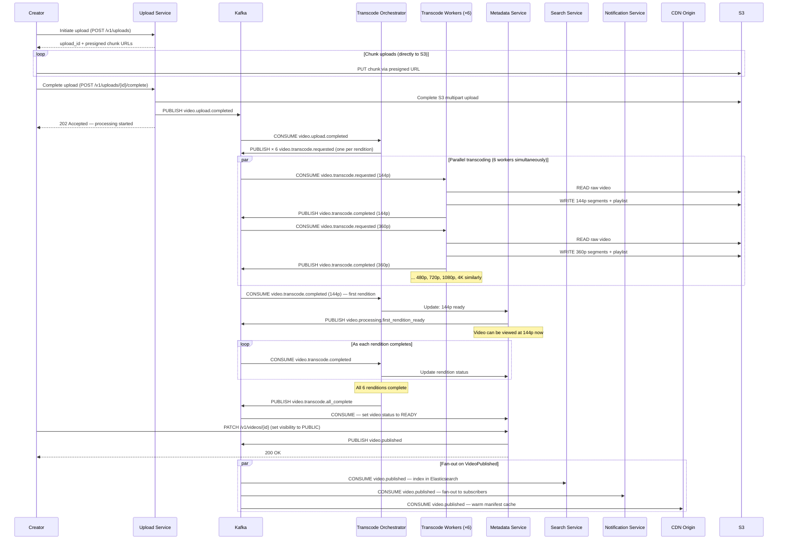
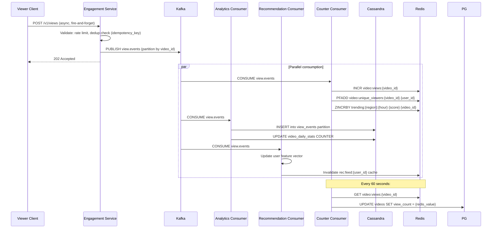
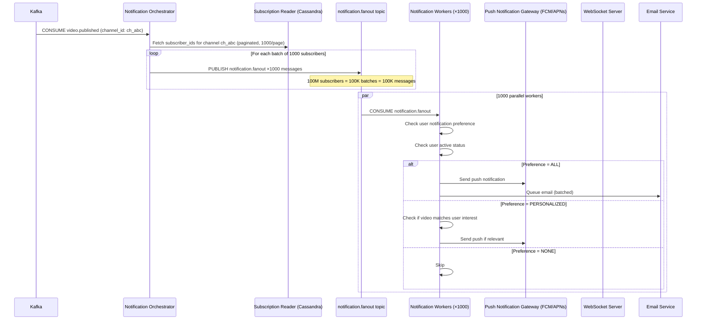
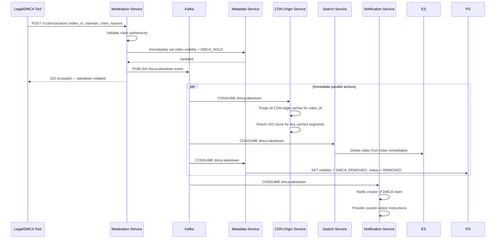
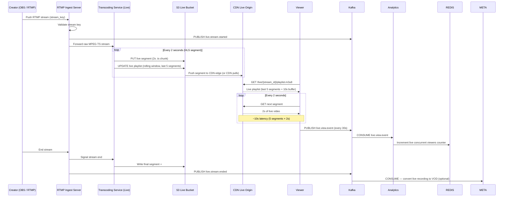

# 06 — Event Flow: Video Streaming Platform

---

## Objective

Define the complete event-driven architecture: all domain events, Kafka topic design, producer/consumer relationships, sequence flows for critical paths, and special-case flows like live streaming and DMCA takedowns. Events are the nervous system of this platform — they decouple services, enable independent scaling, and provide a durable audit trail.

---

## 1. Why Event-Driven Architecture?

At this scale, synchronous request chains would create cascading failures and unacceptable coupling:

- When a video is published, **8+ services** need to react: search indexing, recommendation update, notification fan-out, analytics, CDN warming, moderation review, creator dashboard update
- Making all these synchronous would create a chain where the slowest service (notification fan-out to 100M subscribers) blocks the video publish API response
- Kafka provides durability, replay, and natural backpressure

**Trade-off**: Eventual consistency replaces immediate consistency. The video publish API returns "success" when the event is written to Kafka — not when all 8 consumers have processed it.

---

## 2. Kafka Topic Design

### 2.1 Topic Catalog

| Topic | Partitions | Retention | Producers | Key Consumers |
|---|---|---|---|---|
| `video.upload.initiated` | 16 | 7 days | Upload Service | Analytics |
| `video.upload.completed` | 16 | 7 days | Upload Service | Transcode Orchestrator |
| `video.transcode.requested` | 64 | 3 days | Transcode Orchestrator | Transcode Workers |
| `video.transcode.completed` | 64 | 7 days | Transcode Workers | Orchestrator, Metadata |
| `video.transcode.failed` | 16 | 30 days | Transcode Workers | Alert system, DLQ handler |
| `video.published` | 32 | 30 days | Metadata Service | Search, Recommendations, Notifications, CDN, Analytics |
| `video.updated` | 16 | 7 days | Metadata Service | Search, CDN invalidation |
| `video.deleted` | 16 | 30 days | Metadata Service | CDN, Search, Recommendations |
| `video.removed.moderation` | 16 | 90 days | Moderation Service | CDN, Metadata, Notification, Analytics |
| `view.events` | 128 | 3 days | Engagement Service | Analytics, Recommendation, Counter service |
| `engagement.likes` | 32 | 7 days | Engagement Service | Analytics, Recommendation, Counter |
| `engagement.comments` | 32 | 7 days | Engagement Service | Notification, Moderation, Analytics |
| `engagement.subscriptions` | 32 | 7 days | Engagement Service | Notification, Recommendation, Analytics |
| `user.registered` | 16 | 30 days | User Service | Engagement (create system playlists), Email |
| `user.suspended` | 16 | 90 days | Moderation/User Service | All services |
| `notification.fanout` | 256 | 1 day | Notification Orchestrator | Notification Delivery Workers |
| `dmca.takedown` | 8 | 365 days | Legal/Moderation Service | Metadata, CDN, Search |
| `analytics.aggregated` | 32 | 90 days | Analytics Aggregator | Creator Dashboard, Trending |

### 2.2 Partition Key Strategy

| Topic | Partition Key | Reasoning |
|---|---|---|
| `video.upload.completed` | `video_id` | All transcode events for a video go to same partition — ordering matters |
| `video.transcode.requested` | `video_id` | Keeps rendition jobs for same video near each other |
| `view.events` | `video_id` | Co-locate view events by video for per-video analytics aggregation |
| `engagement.subscriptions` | `channel_id` | Fan-out reads all subscribers for a channel from one partition range |
| `notification.fanout` | `user_id` | Each user's notifications processed in order |

---

## 3. Core Event Schemas

### 3.1 VideoUploaded Event

```json
{
  "event_id": "evt_abc123",
  "event_type": "video.upload.completed",
  "schema_version": "1.0",
  "timestamp": "2026-05-17T12:00:00Z",
  "producer": "upload-service",
  "payload": {
    "video_id": "vid_xyz789",
    "upload_id": "upl_abc123",
    "channel_id": "ch_def456",
    "user_id": "usr_ghi789",
    "raw_s3_bucket": "platform-raw-uploads",
    "raw_s3_key": "uploads/upl_abc123/raw.mp4",
    "file_size_bytes": 2684354560,
    "detected_duration_seconds": 942,
    "detected_framerate": 30.0,
    "detected_resolution": "1920x1080"
  }
}
```

### 3.2 TranscodeCompleted Event

```json
{
  "event_id": "evt_def456",
  "event_type": "video.transcode.completed",
  "schema_version": "1.0",
  "timestamp": "2026-05-17T12:08:30Z",
  "producer": "transcode-worker",
  "payload": {
    "job_id": "job_stu890",
    "video_id": "vid_xyz789",
    "rendition": "1080p",
    "codec": "H.264",
    "segments_count": 157,
    "segment_duration_seconds": 6,
    "output_s3_prefix": "videos/vid_xyz789/1080p/",
    "playlist_s3_key": "videos/vid_xyz789/1080p/playlist.m3u8",
    "duration_seconds": 942,
    "worker_id": "worker-us-east-1-42"
  }
}
```

### 3.3 VideoViewed Event

```json
{
  "event_id": "evt_ghi012",
  "event_type": "view.recorded",
  "schema_version": "1.1",
  "timestamp": "2026-05-17T14:22:10Z",
  "producer": "engagement-service",
  "payload": {
    "view_id": "vw_jkl345",
    "video_id": "vid_xyz789",
    "viewer_user_id": "usr_mno678",
    "session_id": "sess_pqr901",
    "watch_duration_seconds": 342,
    "watch_percentage": 0.363,
    "client_type": "WEB",
    "country_code": "US",
    "referrer_type": "RECOMMENDATION",
    "ip_address_hash": "sha256_hashed_ip",
    "idempotency_key": "ide_stu234"
  }
}
```

---

## 4. Upload-to-Publish Flow (Full Sequence)



---

## 5. View Event Flow



---

## 6. Notification Fan-Out Flow

This is the hardest scaling problem in the engagement domain. A creator with 100M subscribers publishes a video — how do you notify 100M people within minutes?



**Key Design Point**: The fan-out is accomplished via Kafka itself. The Notification Orchestrator produces 100M messages (in batches) to the `notification.fanout` topic. 1000 parallel consumer workers each process ~100K messages. At 1000 workers processing 1000 notifications/second each = 1M notifications/second. 100M notifications delivered in ~100 seconds.

**FAANG Reality**: YouTube has a "lazy fan-out" model — notifications are not pushed to all subscribers immediately. High-subscriber creators use a "pull on demand" approach where the notification is written to a shared store and pulled when the subscriber opens the app.

---

## 7. DMCA Takedown Flow

DMCA requires takedowns to happen "expeditiously" (typically hours, but platforms often process within minutes for critical violations).



**Critical**: CDN cache purge is synchronous (not via Kafka) for DMCA — the CDN API is called immediately before the Kafka event is published. This ensures the video is unreachable from CDN before any async consumers process the event.

---

## 8. Live Streaming Event Flow

Live streaming has different characteristics: ultra-low latency, no transcoding delay, real-time segment generation.



---

## 9. Exactly-Once Semantics for View Counting

View counts are the most visible metric on the platform. Duplicate counts (producer retries) or lost counts (consumer crashes) must be handled:

**Problem**: Kafka at-least-once delivery means view events can be delivered multiple times if the consumer crashes after processing but before committing the offset.

**Solution**: Idempotent consumer design:

```
Step 1: Consumer reads view event with idempotency_key
Step 2: Check Redis SET nx:view:{idempotency_key} = "1" EX 86400
        - If SET returns 1 → first time processing → proceed
        - If SET returns 0 → already processed → skip (deduplicate)
Step 3: INCR Redis counter + write to Cassandra
Step 4: Commit Kafka offset
```

This achieves effectively-exactly-once semantics at the application level (not Kafka's transactional exactly-once which has throughput overhead).

---

## 10. Consumer Group Strategy

| Consumer Group | Topic(s) | Consumer Count | Purpose |
|---|---|---|---|
| `transcode-orchestrator` | `video.upload.completed` | 8 | Single orchestrator group |
| `transcode-workers-144p` | `video.transcode.requested` | 32 | Filter for rendition=144p |
| `transcode-workers-1080p` | `video.transcode.requested` | 32 | Filter for rendition=1080p |
| `analytics-view-counter` | `view.events` | 64 | Redis counter updates |
| `analytics-cassandra-writer` | `view.events` | 64 | Cassandra persistence |
| `recommendation-updater` | `view.events`, `engagement.likes` | 32 | Feature vector updates |
| `search-indexer` | `video.published`, `video.updated`, `video.deleted` | 16 | Elasticsearch sync |
| `notification-orchestrator` | `video.published`, `engagement.subscriptions` | 16 | Fan-out initiation |
| `notification-delivery` | `notification.fanout` | 1024 | Push/email delivery |
| `moderation-auto-review` | `video.published`, `engagement.comments` | 32 | ML content review |
| `cdn-cache-manager` | `video.published`, `dmca.takedown` | 8 | Cache warm/invalidate |
| `dead-letter-handler` | `*.dlq` | 4 | Retry or alert |

---

## 11. Dead Letter Queue Strategy

| DLQ Topic | Trigger | Handler Action |
|---|---|---|
| `video.transcode.requested.dlq` | 3 consecutive failures | Alert on-call + create support ticket for creator |
| `view.events.dlq` | Consumer crash after 3 retries | Log to analytics audit; view count may be off by this amount |
| `notification.fanout.dlq` | Push gateway failure | Log; acceptable — notifications are best-effort |
| `search-index.dlq` | Elasticsearch unavailable | Replay when ES recovers |
| `dmca.takedown.dlq` | CDN purge failure | IMMEDIATE alert; manual intervention required (legal risk) |

---

## 12. Schema Registry and Compatibility

All Kafka events are registered in Confluent Schema Registry:

- **Backward compatibility**: New optional fields can be added; existing fields cannot be renamed/removed within a schema version
- **Consumer contract testing**: Each consumer has a contract test that validates it can deserialize all historical schema versions
- **Event versioning**: `schema_version` field in every event envelope enables gradual consumer migration

---

## 13. Interview-Level Discussion Points

- How do you prevent the notification fan-out from overwhelming FCM/APNs? (Rate limiting at the Notification Worker level; batch notifications to same user; exponential backoff on gateway errors; circuit breaker per delivery channel)
- What happens if the Kafka topic for view events falls behind (consumer lag grows)? (Scale up consumer instances — Kafka consumers scale horizontally up to the number of partitions; if 128 partitions, can have 128 consumers in the group. Beyond that, add partitions — but this is disruptive on live topics)
- Why not use a separate message queue (SQS/RabbitMQ) for transcode jobs instead of Kafka? (Kafka provides log compaction and replay — if the Metadata service was down when TranscodeCompleted events fired, it can replay from its last offset. SQS messages are deleted after consumption — no replay possible)
- How do you handle the case where a producer publishes an event but the downstream database write fails? (Outbox Pattern: the producer writes the event to a local `outbox` table in the same database transaction as the business operation. A separate Outbox Publisher reads new outbox rows and publishes to Kafka. This ensures the event is published if and only if the DB write succeeds)
- How long should view events be retained in Kafka? (3 days minimum for operational replay; analytics pipeline should process events within hours, not days; longer retention increases storage cost. Keep 3 days for safety margin against consumer outages)
