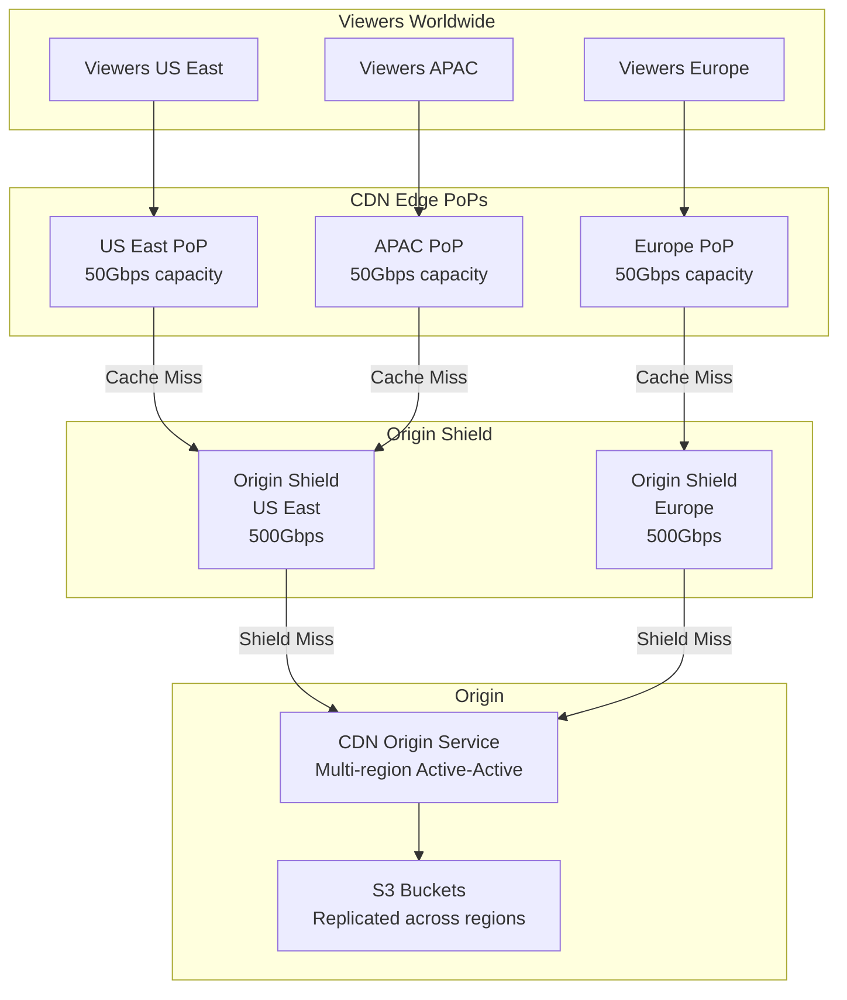
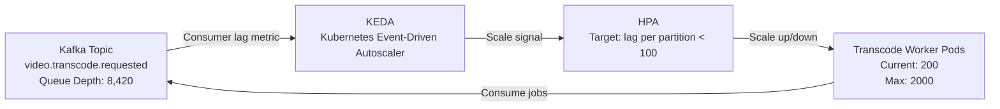
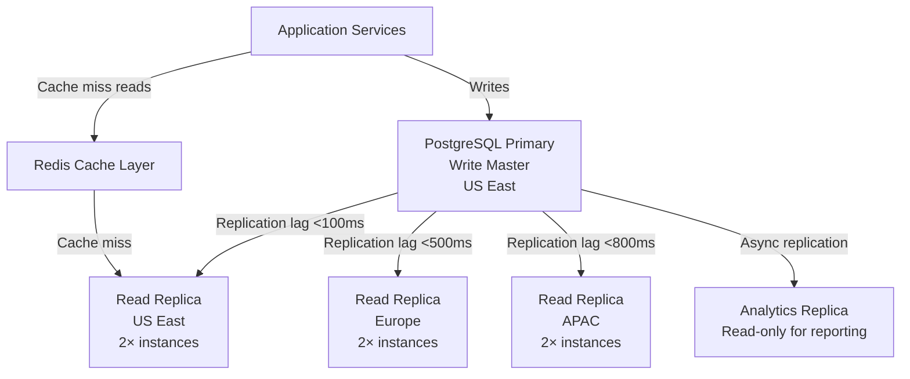
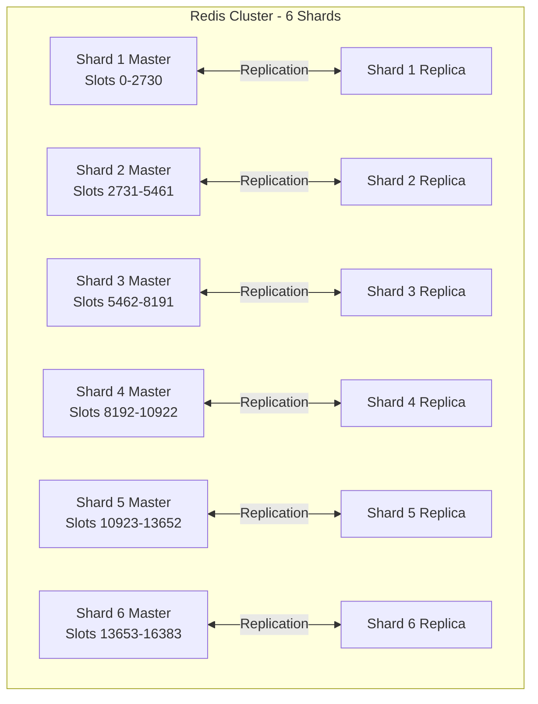
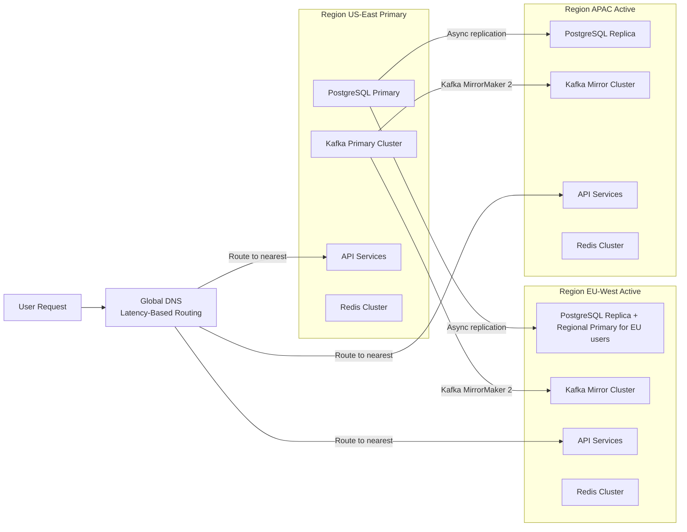

# 07 — Scaling Strategy: Video Streaming Platform

---

## Objective

Define how the platform scales from 1 million to 500 million users and beyond. Cover CDN scaling, transcoding autoscaling, database read scaling, Redis cluster management, the "celebrity channel" fan-out problem, geographic distribution, and the origin shield pattern. Every bottleneck has a specific mitigation.

---

## 1. Scaling Philosophy

**Principle 1: Scale the read path first.** The system is 1000:1 read-heavy. Every video view is a read. Build the read path to handle 99% of traffic with no database involvement (CDN → Redis → replica).

**Principle 2: Decouple write spikes from read performance.** Video uploads and view events are write-heavy but can be asynchronous. Writes go to Kafka; reads never contend with write-path infrastructure.

**Principle 3: Scale compute-intensive work (transcoding) independently.** Transcoding workers are CPU/GPU-bound. They must autoscale independently of API servers.

**Principle 4: The origin never sees 100% of CDN traffic.** CDN hit ratio of 95%+ is architecturally mandatory. Origin capacity is sized for the 5% miss traffic, not total traffic.

---

## 2. CDN Scaling Architecture

### 2.1 CDN Layer Design

### 2.2 Origin Shield Pattern

Without origin shield: Every CDN edge PoP independently fetches cache misses from origin. A video with 500 PoPs simultaneously loading = 500 concurrent origin requests for the same segment.

With origin shield: Each region has one shield node that coalesces all edge-PoP cache misses into a single origin request. 500 PoPs → 2 shield nodes → maximum 2 concurrent origin requests per object.

**Cache Hit Ratio Target**:
- CDN Edge: 90% hit ratio
- Origin Shield: 85% hit ratio of edge misses (effectively 90% + 85%×10% = 98.5% overall)

### 2.3 Cache TTL Strategy

| Object Type | CDN Edge TTL | Origin Shield TTL | Notes |
|---|---|---|---|
| HLS Master Manifest | 60 seconds | 300 seconds | Short TTL to reflect new renditions quickly |
| HLS Rendition Playlist (VOD) | 1 hour | 6 hours | Content doesn't change for published videos |
| HLS Segment (.ts file) | 7 days | 30 days | Immutable after creation |
| Video Thumbnail | 1 day | 7 days | Changes on creator override |
| Channel Avatar/Banner | 1 day | 7 days | Low-change rate |
| API JSON responses | 5–60 seconds | — | Metadata responses cached at CDN for public data |

### 2.4 Multi-CDN Strategy

Use multiple CDN providers (Akamai + CloudFront + Cloudflare) simultaneously:
- Traffic routing via latency-based DNS (Route 53 Latency routing)
- Automatic failover if one CDN provider has degraded performance
- Cost optimization: route different geographies to cheapest provider
- Eliminates single-CDN provider as single point of failure

---

## 3. Transcoding Worker Autoscaling

### 3.1 Architecture

Transcoding workers run on Kubernetes with Horizontal Pod Autoscaler (HPA) configured to scale based on Kafka consumer lag — not CPU (CPU is always high when transcoding; lag tells you if workers are keeping up).

**KEDA** (Kubernetes Event-Driven Autoscaler) reads Kafka consumer lag and drives HPA scaling:
- Lag > 1000 per partition → scale up (add 20% more workers)
- Lag < 100 per partition → scale down (remove 10% of workers)
- Scale-up is fast (30s); scale-down is slow (10 min) to avoid flapping

### 3.2 Worker Sizing Strategy

| Rendition | Compute Type | Encoding Time (1hr video) | Instance Type |
|---|---|---|---|
| 144p, 360p | CPU (low bitrate) | ~5 min | 4 vCPU, 8 GB RAM |
| 480p, 720p | CPU (medium bitrate) | ~12 min | 8 vCPU, 16 GB RAM |
| 1080p | CPU or GPU-accelerated | ~20 min | GPU instance (g4dn) |
| 4K (2160p) | GPU-accelerated (H.265/AV1) | ~45 min | GPU instance |

**Spot Instance Strategy**: 70% spot instances (cheap, interruptible) + 30% on-demand instances. Transcode jobs are checkpointable — if a spot instance is reclaimed, the job restarts from last checkpoint. This reduces transcoding costs by 60-70%.

### 3.3 Priority Queue Design

Not all transcoding is equal:
- **Priority 1**: Videos uploaded by channels with >1M subscribers (expected high viewership)
- **Priority 2**: Videos < 5 minutes (quick to process, fast time-to-publish)
- **Priority 3**: Standard videos
- **Priority 4**: Re-transcoding (quality upgrades, codec migrations)

Implemented as separate Kafka topic partitions with priority-aware consumer groups.

---

## 4. Database Read Scaling

### 4.1 PostgreSQL Read Replica Topology

**Read-Write Splitting**:
- All writes go to primary
- All reads that can tolerate eventual consistency (video metadata, channel info) go to nearest replica
- Reads requiring strong consistency (payment, visibility changes) go to primary

### 4.2 Connection Pooling

- PgBouncer deployed in front of every PostgreSQL instance
- Pool mode: transaction-level pooling (most efficient for short queries)
- Pool size per instance: 100 connections (PostgreSQL max_connections = 200, leave headroom)
- Without PgBouncer: 1000 application pods × 5 connections each = 5000 connections → PostgreSQL OOM

---

## 5. Redis Cluster Scaling

### 5.1 Redis Cluster Architecture

**Slot Allocation**: Redis Cluster uses 16,384 hash slots distributed across shards. Key `video:views:{video_id}` hashes to a slot; the client library routes to the correct shard automatically.

### 5.2 Hot Key Problem

**Problem**: The `trending:{region}:{hour}` sorted set is written by every view event in that region. If the US has 5M concurrent viewers, this key receives 5M writes/second to a single Redis shard.

**Solution**: Local aggregation before Redis write:

1. Each Kafka consumer group member accumulates counts locally in memory for 1 second
2. At the end of 1 second, atomic ZINCRBY with the batched count
3. This reduces Redis write rate from 5M/second to `number_of_consumers` per second

**Alternative for extreme hot keys**: Shard the trending key by bucket:
- `trending:us:2026051712:bucket:3` where bucket = hash(video_id) % 16
- Query all 16 buckets and merge results on read
- Reduces per-key write rate by 16x

---

## 6. The Celebrity Channel Problem (Viral Video Fan-Out)

### 6.1 Problem Statement

A channel with 50M subscribers publishes a video. Within 60 seconds:
- 5M viewers hit the platform simultaneously
- View counter receives 5M writes/second
- CDN edge nodes all simultaneously request the video manifest (cold cache)
- Notification system must fan out to 50M subscribers
- Recommendation system must update 50M user feature vectors

This is the "celebrity problem" in distributed systems — known as the "thundering herd."

### 6.2 Mitigation: CDN Pre-warming

When `VideoPublished` event is consumed by the CDN Cache Manager:
1. Identify if the channel has > 1M subscribers (large creator)
2. Proactively push the video manifest and first 3 segments to all major CDN edge PoPs
3. By the time subscribers click the notification, CDN is already warm

### 6.3 Mitigation: Rate-Limited Fan-Out

Notification fan-out is rate-limited per channel per hour:
- Maximum 1 notification push per subscriber per 4 hours
- Use a Redis Bloom filter to track recently-notified users
- This prevents notification spam from prolific creators

### 6.4 Mitigation: View Counter Batching

For a viral video receiving 10,000 views/second:
- Dedicated Redis shard pre-allocated for the video (based on prediction from subscriber count)
- Counter writes are batched: each consumer aggregates 100ms of events before writing
- Counter is sharded across N Redis keys: `video:views:vid_xyz:shard:0` through `:shard:7`
- Rollup query sums all shards; background job periodically consolidates

### 6.5 Mitigation: Adaptive CDN Routing

When a video is detected as trending (view rate > threshold):
- Automatic CDN configuration update to increase edge cache size allocation for this video
- Origin shield pool size increased
- Database connection for this video's metadata is pinned to primary (avoid replica lag showing stale view counts)

---

## 7. Geographic Distribution

### 7.1 Multi-Region Architecture

**Active-Active Read, Active-Passive Write**: All regions serve reads (from local replicas). Writes (upload, metadata changes, comments) are routed to the primary region and replicated out.

**User Data Sovereignty**: EU users' PII data stored primarily in EU-West region (GDPR requirement). Account writes for EU users go to EU-West PostgreSQL as the primary, replicated to US-East.

### 7.2 Data Residency per Region

| Data | US-East | EU-West | APAC |
|---|---|---|---|
| Video segments | S3 replicated all regions | S3 replicated all regions | S3 replicated all regions |
| Video metadata (read) | Primary | Replica | Replica |
| EU user PII | Replica | **Primary** | Not stored |
| Non-EU user PII | **Primary** | Replica | Replica |
| Analytics | US aggregation | EU aggregation | APAC aggregation |

---

## 8. Horizontal Scaling of API Services

### 8.1 Stateless Service Design

All API services are designed stateless:
- No in-process session state
- JWT tokens carry user context (no server-side session lookup)
- All shared state in Redis (session blacklist, rate limit counters)
- Any pod in the cluster can handle any request

### 8.2 Target Scaling Numbers

| Service | Base Replicas | Peak Replicas | Scale Trigger |
|---|---|---|---|
| API Gateway | 20 | 200 | CPU > 60% or RPS > 3000/pod |
| Upload Service | 10 | 50 | Concurrent uploads / pod > 100 |
| Transcode Workers | 50 | 2000 | Kafka consumer lag > 1000 |
| Metadata Service | 20 | 100 | P99 latency > 100ms |
| Engagement Service | 20 | 200 | CPU > 60% |
| Search Service | 10 | 50 | Query latency > 200ms |
| Notification Workers | 50 | 2000 | notification.fanout queue depth > 100K |
| CDN Origin Service | 10 | 100 | Cache miss rate × RPS |

---

## 9. Backpressure and Load Shedding

When the system is overloaded, controlled degradation is better than total failure.

**Load Shedding Strategies**:

| Scenario | Response |
|---|---|
| API Gateway overwhelmed | Return 429 for low-priority endpoints (search, recommendations) before dropping core endpoints (stream, upload) |
| Transcode queue depth > 50K | Reject new non-priority upload transcode requests with "processing delay" response; creator shown an estimated time |
| Redis cache unavailable | Fall through to database for critical reads (manifest lookups); reject non-critical reads (trending, recommendations) |
| Notification service lagging | Batch notifications; delay non-urgent (email) deliveries; drop duplicate notifications |
| Database primary overloaded | Route reads to replicas even for strong-consistency reads (brief consistency window acceptable for non-financial data) |

---

## 10. Cost Scaling Considerations

| Cost Driver | Optimization |
|---|---|
| CDN egress bandwidth | Primary cost; higher cache hit ratio directly reduces cost; per-region CDN routing to cheapest provider |
| S3 storage | Tiered storage (Standard → Infrequent Access → Glacier) for long-tail videos |
| Transcoding compute | Spot instances for workers; H.265/AV1 encoding reduces file size 50% vs H.264 at same quality (lower storage + bandwidth) |
| Kafka | Retention windows calibrated to minimum viable; compress topics (snappy/lz4) |
| Database | PostgreSQL on Reserved Instances (3yr) for baseline; read replicas right-sized to actual query load |

---

## 11. Interview-Level Discussion Points

- What breaks first at 10× scale? (CDN egress capacity per provider; transcoding compute at upload bursts; Kafka partition limits if not re-partitioned; Redis hot keys for trending data; PostgreSQL primary becoming a bottleneck for metadata writes)
- How do you handle a video that receives 100M views in 1 hour (Super Bowl ad)? (Pre-warm CDN for known large events; dedicated Redis counter shards pre-provisioned; origin shield pool pre-scaled; alert on-call ops team before the event)
- Can you explain the cost tradeoff between H.264, H.265, and AV1? (H.265 is 40-50% more efficient than H.264 but requires DRM for streaming and more CPU to encode; AV1 is 30% more efficient than H.265 and royalty-free but encoding is 10-20× slower. YouTube encodes all videos in AV1 for modern browsers, storing H.264 as fallback — doubles storage cost but significantly reduces bandwidth cost at scale)
- How do you ensure that adding a new CDN region doesn't introduce thundering-herd on S3? (Origin shield pattern — new edge PoPs connect to the shield, not directly to origin. Shield handles coalescing. New regions start cold but ramp up as shield cache warms)
- Why not just use serverless (AWS Lambda) for transcoding? (Lambda has a 15-minute execution limit; a 4K 2-hour movie transcodes in 2+ hours. Lambda also cannot access GPU. Kubernetes workers on GPU instances are the right fit here)
