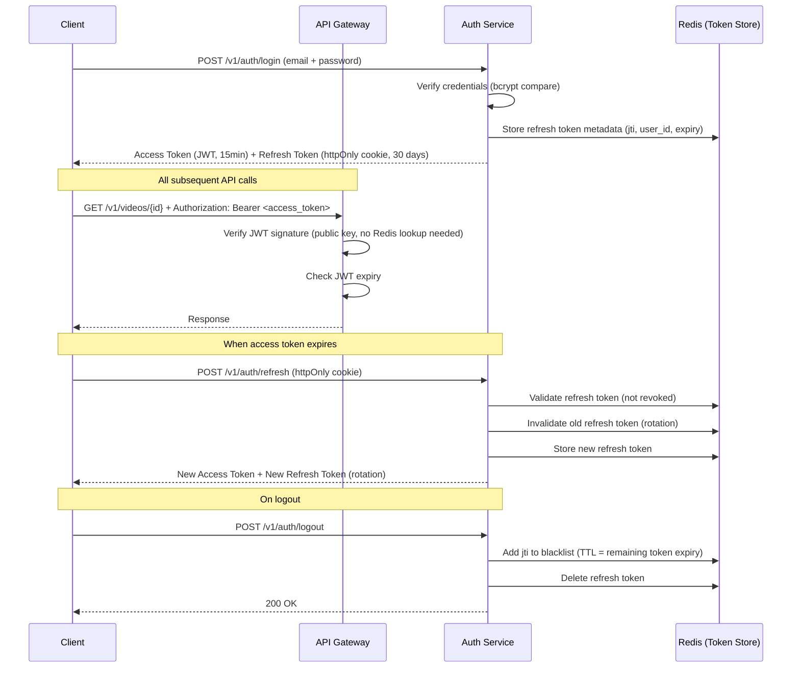
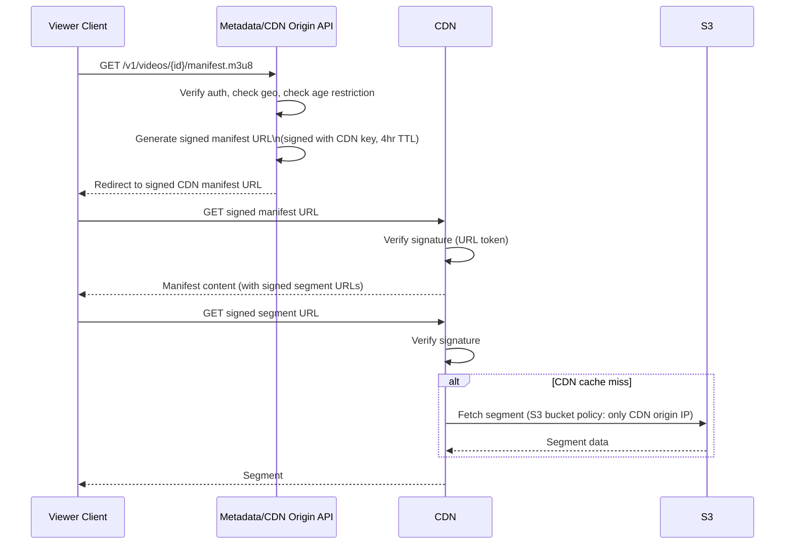
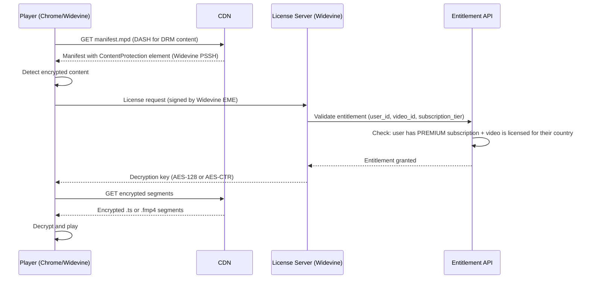
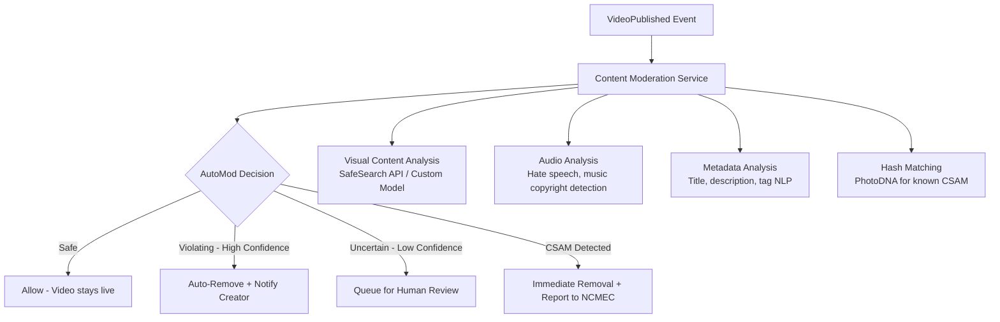

# 08 — Security Design: Video Streaming Platform

---

## Objective

Define the complete security posture of the platform: authentication and authorization, signed URL access control for video streams, DRM for premium content, content moderation pipeline, DMCA compliance mechanisms, upload virus scanning, and data protection. Security at this scale is not a single feature — it is a cross-cutting concern embedded in every layer.

---

## 1. Authentication Architecture

### 1.1 JWT-Based Auth with Refresh Token Rotation



**Why JWT?**
- Stateless verification at the API Gateway level — no Redis lookup per request
- Gateway verifies signature with public key (RSA-256 or ES256)
- Scales to 70,000 RPS without auth service becoming a bottleneck
- Downside: Token cannot be invalidated instantly (solved with short 15-min TTL + blacklist for critical revocations)

**Refresh Token Rotation**: Every refresh generates a new refresh token and invalidates the old one. If an attacker steals a refresh token and uses it, the legitimate user's next refresh will fail (old token is invalid), triggering re-authentication and alert.

### 1.2 OAuth2 / SSO Integration

```
Supported Identity Providers:
  - Google OAuth2 (most common for video platforms)
  - Apple Sign In
  - Internal email/password (fallback)

OAuth Flow:
  Authorization Code Flow with PKCE (no implicit flow — deprecated)
  Client sends code_verifier; server verifies code_challenge
  Prevents authorization code interception attacks
```

---

## 2. Authorization (RBAC + ABAC)

### 2.1 Role-Based Access Control

| Role | Permissions |
|---|---|
| ANONYMOUS | Watch public videos, search, view public channel pages |
| VIEWER | All ANONYMOUS + like, comment, subscribe, watch history, playlists |
| CREATOR | All VIEWER + upload videos, manage own channel, view own analytics |
| MODERATOR | All VIEWER + view flagged content, issue strikes, remove content |
| ADMIN | All + manage users, view all analytics, configure platform settings |

### 2.2 Attribute-Based Access Control (ABAC) for Fine-Grained Rules

Pure RBAC is insufficient for cases like:
- "Only users aged 18+ can watch age-restricted videos" → requires `user.age >= 18` check
- "Only users in country X can watch this video" → requires `user.country NOT IN video.geo_block_countries`
- "Only the video creator can see draft videos" → requires `user.channel_id == video.channel_id`

These rules are evaluated in the API Gateway or individual service authorization layer using a Policy Decision Point (PDP):

```
Policy: CanWatchVideo
  Rules:
    1. video.visibility == PUBLIC
       OR (video.visibility == UNLISTED AND user has direct link)
       OR (video.visibility == PRIVATE AND user.channel_id == video.channel_id)
    2. NOT (video.status == REMOVED OR video.status == DMCA_REMOVED)
    3. NOT (video.age_restricted AND user.age < 18)
    4. NOT (user.country IN video.geo_block_countries)
    5. IF video.drm_required THEN user.subscription_tier == PREMIUM
```

---

## 3. Signed URL Access Control

### 3.1 Why Signed URLs?

Video segments and manifests in S3 should not be publicly accessible URLs. Without signed URLs:
- Any user can share the direct S3 URL publicly, bypassing geo-restrictions, DRM, and access control
- Bots can scrape all video content directly from S3

### 3.2 Signed URL Architecture



**Signed URL Format** (CloudFront Signed Cookies approach):
- Cookie-based signing is preferred over per-URL signing for HLS (avoids signing every segment URL individually)
- CloudFront signed cookies set on manifest response: `CloudFront-Key-Pair-Id`, `CloudFront-Policy`, `CloudFront-Signature`
- All subsequent segment requests from same client carry these cookies automatically

**S3 Bucket Policy**: The encoded segments bucket only allows GetObject from CloudFront's IP ranges. Direct S3 access is denied even if someone knows the S3 key.

### 3.3 Token Expiry Strategy

| Content Type | Signed URL TTL | Notes |
|---|---|---|
| Public video manifest | 4 hours | Viewer can watch a 2hr movie with buffer |
| Private/unlisted video | 1 hour | Shorter TTL for restricted content |
| DRM-protected content | 30 minutes | Combined with DRM license TTL |
| Upload presigned URLs | 12 hours | Allow for slow uploads |
| Thumbnail (public) | 7 days | Static content, infrequent change |

---

## 4. DRM (Digital Rights Management)

### 4.1 DRM Systems

| DRM System | Supported By | Use Case |
|---|---|---|
| **Widevine** | Chrome, Android, Chromecast | Primary DRM for web and Android |
| **FairPlay** | Safari, iOS, tvOS | Required for Apple ecosystem |
| **PlayReady** | Edge, Windows, Xbox | Microsoft ecosystem |

**Multi-DRM Approach**: Encrypt content once (Common Encryption / CENC), serve different license servers per client DRM system. Shaka Player and HLS.js support multi-DRM natively.

### 4.2 DRM Flow



**Key Management**: Encryption keys stored in AWS KMS (Key Management Service), not in application code. License server retrieves keys per request from KMS. Keys are rotated periodically.

---

## 5. Content Moderation Pipeline

### 5.1 Automated Moderation (ML-Based)



**Detection Pipeline**:

| Check | Technology | Latency | Action on Positive |
|---|---|---|---|
| CSAM hash matching | PhotoDNA / NCMEC hash database | < 1s | Immediate removal + NCMEC report |
| Nudity / explicit content | Vision ML API | 2-5s | Age-restrict or remove |
| Graphic violence | Vision ML API | 2-5s | Age-restrict or remove |
| Hate speech (title/description) | NLP classifier | < 1s | Queue for review |
| Copyright (audio) | Content ID fingerprinting | 10-30s | Block, monetize for partner, or allow |
| Misinformation | NLP + knowledge graph | 30s | Flag for review |
| Spam/scam | Text classifier | < 1s | Remove |

**Human Review Queue**: Items the ML model is uncertain about go to a review queue. Human moderators review with target SLA:
- Priority 1 (potential severe violation): 30 minutes
- Priority 2 (standard policy review): 24 hours
- Priority 3 (low confidence signal): 72 hours

### 5.2 DMCA Compliance

**DMCA Safe Harbor requirements** (for Section 512 protection):
1. Designated agent registered with US Copyright Office
2. Expeditious removal upon valid DMCA notice
3. Counter-notice process for disputed takedowns
4. Repeat infringer policy (terminate accounts with repeat strikes)

**Implementation**:
- DMCA notice received → Human review within 4 hours for valid notices
- Automated fingerprinting (Content ID) for proactive detection
- Channel strikes: 3 strikes in 90 days → channel termination
- Appeals queue with 14-day resolution SLA

---

## 6. Upload Security

### 6.1 Virus Scanning Pipeline

All uploaded files pass through virus scanning before transcoding begins:

```
Upload Complete → S3 Trigger → Lambda → ClamAV + Commercial AV Scanner
  Clean: Proceed to transcode
  Infected: Delete file, notify user, flag account for review
```

**Tools**: ClamAV (open source) + Symantec/Sophos (commercial) for defense in depth.

### 6.2 File Validation

| Check | What Is Validated | Rejection Reason |
|---|---|---|
| MIME type verification | Actual file header (magic bytes), not Content-Type header | Prevents disguised executables |
| File size limit | Max 256 GB | Prevent storage abuse |
| Video container validation | Must be a valid MP4, MOV, MKV, AVI, etc. | Prevents corrupted/malformed uploads |
| Duration limit | Max 12 hours (premium creators), 4 hours (standard) | Prevent storage abuse |
| Codec detection | Log detected codec; validate it can be transcoded | Prevent impossible transcode jobs |
| Embedded metadata scan | Strip potentially malicious EXIF/metadata | Prevent XSS in metadata |

### 6.3 Upload Rate Limiting

- Max 5 simultaneous uploads per user
- Max 100 videos uploaded per channel per day (abuse prevention)
- New accounts: max 5 videos/day for first 7 days (anti-spam ramp)

---

## 7. API Security

### 7.1 Input Validation

- All API inputs validated with strict schemas (Spring Validation / Bean Validation annotations)
- SQL injection prevention: parameterized queries exclusively; no string concatenation in SQL
- XSS prevention: all user-generated content HTML-escaped before storage; Content-Security-Policy headers
- CSRF prevention: SameSite=Strict cookies + double-submit cookie pattern for state-changing requests
- JSON injection: reject requests where JSON depth > 5 or size > 1 MB (prevent billion-laugh attacks)

### 7.2 Rate Limiting and Abuse Prevention

- Per-user rate limits enforced at API Gateway level (Redis sliding window)
- Per-IP rate limits for unauthenticated endpoints
- Bot detection: CAPTCHA challenge after 3 failed login attempts
- Credential stuffing protection: velocity checks on login attempts across multiple accounts from same IP

### 7.3 API Gateway Security

- mTLS between internal services (service mesh: Istio)
- TLS 1.3 minimum for all external HTTPS connections
- HSTS headers with 1-year max-age
- Public APIs behind WAF (AWS WAF / Cloudflare) for DDoS protection and common exploit blocking

---

## 8. Secrets Management

| Secret Type | Storage | Rotation |
|---|---|---|
| JWT signing keys (RSA private key) | AWS Secrets Manager | Every 90 days |
| Database passwords | AWS Secrets Manager | Every 30 days |
| CDN signing keys | AWS KMS | Every 90 days |
| DRM encryption keys | AWS KMS | Per-video (never rotated after generation) |
| S3 presigned URL signing keys | AWS IAM Role (IRSA on EKS) | Automatic rotation |
| OAuth client secrets | AWS Secrets Manager | On compromise or 180 days |
| Third-party API keys (push services) | AWS Secrets Manager | Annually |

**No secrets in code** (not even in config files). All secrets injected via environment variables from Secrets Manager at pod startup using AWS IRSA + Kubernetes External Secrets Operator.

---

## 9. Data Privacy and Compliance

| Regulation | Requirement | Implementation |
|---|---|---|
| GDPR | Right to erasure | Soft delete → hard delete + PII zeroing within 30 days of request |
| GDPR | Data portability | Creator data export (videos list, analytics, channel info) |
| GDPR | Data minimization | IP addresses stored as hashed; full IPs never written to DB |
| COPPA | Children's content | COPPA-flagged videos: no tracking, no personalized ads, no comments |
| CCPA | Opt-out of sale | Toggle in account settings; propagated to all data pipelines |
| GDPR | DPA requirement | EU user data primarily stored in EU region; standard contractual clauses for US transfer |

---

## 10. Audit Logging

Every security-relevant action is logged to an immutable append-only audit log:

```
Events logged:
  - Login success/failure (with IP, user agent)
  - Token refresh and revocation
  - Video visibility changes
  - DMCA takedowns
  - Moderation actions
  - Admin actions
  - Billing events
  - Privacy data export requests
  - Account deletion requests

Storage: CloudWatch Logs → S3 (1 year retention, immutable with Object Lock)
Access: Restricted to security team + automated anomaly detection systems
```

---

## 11. Threat Model

| Threat | Likelihood | Impact | Mitigation |
|---|---|---|---|
| Credential stuffing | High | High | MFA, rate limiting, breach detection, anomaly alerting |
| Video piracy (downloading premium content) | High | Medium | DRM, signed URLs, watermarking |
| CSAM upload | Medium | Critical | PhotoDNA hash matching at upload, automated detection |
| Account takeover | Medium | High | MFA, suspicious activity alerts, session management |
| CDN bypass (direct S3 access) | Low | Medium | S3 bucket policy (CDN IPs only) |
| SQL injection | Low | Critical | Parameterized queries, input validation |
| DDoS on upload endpoint | Medium | High | WAF, rate limiting, CDN absorbs volume traffic |
| Insider threat (employee accesses PII) | Low | High | Least privilege, audit logging, data masking in non-prod |
| Fake view count manipulation | High | Medium | Deduplication by session+IP, ML bot detection, slow count updates |

---

## 12. Interview-Level Discussion Points

- How do you prevent view count fraud (bots inflating view counts)? (Multi-layer: deduplication by idempotency key, IP address (hashed) + user_id + video_id + 24h window in Redis; bot detection via request pattern ML; human review for anomalous spikes; ultimately view counts are an approximation and major anomalies trigger investigation)
- Why use cookies for CDN signed access instead of query string signing? (HLS players request dozens of segments; signing each URL individually requires server involvement per segment, which defeats the CDN purpose. Signed cookies apply to all requests matching a URL pattern, requiring only one server call per session)
- How do you handle a compromised JWT signing key? (Rotate keys immediately: deploy new key pair, keep old public key for verifying tokens issued before rotation for the 15-minute window until all old tokens expire. This is why short-lived tokens are critical — a compromised key has maximum 15-minute blast radius without short TTLs)
- What is the risk of PhotoDNA hash matching being insufficient for CSAM? (Hash matching only catches known CSAM. Novel material passes through. Defense requires ML-based visual similarity classifiers for unknown material. This is an arms race; platforms must invest in ML model retraining and cooperation with NCMEC/INHOPE)
- How do you ensure GDPR right-to-erasure is complete? (All PII is tagged in a data inventory. Erasure triggers a saga: soft delete → queue erasure of all tagged fields → verify erasure across all systems including Kafka log compaction → generate compliance receipt. Challenges: logs and backups also contain PII — handled by log retention policies and backup encryption key rotation)
