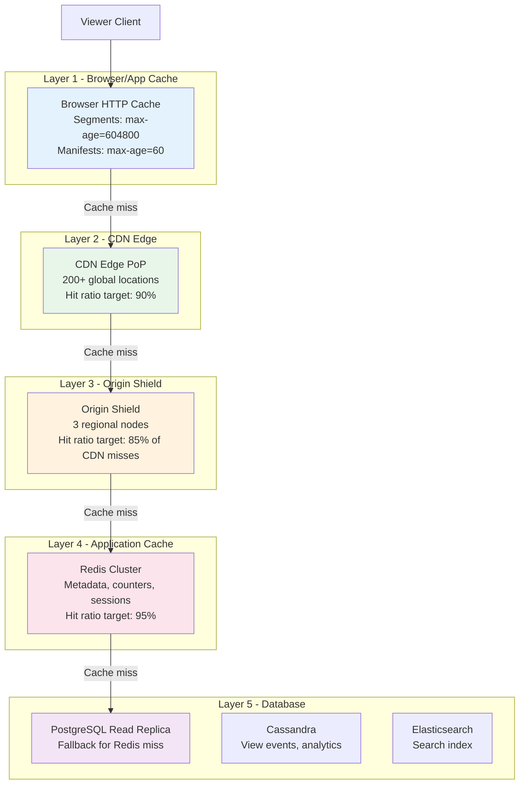

# 09 — Caching Strategy: Video Streaming Platform

---

## Objective

Design a multi-layer caching architecture that achieves the core performance requirements: < 2s video start time globally, < 200ms API responses, and 95%+ CDN hit ratio. Caching at this scale is not an optimization — it is a structural requirement. The system would be physically incapable of serving 10M concurrent viewers without multiple caching layers.

---

## 1. Cache Layer Overview



---

## 2. Layer 1: Browser/App Cache

HTTP caching headers control client-side caching:

| Content | Cache-Control Header | Rationale |
|---|---|---|
| Video segments (.ts, .fmp4) | `max-age=604800, immutable` (7 days) | Segments are immutable once created — never change |
| HLS rendition playlist (.m3u8) | `max-age=3600` (1 hour) | VOD playlists don't change; live playlists require `no-cache` |
| HLS master manifest | `max-age=60` (1 minute) | New renditions may appear; short TTL ensures fast propagation |
| Video thumbnail | `max-age=86400, stale-while-revalidate=3600` (1 day) | Thumbnails change infrequently |
| Video metadata JSON | `max-age=60, stale-while-revalidate=300` | Titles/descriptions can change |
| API responses (recommendations, feed) | `private, max-age=60` | Personalized — not shareable across users |
| Auth tokens | `no-store` | Never cache auth responses |

**`stale-while-revalidate`**: Serve stale content immediately (zero latency) while revalidating in the background. This is invisible to users for most metadata changes.

---

## 3. Layer 2: CDN Caching

### 3.1 CDN Cache Objects and TTLs

| Object | CDN TTL | Cache Key | Notes |
|---|---|---|---|
| Video segment | 30 days | URL path only | URL is content-addressed (immutable) |
| Master manifest | 60 seconds | URL path + ?quality query | Short TTL for live rendition availability |
| Rendition playlist (VOD) | 4 hours | URL path | Long TTL — won't change after transcode |
| Rendition playlist (Live) | No-cache | URL path | Always fetched from origin for live |
| Thumbnail | 7 days | URL path | Long TTL; bust by changing URL on update |
| Channel avatar | 3 days | URL path | |
| Public API responses | 30–300 seconds | URL + Accept-Language header | Vary by language for localized content |

### 3.2 Cache Key Design

**Problem**: CDN cache key must balance hit ratio vs. staleness.

- **Wrong**: Include `Authorization` header in cache key — every user gets different cache entry, hit ratio drops to 0%
- **Wrong**: Exclude geographic location from cache key — EU users served US-region content
- **Right**: Public video content keyed only by URL path; private content bypasses CDN entirely

**CDN Behaviors**:

```
Rule 1: /segments/* → Cache 30 days, immutable
Rule 2: /manifests/*.m3u8 → Cache 60 seconds, strip auth headers from key
Rule 3: /thumbnails/* → Cache 7 days
Rule 4: /v1/videos/*/manifest.m3u8 → Cache 60 seconds
Rule 5: /v1/private/* → Bypass CDN, forward to origin
Rule 6: /v1/auth/* → Bypass CDN, no-cache
```

### 3.3 CDN Cache Invalidation

| Trigger | Invalidation Strategy |
|---|---|
| Video title/description update | Invalidate metadata API cache for video_id (API response, not segments) |
| Thumbnail replaced | Change thumbnail URL (append `?v=2` or use content-hash in URL) — URL change = automatic cache miss |
| Video deleted/DMCA removed | Purge all CDN entries for the video_id (CDN Purge API call) |
| New rendition available | Master manifest cache expires naturally (60s TTL) |
| Video geo-restriction added | Purge manifest cache + add edge rule for geo-blocking |

**Mass Invalidation Caution**: Purging thousands of CDN entries simultaneously has a cost (some CDNs charge per purge) and can cause origin stampede (all subsequent requests hit origin simultaneously). Use staggered purges or rely on TTL expiry for non-critical updates.

---

## 4. Layer 4: Redis Application Cache

### 4.1 Video Metadata Cache

```
Cache Pattern: Cache-Aside (Lazy Loading)

Key:   video:meta:{video_id}
Type:  Redis Hash
TTL:   300 seconds (5 minutes)

Fields:
  title, description, channel_id, channel_name, duration_seconds,
  view_count (approximate), like_count (approximate), status, visibility,
  default_thumbnail_url, published_at, tags, category

Read Path:
  1. GET video:meta:{video_id}
  2. On miss: Query PostgreSQL, store result in Redis
  3. Serve from Redis

Write Path:
  1. Write to PostgreSQL
  2. DELETE video:meta:{video_id}  (invalidate, not update)
  3. Next read will repopulate from DB
```

**Why delete instead of update?** (Cache invalidation is hard)
- On update, reading the DB and writing Redis is not atomic; a race condition between two concurrent updates can store stale data permanently
- Delete is safe: worst case is one extra DB read on the next request

### 4.2 View Count Cache (Write-Heavy)

```
Key:   video:views:{video_id}
Type:  String (atomic counter)
TTL:   None (persistent; flush to DB every 60 seconds)

Operations:
  Write: INCR video:views:{video_id}      ← per view event
  Read:  GET video:views:{video_id}        ← for display

Flush job (every 60 seconds):
  1. GETSET video:views:{video_id} 0       ← get current value, reset to 0
  2. UPDATE videos SET view_count = view_count + {delta} WHERE video_id = X
  
  Note: GETSET is atomic — no view events lost between get and set
```

### 4.3 Like Count Cache

Same pattern as view count. Separate concern: per-user like state.

```
Per-user like state (for "did I like this video?" check):
  Key:   user:liked:{user_id}
  Type:  Set
  Members: video_ids that user has liked
  TTL:   3600 seconds (1 hour) — accessed frequently during browsing session
  
  Operations:
    Check: SISMEMBER user:liked:{user_id} {video_id}
    Add:   SADD user:liked:{user_id} {video_id}
    Remove: SREM user:liked:{user_id} {video_id}
    
  Size concern: 1 like set per user × 500M users × 100 videos/user = 50B entries
  Solution: Only cache active users' sets; cold users evicted (TTL)
```

### 4.4 Channel Metadata Cache

```
Key:   channel:meta:{channel_id}
Type:  Redis Hash
TTL:   600 seconds (10 minutes)

Fields:
  channel_name, channel_handle, subscriber_count, is_verified, avatar_url

High read rate: Every video page includes channel info.
subscriber_count is approximate — Redis shows approximate, PostgreSQL is source of truth.
```

### 4.5 Recommendation Cache

```
Key:   rec:feed:{user_id}
Type:  String (JSON array)
TTL:   900 seconds (15 minutes)

Invalidation triggers:
  - User watches a video: SREM relevant recommendations + shorten TTL
  - User likes a video: Set TTL = 60 seconds (force quick refresh)
  - Scheduled refresh: Background job refreshes caches for DAU every 10 minutes
  
Fallback if cache miss:
  - Serve trending videos for user's country (rec:trending:{country_code})
  - This avoids cold-start latency on recommendation service
```

### 4.6 Search Suggestion Cache

```
Prefix-based autocomplete:
  Key:   search:suggest:{prefix}
  Type:  Sorted Set (suggestions by score/frequency)
  TTL:   3600 seconds

  Populated by: Top N search queries for each prefix, refreshed hourly
  Size cap: Only cache prefixes of length >= 3 characters
```

### 4.7 Rate Limit State

```
Key:   ratelimit:{user_id}:{endpoint}:{window_start}
Type:  String with INCR + EXPIRE
TTL:   Window size in seconds (60 for most endpoints)

Sliding window implementation:
  Key:   ratelimit:sw:{user_id}:{endpoint}
  Type:  Sorted Set
  Members: request timestamps
  Score:   Unix timestamp
  
  On request:
    1. ZREMRANGEBYSCORE remove entries older than 1 minute
    2. ZCARD count remaining entries
    3. If count >= limit → reject 429
    4. ZADD current_timestamp
    5. EXPIRE to keep TTL rolling
```

### 4.8 Session and Auth State

```
JWT Blacklist (for explicitly revoked tokens):
  Key:   jwt:blacklist:{jti}
  Type:  String ("1")
  TTL:   Remaining token lifetime

Active Upload Sessions:
  Key:   upload:session:{upload_id}
  Type:  Hash (upload state)
  TTL:   24 hours
  
  This allows Upload Service to be stateless — session state in Redis
```

---

## 5. HyperLogLog for Unique Viewer Estimation

Standard approach for exact unique viewer count would require storing every user_id per video — billions of entries.

**HyperLogLog** provides probabilistic unique counting with 0.81% standard error using only 12 KB of memory regardless of cardinality:

```
Key:   video:unique_viewers:{video_id}:{date}
Type:  HyperLogLog
TTL:   90 days

Operations:
  PFADD video:unique_viewers:vid_xyz:2026-05-17 {user_id}
  PFCOUNT video:unique_viewers:vid_xyz:2026-05-17

Memory: 12 KB per video per day (vs. ~80 bytes × millions_of_viewers = GBs per video)

Tradeoff: 0.81% error. For a video with 1M unique viewers, count may show 991,900–1,008,100.
This is completely acceptable for creator analytics.
```

---

## 6. Thundering Herd Protection

### 6.1 Cache Stampede on Expiry

**Problem**: 10,000 concurrent requests hit a key that just expired → all simultaneously go to DB → DB overwhelmed.

**Solutions**:

**Probabilistic Early Expiration (PER)**:
- Instead of hard TTL, each read calculates: should I re-fetch?
- Formula: `current_time + beta × fetch_time × log(random())` where fetch_time is last known DB query time
- Keys expire "early" for some requests, preventing synchronized expiry

**Cache Lock (Mutex)**:
```
Redis Pseudocode:
1. GET cached_value
2. If miss:
   a. SET lock:video_meta:{id} "1" NX EX 5  ← acquire lock, 5s TTL
   b. If lock acquired → fetch from DB, set cache, release lock
   c. If lock not acquired → wait 50ms, retry from step 1
   d. After 5 retries → fetch from DB directly (lock expired, circuit breaker)
```

### 6.2 Viral Video Cache Warming

When a video goes viral (view rate suddenly increases > 10x baseline):
1. Detected by analytics consumer monitoring view rate
2. Triggers cache warming event
3. Cache Warming Service pre-fetches video metadata into Redis
4. CDN pre-warming of manifests and first N segments

---

## 7. Cache Sizing and Memory Estimation

```
Video metadata cache (300s TTL):
  DAU of 100M, average 10 videos/session viewed
  Unique videos viewed per day: ~50M (many repeat views)
  In a 5-minute window: 50M × (5/1440) = ~174K unique videos cached
  Per entry size: ~2KB (hash with all fields)
  Total: 174K × 2KB = ~340 MB — very manageable

View counters (no TTL):
  All published videos: ~6M videos
  Per counter: ~24 bytes (Redis String overhead)
  Total: 6M × 24 bytes = ~144 MB

Like state (per user, 1hr TTL):
  DAU 100M × 1 active set × avg 100 liked videos × 16 bytes UUID
  But only active users (100M × 1hr / 24hr = ~4M concurrently active)
  4M users × 100 entries × 16 bytes = ~6.4 GB

Recommendation cache (15min TTL):
  DAU 100M users, 15min TTL, refresh pattern
  Active at any time: ~4M users × 1 KB per recommendation list = ~4 GB

Total Redis Memory Estimate: ~20 GB across cluster
With 3x replication overhead and headroom: ~80 GB Redis cluster capacity needed
This maps to: 6 × 16GB Redis nodes (6 shards, 1 replica each)
```

---

## 8. Cache Invalidation Strategy Summary

| Cache Layer | Invalidation Method | Trigger |
|---|---|---|
| Browser cache (segments) | URL versioning | Never (immutable) |
| Browser cache (manifest) | TTL expiry (60s) | Automatic |
| CDN segments | URL versioning | Never (immutable) |
| CDN manifests | TTL expiry (60s) or purge API | Video removed / DMCA |
| Redis video metadata | DELETE on write | Any metadata update |
| Redis view counts | No invalidation (counter) | Periodic flush to DB |
| Redis recommendations | DELETE + short TTL on user action | Like, view, subscribe |
| Redis channel metadata | DELETE on write | Channel profile update |

---

## 9. Cache Monitoring and Alerts

| Metric | Alert Threshold | Action |
|---|---|---|
| Redis hit ratio | < 80% | Investigate key pattern; increase TTL or warm cache |
| Redis memory usage | > 85% | Add shard or increase instance size |
| Redis evictions/sec | > 1000 | Cache is too small; objects evicted before TTL |
| CDN hit ratio | < 90% | Investigate cache key issues or purge abuse |
| Cache miss burst (stampede indicator) | DB query rate × 10 | Implement mutex locking |
| Redis replication lag | > 1 second | Investigate network or shard overload |

---

## 10. FAANG vs Startup Differences

**Startup approach**:
- Simple Redis cache with standard Cache-Aside pattern
- No HyperLogLog — exact counts with periodic DB queries
- TTL-based invalidation only
- Single Redis instance (no cluster) for the first year

**FAANG approach**:
- Multi-layer caching (browser, CDN edge, origin shield, application, local)
- Custom Redis data structures per use case (HLL, sorted sets, Lua scripts for atomic operations)
- Active cache warming for high-priority content
- Cache-aside + write-through + write-behind depending on consistency requirement
- Custom CDN rules per content type
- Dedicated cache teams monitoring and optimizing hit ratios

---

## 11. Interview-Level Discussion Points

- How do you handle the "cold start" problem for a new video? (First request causes all cache misses up to DB; for high-subscriber creators, pro-actively warm caches when `VideoPublished` event fires; for others, accept the cold start penalty on first few requests)
- Why not use write-through caching instead of cache-aside? (Write-through requires synchronous write to both DB and cache on every write; for view events at 11,600/sec, this doubles write latency and doubles write load; cache-aside with async flush is better for high-write counters)
- What is the consistency window with 60-second Redis-to-DB flush for view counts? (Up to 60 seconds of views may be in Redis but not PostgreSQL; if Redis fails in this window, those views are lost; mitigated by: Redis AOF persistence, Kafka event replay as backup source, and the fact that approximate view counts are acceptable)
- How does `stale-while-revalidate` improve perceived performance? (Client receives stale cached response instantly (0ms from cache vs 100ms+ from origin), while browser fetches fresh data in background; next request gets fresh data; user never perceives latency)
- What are the limits of HyperLogLog? (Cannot get per-user breakdown — only total count; cannot reverse the HLL to find which users watched; for exact counts (legal, financial) must use actual records. HLL is ideal for display purposes but not audit purposes)
