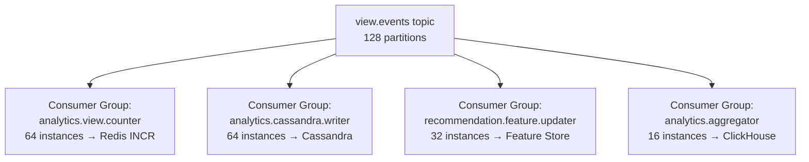
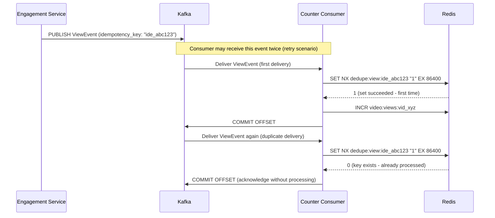

# 10 — Message Queue Design: Video Streaming Platform

---

## Objective

Define the complete Apache Kafka topology: every topic, its partitioning rationale, retention policy, consumer group design, producer configuration, and failure handling including DLQs. Kafka is the event backbone that decouples every major system component — getting its design right is critical to the platform's scalability and reliability.

---

## 1. Why Kafka Over Alternatives

| Feature | Kafka | RabbitMQ | AWS SQS | AWS EventBridge |
|---|---|---|---|---|
| Throughput | Millions/sec | ~100K/sec | ~10K/sec | ~10K/sec |
| Message replay | Yes (log retention) | No (messages deleted after ACK) | No | Limited |
| Consumer groups | First-class concept | Exchange/binding patterns | Competing consumers only | Push model |
| Partitioning | Fine-grained control | Less control | Per-queue | Per-bus |
| Log compaction | Yes | No | No | No |
| Long-term retention | Yes (days to forever) | No | 14 days max | No |
| Fan-out to multiple consumers | Yes (consumer groups) | Requires exchange fan-out | Requires SNS+SQS | Yes |
| Ordering guarantees | Per-partition | Per-queue | Per-message group | None |

**Key Kafka advantages for this system**:
- **Replay**: When a new service is deployed (e.g., new recommendation engine), it can replay all historical view events from day 0
- **Fan-out**: `VideoPublished` event consumed independently by Search, Recommendations, Notifications, CDN — each at their own pace
- **Backpressure-safe**: Slow consumers don't block fast producers; lag accumulates safely
- **Durability**: Kafka log is durable; if a consumer crashes, it resumes from its last committed offset

---

## 2. Complete Topic Catalog

### 2.1 Upload and Processing Topics

```
Topic: video.upload.initiated
  Partitions: 16
  Replication: 3
  Retention: 7 days
  Partition Key: user_id
  Producer: Upload Service
  Consumers: Analytics (track upload funnel)
  
  Purpose: Signals that an upload session has been created.
  Used for: Funnel analytics (upload initiated but never completed = dropped upload)

Topic: video.upload.completed
  Partitions: 16
  Replication: 3
  Retention: 7 days
  Partition Key: video_id
  Cleanup Policy: Delete (time-based)
  Producer: Upload Service
  Consumers: Transcode Orchestrator (primary), Virus Scanner, Analytics
  
  Purpose: Raw video is in S3 and ready for processing.
  Ordering requirement: None (each video_id processed independently)

Topic: video.transcode.requested
  Partitions: 64
  Replication: 3
  Retention: 3 days
  Partition Key: video_id (so all renditions of same video are on same partition)
  Producer: Transcode Orchestrator
  Consumers: Transcode Workers (multiple consumer groups, one per rendition tier)
  
  Purpose: Individual transcode job requests.
  High partition count: Allows up to 64 simultaneous worker groups.
  Message routing: Workers filter by rendition field (not separate topics per rendition).

Topic: video.transcode.completed
  Partitions: 64
  Replication: 3
  Retention: 7 days
  Partition Key: video_id
  Producer: Transcode Workers
  Consumers: Transcode Orchestrator, Metadata Service, CDN Cache Manager

Topic: video.transcode.failed
  Partitions: 16
  Replication: 3
  Retention: 30 days
  Producer: Transcode Workers
  Consumers: DLQ Handler, Alert Service, Creator Notification
  
  Extended retention: 30 days for incident investigation.
```

### 2.2 Metadata and Lifecycle Topics

```
Topic: video.published
  Partitions: 32
  Replication: 3
  Retention: 30 days
  Partition Key: channel_id (fan-out needs channel context)
  Producer: Metadata Service
  Consumers: Search Indexer, Recommendation Updater, Notification Orchestrator, 
             CDN Cache Warmer, Analytics, Moderation Service
  
  High consumer count: This is the most "fanned-out" event in the system.
  30-day retention: Allows new consumers to catch up on recent videos.

Topic: video.metadata.updated
  Partitions: 16
  Replication: 3
  Retention: 7 days
  Partition Key: video_id
  Producer: Metadata Service
  Consumers: Search Indexer, CDN Cache Invalidator, Recommendation Updater

Topic: video.deleted
  Partitions: 16
  Replication: 3
  Retention: 90 days
  Producer: Metadata Service
  Consumers: Search Indexer (remove entry), CDN Invalidator, Storage Lifecycle Manager
  Extended retention: For audit/compliance.

Topic: video.removed.moderation
  Partitions: 16
  Replication: 3
  Retention: 365 days
  Producer: Moderation Service
  Consumers: CDN Invalidator (highest priority), Metadata Service, Search Indexer,
             Creator Notification, Legal Audit Log
  Extended retention: Legal requirement.
```

### 2.3 Engagement Topics

```
Topic: view.events
  Partitions: 128
  Replication: 3
  Retention: 3 days
  Partition Key: video_id
  Compression: snappy
  Max Message Size: 1 KB
  Producer: Engagement Service
  Consumers:
    - analytics.view.counter (group): Updates Redis counters
    - analytics.cassandra.writer (group): Persists to Cassandra
    - recommendation.feature.updater (group): Updates user feature vectors
    - analytics.aggregator (group): Computes creator analytics
  
  Throughput: 11,600 messages/second baseline, up to 500K/sec during viral events.
  128 partitions: Supports up to 128 consumers per group.
  
  Why video_id as partition key:
    - All view events for the same video go to the same partition
    - Analytics aggregation (per-video stats) processes events in order
    - Counter consumers accumulate counts locally before flushing

Topic: engagement.likes
  Partitions: 32
  Replication: 3
  Retention: 7 days
  Partition Key: video_id
  Producer: Engagement Service
  Consumers: Analytics, Recommendation Updater, Like Counter

Topic: engagement.comments
  Partitions: 32
  Replication: 3
  Retention: 7 days
  Partition Key: video_id
  Producer: Engagement Service
  Consumers: Notification Service, Moderation Service, Analytics

Topic: engagement.subscriptions
  Partitions: 32
  Replication: 3
  Retention: 7 days
  Partition Key: channel_id (for fan-out reads)
  Producer: Engagement Service
  Consumers: Notification Orchestrator, Recommendation Updater, Analytics
```

### 2.4 Notification Topics

```
Topic: notification.orchestrator.requests
  Partitions: 16
  Replication: 3
  Retention: 1 day
  Partition Key: channel_id
  Producer: Notification Orchestrator
  Consumers: Notification Fan-out Workers

Topic: notification.fanout
  Partitions: 256
  Replication: 3
  Retention: 1 day
  Partition Key: user_id
  Max Throughput: 1M messages/second
  Producer: Notification Orchestrator Fan-out
  Consumers: Notification Delivery Workers (up to 256 per group)
  
  This is the highest fan-out topic in the system.
  256 partitions × 1000 delivery workers/partition = 256K workers max.
  In practice: 1000 delivery workers per consumer group, each consuming ~256/1000 partitions.

Topic: notification.delivery.results
  Partitions: 16
  Retention: 24 hours
  Producer: Notification Delivery Workers
  Consumers: Notification Analytics
```

### 2.5 User and Auth Topics

```
Topic: user.registered
  Partitions: 16
  Replication: 3
  Retention: 30 days
  Producer: User Service
  Consumers: Email Onboarding, Engagement (create system playlists), Analytics

Topic: user.suspended
  Partitions: 8
  Replication: 3
  Retention: 90 days
  Producer: Moderation/User Service
  Consumers: Auth (revoke all tokens), Upload Service (reject uploads), 
             Comment Service (hide comments), Engagement (block actions)
  
  Critical: All consumers must process quickly. user.suspended is a security event.
```

### 2.6 DLQ Topics

```
Topic: video.transcode.requested.dlq
  Partitions: 8
  Replication: 3
  Retention: 30 days
  Producer: Transcode Worker (on 3rd failure)
  Consumers: DLQ Handler Service

Topic: view.events.dlq
  Partitions: 8
  Retention: 7 days
  Producer: Analytics Consumer (on persistent failure)

Topic: notification.fanout.dlq
  Partitions: 8
  Retention: 3 days

Topic: dmca.takedown.dlq
  Partitions: 4
  Retention: 90 days
  Alert: PagerDuty page on any message arriving here (legal risk)
```

---

## 3. Producer Configuration

### 3.1 Standard Producer Settings

```
# Reliability settings (for critical topics)
acks = all                    # Wait for all ISR replicas to acknowledge
retries = 10                  # Retry up to 10 times
retry.backoff.ms = 100        # 100ms between retries
max.in.flight.requests.per.connection = 5  # With idempotent=true: safe
enable.idempotence = true     # Exactly-once per producer session

# Performance settings
batch.size = 65536            # 64KB batch before sending
linger.ms = 10                # Wait 10ms to batch more messages
compression.type = snappy     # 40-50% compression for JSON payloads
buffer.memory = 33554432      # 32MB producer buffer

# Timeout settings
request.timeout.ms = 30000
delivery.timeout.ms = 120000
```

### 3.2 High-Throughput Producer (view.events)

```
# Optimized for throughput over latency
batch.size = 524288           # 512KB batch — larger batches for throughput
linger.ms = 50                # More aggressive batching
acks = 1                      # Only leader ack needed — view events can tolerate some loss
enable.idempotence = false     # Not needed with acks=1
compression.type = lz4        # Faster than snappy for CPU-bound producers
```

**Trade-off for view.events**: Using `acks=1` instead of `acks=all` accepts a small risk of data loss (if leader crashes before replication) in exchange for 40% higher throughput. View counts are approximate anyway — losing 0.01% of events is invisible.

### 3.3 Critical Producer (dmca.takedown)

```
acks = all
enable.idempotence = true
retries = Integer.MAX_VALUE    # Never give up on DMCA messages
max.block.ms = 60000           # Block producer for up to 60 seconds if buffer full
```

---

## 4. Consumer Group Design

### 4.1 Consumer Group Isolation

Each logical consumer of a topic is a separate consumer group. This ensures:
- One slow consumer (analytics Cassandra writer) doesn't block a fast consumer (Redis counter)
- Each group maintains independent offset — can be reset independently



### 4.2 Consumer Instance Sizing

| Consumer Group | Instances | Partitions/Instance | Throughput Target |
|---|---|---|---|
| analytics.view.counter | 64 | 2 | 11,600 events/sec total |
| analytics.cassandra.writer | 64 | 2 | 11,600 events/sec total |
| recommendation.feature.updater | 32 | 4 | Best-effort, lag OK |
| transcode-workers | 200–2000 (HPA) | Dynamic | Queue-draining |
| notification.delivery | 1000 | ~0.25 | 1M notifications/sec |

**Rule**: Instances ≤ Partitions. Adding more instances than partitions wastes resources — excess instances sit idle. Partition count is a scaling ceiling.

---

## 5. Offset Management

### 5.1 Manual Offset Commit

All consumers use manual offset commits (not auto-commit):

```
Process:
  1. Poll batch of records
  2. Process each record (write to DB, update Redis, etc.)
  3. Commit offset AFTER successful processing

Why manual:
  Auto-commit commits offsets on a timer, not after processing.
  If crash occurs between auto-commit and processing completion,
  events are marked committed but were not processed → silent data loss.
  
  Manual commit: if crash occurs before commit, events are reprocessed on restart.
  This gives at-least-once processing semantics.
```

### 5.2 Idempotent Consumer Design

Since at-least-once delivery means duplicates are possible, consumers must be idempotent:

```
For view.events counter consumer:
  Deduplicate using: Redis SET NX with idempotency_key from event
  SET nx:processed:{idempotency_key} "1" EX 86400
  If returns 1: process (first time)
  If returns 0: skip (already processed)

For search indexer:
  Elasticsearch PUT with explicit document ID = video_id
  Duplicate PUT simply overwrites with same data — naturally idempotent

For Cassandra view writer:
  Cassandra inserts are idempotent with fixed primary key
  Duplicate insert of same (video_id, viewed_date, view_id) is a no-op
```

---

## 6. Exactly-Once Semantics for View Counting

Pure Kafka transactions are expensive (10x throughput penalty). Application-level deduplication is the practical choice:



**Cost**: 1 extra Redis SET NX per view event = ~1 microsecond overhead. For 11,600 events/sec: negligible.

**Window**: 24-hour deduplication window. A view event replayed after 24 hours (e.g., from incident recovery) would be counted again. Acceptable trade-off.

---

## 7. Dead Letter Queue (DLQ) Strategy

### 7.1 DLQ Routing Policy

```
Retry Policy per topic:
  1st failure: Immediate retry (in-memory)
  2nd failure: Retry after 1 second
  3rd failure: Retry after 10 seconds
  4th failure: Move to DLQ topic with error metadata

DLQ message envelope:
  {
    "original_topic": "video.transcode.requested",
    "original_partition": 12,
    "original_offset": 84920,
    "failure_reason": "java.io.IOException: S3 read timeout",
    "attempt_count": 4,
    "first_failure_at": "2026-05-17T14:00:00Z",
    "last_failure_at": "2026-05-17T14:01:30Z",
    "original_payload": { ... }
  }
```

### 7.2 DLQ Handler Service

DLQ Handler subscribes to all DLQ topics and takes action:

| DLQ Topic | Action |
|---|---|
| transcode.requested.dlq | Alert on-call; notify creator via email; create support ticket |
| view.events.dlq | Log for analytics audit; increment "lost_events" metric |
| notification.fanout.dlq | Log; acceptable loss for notifications |
| dmca.takedown.dlq | **IMMEDIATE PAGERDUTY PAGE** — legal obligation at risk |
| search.index.dlq | Queue for retry when ES recovers; lower urgency |

### 7.3 DLQ Replay Procedure

When the underlying issue is fixed (e.g., S3 was temporarily unavailable), DLQ events can be replayed:

```
Manual replay procedure:
  1. Identify DLQ topic and time range to replay
  2. Read DLQ events using consumer from beginning
  3. Republish to original topic (with new timestamp, preserving original payload)
  4. Monitor processing completion
  5. Mark DLQ events as replayed

Tools: kafka-console-producer, custom replay utility, or Kafka Streams re-routing
```

---

## 8. Kafka Cluster Configuration

### 8.1 Cluster Sizing

```
Production cluster:
  Brokers: 15 broker nodes (5 per availability zone, 3 AZs)
  Per broker: 64 vCPU, 256 GB RAM, 12 TB NVMe SSD
  Replication factor: 3 (one copy per AZ)
  Minimum ISR: 2 (write succeeds with 2 of 3 replicas)
  
  Total storage capacity: 15 × 12 TB = 180 TB
  
  At peak view event rate (500K events/sec × 1KB = 500 MB/sec):
  3 days retention × 86400s × 500 MB/s = 129 TB just for view.events
  → 180 TB total with all topics is tight at peak; 20 brokers for safety
```

### 8.2 Topic Replication and ISR

```
For all critical topics:
  replication.factor = 3
  min.insync.replicas = 2      # acks=all requires 2 of 3 replicas to ack
  
  This means: the system tolerates 1 broker failure without losing data.
  A second simultaneous failure would cause writes to fail (min.insync.replicas not met).

For DLQ topics:
  replication.factor = 3
  min.insync.replicas = 1      # DLQ should never be a bottleneck
```

### 8.3 Log Compaction Strategy

Log compaction keeps only the most recent value per key, discarding historical updates:

```
Topics using log compaction:
  - video.metadata.updated (key = video_id): Only latest metadata matters for catch-up
  - engagement.subscriptions (key = user_id:channel_id): Current subscription state

Topics using time-based deletion:
  - view.events: Raw events (all events matter for analytics)
  - video.transcode.requested: Point-in-time job requests
  - notification.fanout: Short-lived delivery queue
```

---

## 9. Kafka MirrorMaker 2 for Multi-Region

For geo-distributed deployment, Kafka MirrorMaker 2 replicates topics across regions:

```
Active-active replication:
  US-East (primary) ← → EU-West (active)
                    ← → APAC (active)

Mirror configuration:
  Replication lag target: < 1 second
  Topics replicated: All topics except notification.fanout (region-local)
  Consumer offset sync: Yes (consumers can fail over to mirror cluster)

Failover scenario:
  If US-East Kafka unavailable:
  → EU-West producers write to local cluster
  → Consumers in all regions switch to EU-West cluster
  → When US-East recovers: reconcile via MirrorMaker replay
```

---

## 10. Kafka Schema Registry

All messages use Avro schema registered with Confluent Schema Registry:

```
Schema evolution rules (BACKWARD compatibility):
  - New optional fields can be added
  - Default values must be provided for new fields
  - Field types cannot change
  - Fields cannot be removed within 90-day deprecation window
  
Example: view.events schema v1.1 adds "referrer_type" field:
  Old consumers (v1.0): Receive records, ignore unknown field (safe)
  New consumers (v1.1): Receive records, use referrer_type
  
Schema ID embedded in every message (4 bytes).
Consumer deserializer fetches schema by ID from registry.
```

---

## 11. Interview-Level Discussion Points

- Why 128 partitions for view.events instead of, say, 16? (At 11,600 events/sec with each consumer processing ~100 events/sec, you need 116 consumer instances. With 16 partitions, you can only have 16 consumers per group — creates a bottleneck. 128 partitions allows 128 consumers, 90% headroom for burst. Also, re-partitioning a live topic is painful — over-provision upfront)
- How do you handle consumer group rebalancing during deployment? (Cooperative rebalancing (incremental partition assignment) minimizes stop-the-world pauses. K8s rolling deployments reduce blast radius. Consumer group members that are being replaced drain their current partitions before releasing them)
- Why not use AMQP (RabbitMQ) for the notification fan-out? (RabbitMQ messages are deleted after ACK — if the notification delivery worker crashes after ACKing but before sending the push, the notification is lost. Kafka retains messages and allows the consumer to retry by resetting offset. For 100M notifications, some failure is expected; Kafka's retention ensures no permanent loss)
- Can you explain how min.insync.replicas=2 affects write availability? (With 3 replicas and min.insync.replicas=2: if one broker fails, writes still succeed (2 of 3 replicas). If two brokers fail simultaneously, writes fail with NotEnoughReplicasException. This is the CAP theorem in action: we chose consistency over availability in the face of multi-broker failure)
- How would you migrate from one Kafka cluster to another without downtime? (Dual-write pattern: for a window, producers write to both old and new cluster. Consumers are migrated consumer group by consumer group to the new cluster. Once all consumers are on new cluster and have fully caught up, stop writing to old cluster. Monitor for lag on old cluster to reach 0 before full cutover)
