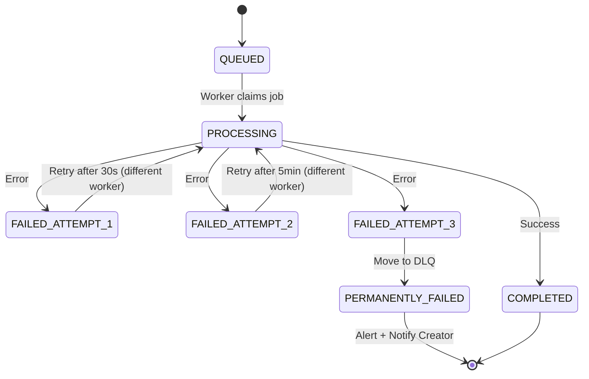

# 11 — Failure Scenarios: Video Streaming Platform

---

## Objective

Systematically analyze every realistic failure mode in the platform, its detection mechanism, recovery procedure, and the residual risk after mitigation. This document serves as both an operational runbook and an interview preparation resource for "what breaks first?" and "how do you handle X failure?" questions.

---

## 1. Failure Classification Framework

| Class | Examples | User Impact | Recovery Style |
|---|---|---|---|
| **Transient** | Network blip, brief DB overload | Brief degradation | Auto-retry, heals within seconds |
| **Component Failure** | Single DB replica down, Redis shard failure | Partial degradation | Automatic failover, minutes |
| **Data Corruption** | Bad transcode output, corrupted upload | Specific content unavailable | Manual investigation, hours |
| **Cascade Failure** | Slow DB causes thread pool exhaustion, causes gateway timeout | Widespread degradation | Circuit breaker, load shedding |
| **Catastrophic** | Primary region outage, CDN provider down | Major outage | Regional failover, hours |

---

## 2. Transcode Job Failure

### 2.1 Failure Modes

| Failure | Cause | Detection |
|---|---|---|
| Worker crashes mid-encode | OOM, hardware failure, spot instance reclamation | Kafka consumer group rebalance + job timeout monitor |
| Corrupt input file | Damaged upload, unsupported codec variant | FFmpeg returns non-zero exit code |
| S3 read timeout | S3 regional issue or network congestion | Timeout exception in worker |
| S3 write failure | S3 outage, quota exceeded | Write exception |
| Transcode output quality error | Invalid encoding parameters, codec bug | Output file size validation (too small = likely failed) |
| Permanent transcode failure | Unsupported video format (e.g., ancient H.263) | 3 attempts all fail |

### 2.2 Recovery Flow



**Recovery Details**:
- Job is associated with a Kafka message. If worker crashes, Kafka detects consumer timeout (max.poll.interval.ms = 5 minutes) and reassigns the partition to another worker.
- Job status in DB is checked: if `status = PROCESSING AND started_at < now() - 2 hours`, a background job marks it as STALE and re-queues.
- Partial output is cleaned up: if a worker wrote some segments before failing, those partial segments are deleted from S3 before retry.

**Creator Experience**: Creator sees "Processing delayed" notification after 3 failures. Support ticket auto-created. If the video has an unsupported codec, creator is notified with specific guidance.

---

## 3. CDN Origin Failure

### 3.1 Scenario: CDN Origin Service Is Down

**What Happens**:
- CDN edge caches serve cached content normally (segments with 30-day TTL unaffected)
- Only new/uncached content is impacted (new videos published within last 60 seconds)
- Cache misses return CDN error pages instead of video content

**Detection**: CDN health check to origin fails; CDN returns 5xx for cache misses; origin service health endpoint alerts.

**Mitigation**:
- **Origin Shield acts as a buffer**: If origin is down briefly, shield serves from its cache (can extend effective TTL beyond origin TTL for ~85% of traffic)
- **Multi-origin failover**: Configure CDN with primary origin + secondary origin (different region). CDN automatically fails over.
- **Static error page**: For cache misses where origin is down, CDN serves a graceful error page ("video temporarily unavailable") rather than a raw 502.

### 3.2 Scenario: CDN Provider Outage

**What Happens**:
- All traffic hits origin directly (25 Tbps origin request) → origin instantly overwhelmed

**Mitigation**:
- **Multi-CDN routing**: Primary CDN routes ~60% of traffic, secondary CDN routes ~40%. If one CDN fails, DNS routing shifts 100% to the other within TTL (30–60 seconds).
- **DNS TTL**: CDN-level DNS TTL set to 30 seconds to allow rapid failover.
- **Origin capacity**: Pre-sized to handle 10% of peak CDN traffic (the origin shield scenario). Full CDN bypass is not survivable — this is why multi-CDN is critical.

---

## 4. PostgreSQL Primary Database Failure

### 4.1 Scenario: Primary Write Node Fails

**Detection**: Health check failure; replication lag alert (replica sees no new WAL).

**Automatic Failover Sequence** (RDS Multi-AZ or Patroni):
```
T+0s:   Primary fails
T+10s:  Health check detects failure (3 checks × 3 seconds)
T+10s:  Patroni / RDS triggers automatic failover election
T+15s:  Replica with most recent WAL is promoted to primary
T+15s:  DNS endpoint updated to point to new primary
T+20s:  Application reconnects (connection pool retries on disconnect)
T+20s:  Writes resume
Total downtime: ~20-30 seconds
```

**Impact during failover**:
- All write operations fail for 20-30 seconds
- Read operations continue (replicas are still available)
- Upload API: Upload initiation fails (creation of upload_session row fails) → client retries
- Engagement writes: Kafka consumers retry; view events buffered in Kafka

**Post-failover**: Old primary comes back as a replica; DBA promotes the previous failover as the new permanent primary.

### 4.2 Scenario: PostgreSQL Read Replica Failure

**Impact**: Reduced read capacity. Surviving replicas absorb load.
**Mitigation**: Connection pool routes to remaining replicas. Redis cache absorbs most read load. New replica can be created from snapshot in ~15 minutes.

---

## 5. Kafka Consumer Lag (Consumer Falling Behind)

### 5.1 Scenario: view.events Consumer Group Falls Behind

**Cause**: 
- Consumer instance OOM (processing 500K events/sec burst after viral video)
- GC pauses in consumer JVM
- Database write bottleneck (Cassandra write timeout)

**Detection**:
- Kafka consumer lag metric > threshold (alert at 100K, page at 1M)
- Consumer lag growing at > 10K events/minute

**Impact**:
- View counts in Redis may be delayed (stale for minutes)
- Creator analytics dashboard shows slightly stale data
- Recommendation system doesn't know about recent views immediately

**Recovery**:
1. Auto-scaling: HPA adds more consumer pod replicas
2. Kafka partitions are redistributed among new consumers
3. New consumers begin consuming from their assigned partitions
4. Lag decreases as processing outpaces production rate

**Limit**: Consumer group can have max = partition count instances (128). If 128 instances can't keep up at peak, the only option is to increase partition count (disruptive on live topics) or optimize per-consumer throughput.

### 5.2 Scenario: Transcode Worker Consumer Lag

**Cause**: Upload burst (major event, holiday) overwhelms current worker count.

**Detection**: Kafka lag on video.transcode.requested > 1000 per partition.

**Recovery**: KEDA autoscaler adds workers. Workers on spot instances ramp up quickly. Excess lag cleared within minutes.

**Creator Experience**: Newly uploaded videos take longer to become available during peak. System should communicate estimated processing time to creator.

---

## 6. Corrupted Upload Recovery

### 6.1 Scenario: Partial Upload Where Some Chunks Are Corrupt

**Detection**: After upload completion, checksum validation fails (client provides SHA-256 of complete file; server verifies S3 multipart ETag against expected checksum).

**Recovery Flow**:
```
1. Client sends complete-upload request with SHA-256 checksum
2. Server assembles multipart upload in S3
3. Server calculates ETag of assembled file
4. If checksum mismatch:
   a. Mark upload session as FAILED
   b. Notify client: "Upload integrity check failed"
   c. Delete raw file from S3
   d. Client must re-initiate upload
5. If client abandons:
   a. Scheduled cleanup job deletes incomplete multipart uploads older than 7 days
```

### 6.2 Scenario: Transcode Produces Corrupt Output

**Detection**: 
- Output .ts files have duration = 0 or size < minimum threshold
- Segment count does not match expected (duration / segment_duration)
- Post-transcode validation plays first and last segment

**Recovery**: Mark transcode job as FAILED; retry with different worker/parameters.

---

## 7. Partial Transcode Failure

### 7.1 Scenario: Only 3 of 6 Renditions Complete

**Cause**: Workers for high-quality renditions (4K, 1080p) fail while low-quality renditions succeed.

**State**: 
- Video has 144p, 360p, 480p complete
- 720p, 1080p, 4K transcode jobs have permanently failed

**Policy Decision**:
- Video is published with available renditions (144p/360p/480p are sufficient for most viewers)
- Creator and master manifest only show available renditions
- Failed renditions are flagged for manual investigation
- Creator notified: "Your video is available in standard quality; high-definition processing failed"
- Retry window: Failed high-quality jobs queued for retry during off-peak hours

**Master Manifest**: Dynamically generated to only include completed renditions. If 4K segment is missing from S3, the master manifest doesn't list it.

---

## 8. Redis Cluster Failure

### 8.1 Scenario: Redis Shard Master Failure

**Detection**: Redis Sentinel / Cluster heartbeat failure.

**Automatic Failover**:
- Redis Cluster promotes replica to master within 10-15 seconds
- Client library detects CLUSTERDOWN error, retries until cluster stabilizes
- Brief spike in DB queries as Redis is unavailable

**Impact during failover (15 seconds)**:
- API responses slightly slower (cache misses hit DB)
- View counter INCR operations fail → view events buffer in application memory or Kafka
- Rate limit enforcement degraded (fail-open: allow requests through during Redis outage)

### 8.2 Scenario: Redis Full Cluster Failure (All Nodes)

**Impact**: Total cache loss, all traffic hits database directly.

**Cascade risk**: If cache miss rate jumps from 5% to 100%, DB receives 20× normal query load → DB becomes bottleneck → slow queries → connection pool exhaustion → API timeouts → cascading failure.

**Circuit Breaker**:
- API services detect Redis unavailability
- Fall-back mode: serve stale data from in-process local cache (LRU, 1 minute TTL)
- Non-critical endpoints return "service degraded" response
- Load shedding: reduce concurrent requests per service to prevent DB overload

**Recovery**: Redis Cluster re-initialized from Redis AOF backup (last sync point) + Kafka event replay from that point to rebuild counters.

---

## 9. Cascading Failure Scenario

### 9.1 Scenario: Slow DB Query Causes API Thread Exhaustion

**Trigger**: A poorly-optimized search query (e.g., full table scan on comments table due to missing index) causes PostgreSQL to hold connections for 5+ seconds.

**Cascade Chain**:
```
DB query takes 5s → Thread pool holds connection for 5s
→ New requests queue up waiting for a thread
→ Thread pool exhausted (e.g., 200 threads, each waiting 5s = queue of 40 requests/second)
→ API Gateway timeout waiting for downstream service response
→ Gateway returns 503 to clients
→ Client retries → doubles incoming request rate
→ Retry storm accelerates thread exhaustion
→ Service is now completely unavailable
```

**Detection**: 
- DB slow query log: queries > 1 second alerted
- Thread pool utilization > 80% (alert)
- API error rate > 1% (page)
- "Error rate" dashboard shows sudden spike

**Mitigation**:
- **Query timeout**: Every DB query has a max execution time (500ms for APIs, 5s for analytics)
- **Circuit breaker** (Resilience4j): If 50% of requests to DB fail in 30s window → open circuit → return error immediately without hitting DB → allows DB to recover
- **Thread pool timeout**: Bounded thread pools with request timeout (don't wait indefinitely)
- **Backpressure at gateway**: Gateway rejects requests when queue depth > threshold

---

## 10. S3 / Object Storage Failure

### 10.1 Scenario: S3 Region Unavailable

**Impact**:
- Video segments cannot be served (CDN cache misses go unfilled)
- New uploads cannot be stored
- Transcode outputs cannot be written

**Mitigation**:
- S3 Cross-Region Replication (CRR): All video segments replicated to secondary region within seconds
- CDN origin falls back to secondary region S3 bucket
- Origin Shield has significant cache hit rate — many segments served from cache during outage
- Upload service: redirect uploads to secondary region bucket (S3 endpoint configuration change)

### 10.2 S3 Request Rate Throttling

**Cause**: Excessive S3 requests per prefix at once (S3 has 5,500 GET requests/second per prefix).

**Mitigation**: S3 request rate scales with prefix diversity. Using `videos/{video_id}/` as prefix means each video_id distributes to different S3 partitions. With millions of video IDs, request load is spread across many S3 internal partitions automatically.

---

## 11. Live Streaming Failures

### 11.1 Scenario: RTMP Ingest Server Fails During Live Stream

**Impact**: Live stream feed interrupted; viewers see buffering.

**Recovery**:
1. OBS/streaming software detects connection drop (within 5-10 seconds)
2. Software auto-retries connection to same RTMP endpoint
3. RTMP load balancer routes to a different healthy ingest node
4. Live stream resumes within ~10-15 seconds
5. HLS playlist picks up new segments; viewers see brief pause then resumes

**Viewer Experience**: 5-15 second buffering. This is an acceptable SLA for live streaming (vs. VOD where any interruption is unacceptable).

### 11.2 Scenario: Live Transcoding Latency Spike

**Cause**: Transcoding worker for live content CPU-throttled or overloaded.

**Impact**: HLS segment generation slows; viewer buffer drains faster than new segments arrive → buffering.

**Detection**: Segment generation latency > 80% of segment duration (e.g., >1.6s to generate a 2s segment).

**Recovery**: Live transcoding worker auto-scaled by CPU/latency metric. Additional workers pre-warmed for large streaming events.

---

## 12. DMCA Takedown Execution Failure

### 12.1 Scenario: CDN Purge API Fails During DMCA Takedown

**Risk**: Video remains accessible from CDN cache after DMCA takedown. This is a **legal compliance failure**.

**Detection**: CDN Purge API call returns error; DLQ receives dmca.takedown event.

**Recovery**:
1. Immediate PagerDuty alert to on-call security + legal team
2. Manual CDN purge initiated from CDN dashboard (out-of-band)
3. Alternative: Set 0-TTL Cache-Control header on origin for the video path → CDN edge serves a 410 Gone response from origin for all subsequent requests
4. Temporary server-side override: Origin returns 410 for any request to this video_id

**SLA**: CDN purge must complete within 1 hour of DMCA receipt to maintain DMCA Safe Harbor protection.

---

## 13. Failure Recovery Runbooks Summary

| Failure | Automated? | Detection Time | Recovery Time | Data Loss Risk |
|---|---|---|---|---|
| Transcode worker crash | Yes (Kafka reassignment) | 5 minutes | 10-30 minutes | None (retry from S3) |
| CDN origin down | Partial (shield cache) | 30 seconds | Minutes (failover) | None |
| DB primary failure | Yes (Patroni failover) | 30 seconds | 20-30 seconds | ~30s writes lost |
| Redis shard failure | Yes (Cluster failover) | 15 seconds | 15 seconds | ~15s counter data |
| Kafka consumer lag | Yes (HPA scale-out) | 5 minutes | 10-30 minutes | None (events retained) |
| S3 regional failure | Yes (CRR + CDN cache) | Minutes | Minutes (redirect) | None |
| DMCA purge failure | No | Immediate (DLQ alert) | Manual: 30-60 min | N/A (legal risk) |
| Cascade: DB thread exhaustion | Partial (circuit breaker) | 1-5 minutes | 5-30 minutes | None |

---

## 14. Disaster Recovery (DR) Strategy

### 14.1 RTO and RPO Targets

| Service | RTO (Recovery Time Objective) | RPO (Recovery Point Objective) |
|---|---|---|
| Video streaming (CDN delivery) | < 5 minutes | 0 (CDN edge serves from cache) |
| Video upload | < 15 minutes | 0 (redirect to secondary region) |
| Metadata API | < 5 minutes (replica promotion) | < 30 seconds (replication lag) |
| Analytics pipeline | < 1 hour | < 1 hour (Kafka replay) |
| Live streaming | < 30 minutes | Live content is inherently lossy |
| Creator dashboard | < 30 minutes | < 1 hour |

### 14.2 DR Drill Schedule

- Monthly: Failover drill for DB primary → replica promotion (in staging)
- Quarterly: Full regional failover drill (simulate US-East outage, fail over to EU-West)
- Annually: Full DR test including CDN failover, multi-region database promotion

---

## 15. Interview-Level Discussion Points

- "What breaks first at 10× scale?" (The view.events Kafka consumer group reaches partition count limit (128 consumers max per group). Transcoding workers are the next bottleneck — spot instance availability may not scale fast enough. Redis trending sorted set becomes a hot key at 10× view rate per video. PostgreSQL primary for metadata writes starts showing replication lag that exceeds tolerance)
- "How do you handle a full CDN provider outage?" (Multi-CDN is the only real solution. DNS failover in 30-60 seconds routes 100% traffic to secondary CDN. The secondary CDN is pre-configured with all origin rules. Origin capacity is sized for the shield scenario — it will struggle with full miss traffic initially, but CDN warms quickly for popular content)
- "How do you protect against a cascade failure from slow DB queries?" (Three layers: query timeout prevents any single query from holding connections indefinitely; connection pool limits cap DB connection count; circuit breaker opens when error rate crosses threshold — protecting the DB from retry storms. Monitoring alerts before cascade starts)
- "What data would you lose in a Redis failure?" (Maximum data loss: view count deltas accumulated since last DB flush (up to 60 seconds). Recommendation cache (rebuilt from DB). User session data (users must re-authenticate). Rate limit counters reset (brief abuse window). HyperLogLog unique viewer estimates reset for the day. Most of this is non-critical or recoverable)
- "How do you detect a transcode loop (worker keeps failing and retrying indefinitely)?" (max attempts = 3 enforced in TranscodeJob entity. After 3rd failure, status = PERMANENTLY_FAILED, moved to DLQ, Kafka offset committed — no more retries. A separate monitoring query alerts if transcode_jobs.status = 'PERMANENTLY_FAILED' > threshold per hour)
